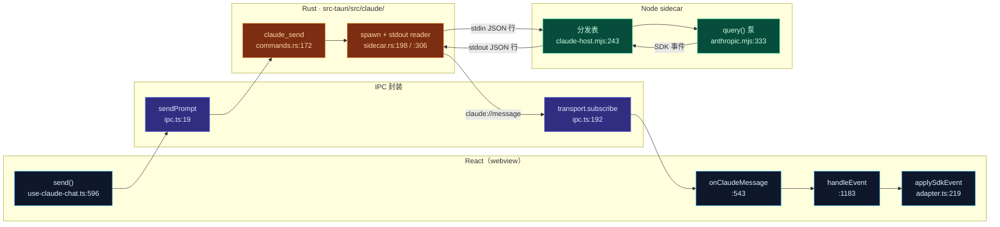
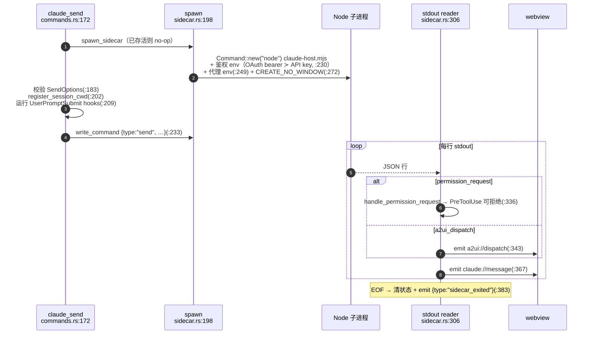
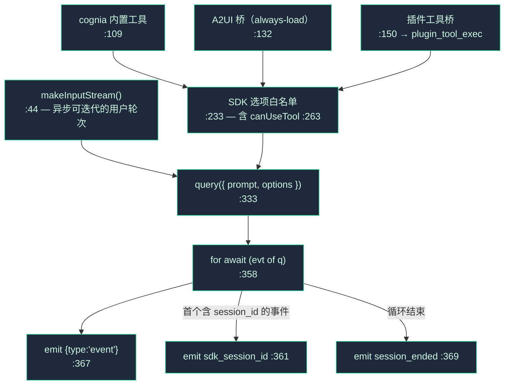

# 运行时主链

这是内置 Agent 每一轮都要经过的主链：React hook 装配负载并发出；Rust 进程拥有 Node sidecar；sidecar 运行 SDK 的 `query()` 循环；事件经单一 Tauri 通道回流，由一个**纯**归约器折叠成消息。

<TLDR>
  `send`（`use-claude-chat.ts:596`）装配选项、乐观追加用户消息，并调用 `sendPrompt`（`ipc.ts:19`）。
  Rust sidecar（`sidecar.rs:198`）拉起 `node claude-host.mjs`，向其 stdin 写一行 `{type:"send"}`
  JSON，并把 sidecar 的每行 stdout 扇出到 `claude://message` Tauri 事件。单个订阅
  （`use-claude-chat.ts:543`）把事件经一个按会话串行化的队列喂给 `handleEvent`（`:1183`），其
  `event` 分支调用纯归约器 `applySdkEvent`（`adapter.ts:219`），把结果写入按帧合并的 mirror + store。
  流式输入/输出就是 SDK 的 `query({ prompt: asyncIterable })`（`anthropic.mjs:333`）。
</TLDR>

## 五个阶段

## 阶段 1 —— `send`（React 入口）

`send` 是 `hooks/chat/use-claude-chat.ts:596-894` 的一个 `useCallback`，签名 `send(content, opts?, callOptions?)`。它是**发出即写**：不消费流（流是 push 式的，见阶段 5）。

| 步骤 | 内容 | 行号 |
| --- | --- | --- |
| 校验 | 解析活跃会话 id，拒绝空内容 | `:606-612` |
| 目标暂停 | ADR-0019 新用户轮次暂停 | `:621-624` |
| **装配选项** | `opts ?? await buildSendOptions(session, text)` —— 包裹 [`resolveSendOptions`](./build-options) | 调用 `:634`，封装 `:1105` |
| 命令 frontmatter | 合并每个斜杠命令的覆盖 | `:645-658` |
| 插件 `onUserPromptSubmit` | 可**阻断** / 修改 / 注入 `additionalContext` | `:674-710` |
| **乐观追加** | `makeUserMessage` → `replaceMessages`；状态 → `"streaming"` | `:728-733` |
| 外部 Agent 分支 | 非 SDK 路径（完全绕过 sidecar） | `:738-835` |
| 持久化 + 标题 | 写消息、touch 会话、派生标题 | `:838-847` |
| Trace span | `startSpan("invoke_agent")`，把 `traceId`/`spanId` 盖到 `opts` 上 | `:854-865` |
| **调用** | `await sendPrompt(sessionId, content, opts)` | `:867` |
| 缓存发送 | `setLastSend(sid, { options })`（兜底重试 + twin/记忆回读） | `:873-877` |

`sendRef.current = send`（`:898-903`）保持最新，使模块作用域的事件处理能发起静默的目标续跑发送。

## 阶段 2 —— IPC 封装（`lib/claude/ipc.ts`）

`ipc.ts` 是**唯一**的前后端接缝。一切都经 `@/lib/tauri` 的 `transport`。

| 函数 | 行号 | 线路 |
| --- | --- | --- |
| `sendPrompt` | `:19` | `invoke("claude_send", …)` |
| `interruptSession` | `:27` | `claude_interrupt` |
| `approveTool` | `:131` | `claude_approve`（allow / allow_always / deny） |
| `closeSession` | `:147` | `claude_close_session` |
| `setApiKey` / `setProviderEnv` | `:155` / `:167` | 内存凭据状态 |
| `restartSidecar` | `:188` | `claude_restart_sidecar` |
| **`onClaudeMessage(handler)`** | `:192` | `transport.subscribe(SIDECAR_EVENT, handler)` |

`SIDECAR_EVENT = "claude://message"`（`ipc.ts:17`，在 `sidecar.rs:17` 镜像）是单一入站通道；A2UI 分发走单独的 `a2ui://dispatch` 通道（`sidecar.rs:23`）。

## 阶段 3 —— Rust 生命周期（`src-tauri/src/claude/sidecar.rs`）

`SidecarState`（`sidecar.rs:26-149`）持有子进程句柄、stdin、ready 标志、会话集合与重启计数。

关键生命周期触发：

- **首次 `claude_send`** 惰性拉起；后续发送复用进程（`sidecar.rs:199-204`）。
- **`claude_set_api_key`**（`lib.rs:71`）把 `ApiKeyState` 写入内存——绝不落盘。
- **`claude_restart_sidecar`**（`lib.rs:119`）调用 `kill_sidecar`（`:593`）；下次发送重新拉起，使 SDK 在 init 时重读 env。
- **应用退出** 从 `RunEvent::ExitRequested` 杀掉 sidecar，避免遗留 Node 进程。
- 鉴权互斥：OAuth bearer 路径会 `env_remove` 掉 `ANTHROPIC_API_KEY`（`:221-238`）。

## 阶段 4 —— JSON-lines 协议（`sidecar/claude-host.mjs`）

每条消息是一行一个 JSON 对象。分发表就是 readline 循环里的 `switch(msg.type)`（`claude-host.mjs:243-261`）。

| 方向 | 类型 | 处理器 | 行号 |
| --- | --- | --- | --- |
| → | `send` | `handleSend`（cwd 变更强制重启） | `:118` |
| → | `interrupt` | `handleInterrupt` | `:144` |
| → | `permission_response` | `handlePermissionResponse` | `:158` |
| → | `plugin_tool_response` | `handlePluginToolResponse` | `:187` |
| → | `close` | `handleClose` | `:197` |
| ← | `event` | SDK 流封套 `{sessionId, event}` | `anthropic.mjs:367` |
| ← | `permission_request` | 模型要调用工具，且未被静态解析 | `anthropic.mjs:298` |
| ← | `plugin_tool_exec` | 把插件工具代理回 renderer | `builtin-tools/plugin-tools.mjs` |
| ← | `session_ended` / `ready` / `log` / `sdk_session_id` / `a2ui_dispatch` | 生命周期 + 遥测 | 多处 |

`fetch-interceptor.mjs` **必须**是第一个 import（`claude-host.mjs:24`），这样在 SDK 加载前全局 `fetch` 补丁就已到位。启动时 host 发出 `{type:"ready", …}`（`:272`）。

## 阶段 5 —— SDK 泵（`sidecar/dispatch/anthropic.mjs`）

`dispatch()`（`dispatch/index.mjs:23`）按 `sendOptions.provider` 路由：`anthropic` → `dispatchAnthropic`，其它 → `dispatchAiSdk`（Vercel AI SDK，**无工具/MCP/A2UI**，P2 路径）。

`dispatchAnthropic`（`anthropic.mjs:43`）组装进程内 MCP 服务器并运行泵：

只有显式白名单字段会进入 `query()`（`:233-325`）。`canUseTool` 回调（`:263-324`）是权限门的 **A 层**——见[权限](./permissions)。env 展开保留完整 `process.env`（`:186-194`）；若塌缩成只用 `sendOptions.env`，Windows 上会丢失 `PATH`。

非 Anthropic 路径（`dispatch/ai-sdk.mjs`）通过 `event-adapter.mjs` 把 Vercel-AI-SDK 事件映射成 SDK 消息形状，使同一个 renderer 归约器原样工作。

## 阶段 5′ —— 纯归约器（`lib/claude/adapter.ts`）

`adapter.ts` **零** Tauri 调用。它是 renderer 逐事件驱动的纯翻译层。

| 导出 | 行号 | 角色 |
| --- | --- | --- |
| **`applySdkEvent(messages, evt)`** | `:219` | 核心归约器 → `{messages, turnComplete, result?}`。`assistant`→追加（`:247`），`user`→应用工具结果（`:266`），`result`→附加用量 + `turnComplete`（`:234`） |
| `extractUsage(result)` | `:356` | 输入/输出/缓存 token、成本、时长 |
| `makeUserMessage(content, id?)` | `:392` | 文本 / 多模态块 → `UIMessage` |
| `mergeTwinSourcesIntoLastAssistant` | `:467` | Twin RAG + 风格 → `SourcesPart`（幂等） |
| `mergeMemorySourcesIntoLastAssistant` | `:551` | 召回记忆 → `SourcesPart` |

内部 `blockToPart` 把 `text`→text、`thinking`→reasoning、`tool_use`→`tool-${name}`（`state:"input-available"`）（`:160-194`）；`applyToolResults` 按 `tool_use_id` 把工具 part 打补丁为 `output-available`/`output-error`（`:266-325`）。消息 id 取 `evt.message.id ?? evt.uuid`，因此部分流消息会被规范的完整消息*替换*。

### 消息 part 扩展（`parts-extensions.ts`）

纯类型/守卫模块（222 行），定义 renderer 识别的六种非文本 part：

| `type` | 接口 | 守卫 | 行号 |
| --- | --- | --- | --- |
| `a2ui` | `A2UIPart`（source ∈ codeblock/tool-result/acp-stream/mcp-bridge） | `isA2UIPart` | `27` / `42` |
| `subagent` | `SubagentPart` | `isSubagentPart` | `62` / `79` |
| `agent-team-dispatch` | `AgentTeamDispatchPart` | `isAgentTeamDispatchPart` | `95` / `107` |
| `artifact` | `ArtifactPart`（code/react/html/svg/mermaid/document/chart/math） | `isArtifactPart` | `126` / `138` |
| `sources` | `SourcesPart`（origin ∈ anthropic/twin-rag/twin-style/memory/footnote） | `isSourcesPart` | `185` / `190` |
| `canvas` | `CanvasInlinePart` | `isCanvasInlinePart` | `202` / `213` |

## 阶段 2′ —— 事件处理（`handleEvent`）

事件不在 `send` 内消费。单个订阅（`use-claude-chat.ts:543-588`）把每个事件喂进一个**按会话串行化的 promise 队列**（`eventQueuesRef`，`:556-566`），使乱序写入不会交错，再调用 `handleEvent`（`:1183`）。其 `switch(evt.type)`（`:1205`）：

| 事件 | 动作 | 行号 |
| --- | --- | --- |
| `sdk_session_id` | 持久化 resume id | `:1210` |
| `session_ended` | 出错则试路由兜底，否则 flush + `setError` + `endSpan`；干净结束 → flush + idle | `:1218` |
| `permission_request` | 白名单自动放行 → Auto-mode 裁决 → 提示用户 | `:1267`（见[权限](./permissions)） |
| **`event`** | 读 mirror-first 基线 → `applySdkEvent`（`:1383`）→ 工具 span → `turnComplete` 时合并 twin（`:1445`）+ memory（`:1454`）来源 → 写入 | `:1363` |
| _（在 `event` 内）_ | 当 `applySdkEvent` 返回 `result` 时：`recordResultUsage` + `endSpan(extractUsage)`（没有单独的 `result` 分支） | `:1499-1525` |

### 为什么用 mirror 与按帧合并

store 提交是 `requestAnimationFrame` 节流的（`commit`，`:506`），持久化防抖 250ms（`persistDebounced`，`:516`）。所以*下一个*事件的权威读取基线是同步的 **mirror**（`messagesMirrorRef`，`:1466` 设置），而非落后一帧的 store。`turnComplete` 时 hook 用显式同步的 `replaceMessages` + `persistMessages`（`:1475-1476`）而非 `commit.flush()`，因为 twin/记忆合并在最后一次 `commit.call` *之后*重写了 `nextMessages`。Twin 与记忆来源来自 `lastSendBySession` 缓存（运行时上下文），**而非** SDK 流。

## 坑点

- **`SendOptions` skip-null 是承重的。** 对 `systemPrompt` 传显式 `null`（而非缺省）会崩掉 SDK 选项解析器（`commands.rs:11-14`；strip 遍历 `anthropic.mjs:327`）。
- **fetch-interceptor 的 import 顺序**必须靠前，否则全局 fetch 补丁错过 SDK（`claude-host.mjs:24`）。
- **cwd 变更强制会话重启**——其它选项变更需显式 `close`（`claude-host.mjs:131-138`）。
- **`allow_always` 由父进程强制**——sidecar 只放行单次调用；父进程停止再问（`claude-host.mjs:168-174`）。
- **A2UI 桥是 always-load**——交互式界面绝不能被 tool search 延迟加载（`anthropic.mjs:129-132`）。
- **权限兜底**——sidecar `canUseTool` 无超时；远程路由的审批会布下一个兜底 deny，由下一个 SDK 事件取消（`use-claude-chat.ts:1286-1294`）。
- **AI-SDK provider 路径无工具/MCP/A2UI**——当 `allowedTools` 已设置时，输入框会禁用非 Anthropic provider（`dispatch/index.mjs:6-9`）。

## 下一步

<Cards>
  <Card title="Build-options 管线" href="./build-options" description="resolveSendOptions 往这条主链所携带的负载里放了什么。" />
  <Card title="权限与 Auto-mode" href="./permissions" description="在 permission_request 上触发的双层门。" />
  <Card title="Sidecar 与 Claude Agent SDK" href="../core/sidecar-and-claude-sdk" description="进程边界与凭据发现。" />
</Cards>
