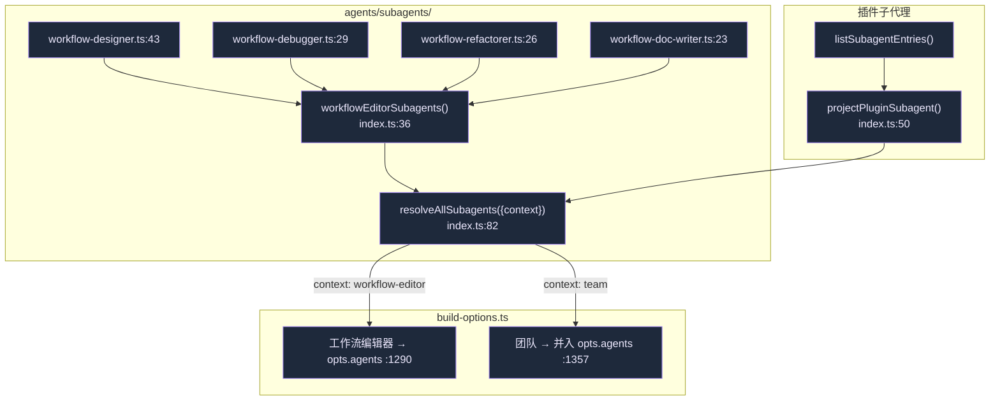
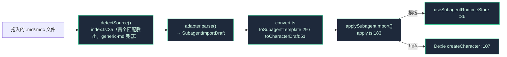

# 子代理

**子代理**是 SDK 能在轮次中途委派的受限子人格——拥有自己的提示词、工具白名单、模型与轮次预算。Cognia 自带 4 个内置工作流子代理、暴露插件贡献的子代理，并能从其它工具的格式导入子代理定义。

<TLDR>
  4 个内置（`workflow-designer/debugger/refactorer/doc-writer`）是 `lib/claude/agents/subagents/` 里的
  `AgentDefinition`。`resolveAllSubagents({context})`（`index.ts:82`）按名返回它们；build-options 为工作流
  编辑器会话把它们铺进 `opts.agents`（`:1290`），或为团队会话与插件子代理求并集（`:1357`）。另有一个**运行时
  →UI** 桥（`subagent-bridge.ts:24`）把被拉起的子代理状态投影成助手消息上的 `SubagentPart`——它*不*喂给
  SDK。`subagent-importers/` 管线把外部工具的 markdown（Claude Code、Codex、Cursor、Cline、通用）解析成规范
  草稿，再变成模板或角色。
</TLDR>

## AgentDefinition 形状

`lib/claude/agents/subagents/types.ts:13` 重导出 SDK 的 `AgentDefinition`：`description`、`prompt`、可选 `tools[]`、`disallowedTools[]`、`model`、`maxTurns`、`effort`（`low|medium|high|xhigh|max`）。4 个内置只设 `description`、`prompt`、`tools`、`maxTurns`——模型与 effort 从父轮次继承。

## 4 个内置工作流子代理

四者都通过 `mcp__cognia-plugin-tools__wf_*` 工具操作 [可视化工作流](../subsystems/visual-workflows) 编辑器。

| 子代理 | 导出 | 工具 | maxTurns | 可改图？ |
| --- | --- | --- | --- | --- |
| **Workflow Designer** | `workflow-designer.ts:43` | 15（read/add/remove/connect/configure/propose_batch/templates/auto_layout/group） | 20 | 是（构建图） |
| **Workflow Debugger** | `workflow-debugger.ts:29` | 5 个**只读**（read_graph/selection/node/validation_errors/last_run） | 10 | 否（诊断） |
| **Workflow Refactorer** | `workflow-refactorer.ts:26` | 10（读 + 改 + `wf_batch_apply` + 布局） | 15 | 是 |
| **Workflow Doc Writer** | `workflow-doc-writer.ts:23` | 5（读 + add + configure + focus —— **不能 remove**） | 15 | 仅标注 |

每个文件的 `SYSTEM_PROMPT` 常量就是 `prompt`。工具白名单强制角色：debugger 只持只读工具，物理上无法改图。

## 它们如何进入 SDK

`resolveAllSubagents({context})`（`index.ts:82`）：

- `"workflow-editor"` → 仅 4 个内置（`:86`）。
- `"team"` → 内置与每个插件子代理**求并集**（`:90`）。

插件子代理经 `projectPluginSubagent()`（`index.ts:50`）投影；运行时 id 为 `<pluginId>:<id>`（`:67`）。两个 build-options 分支都 fail-soft——投影出错只 `console.warn`（`:1293` / `:1360`）。

## 运行时 → UI 桥（非 SDK 暴露）

`subagent-bridge.ts` 是*另一个*方向：把被拉起的子代理运行时状态变成拉起它的那条助手消息上的 `SubagentPart`。它**零** SDK 或 store 导入——是被 `use-claude-chat.ts`（订阅 `useSubagentRuntimeStore`）消费的纯消息变换。

`applySubagentUpdate(messages, subAgent, opts?)`（`:24`）在正确消息上找到或插入幂等 `SubagentPart`（构建于 `:29-44`）。`pickTargetMessageIndex()`（`:71`）按 `parentMessageId`（`:76`）、再按 `metadata.parentAgentId`（`:82`）匹配，兜底到最近的助手消息（`:91`）。

## 导入外部子代理

`subagent-importers/` 管线读取*其它*工具的子代理定义并规范化。四阶段：**适配器 → 转换 → 应用 → UI 对话框**。

| 阶段 | 文件 | 做什么 |
| --- | --- | --- |
| 适配器 | `claude-code.ts`、`codex-cli.ts`、`cursor.ts`、`cline.ts`、`generic-md.ts` | 各自 `detect()` + `parse()` 工具特有 frontmatter（`SUBAGENT_SOURCE_ADAPTERS`，`index.ts:11`；generic-md 末位） |
| 规范化 | `types.ts:38` | 每个适配器产出一个 `SubagentImportDraft`（`source`、`sourceKey`、`name`、`systemPrompt`、`tools?`、`model?`、`warnings[]`） |
| 转换 | `convert.ts:29/51` | 草稿 → `SubAgentTemplate` 或 `CharacterDraft`（gemini→`"google"` provider 映射，`:16`） |
| 应用 | `apply.ts:183` | 按目标分发；**合并策略** skip / overwrite（内置受保护 → `failed[]`）/ duplicate（`nextAvailableName()`，`:25`） |

`detectSource()`（`index.ts:35`）返回首个 `"match"`，否则首个 `"maybe"`（使 generic-md 成为兜底），仅当无文件被接受时返回 `null`。逐草稿失败隔离进 `failed[]`，绝不中止整批。

## 扩展点

- **新增内置子代理**：建 `<role>.ts` 导出一个 `AgentDefinition`，加进 `workflowEditorSubagents()`（`index.ts:36`）。工具白名单*就是*安全边界。
- **插件子代理**：在清单里声明；manager 把它注册进 `listSubagentEntries()`，团队会话里自动出现。
- **导入新工具格式**：加一个实现 `SubagentSourceAdapter`（`detect`/`parse`）的适配器，并在 generic-md 之前注册进 `SUBAGENT_SOURCE_ADAPTERS`。

## 下一步

<Cards>
  <Card title="Build-options 管线" href="./build-options" description="把子代理铺进 opts.agents 的 :1290 / :1357 处。" />
  <Card title="可视化工作流" href="../subsystems/visual-workflows" description="4 个内置子代理操作的那个编辑器。" />
  <Card title="Agent Teams" href="./agent-teams" description="团队会话把插件子代理与内置求并集。" />
</Cards>
