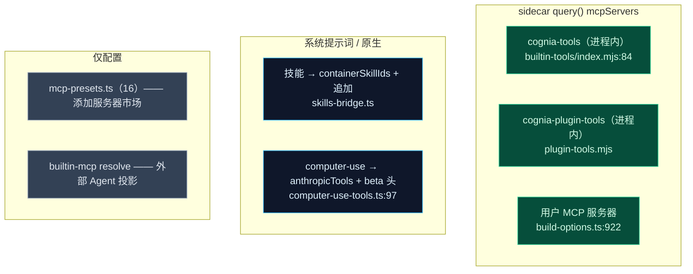
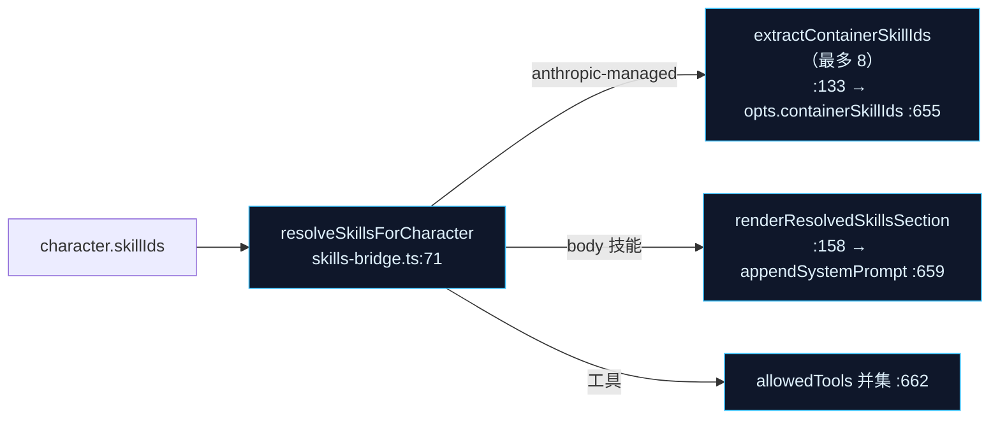

# 工具、MCP 与技能

内置 Agent 的工具表面来自五个来源，全部汇聚在 sidecar 的 SDK `query()` 调用里。本页逐一梳理：进程内 `cognia-tools` MCP 服务器、内置 MCP 占位符解析器、技能→SDK 桥、computer-use 原生工具与预设市场。

<TLDR>
  sidecar 从 `sidecar/builtin-tools/` 构建一个**进程内 MCP 服务器**（`cognia-tools`）——文件/git/进程/env/
  shell/terminal/LSP 工具，按类别门控。第二个进程内服务器（`cognia-plugin-tools`）代理 renderer 侧插件
  工具，并解析工作流子代理的 `wf_*` 名。技能以两种方式成为工具表面：anthropic-managed 技能作为
  `containerSkillIds` 透传，body 技能折入 `appendSystemPrompt`（`skills-bridge.ts`）。computer-use 发出
  Anthropic *原生*工具加一个 `anthropic-beta` 头，并在连接器通道上默认拒绝的 IM 黑名单。预设市场
  （`mcp-presets.ts`，16 个预设）只是“添加服务器”UI 目录。
</TLDR>

## 工具从哪来

## cognia-tools —— 进程内 MCP 服务器

`buildCogniaToolsServer({enabled, alwaysLoad, lspResolver})`（`sidecar/builtin-tools/index.mjs:69`）组合一个名为 `cognia-tools` 的 `createSdkMcpServer`（`:84`），无类别启用时返回 `null`。工具按类别分组（`TOOLS_BY_CATEGORY`，`:25`）；被禁用类别的带命名空间名会被推到 `disallowedTools` 作为纵深防御（`namesForDisabledCategories`，`:100`）。每个工具都带命名空间 `mcp__cognia-tools__<tool>`。

| 类别 | 文件 | 工具 | 数量 |
| --- | --- | --- | --- |
| fileExtras | `file-extras.mjs` | hash/diff/info/exists/search/content_search/append/binary_write/copy/rename/move/dir_create/dir_delete | 13 |
| git | `git.mjs` | status/diff/log/branch/remote/tag/repo_inspect/changes/history | 9 |
| process | `process.mjs` | list/get/search/top_memory/check_allowed/manager_status/tracked/start/terminate | 9 |
| environment | `environment.mjs` | list_env/get_env/system_info | 3 |
| shellAdvanced | `shell-advanced.mjs` | shell_execute_advanced | 1 |
| terminalRepl | `terminal-repl-tool.mjs` | spawn/write/read/kill（node-pty 私有 REPL） | 4 |
| lsp | `lsp.mjs` | goto_definition/find_references/hover/document_symbols/diagnostics | 5 |

LSP 工具是**绑定解析器且每会话**的——仅当 `enabled.lsp && lspResolver` 时经 `createLspTools(resolver)`（`lsp.mjs:85`）加入，不在静态 map 中。`shell_execute_advanced` 与 `start_process` 经 `safety.mjs`（路径穿越守卫 + 允许/阻止/危险模式扫描），镜像自 Cognia shell 工具。

开关来源是 `opts.builtinTools`（`build-options.ts:965`）——启用/禁用各类别的设置 JSON。

## cognia-plugin-tools —— renderer 代理

`buildPluginToolsServer`（`plugin-tools.mjs`）构建第二个进程内服务器（`cognia-plugin-tools`），包装 renderer 转发的插件工具：每个工具被调用时向 renderer 发出 `plugin_tool_exec` 并等待 `plugin_tool_response`。这就是工作流子代理的 `mcp__cognia-plugin-tools__wf_*` 名所解析到的服务器。清单在 build-options 构建（`buildPluginToolsManifest`，`:995`），它还折入内置技能清单，并在 computer-use 未授权时丢弃 `cognia-computer-use`。

## 内置 MCP 解析

`lib/claude/builtin-mcp/` **不**在聊天发送路径上——它是**外部 Agent 配置投影**（写 `~/.claude.json` 等）的占位符解析器。`resolveBuiltinMcpConfig(server, ctx)`（`resolve.ts:93`）是纯的：替换 `command`/`args`/`env` 中的 `${COGNIA_SIDECAR_DIR}`，并为 a2ui-bridge 行注入 `env.COGNIA_BRIDGE_SOCKET = ctx.socketPath` 使被拉起的 `a2ui-mcp.mjs` 连回 renderer。`getBuiltinMcpRuntimeContext()`（`runtime-context.ts:38`）从 Rust（`a2ui_bridge_runtime_paths`）取路径，进程生命周期缓存。它被 `sync.ts:88` 消费。（真正聊天路径的 MCP 服务器来自 `listEnabledMcpServers` + `buildMcpServerMap`，`build-options.ts:929`。）

## 技能 → SDK 表面

`skills-bridge.ts` 在聊天技能与插件技能间产出统一的 `ResolvedSkill`（`:38`），再以两种方式暴露给 SDK：

- **Managed 技能**（`anthropic-managed`）只解析成 `containerSkillId`；build-options 把至多 8 个（`MAX_CONTAINER_SKILLS`，`:126`）作为 `container.skill_id` 转发给 sidecar。
- **Body 技能**的 markdown 由 `resolveSkillMarkdown`（`skills-io.ts:273`）读取——inline / local-folder / local-bundle / archive——并经 `renderResolvedSkillsSection`（`:158`）折成一段 `## Skill: <name>`。

插件技能在 id 冲突时胜出；一切 fail-soft（浏览器 / fs 失败 → `undefined`，绝不抛）。撰写见[技能系统](./skills-system)。

## Computer-use 原生工具

`applyComputerUseTools(input)`（`computer-use-tools.ts:97`）为一轮解析 Anthropic 的*原生* computer-use 工具——区别于 MCP 工具。流程：

1. `!enableComputerUse` 早退（清缓存设置，`:100`）
2. **IM 黑名单短路**（`:118`）：`if (imSession && allowImComputerUse !== true) return {attachedCount:0}` —— 连接器通道默认拒绝屏幕控制
3. 读原生工具注册表，按 `allowedToolIds` 过滤，应用 consent/tier 逻辑（`:139`）
4. 映射到 `opts.anthropicTools`（`:186`）并组合 `anthropic-beta` 头（`:205`）

`COMPUTER_USE_PLUGIN_TOOL_NAMES`（`:39`）是喂给 `opts.suppressApprovalForTools` 的抑制集（使会话授权 / auto consent 不再提示），在 `use-claude-chat.ts:39` 镜像。IM 门在 build-options 的 `:990` 计算（`imSession = Boolean(session.platformBinding?.adapterId)`），在 `:1075` 调用点传入。完整门见 [ADR-0020](../adr/0020-computer-use-completeness)。

## 预设 MCP 市场

`mcp-presets.ts` 是**仅代码**目录（`MCP_PRESETS`，`:46`），含 16 个一键服务器：filesystem、github、gitlab、brave-search、puppeteer、fetch、memory、sqlite、postgres、slack、time、deepwiki（http）、http-generic、sse-generic、custom。`applyPresetFields(preset, values)`（`:365`）把用户值放进 env / args / url / headers。这只填充“添加服务器”UI——区别于进程内 `cognia-tools` 服务器。

## 跨模块小结

| 来源 | 以何形式抵达 SDK | build-options 位点 |
| --- | --- | --- |
| cognia-tools | `query()` mcpServers（进程内） | `opts.builtinTools` `:965` |
| 插件工具 | `cognia-plugin-tools`（进程内代理） | `opts.pluginTools` `:995` |
| 用户 MCP | `opts.mcpServers` | `:922` |
| 技能（managed） | `opts.containerSkillIds` | `:655` |
| 技能（body） | `appendSystemPrompt` | `:659` |
| computer-use | `opts.anthropicTools` + beta 头 | `:1075` |

## 下一步

<Cards>
  <Card title="Build-options 管线" href="./build-options" description="每个工具/MCP/技能字段在哪里装配进负载。" />
  <Card title="技能系统" href="./skills-system" description="撰写聊天技能与 SKILL.md 格式。" />
  <Card title="Sidecar MCP 服务器" href="../subsystems/mcp-server-sidecar" description="独立的 a2ui-mcp.mjs 服务器与协议。" />
  <Card title="ADR-0020 Computer Use" href="../adr/0020-computer-use-completeness" description="原生 computer-use 门与 consent 层级。" />
</Cards>
