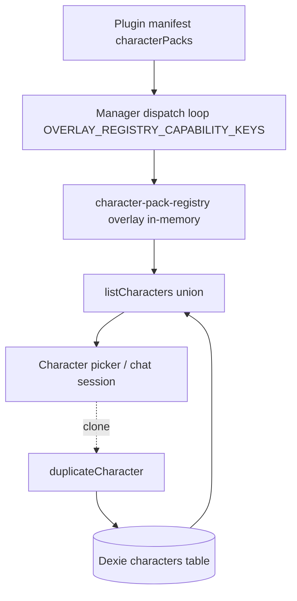

# 角色包

**角色包**（character pack）是一组开箱即用角色的可移植捆绑包（系统提示词 + 模型默认值 + 技能 / MCP / 原生工具的接线），由插件通过其清单贡献。ADR-0030 将 `character-pack` 设为 `OVERLAY_REGISTRY_CAPABILITIES` 中的第 5 个条目：角色包在插件启用时注册进内存中的覆盖层注册表，并在禁用时被丢弃。插件贡献的角色**永不持久化到 Dexie**——只有用户对覆盖层角色的*克隆*才会成为一条 Dexie 行。宿主在投影时派生一个合成的运行时 id，因此不可能与用户的 `char_*` id 发生冲突。

<TLDR>
- 清单字段 `characterPacks: PluginCharacterPackDef[]` —— `types/plugin/plugin.ts:572`；能力 `"character-pack"` 在 `lib/plugin/contracts/capability-bridge-map.ts:228` 处分发。
- 覆盖层注册表（内存中，永不进 Dexie）：`lib/plugin/registries/character-pack-registry.ts:37`。
- 运行时 id `cognia-pack:<pluginId>:<packId>:<localId>` —— `buildOverlayCharacterId` 位于 `character-pack-registry.ts:162`。
- SDK 作者辅助函数 `defineCharacterPack` —— `lib/plugin/sdk/define-character-pack.ts:46`（软上限 50，64 KB 头像警告）。
- `requires` 是警告而非阻断 —— `lib/plugin/character-pack/validate-requires.ts:56`。
- 第一方内置角色也搭乘覆盖层 —— `plugins/cognia-builtin-characters/src/index.ts:32`。
</TLDR>

## 清单类型

一个角色包包含一个或多个角色。每个角色都是 Dexie `Character` 形状的一个严格、可移植子集——宿主托管的身份 / 生命周期 / Twin 绑定字段由宿主在投影时填充，而不由作者声明。

```ts
// types/plugin/plugin-character-pack.ts:37-42
export interface PluginCharacterAvatarImage {
  /** Filesystem-style path relative to the plugin bundle (Tauri only). */
  tauriPath?: string
  /** `data:image/*` URL — works in every shell, larger payload. */
  webDataUrl?: string
}
```

```ts
// types/plugin/plugin-character-pack.ts:48-57
export interface PluginCharacterPersona {
  /** Free-form tone descriptor (e.g. "warm, encouraging"). */
  tone?: string
  /** Persona prose (e.g. "Former kindergarten teacher, prefers analogies."). */
  personality?: string
  /** Opening line shown when the user starts a new chat with the character. */
  openingMessage?: string
  /** Few-shot exemplar prompts surfaced as quick-action chips. */
  exemplarPrompts?: string[]
}
```

```ts
// types/plugin/plugin-character-pack.ts:69-76
export interface PluginCharacterVoiceProfile {
  provider: TTSProvider
  voiceId: string
  /** TTS rate multiplier. Inherits global `ttsRate` when undefined. */
  rate?: number
  pitch?: number
  volume?: number
}
```

```ts
// types/plugin/plugin-character-pack.ts:88-141 (trimmed)
export interface PluginCharacterDef {
  /** Unique id within the pack. Host derives the runtime id from this. */
  localId: string
  name: string
  description?: string
  avatarColor: string
  avatarEmoji?: string
  /** Required. The persona's system prompt. */
  systemPrompt: string

  // ---- Optional Character subset (mirrors lib/claude/types.ts:Character) ----
  model?: string
  providerId?: string
  permissionMode?: SendOptions["permissionMode"]
  allowedTools?: string[]
  disallowedTools?: string[]
  mcpServerIds?: string[]
  skillIds?: string[]
  pluginSkillIds?: string[]
  workingDir?: string
  bareMode?: boolean
  debugMode?: boolean
  briefMode?: boolean
  enableComputerUse?: boolean
  computerUseSettings?: Character["computerUseSettings"]
  sandboxEnabled?: boolean
  sandboxTier?: Character["sandboxTier"]
  platformDefaults?: CharacterPlatformDefaults
  a2uiEnabled?: boolean
  a2uiCatalogId?: string
  /** Restrict to specific host profiles; unset = available everywhere. */
  availableOnPlatforms?: PluginRuntimeProfile[]

  // ---- v2 fields (schemaVersion: 2) ----
  avatarImage?: PluginCharacterAvatarImage
  persona?: PluginCharacterPersona
  voiceProfile?: PluginCharacterVoiceProfile
}
```

```ts
// types/plugin/plugin-character-pack.ts:147-176
export interface PluginCharacterPackDef {
  /** Pack id; must be unique within the contributing plugin's manifest. */
  id: string
  name: string
  description?: string
  /** Semver. Drives the user-clone "Update available" comparison. */
  version: string
  /** At least one character. SDK helper soft-caps at 50; see ADR-0030. */
  characters: PluginCharacterDef[]

  /** Cross-capability dependencies — validated as warnings, never blockers. */
  requires?: {
    skills?: string[]
    pluginSkillIds?: string[]
    mcpServerPresets?: string[]
    nativeAnthropicTools?: string[]
    a2uiCatalogId?: string
  }

  /** Optional cosmetic. Default for character avatars that omit one. */
  icon?: { emoji?: string; color?: string }
  /** Free-form tags surfaced in the Settings UI search. */
  tags?: string[]
}
```

角色名是普通 `string`（ADR-0030 §D7）——想要本地化标签的插件通过 `lib/i18n/plugin-i18n-registry.ts:registerPluginI18n` 注册自己的语言包，宿主据此渲染 `plugin.<pluginId>.<key>`。v2 字段是可选且向后兼容的：v1 角色包让它们保持未定义，运行时回退到 `avatarEmoji + avatarColor` 用于显示，并使用 AppSettings 的 TTS 用于语音。

## SDK 作者接口 —— `defineCharacterPack`

`defineCharacterPack()` 是一个带类型的透传函数，同时在作者编写时强制结构规则：至少一个角色、`localId` 唯一、50 个角色的软上限，以及对未知语音提供方 / 超大头像的非阻断警告。

```ts
// lib/plugin/sdk/define-character-pack.ts:46-69
export function defineCharacterPack(def: PluginCharacterPackDef): PluginCharacterPackDef {
  if (!def.characters || def.characters.length === 0) {
    throw new Error(`defineCharacterPack: pack "${def.id}" must declare at least one character`)
  }
  if (def.characters.length > PLUGIN_CHARACTER_PACK_SOFT_LIMIT) {
    throw new Error(
      `defineCharacterPack: pack "${def.id}" declares ${def.characters.length} characters; ` +
        `the soft limit is ${PLUGIN_CHARACTER_PACK_SOFT_LIMIT}. Split into multiple packs.`
    )
  }
  const seen = new Set<string>()
  for (const ch of def.characters) {
    if (seen.has(ch.localId)) {
      throw new Error(`defineCharacterPack: pack "${def.id}" has duplicate localId "${ch.localId}"`)
    }
    seen.add(ch.localId)
    warnIfUnknownVoiceProvider(def.id, ch.localId, ch.voiceProfile?.provider)
    warnIfOversizedAvatarImage(def.id, ch.localId, ch.avatarImage?.webDataUrl)
  }
  return def
}
```

| 常量 | 取值 | file.ts:line |
| --- | --- | --- |
| `PLUGIN_CHARACTER_PACK_SOFT_LIMIT` | 50（超过即抛错） | `define-character-pack.ts:35` |
| `PLUGIN_CHARACTER_AVATAR_WEB_DATA_URL_SOFT_BYTES` | 64 KB（仅警告） | `define-character-pack.ts:44` |

作者用法示例：

```ts
const workplace = defineCharacterPack({
  id: "workplace",
  name: "Workplace Suite",
  version: "1.0.0",
  characters: [
    {
      localId: "alice",
      name: "Alice the Analyst",
      avatarColor: "oklch(0.7 0.15 250)",
      systemPrompt: "...",
    },
  ],
})
```

## 覆盖层注册表

该注册表是一个以角色包 `id` 为键的 `createValidatingOverlayRegistry` 闭包，接入了 `validatePackRequires` 作为校验器，因此 `requires` 警告会在注册时被捕获。

```ts
// lib/plugin/registries/character-pack-registry.ts:37-43
const registry = createValidatingOverlayRegistry<
  PluginCharacterPackDef,
  PluginCharacterPackWarning
>({
  name: "character-pack",
  validate: (pack) => validatePackRequires(pack).warnings,
})
```

| API | file.ts:line | 用途 |
| --- | --- | --- |
| `registerCharacterPack` | `character-pack-registry.ts:51` | 添加或替换一个角色包（幂等）。 |
| `getCharacterPack` / `getCharacterPackEntry` | `:64` / `:66` | 角色包查找；entry 额外附带 `pluginId` 标签。 |
| `listCharacterPackIds` | `:68` | 按注册顺序列出已注册的 id。 |
| `getPackWarnings` | `:76` | 注册时收集的 `requires` 警告。 |
| `getPackCharacterWarnings` | `:85-92` | 角色包级加上匹配的角色级警告。 |
| `listAllPackCharacters` | `:95-111` | 用于并集的扁平化 `{ pack, character, pluginId }[]`。 |
| `getPackCharacterByRuntimeId` | `:122-154` | 把一个合成 id 解析回它所属的角色包 + 角色。 |
| `buildOverlayCharacterId` | `:162-168` | 构造合成的运行时 id。 |
| `isOverlayCharacterId` | `:171-173` | 判定函数——覆盖层 id 为 true，Dexie 行 id 为 false。 |

合成 id 至多拆分为四部分，因此 `localId` 自身可以包含冒号。解析器还容忍空的 `pluginId` 段，以便本地导入的角色包（无贡献插件）也能被解析。

```ts
// lib/plugin/registries/character-pack-registry.ts:162-173
export function buildOverlayCharacterId(
  pluginId: string | undefined,
  packId: string,
  localId: string
): string {
  return `cognia-pack:${pluginId ?? ""}:${packId}:${localId}`
}

/** True if `id` is a synthetic overlay character id; false for Dexie row ids. */
export function isOverlayCharacterId(id: string): boolean {
  return id.startsWith("cognia-pack:")
}
```

## 清单接线与分发

清单声明 `characterPacks`（`types/plugin/plugin.ts:572`）并列出 `"character-pack"` 能力。插件管理器遍历 `OVERLAY_REGISTRY_CAPABILITY_KEYS`，**无需任何针对单个能力的手术式改动**——`capability-bridge-map.ts:228` 处的描述符把清单字段映射到注册表，并在每次注册 / 注销时刷新同级模板警告。

```ts
// lib/plugin/contracts/capability-bridge-map.ts:228-245
"character-pack": defineOverlayCapability<PluginCharacterPackDef>({
  manifestField: "characterPacks",
  registerEntry: (def, ctx) => {
    registerCharacterPack(def.id, def, ctx)
    refreshAllTemplateWarnings()
  },
  unregisterAllByPlugin: (pluginId) => {
    const n = unregisterCharacterPacksByPlugin(pluginId)
    refreshAllTemplateWarnings()
    return n
  },
}),
```

## `requires` 校验（警告，不阻断）

`validatePackRequires` 同步检查内存中的同级覆盖层（技能 / MCP 预设 / 原生工具）并发出警告——无论如何角色包都会注册。引用了缺失依赖的角色会通过既有的 `resolveSendOptions` 路径优雅降级（未知技能 id 被静默丢弃）。

```ts
// lib/plugin/character-pack/validate-requires.ts:23-35
export interface PluginCharacterPackWarning {
  code:
    | "missing-skill"
    | "missing-plugin-skill"
    | "missing-mcp-preset"
    | "missing-native-tool"
    | "missing-a2ui-catalog"
  missingId: string
  characterLocalId?: string
}
```

<Status type="warning">
Dexie 支持的聊天 `skillIds` 在注册时不会被检查——那需要在同步注册循环内做一次异步 DB 调用。改为由 characters-section.tsx 中的 UI 级校验在渲染时捕捉这些遗漏。
</Status>

## 第一方内置角色包

ADR-0030 §D5 最初把六个内置人设排除在覆盖层之外；v50 修订反转了这一决定，使它们也能享受与第三方角色包相同的应用更新流程。它们现在存在于一个真正的第一方插件中。

```ts
// plugins/cognia-builtin-characters/src/index.ts:32-39 (head)
export const BUILTIN_PACK = defineCharacterPack({
  id: "builtin",
  name: "Cognia Built-ins",
  description: "The six default Cognia personas. Bundled with the app.",
  version: "1.0.0",
  icon: { emoji: "✨", color: "oklch(0.7 0.13 250)" },
  tags: ["builtin"],
  characters: [ /* coding, writer, research, brainstorm, translator, goal-tracker */ ],
})
```

历史遗留的 `char_builtin_*` Dexie 行由 Dexie v50 升级钩子打上该插件 id + 角色包 id 的标签，而 `clone-hides-overlay` 去重规则保持可见的选择器不变。这张抬升迁移映射表是单一事实来源——**修改某个 `localId` 会让现有的用户自定义成为孤儿**。

```ts
// plugins/cognia-builtin-characters/src/index.ts:108-117
export const BUILTIN_LEGACY_ID_TO_LOCAL_ID: Readonly<Record<string, string>> = Object.freeze({
  char_builtin_coding: "coding",
  char_builtin_writer: "writer",
  char_builtin_research: "research",
  char_builtin_brainstorm: "brainstorm",
  char_builtin_translator: "translator",
  char_builtin_goal_tracker: "goal-tracker",
})

export const BUILTIN_PLUGIN_ID = "cognia-builtin-characters"
```

## 生命周期

| 事件 | 行为 |
| --- | --- |
| 插件启用 | 管理器遍历 `OVERLAY_REGISTRY_CAPABILITY_KEYS` 并对每个角色包调用 `registerCharacterPack`；设置面板 + 选择器经由 Zustand 重新渲染。 |
| 插件禁用 | `unregisterCharacterPacksByPlugin` 在一次 Map 扫描中丢弃每个角色包；Dexie 克隆不受影响；进行中的覆盖层会话会得到一个 `CharacterMissingBanner`。 |
| 重新启用、更新版本 | 匹配 `sourcePluginId` + `sourcePackId` 的克隆行显示「Update available」——用户重新克隆或忽略；绝不自动覆盖。 |
| 用户克隆覆盖层 | `duplicateCharacter(syntheticId)` 写入一条 Dexie 行，带有 `sourcePluginId` / `sourcePackId` / `clonedFromPackCharacterId` / `packVersionAtClone` 以及一份 `pristineSnapshot`。 |
| 本地角色包导入 | `importLocalPack` 校验、写入文件，并以 `local:imported` 注册；与真实插件角色包 id 冲突时拒绝。 |
| 本地角色包删除 | `deleteLocalPack` 注销并删除文件；Dexie 克隆得以保留。 |

### 不变量

1. **仅覆盖层存储**——插件角色包永不持久化到 Dexie；删除是原子的。
2. **带命名空间的 id**——`cognia-pack:` 前缀永不会与用户的 `char_*` id 冲突。
3. **并集上 Dexie 优先**——用户克隆优先于其覆盖层来源。
4. **克隆在禁用后存活**——重新启用更新版本时浮现「Update available」。
5. **内置角色搭乘覆盖层**（v50）并带有 Dexie 归属标签。
6. **`requires` 仅警告，绝不阻断。**
7. **i18n 经由插件语言包**（`plugin.<id>.<key>`），而非清单形状。
8. **本地角色包绕过插件管理器**，使用它们自己的磁盘存储。

## 数据流



## 相关

<Cards>
  <Card title="数据模型与克隆归属" href="./data-model" />
  <Card title="本地角色包与应用更新" href="./packs-local-and-updates" />
  <Card title="编辑器与发现页" href="./editor-and-discover" />
  <Card title="ADR-0030 —— 覆盖层能力" href="../adr/0030-character-pack-overlay-capability" />
  <Card title="插件系统" href="../subsystems/plugin-system" />
</Cards>
