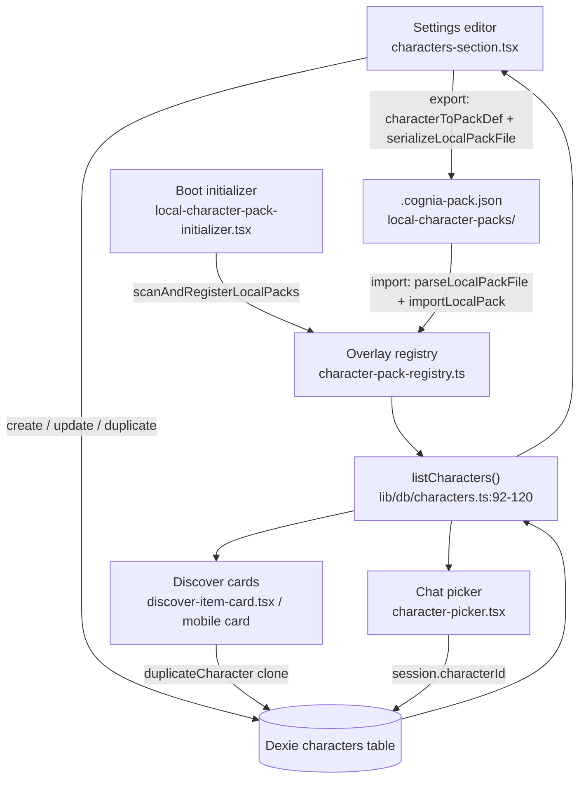

# 编辑器、选择器与发现页

让用户创作、选择、更新和发现角色的四个 UI 界面都从同一个 Dexie-∪-覆盖层并集读取（`lib/db/characters.ts:listCharacters` 92–120），并通过同一个 CRUD 模块写回。本页涵盖**设置编辑器**（完整字段清单 + 角色包导入/导出）、**应用更新差异对话框**、**聊天选择器**（三桶分组 + 平台过滤）、**发现页**投影卡片（桌面网格 + 移动端 Sheet），以及扫描本地角色包文件的**启动初始化器**。

<TLDR>
- 编辑器：`components/settings/characters-section.tsx` —— 按来源过滤的列表（`filterCharacters` / `classifyCharacterSource` `editor-projection.ts:20–41`）、分组的逐角色表单、`.cognia-pack.json` 导入/导出（`characterToPackDef` + `serializeLocalPackFile` 第 117 行）、内置行只读且带复制。
- 更新对话框：`components/settings/character-pack-update-dialog.tsx` —— `previewPackUpdate` 演练（第 25/65 行）、两栏 `PackUpdateDiff` 渲染（第 29/99–113 行）、`noBaseline` 警告、应用 → `applyPackUpdate`。
- 选择器：`components/chat/character-picker.tsx` —— `groupCharacters`（38–64）分成 builtIn / 按插件 / user、`isOverlayCharacterId`（15）+ `LOCAL_PACK_PLUGIN_ID`（16）+ `isAvailableOnProfile`（17）、`avatarImage.webDataUrl` 回退字形（94）。
- 发现页：`components/discover/discover-item-card.tsx:50–66` 投影；移动端 `components/mobile/discover/character-card.tsx`（头像 48–49，Plugin 徽章 71–75）。
- 启动：`components/providers/initializers/local-character-pack-initializer.tsx:1–62` —— 首次绘制时 `scanAndRegisterLocalPacks`、跳过提示、web 空操作。
</TLDR>

## 设置编辑器

`components/settings/characters-section.tsx` 是创作界面。左侧列表按**来源**过滤——`classifyCharacterSource()`（`editor-projection.ts:20–24`）把每一行分入 `builtin | plugin | user` 桶，`filterCharacters()`（`editor-projection.ts:30–41`）应用当前过滤器加上搜索框。内置行渲染为**只读**，仅带一个复制动作；选中任意行会打开逐角色表单。

### 表单字段清单

表单经过分组，使冗长的字段列表保持可一目了然。每个字段都映射到一个 `Character` 属性（`lib/claude/types.ts:2059–2317`）。

| 分组 | 字段 | Character 属性 |
|---|---|---|
| 身份 | 头像 emoji + `COLOR_PALETTE` 色板（第 125–134 行）、名称、描述 | avatarEmoji, avatarColor, name, description |
| 提示词 | 系统提示词文本域 | systemPrompt |
| 模型路由 | 模型预设（`MODEL_PRESET_VALUES`）、提供方、账户覆盖 | model, providerId, accountIdOverride |
| 权限 | 权限模式（`PERMISSION_MODE_VALUES`） | permissionMode |
| 工具 | 白名单、黑名单、MCP 子集、技能选择器 | allowedTools, disallowedTools, mcpServerIds, skillIds + pluginSkillIds |
| 工作目录 | 工作目录 | workingDir |
| 模式 | 裸 / 调试 / 简洁开关、思考预算 | bareMode, debugMode, briefMode, maxThinkingTokens |
| A2UI | 启用开关 + 目录 id | a2uiEnabled, a2uiCatalogId |
| Twin | `TwinBindingSection` | twinId, twinSettings |
| 电脑使用 | 选择启用 + 子设置（同意模式、息屏、允许的工具 id） | enableComputerUse, computerUseSettings |
| 沙箱 | 层级选择器 | sandboxEnabled, sandboxTier |
| 语音 | 提供方 + 语音（来自 `VOICE_CATALOG` 139–149）+ 速率 / 音高 / 音量滑块 | voiceProfile |
| 人设 | 语气、个性、openingMessage、exemplarPrompts | persona |
| 可用性 | 平台复选框（`PLATFORM_OPTIONS` 第 151 行） | availableOnPlatforms |

语音编辑器由共享的 TTS 目录支撑——`system` 没有静态目录，因此其语音 id 是自由文本：

```typescript
// components/settings/characters-section.tsx:139-149
const VOICE_CATALOG: Partial<Record<TTSProvider, ReadonlyArray<{ id: string; name: string }>>> = {
  openai: OPENAI_TTS_VOICES,
  gemini: GEMINI_TTS_VOICES,
  edge: EDGE_TTS_VOICES,
  elevenlabs: ELEVENLABS_TTS_VOICES,
  lmnt: LMNT_TTS_VOICES,
  hume: HUME_TTS_VOICES,
  cartesia: CARTESIA_TTS_VOICES,
  deepgram: DEEPGRAM_TTS_VOICES,
  xiaomi: XIAOMI_TTS_VOICES,
}
```

人设示例文本域通过 `parseLines()`（`editor-projection.ts:44–49`）往返；人设对象本身由 `buildPersona()`（61–73）重建，语音覆盖层由 `buildVoiceProfile()`（85–94）重建。

### 导入 / 导出

导出把当前行序列化成可移植的角色包文件。`characterToPackDef()`（`editor-projection.ts:102–141`）把宿主托管字段（createdAt、twinId、isBuiltIn……）丢弃进一个 `PluginCharacterDef`，随后 `serializeLocalPackFile()`（`schema.ts:247–259`）发出一个 2 空格缩进 + 尾随换行的 v2 `.cognia-pack.json`：

```typescript
// components/settings/characters-section.tsx:116-118
import { characterToPackDef, filterCharacters } from "@/lib/plugin/character-pack/editor-projection"
import { serializeLocalPackFile } from "@/lib/plugin/character-pack/schema"
import { downloadBlob } from "@/lib/files/download"
```

导入运行其逆过程——文件选择器 → `parseLocalPackFile()`（`schema.ts:83–120`，schema 版本 1–2）→ `importLocalPack()`（`local-pack-store.ts:243–287`），它校验、把文件写入 `<appData>/cognia/local-character-packs/` 下，并以 `LOCAL_PACK_PLUGIN_ID` 注册。Web 模式是空操作（无文件系统）。

<Status type="warning">
内置行无法被编辑或删除。表单为只读，只提供复制动作——它经由 duplicateCharacter 把覆盖层克隆成一条可编辑的 Dexie 行。
</Status>

## 应用更新对话框

`components/settings/character-pack-update-dialog.tsx` 在用户提交前预览更新版本的角色包将会改变什么。打开时它运行演练差异：

```typescript
// components/settings/character-pack-update-dialog.tsx:64-68
const result = await previewPackUpdate(characterId)
if (cancelled) return
setPreview(result ?? null)
```

`previewPackUpdate()`（`characters.ts:411–421`）返回一个 `PackUpdateDiff`（`diff-pack-update.ts:111–118`）。对话框经由本地的 `DiffColumn` 组件把它渲染为两栏——**将更新**（覆盖项）与**已保留**（用户编辑、保留）：

```tsx
// components/settings/character-pack-update-dialog.tsx:98-113
{preview.diff.willOverwrite.length > 0 && (
  <DiffColumn heading={tDialog("willUpdate")} changes={preview.diff.willOverwrite} tone="overwrite" ... />
)}
{preview.diff.preserved.length > 0 && (
  <DiffColumn heading={tDialog("preserved")} changes={preview.diff.preserved} tone="preserved" ... />
)}
```

当差异带有 `noBaseline`（一个早于 `pristineSnapshot` 捕获的历史遗留克隆）时，会显示一条黄色警告横幅（第 88–92 行），且**每个**包级管理字段都可被覆盖。当没有任何可覆盖项且无 `noBaseline` 标志时，确认按钮被禁用（第 75–76 行）。应用会回调 `applyPackUpdate()`（`characters.ts:385–403`）。差异规则参见[本地角色包与更新](./packs-local-and-updates)。

## 聊天选择器

`components/chat/character-picker.tsx` 是一个由 `DesktopChatWorkspace` 挂载的 `CommandDialog` 命令面板。它首先隐藏任何被角色包限制在此宿主之外的角色，然后对其余的进行分组：

```typescript
// components/chat/character-picker.tsx:81-82
const visible = characters.filter((c) => isAvailableOnProfile(c.availableOnPlatforms))
const groups = groupCharacters(visible)
```

`groupCharacters()`（38–64）产出三个桶——`builtIn`、`byPlugin`（一个以 `sourcePluginId` 为键的 `Map`，匿名覆盖层回退到 `LOCAL_PACK_PLUGIN_ID`）和 `user`——使用 `isOverlayCharacterId()`（导入第 15 行）把合成的 `cognia-pack:` id 与用户的 `char_*` 行区分开：

```typescript
// components/chat/character-picker.tsx:42-62 (trimmed)
for (const c of characters) {
  if (c.isBuiltIn) { builtIn.push(c); continue }
  if (isOverlayCharacterId(c.id) && c.sourcePluginId) {
    const list = byPlugin.get(c.sourcePluginId) ?? []
    list.push(c); byPlugin.set(c.sourcePluginId, list); continue
  }
  if (isOverlayCharacterId(c.id) && !c.sourcePluginId) { /* → LOCAL_PACK_PLUGIN_ID */ }
  user.push(c)
}
```

每一行通过 `AvatarBadge` 渲染，把可选的 v2 角色包图像穿入，使 Radix 在其缺失时能回退到颜色 + 字形：

```tsx
// components/chat/character-picker.tsx:93-97
<AvatarBadge
  subject={{ ...c, avatarImageUrl: c.avatarImage?.webDataUrl }}
  size={24}
  textClassName="text-xs"
/>
```

`CommandInput` 过滤器跨组运行（`value` 是 `name + description`），因此键入可以无论桶为何都找到一个角色。选中某个会调用 `onPick(c)`，它设置 `session.characterId`。聊天头随后在 `chat-header.tsx:387–433` 处渲染当前角色（头像、名称 · 描述、模型徽章）——头部细节参见[运行时消费](./runtime-consumption)。

## 发现页界面

发现页把角色投影成安装卡片。桌面网格（`discover-desktop-body.tsx`）和移动端 Sheet 都基于同一个 `"character"` 种类的 `DiscoverItem`。`discover-item-card.tsx` 把行扁平化为显示字段：

```typescript
// components/discover/discover-item-card.tsx:54-66
case "character": {
  const c = item.data
  return {
    name: c.name,
    description: c.description,
    builtIn: Boolean(c.isBuiltIn),
    badge: undefined,
    avatar: { kind: "color", color: c.avatarColor ?? "#888", glyph: c.avatarEmoji ?? c.name.slice(0, 2).toUpperCase() },
  }
}
```

移动端卡片（`components/mobile/discover/character-card.tsx`）在 v2 头像图像存在时渲染它，并为插件覆盖层或克隆自插件的行浮现单个 Plugin 药丸标签：

```tsx
// components/mobile/discover/character-card.tsx:48-49
{character.avatarImage?.webDataUrl ? (
  <AvatarImage src={character.avatarImage.webDataUrl} alt="" />
) : null}
```

```tsx
// components/mobile/discover/character-card.tsx:71-75
{character.sourcePluginId ? (
  <Badge variant="outline" className="text-[10px]">
    {t("pluginBadge")}
  </Badge>
) : null}
```

一个配套的 `character-detail-sheet.tsx` 打开完整描述。**安装 / 应用**流程取决于来源：覆盖层角色包角色经由 `duplicateCharacter()`（`characters.ts:276–329`）被克隆成一条可编辑的 Dexie 行；内置角色直接按 id 引用；无论哪种方式，会话都以 `session.characterId = character.id` 绑定。

## 启动初始化器

`components/providers/initializers/local-character-pack-initializer.tsx`（1–62）挂载在 `app/layout.tsx` 之下。首次绘制时它运行一次 `scanAndRegisterLocalPacks()`（`local-pack-store.ts:175–222`）（由一个 `useRef` 守护），把每个有效的 `.cognia-pack.json` 注册进内存中的覆盖层注册表。校验失败的文件浮现一个跳过提示，使磁盘角色包不会被静默隐藏：

```tsx
// components/providers/initializers/local-character-pack-initializer.tsx:41-49
const result = await scanAndRegisterLocalPacks()
if (result.skipped.length > 0) {
  log.warn("local-pack-store: some packs were skipped during boot scan", { skipped: result.skipped })
  toast.warning(t("packs.skippedToast", { count: result.skipped.length }))
}
```

它在 web 模式下是空操作（`appDataDir()` 无法解析），镜像 `ExternalAgentInitializer` 的形状。

## 数据流



## 相关

<Cards>
  <Card title="数据模型" href="./data-model" />
  <Card title="角色包" href="./character-packs" />
  <Card title="本地角色包与更新" href="./packs-local-and-updates" />
  <Card title="运行时消费" href="./runtime-consumption" />
</Cards>
