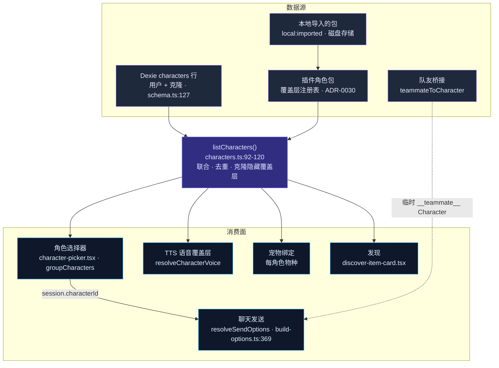

# 角色

**Character**（角色）是 Cognia 用来把 *助手是谁* 与 *一次发送如何配置* 打包成单个可复用、可选择对象的单元。它远不止是一段系统提示词：一个角色携带人格提示词、模型/供应商路由、工具与 MCP 子集、权限模式、技能、可选的员工数字分身（Twin）绑定、TTS 语音覆盖层，以及计算机使用、沙箱、OCR 和 A2UI 的开关。当你在输入框里选中一个角色时，所有这些字段都通过唯一一个函数流入下一轮——`lib/claude/build-options.ts` 中的 `resolveSendOptions`。

<TLDR>
  一个角色是 Dexie `characters` 表中的一行（`lib/db/schema.ts:127`），在读取时由 `listCharacters`
  （`lib/db/characters.ts:92-120`）与插件**角色包覆盖层**（ADR-0030）**联合**。覆盖层行获得合成 id
  `cognia-pack:<plugin>:<pack>:<local>`；带有匹配 `clonedFromPackCharacterId` 的 Dexie 克隆会**隐藏**其对应的覆盖层（108-118）。被选中的角色由
  `resolveCharacterById`（`characters.ts:134-141`）解析，并由 `resolveSendOptions`（`build-options.ts:369-376`）折叠成单个 `SendOptions` 载荷。六个默认人格现在作为第一方
  <Term>cognia-builtin-characters</Term> 插件包发布，由 `seedBuiltInCharacters`
  （`characters.ts:497-560`）带归属信息植入 Dexie。
</TLDR>

<StatGrid>
  <Stat label="角色字段" value="~50" hint="lib/claude/types.ts:2059-2317 — 标识、提示词、路由、工具、权限、分身、开关、包 v2、归属" />
  <Stat label="内置人格" value="6" hint="编码 · 写作 · 研究 · 头脑风暴 · 翻译 · 目标追踪 — cognia-builtin-characters BUILTIN_PACK" />
  <Stat label="系统提示词预设" value="12" hint="SystemPromptPreset 内置项，lib/db/preset-built-ins.ts:18-173" />
  <Stat label="包托管字段" value="20" hint="PACK_MANAGED_FIELDS 可用于 Apply Update，diff-pack-update.ts:65-88" />
  <Stat label="包文件 schema" value="v2" hint="CHARACTER_PACK_FILE_SCHEMA_VERSION, schema.ts:28 — 支持 v1 + v2" />
  <Stat label="消费面" value="6" hint="聊天发送 · 智能体团队 · TTS · 宠物 · 发现 · IM 平台" />
</StatGrid>

## 角色是什么

角色是**带一张脸的每次发送配置**。它的存在是为了让所有塑造一轮对话的旋钮——提示词、模型、工具、权限、能力开关——可以保存一次、起个名字、配上头像并被重新选择，而不必每次都重新键入到输入框里。选中一个角色会把它绑定到会话（`session.characterId`）；之后每一次发送都会重新解析它。

角色本身**不**运行任何东西。它是数据。执行主干是[内置智能体](./built-in-agent)：`resolveSendOptions` 读取角色并把它的字段折叠进单个 `SendOptions` 载荷，跨越 IPC 接缝进入 sidecar。这种收敛正是要点所在——新增一项能力只需触及角色 schema 和 `resolveSendOptions` 的一个分支，别无其他。

单个角色按字段分组解析成什么：

| 关注点 | 角色字段 | 解析者 |
| --- | --- | --- |
| 人格提示词 | `systemPrompt`, `persona` | `build-options.ts:589-594`，persona 段落 `:744-753` |
| 模型路由 | `model`, `providerId`, `accountIdOverride` | 优先于 `AppSettings` 默认值 |
| 技能 | `skillIds`, `pluginSkillIds` | `:709-737` resolveSkillsForCharacter |
| 工具与 MCP | `allowedTools`, `disallowedTools`, `mcpServerIds`, `toolFilter` | `:827-836` 处的联合，MCP 子集 `:987-1005` |
| 权限与模式 | `permissionMode`, `bareMode`, `briefMode`, `maxThinkingTokens` | 在整条流水线中折叠 |
| 分身绑定 | `twinId`, `twinSettings` | `:606-643` 处的 `applyTwinContext` |
| 能力开关 | `enableComputerUse`, `sandboxEnabled`, `enableOcr`, `a2uiEnabled` | 计算机使用开关 `:1052-1053` |
| 语音覆盖层 | `voiceProfile` | 发送相邻面的 TTS |

## 双层数据源模型

角色来自**在读取时联合的两个数据源**，从不是单一权威存储：

1. **Dexie `characters` 行** —— 用户创建的角色，以及包角色的 *克隆*。它们会持久化；这是可写层。
2. **插件角色包覆盖层**（ADR-0030）—— 由已启用插件的 `characterPacks` 贡献的角色。它们**只**存在于内存中的覆盖层注册表里，由 `projectOverlayCharacter`（`characters.ts:46-90`）投射成临时的 `Character` 对象，带合成运行时 id `cognia-pack:<pluginId>:<packId>:<localId>`。禁用该插件，覆盖层角色就消失；你的克隆则保留。

`listCharacters`（`characters.ts:92-120`）执行联合与去重。两条规则使其保持确定性：

- **Dexie 优先去重** —— 在 id 碰撞时，持久化行胜过覆盖层。
- **克隆隐藏覆盖层**（`:108-118`）—— 如果某个 Dexie 行携带 `clonedFromPackCharacterId`，对应的覆盖层角色会被抑制，使被克隆的角色不会出现两次。

六个默认人格**不再**是手工植入的行。它们作为第一方 `cognia-builtin-characters` 插件包（`BUILTIN_PACK`，6 个角色：编码、写作、研究、头脑风暴、翻译、目标追踪）发布，并由幂等的 `seedBuiltInCharacters`（`characters.ts:497-560`，v50）带内置包归属信息抬入 Dexie。因此内置项与其他每一个包一样，跑在相同的覆盖与克隆机制之上。完整的数据契约在[数据模型](./data-model)页面。

## 从数据源到消费面

队友桥接是第四个、临时性的生产者：`teammateToCharacter`（`lib/ai/agent/team/teammate-character.ts:56`）合成一个临时角色（id 为 `__teammate__:<id>`），使每个智能体团队成员都跑在与聊天发送**相同**的 `resolveSendOptions` 路径上——从不持久化，从不出现在 `listCharacters` 中。

## 本章节如何组织

每个同级页面都是对子系统某一切片的行级深入剖析。

<Cards>
  <Card title="数据模型" href="./data-model" description="完整的 Character 接口、Dexie 表、lib/db/characters.ts CRUD API、内置植入故事，以及 SystemPromptPreset。" />
  <Card title="运行时消费" href="./runtime-consumption" description="resolveSendOptions 如何把一个角色折叠进一次发送——提示词、模型、工具、MCP、分身以及能力开关的优先级链。" />
  <Card title="角色包" href="./character-packs" description="ADR-0030 覆盖层模型：包类型、注册表、运行时 id、插件启用/禁用时的生命周期，以及 SDK defineCharacterPack 辅助函数。" />
  <Card title="本地包与更新" href="./packs-local-and-updates" description=".cognia-pack.json 文件 schema、本地磁盘存储、Apply Update 差异（原始快照 vs 最新），以及克隆存活。" />
  <Card title="编辑器与发现" href="./editor-and-discover" description="角色设置编辑器、导入/导出、角色选择器分组，以及发现页的安装并克隆流程。" />
</Cards>

## 相关子系统

<Cards>
  <Card title="聊天、角色、技能与团队" href="./chat-and-skills" description="本章节深入剖析的概念概览：角色在聊天面、技能和团队中所处的位置。" />
  <Card title="内置智能体" href="./built-in-agent" description="在每次发送时消费角色的 resolveSendOptions 主干。" />
  <Card title="智能体团队" href="./agent-teams" description="把每个团队成员转化为临时角色的队友桥接。" />
  <Card title="员工数字分身" href="../subsystems/employee-twin" description="把 RAG + 风格少样本注入系统提示词的 twinId 绑定。" />
  <Card title="插件系统" href="../subsystems/plugin-system" description="插件如何通过覆盖层注册表贡献角色包。" />
</Cards>
