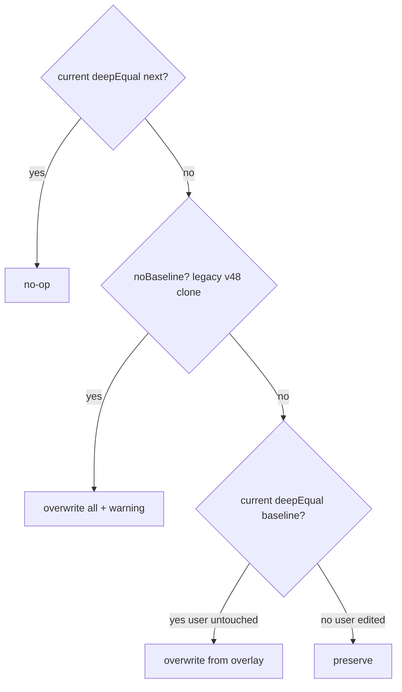

# 本地角色包与更新应用

一个角色包可以作为独立的 `.cognia-pack.json` 文件流转，在市场安装管线之外导入；当角色包发布更新版本时，用户对覆盖层角色的*克隆*可以接收一次**选择性更新**。本页涵盖文件格式、磁盘支持的本地角色包存储、决定覆盖还是保留的逐字段差异引擎、编辑器投影，以及语音 / 平台解析。

<TLDR>
- 文件格式：`CHARACTER_PACK_FILE_SCHEMA_VERSION = 2`，`SUPPORTED_SCHEMA_VERSIONS = Set([1, 2])` —— `lib/plugin/character-pack/schema.ts:28` / `:37`。
- 解析器 `parseLocalPackFile` —— `schema.ts:83-120`；序列化器 `serializeLocalPackFile` —— `schema.ts:247-259`。
- `local:imported` 下的本地磁盘存储 —— `lib/plugin/character-pack/local-pack-store.ts:51`；启动扫描 `scanAndRegisterLocalPacks` —— `:175-222`。
- 差异引擎 `diffPackUpdate` —— `lib/plugin/character-pack/diff-pack-update.ts:153-192`；`USER_OWNED_CHARACTER_FIELDS` —— `:44-62`。
- 语音解析器 `resolveCharacterVoice` —— `lib/plugin/character-pack/character-voice.ts:53-73`。
- 平台门控 `isAvailableOnProfile` —— `lib/plugin/character-pack/platform-availability.ts:22-28`。
</TLDR>

## 文件格式 —— `.cognia-pack.json`

该文件是一个薄包装，携带**文件格式**层面的 `schemaVersion`（独立于角色包的语义 `version`）加上角色包负载和一个可选签名。版本化分两步：提升文件格式是宿主的事；角色包内容通过 `PluginCharacterPackDef.version` 自行版本化。

```ts
// lib/plugin/character-pack/schema.ts:28-40
export const CHARACTER_PACK_FILE_SCHEMA_VERSION = 2 as const

export const SUPPORTED_SCHEMA_VERSIONS = new Set<number>([1, 2])

export type CharacterPackFileSchemaVersion = 1 | 2
```

```ts
// lib/plugin/character-pack/schema.ts:51-62
export interface LocalCharacterPackSignature {
  algo: "ed25519"
  pubKey: string
  sig: string
}

export interface LocalCharacterPackFile {
  schemaVersion: CharacterPackFileSchemaVersion
  pack: PluginCharacterPackDef
  signature?: LocalCharacterPackSignature
}
```

<Status type="warning">
Ed25519 签名字段（`schema.ts:51-55`）是为与 WASM 验证器的前向兼容而预留的。本地角色包存储目前尚未验证签名——未签名文件如今会被接受，畸形的签名形状仅在其结构层面被拒绝。验证是一项已记录在案的后续工作。
</Status>

`parseLocalPackFile` 校验并收窄任意 JSON。校验规则：

- 顶层必须为 `{ schemaVersion, pack }`；`schemaVersion` 必须是 `SUPPORTED_SCHEMA_VERSIONS` 中的一个数字。更高的版本会以「Upgrade Cognia」消息被拒绝；低于受支持版本的则要求作者重新导出。
- 角色包级必填：非空的 `id`、`name`、`version`，以及一个 `characters` 数组（非空，至多 `PLUGIN_CHARACTER_PACK_SOFT_LIMIT`）。
- 每个角色都要求非空的 `localId`、`systemPrompt`、`name`、`avatarColor`，且 `localId` 在角色包内唯一。
- v2 可选字段（`avatarImage`、`persona`、`voiceProfile`）仅在出现时做形状检查；未知 TTS 提供方在这里不会被拒绝（那属于 `defineCharacterPack`，警告而非阻断）。
- 出现的 `signature` 必须声明 `algo: "ed25519"` 以及字符串类型的 `pubKey` / `sig`。

```ts
// lib/plugin/character-pack/schema.ts:247-259
export function serializeLocalPackFile(
  pack: PluginCharacterPackDef,
  signature?: LocalCharacterPackSignature
): string {
  const file: LocalCharacterPackFile = {
    schemaVersion: CHARACTER_PACK_FILE_SCHEMA_VERSION,
    pack,
    ...(signature ? { signature } : {}),
  }
  return JSON.stringify(file, null, 2) + "\n"
}
```

2 空格缩进加上尾随换行，使角色包在为分享 / fork 工作流签入 git 时差异保持易于审阅。

## 本地角色包存储

独立文件**不是**插件——市场安装管线期望一个由 Tauri 解压的 tarball。取而代之的是一个专用存储在磁盘上读 / 写它们，并以 `pluginId = "local:imported"` 把它们注册进同一个覆盖层。

```ts
// lib/plugin/character-pack/local-pack-store.ts:51
export const LOCAL_PACK_PLUGIN_ID = "local:imported"
```

一个 `LocalPackFsAdapter`（`local-pack-store.ts:67-84`）抽象了文件系统。生产用的 `defaultTauriFs` 把目录解析到 `appDataDir()/cognia/local-character-packs/<id>.cognia-pack.json`；测试通过 `__setLocalPackFsForTesting` 注入一个同步的内存适配器。在 **web 模式下，每个操作都是空操作或返回错误**——设置面板的导入按钮以 `isTauri()` 门控。

| 操作 | file.ts:line | 行为 |
| --- | --- | --- |
| `scanAndRegisterLocalPacks` | `:175-222` | 启动扫描；返回 `{ registered[], skipped[] }`；坏文件附带原因被跳过，绝不阻塞同级。 |
| `importLocalPack` | `:243-287` | 校验、写入文件、注册；当 id 已属于某个真实插件时拒绝。 |
| `deleteLocalPack` | `:295-318` | 注销并移除文件；Dexie 克隆得以存活。 |
| `exportPack` | `:327-348` | 把任意已注册角色包导出为 `.cognia-pack.json` 字符串（插件身份被剥离）。 |

启动扫描是幂等的——覆盖层注册表的 `register` 会替换先前的条目，因此在导入 / 删除后重新扫描只是刷新视图。

```ts
// lib/plugin/character-pack/local-pack-store.ts:212-216
registerCharacterPack(result.file.pack.id, result.file.pack, {
  pluginId: LOCAL_PACK_PLUGIN_ID,
})
registered.push(result.file.pack.id)
```

导入强制执行冲突策略：一个已被真实插件（`pluginId` 不是 `local:imported`）注册的角色包 id 会被拒绝——本地层级绝不遮蔽真实插件的贡献。

```ts
// lib/plugin/character-pack/local-pack-store.ts:266-272
const existingEntry = getCharacterPackEntry(pack.id)
if (existingEntry && existingEntry.pluginId && existingEntry.pluginId !== LOCAL_PACK_PLUGIN_ID) {
  return {
    ok: false,
    error: `Pack id "${pack.id}" is already provided by plugin "${existingEntry.pluginId}". Rename the pack before importing.`,
  }
}
```

启动初始化器 `components/providers/initializers/local-character-pack-initializer.tsx` 在首次绘制时运行一次扫描，并在文件被跳过时弹出提示，使注册失败的磁盘文件不会被静默隐藏。

## 应用更新引擎

当插件以更新的 `pack.version` 重新启用时，用户的克隆会显示「Update available」。更新是**选择性的**：用户从未改动过的包级管理字段从新覆盖层中覆盖；用户编辑过的字段被保留。该决策是一次纯差异，无任何 Dexie 访问，对话框预览与实际写入共享同一逻辑。

由两套字段策略驱动它。`USER_OWNED_CHARACTER_FIELDS` 永不被覆盖：

```ts
// lib/plugin/character-pack/diff-pack-update.ts:44-62
export const USER_OWNED_CHARACTER_FIELDS: ReadonlySet<keyof Character> = new Set<keyof Character>([
  "id",
  "name",
  "isBuiltIn",
  "twinId",
  "twinSettings",
  "accountIdOverride",
  "workingDir",
  "bareMode",
  "debugMode",
  "briefMode",
  "sandboxEnabled",
  "maxThinkingTokens",
  "embeddingProviderId",
  "disablePluginTools",
  "enableBuiltInSkills",
  "createdAt",
  "updatedAt",
])
```

20 个 `PACK_MANAGED_FIELDS`（`diff-pack-update.ts:65-88`）是可覆盖的集合：`systemPrompt`、`description`、`avatarColor`、`avatarEmoji`、`model`、`providerId`、`permissionMode`、`allowedTools`、`disallowedTools`、`mcpServerIds`、`skillIds`、`pluginSkillIds`、`enableComputerUse`、`computerUseSettings`、`sandboxTier`、`a2uiEnabled`、`a2uiCatalogId`、`platformDefaults`、`availableOnPlatforms`，加上 v2 三件套 `avatarImage` / `persona` / `voiceProfile`。

```ts
// lib/plugin/character-pack/diff-pack-update.ts:111-118
export interface PackUpdateDiff {
  overwrites: Partial<Character>
  preserved: PackUpdateFieldChange[]
  willOverwrite: PackUpdateFieldChange[]
  nextSnapshot: PackPristineSnapshot
  /** True when row.pristineSnapshot was missing — we can't tell user edits apart. */
  noBaseline: boolean
}
```

`buildPristineSnapshot`（`diff-pack-update.ts:124-151`）通过 JSON 往返深拷贝最新覆盖层角色的每个包级管理字段，因此后续的覆盖层变更不会经由引用泄漏进来。`diffPackUpdate`（`:153-192`）随后逐字段比较行、其存储的 `pristineSnapshot` 基线，以及覆盖层：

```ts
// lib/plugin/character-pack/diff-pack-update.ts:162-189 (decision core)
for (const field of PACK_MANAGED_FIELDS) {
  if (USER_OWNED_CHARACTER_FIELDS.has(field as keyof Character)) continue
  const current = (row as unknown as Record<string, unknown>)[field]
  const next = (nextSnapshot as unknown as Record<string, unknown>)[field]

  if (deepEqual(current, next)) continue // no-op: already latest

  if (noBaseline) {
    overwrites[field as keyof Character] = next as never
    willOverwrite.push({ field, current, next })
    continue
  }

  const baselineValue = (baseline as Record<string, unknown>)[field]
  if (deepEqual(current, baselineValue)) {
    overwrites[field as keyof Character] = next as never // user untouched -> overwrite
    willOverwrite.push({ field, current, next })
  } else {
    preserved.push({ field, current, next }) // user edited -> preserve
  }
}
```

### 逐字段决策



一个没有 `pristineSnapshot` 的历史遗留 v48 克隆属于 `noBaseline` 情形：我们无法区分用户编辑与陈旧副本，因此每个变更的字段都进入 `willOverwrite`，且对话框渲染一个警告。

## 更新流程

1. **「Update available」徽章** —— 当克隆的 `packVersionAtClone` 与注册表当前角色包 `version` 不同时浮现。
2. **`previewPackUpdate`** —— 不写入即产出 `PackUpdateDiff` 的演练。
3. **`character-pack-update-dialog.tsx`** —— 逐字段两栏差异（当前 vs 下一版），在适用时带 `noBaseline` 警告。
4. **应用 / 忽略** —— `applyPackUpdate(id)`、`applyPackUpdateForPack(sourcePluginId, sourcePackId)`（用于某角色包的所有待更新克隆），或 `dismissPackUpdate(id, version)`。接线位于 `components/settings/characters-section.tsx`（`:457`、`:472`、`:552`）。

## 编辑器投影

`editor-projection.ts` 持有从设置编辑器中抽取的纯映射，使「空白 → undefined」规则可被单元测试。

| 符号 | file.ts:line | 用途 |
| --- | --- | --- |
| `classifyCharacterSource` | `editor-projection.ts:20-24` | 为来源过滤器返回 `"builtin"` / `"plugin"` / `"user"`。 |
| `filterCharacters` | `:30-41` | 为搜索栏提供自由文本加来源分桶过滤。 |
| `buildPersona` | `:61-73` | 表单字段转 `PluginCharacterPersona`，全部空白时为 undefined。 |
| `buildVoiceProfile` | `:85-94` | 表单字段转 `PluginCharacterVoiceProfile`，无提供方 / 语音时为 undefined。 |
| `characterToPackDef` | `:102-141` | Dexie `Character` 转可移植的 `PluginCharacterDef`，丢弃宿主托管字段。 |

`characterToPackDef` 只保留可移植的角色包子集并省略 `undefined` 字段以保持导出文件精简——身份、生命周期和 Twin 绑定列永不进入文件。

## 语音解析

角色的可选 `voiceProfile` 投影为一个 `Partial<SpeechSettings>` 覆盖层，调用方在调用 `TTSOrchestrator.speak()` 之前将其展开到由 AppSettings 派生的语音设置之上。它绝不修改 `AppSettings`。

```ts
// lib/plugin/character-pack/character-voice.ts:25-36
const PROVIDER_VOICE_FIELD: Record<TTSProvider, keyof SpeechSettings> = {
  system: "systemVoice",
  openai: "openaiVoice",
  gemini: "geminiVoice",
  edge: "edgeVoice",
  elevenlabs: "elevenlabsVoice",
  lmnt: "lmntVoice",
  hume: "humeVoice",
  cartesia: "cartesiaVoice",
  deepgram: "deepgramVoice",
  xiaomi: "xiaomiVoice",
}
```

```ts
// lib/plugin/character-pack/character-voice.ts:53-73
export function resolveCharacterVoice(
  character: CharacterVoiceSource
): CharacterVoiceOverlay | undefined {
  const profile = character.voiceProfile
  if (!profile) return undefined
  if (!isKnownTtsProvider(profile.provider)) return undefined
  if (!profile.voiceId.trim()) return undefined

  const overlay: CharacterVoiceOverlay = {
    ttsProvider: profile.provider,
  }
  const voiceField = PROVIDER_VOICE_FIELD[profile.provider]
  ;(overlay as Record<string, unknown>)[voiceField] = profile.voiceId
  if (profile.rate !== undefined) overlay.ttsRate = profile.rate
  if (profile.pitch !== undefined) overlay.ttsPitch = profile.pitch
  if (profile.volume !== undefined) overlay.ttsVolume = profile.volume
  return overlay
}
```

`isKnownTtsProvider`（`character-voice.ts:75-77`）采取宽松失败策略：未知提供方不产出覆盖层，于是调用方回退到全局默认值。该解析器被 `lib/tts/speak-chat-message.ts` 消费。

## 平台可用性

`platform-availability.ts` 针对当前外壳对角色进行门控。`currentRuntimeProfile` 返回 `"tauri"` 或 `"browser"`；未定义 / 空的 `availableOnPlatforms` 意味着「处处可用」。

```ts
// lib/plugin/character-pack/platform-availability.ts:22-28
export function isAvailableOnProfile(
  availableOnPlatforms: PluginRuntimeProfile[] | undefined,
  profile: PluginRuntimeProfile = currentRuntimeProfile()
): boolean {
  if (!availableOnPlatforms || availableOnPlatforms.length === 0) return true
  return availableOnPlatforms.includes(profile)
}
```

## 相关

<Cards>
  <Card title="角色包（覆盖层能力）" href="./character-packs" />
  <Card title="编辑器与发现页" href="./editor-and-discover" />
  <Card title="运行时消费" href="./runtime-consumption" />
</Cards>
