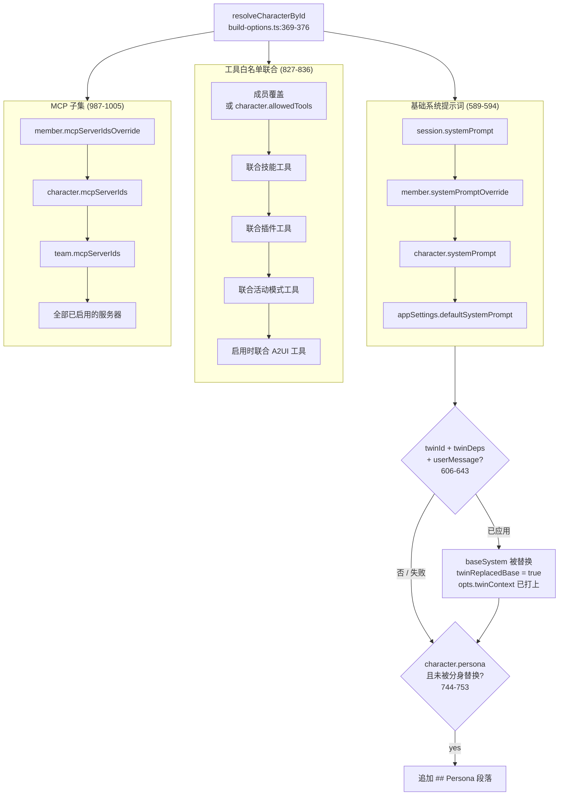

# 运行时消费

在某个东西 *解析* 它之前，角色只是一条被动记录。本页穷举每一个读取被选中角色并据此改变行为的运行时接缝：`resolveSendOptions` 的优先级链、聊天头部各面、TTS 语音覆盖层、宠物物种绑定，以及让队友跑在同一条流水线上的团队桥接。字段定义见[数据模型](./data-model)；本页讲的是 *消费*。

<TLDR>
收敛点是 `lib/claude/build-options.ts:resolveSendOptions`。角色解析在 <Term>369–376</Term>；基础系统优先级在 <Term>589–594</Term>；分身注入 <Term>606–643</Term>；persona 段落 <Term>744–753</Term>；插件技能 <Term>709–737</Term>；工具白名单联合 <Term>827–836</Term>；MCP 子集 <Term>987–1005</Term>；计算机使用开关 <Term>1052–1053</Term>；插件工具过滤 <Term>1088–1089</Term>。聊天头部在 `components/chat/chat-header.tsx:387–433` 读取它。TTS 覆盖层在 `lib/tts/speak-chat-message.ts:19–54`。宠物绑定在 `components/pet/console/binding-tab.tsx:14–70`。队友在 `lib/ai/agent/team/teammate-character.ts:56` 合成临时角色。
</TLDR>

## build-options 解析流水线

一旦会话绑定了角色（`session.characterId`），`resolveSendOptions` 就是每项能力流经的唯一漏斗。Anthropic 聊天、非 Anthropic 供应商、团队派发以及连接器自动模式都在这里收敛，因此一处描述的行为处处适用。

| 关注点 | 源行号 | 行为 |
|---|---|---|
| 角色解析 | `build-options.ts:369–376` | 若提供则用 `ctx.character`，否则 `resolveCharacterById(session.characterId)` |
| 团队成员提示词 | `build-options.ts:346` | `member.systemPromptOverride` 回退到 `character.systemPrompt` |
| 基础系统优先级 | `build-options.ts:589–594` | 会话提示词 &rarr; 成员覆盖 &rarr; 角色提示词 &rarr; 应用默认值 |
| 分身上下文注入 | `build-options.ts:606–643` | 当分身绑定 + 依赖 + 用户消息齐备时，`applyTwinContext` 替换 base；打上 `opts.twinContext`；失败时开放回退 |
| persona 段落 | `build-options.ts:744–753` | 仅当分身未替换 base 时才追加 `## Persona`（tone + personality） |
| 插件技能 | `build-options.ts:709–737` | `resolveSkillsForCharacter` 处理 `pluginSkillIds` &rarr; 容器技能 id + 段落 + 工具联合 |
| 工具白名单联合 | `build-options.ts:827–836` | 成员覆盖或角色白名单，与技能、插件、模式和 A2UI 工具联合 |
| MCP 子集 | `build-options.ts:987–1005` | 成员覆盖 &rarr; 角色子集 &rarr; 团队子集 &rarr; 全部已启用 |
| 计算机使用开关 | `build-options.ts:1052–1053` | 仅当已选择接入且未被 IM 黑名单阻止时才启用 |
| 插件工具过滤 | `build-options.ts:1088–1089` | 非计算机使用的聊天会丢弃 `cognia-computer-use` 插件条目 |

### 优先级链可视化



### 基础系统提示词优先级

系统提示词是一条严格的空值合并链。会话级提示词直接胜出；否则取团队成员覆盖；否则取角色自身的提示词；否则取应用默认值。

```typescript
// lib/claude/build-options.ts:589-594
let baseSystem =
  session?.systemPrompt ??
  memberOverride?.systemPromptOverride ??
  character?.systemPrompt ??
  appSettings?.defaultSystemPrompt ??
  undefined
```

### 分身上下文注入（选择接入，失败开放）

当被解析的角色是分身绑定的 *并且* 调用方提供了 `twinDeps` 加上非空的 `twinUserMessage` 时，四段式分身提示词会**替换** `baseSystem`。运行时从不抛错——任何失败都降级回原始提示词。成功时它会置 `twinReplacedBase = true`（这会抑制下方的 persona 段落），并打上 `opts.twinContext`，以便聊天钩子可在助手消息上渲染一个分身 `SourcesPart`。

```typescript
// lib/claude/build-options.ts:606-643 (trimmed)
if (character?.twinId && ctx.twinDeps && ctx.twinUserMessage && ctx.twinUserMessage.trim()) {
  try {
    const { applyTwinContext } = await import("@/lib/twin/runtime")
    const result = await applyTwinContext({ character, userMessage: ctx.twinUserMessage, ... })
    if (result.applied) {
      baseSystem = result.applied.systemPrompt
      twinReplacedBase = true
    }
    // stamped when the runtime ran (even degraded) so the UI can show context
    opts.twinContext = {
      twinId: character.twinId,
      retrievedChunks: result.retrievedChunks,
      selectedStyleSamples: result.selectedStyleSamples.map(/* id/contextLabel/summary/tone */),
      degraded: result.degraded,
    }
  } catch {
    // Twin runtime failure is non-fatal — keep the original baseSystem.
  }
}
```

<Status type="info">
分身提示词已经编码了人格，因此当 `twinReplacedBase` 被置位时，v2 persona 段落（`744–753`）会被刻意跳过，以避免相互矛盾的指引。绑定字段位于 `Character.twinId` / `twinSettings`；深入剖析在员工分身子系统（下方链接）。
</Status>

### persona 段落、插件技能、工具与 MCP 联合

persona 段落（`744–753`）仅当分身尚未替换 base 时，才从 `character.persona`（tone + personality）发出一个 `## Persona` 块。插件技能（`709–737`）经由 `resolveSkillsForCharacter(character.pluginSkillIds)` 处理，产出 `containerSkillIds`、一段渲染好的技能段落，以及馈入联合的工具名。

工具白名单（`827–836`）是一个**联合**，而非单一来源：它从 `memberOverride.allowedToolsOverride ?? character.allowedTools` 起步，然后联合技能 `allowedTools`、插件工具名、活动模式的工具，以及——当 `a2uiEnabled` 时——`namespacedA2UIToolNames()`。MCP 子集（`987–1005`）是一条优先级链：成员覆盖，然后 `character.mcpServerIds`，然后团队的子集（团队会话），最后当没有任何东西收窄它时取全部已启用的服务器。

计算机使用开关（`1052–1053`）只在 `character.enableComputerUse === true` 且该会话不是被黑名单阻止的 IM 会话时才放行工具；插件工具过滤（`1088–1089`）会从非计算机使用的聊天中剥除 `cognia-computer-use` 条目。

## 聊天面

头部是最显眼的消费者。它从 `avatarColor(character)` / `avatarGlyph(character)` 渲染头像，接着是 `name · description`、一个优先取 `session.model` 而非 `character.model` 的模型徽章、用角色供应商路由初始化的账户切换器，以及绑定时的分身徽章。

```tsx
// components/chat/chat-header.tsx:387-433 (trimmed)
{character && (
  <Avatar className="size-7 shrink-0" title={character.name}>
    <AvatarFallback style={{ backgroundColor: avatarColor(character) }} aria-hidden>
      {avatarGlyph(character)}
    </AvatarFallback>
  </Avatar>
)}
{/* name · description ... */}
{(session.model || character?.model) && (
  <Badge variant="secondary" className="font-mono text-[10px]">
    {session.model || character?.model}
  </Badge>
)}
<HeaderAccountSwitcher
  session={session}
  characterProviderId={character?.providerId}
  characterAccountIdOverride={character?.accountIdOverride}
/>
{character?.twinId && (
  <TwinHeaderBadge twinId={character.twinId} twinSettings={character.twinSettings} />
)}
```

选择器把角色分成内置、按插件和用户三组——分组与平台过滤见[编辑器与发现](./editor-and-discover)。`directCharacter` 从 `ChatView` 一路下穿到 `MessageList`，以便朗读按钮和自动播放能够解析说话角色的语音（见下一节）。

## TTS 语音覆盖层

当一条聊天消息被朗读时，全局语音设置作为基础，角色的 `voiceProfile` 被投射成一个叠加其上的覆盖层。`null`/`undefined` 的角色会落到全局语音——这正是让团队成员拥有各自不同声音的机制。

```typescript
// lib/tts/speak-chat-message.ts:19-54 (trimmed)
import {
  resolveCharacterVoice,
  type CharacterVoiceSource,
} from "@/lib/plugin/character-pack/character-voice"
// ...
const base = selectSpeechSettings(store.settings)
const overlay = character ? resolveCharacterVoice(character) : undefined
const speechSettings = overlay ? { ...base, ...overlay } : base
```

`voiceProfile` 字段为 `provider`、`voiceId`、`rate`、`pitch` 和 `volume`。每供应商的字段映射（每个 TTS 供应商如何消费这些字段）位于 `character-voice.ts`——见[包、本地与更新](./packs-local-and-updates)。

## 宠物绑定

宠物控制台把每个角色映射到一个宠物物种。绑定标签页通过 `useLiveQuery(getDb().characters.toArray())` 与 `listPetBindings()` 一起列出角色；为某个角色选择物种会调用 `upsertPetBinding({ characterId, species })`，清除它则调用 `deletePetBinding(characterId)`，后者回退到全局宠物。CRUD 位于 `lib/db/pet.ts`。

```tsx
// components/pet/console/binding-tab.tsx:14-70 (shape)
const characters = useLiveQuery(() => getDb().characters.toArray())
const bindings = useLiveQuery(() => listPetBindings())
// per character: upsertPetBinding({ characterId, species }) | deletePetBinding(characterId)
```

## 团队桥接

队友没有并行的解析流水线——它们跑在 *相同* 的 `resolveSendOptions` 上。`teammateToCharacter()` 从队友配置加上已解析的能力，合成一个临时 `Character`（id 模式为 `__teammate__:` + 队友 id）。

```typescript
// lib/ai/agent/team/teammate-character.ts:56 (mapping summary)
// systemPrompt   ← teammate.config.systemPrompt > team.defaultSystemPrompt > DEFAULT
// model          ← modelHint > teammate.config.model > team.defaultModel
// providerId     ← teammate.config.provider > team.defaultProvider
// mcpServerIds   ← resolvedCaps.mcpServerIds (empty → undefined = inherit all)
// skillIds + pluginSkillIds ← resolvedCaps.skillIds (both fields; resolvers drop unowned ids)
// allowedTools   ← teammate.config.tools
// enableComputerUse + computerUseSettings.allowedToolIds ← resolvedCaps.nativeAnthropicToolIds
// workingDir     ← cwd
```

把 `skillIds` 和 `pluginSkillIds` 设为同一集合是刻意的：每个解析器会静默丢弃它不拥有的 id，因此无论某个技能是宿主技能还是插件技能，它都不会丢失。子智能体在会话级别（`kind: "team"`）启用，而非在合成的角色上启用。关于队友能力在此合成之前如何被解析，见[智能体团队能力与插件](../agent-teams/capabilities-and-plugins)。

## 指向子系统深入剖析

- **分身** —— `Character.twinId` / `twinSettings` 由 `lib/twin/runtime` 的 `applyTwinContext` 消费。完整流水线在[员工数字分身（Twin）](../subsystems/employee-twin)子系统。
- **IM / 平台默认值** —— `Character.platformDefaults` 在角色被绑定到入站会话时由连接器绑定消费。见[平台连接器](../subsystems/platform-connectors)。

<Cards>
  <Card title="数据模型" href="./data-model" description="每个 Character 字段及其含义。" />
  <Card title="角色包" href="./character-packs" description="v2 包、persona、语音档案和头像图片。" />
  <Card title="Build Options" href="../built-in-agent/build-options" description="超越角色关注点的完整 resolveSendOptions 流水线。" />
</Cards>
