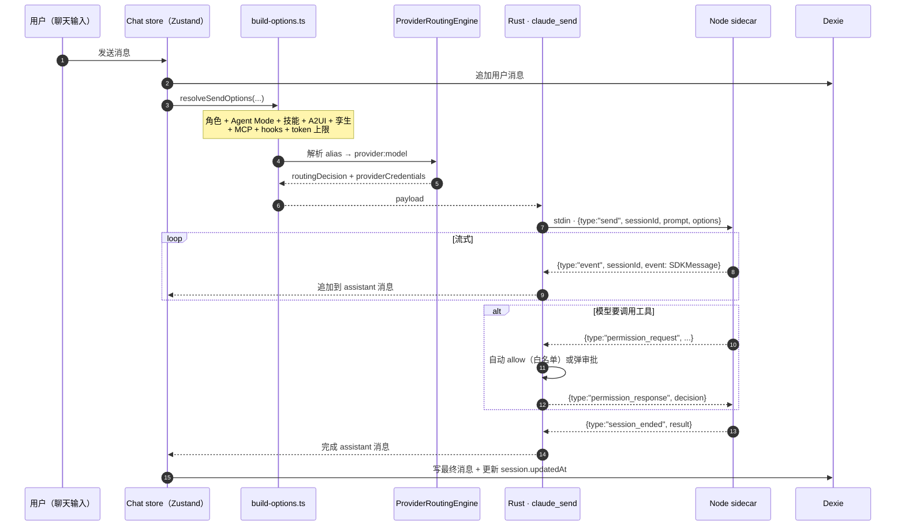

# 聊天、角色、技能 & 团队

<Status variant="stable">Stable</Status>

<TLDR>
  聊天工作台是 Cognia 最大的用户面。会话 / 消息 / 角色 / 技能 / 团队 / MCP
  服务器六个概念可组合；发送时 `resolveSendOptions` 把所有层（角色 + Agent Mode + 技能 + A2UI + 孪生
  + 路由）压成一份 sidecar payload。 斜杠命令、Agent Mode、Provider Routing Engine
  是新加入的三条编排轴。
</TLDR>

## 概念速览

| 概念                  | 内容                                                     | 持久化在                         |
| --------------------- | -------------------------------------------------------- | -------------------------------- |
| **Session（会话）**   | 一条对话线（标题、模型、最近更新时间）                   | `sessions` 表                    |
| **Message（消息）**   | 一次 user / assistant / tool 轮次                        | `messages` 表                    |
| **Character（角色）** | 可复用的人格（系统提示、模型、工具白名单、可选孪生绑定） | `characters` 表                  |
| **Skill（技能）**     | 可复用的能力（markdown 提示片段 + 工具白名单）           | `skills` 表                      |
| **Team（团队）**      | 多角色 orchestration 配置                                | `teams` 表                       |
| **MCP 服务器**        | 接入 Claude 的工具/资源提供方                            | `mcpServers` 表                  |
| **Agent Mode**        | 提示修饰器（系统提示 + 模型 / 温度覆盖）                 | 内置 + `agentModes`（自定义）    |
| **Slash 命令**        | 统一的斜杠命令注册表（builtin / custom / plugin）        | `lib/slash-commands/registry.ts` |

均持久化在 Dexie（IndexedDB）；类型在 `lib/claude/types.ts`。

## 会话与消息流



聊天 store 在 `lib/chat/`；UI 在 `components/chat/`。Store 故意做得很薄 —— 大部分逻辑在 `lib/claude/`，
便于在聊天面之外（例如 agent-teams 工作台）复用。

## 角色（Characters）

`Character` 定义在 `lib/claude/types.ts:1055`：

<TypeTable
  type={{
    id: { description: "稳定唯一标识。", type: "string", required: true },
    name: { description: "显示名。", type: "string", required: true },
    description: { description: "面向用户的简短描述。", type: "string" },
    avatarColor: {
      description: "头像背景色（CSS 颜色 token，常为 oklch 或 hex）。",
      type: "string",
      required: true,
    },
    avatarEmoji: { description: "可选 emoji 头像。", type: "string" },
    systemPrompt: {
      description: "每次发送时附加的系统提示。",
      type: "string",
      required: true,
    },
    model: {
      description:
        "默认模型 ID（如 `claude-sonnet-4-5` 或 alias `claude-fast`）。 注意：从 `modelId` 重命名而来。",
      type: "string",
    },
    providerId: {
      description:
        "首选 provider id；覆盖 `AppSettings.defaultProvider`，被 `ChatSession.providerOverride` 覆盖。",
      type: "string",
    },
    embeddingProviderId: {
      description:
        "孪生 embedding 用的 provider id（独立于 chat provider）。 切换会触发 re-embed banner。",
      type: "string",
    },
    permissionMode: {
      description:
        "SDK permission 模式（`default` / `bypassPermissions` / `acceptEdits` / `plan`）。",
      type: 'SendOptions["permissionMode"]',
    },
    allowedTools: {
      description: "工具白名单（与 skill.allowedTools 并集）。",
      type: "string[]",
    },
    disallowedTools: {
      description: "工具黑名单。",
      type: "string[]",
    },
    mcpServerIds: {
      description: "MCP 服务器子集；undefined 表示『全部已启用』。",
      type: "string[]",
    },
    skillIds: {
      description: "选中该角色时自动启用的技能（有序）。",
      type: "string[]",
    },
    workingDir: {
      description: "发送时传给 SDK 的 cwd。",
      type: "string",
    },
    maxThinkingTokens: {
      description: "extended-thinking 预算上限。",
      type: "number",
    },
    bareMode: {
      description: "skip on-disk auto-discovery（CLAUDE.md 等）。",
      type: "boolean",
    },
    debugMode: {
      description: "SDK verbose logging。",
      type: "boolean",
    },
    briefMode: {
      description: "在 system prompt 尾部追加 brief-output 片段。",
      type: "boolean",
    },
    a2uiEnabled: {
      description: "允许该角色驱动 A2UI（4 工具白名单 + 系统提示注入）。",
      type: "boolean",
    },
    a2uiCatalogId: {
      description: "默认 A2UI 卡片目录（academic / financial / general / …）。",
      type: "string",
    },
    twinId: {
      description: "可选孪生绑定 —— 启用孪生 runtime 路径。",
      type: "string",
    },
    twinSettings: {
      description: "每角色孪生调参。见员工数字孪生。",
      type: "TwinSettings",
    },
    platformDefaults: {
      description: "Platform 绑定默认值（Connectors）。",
      type: "CharacterPlatformDefaults",
    },
    isBuiltIn: {
      description: "标记内置角色；备份清空时不丢。",
      type: "boolean",
      default: "false",
    },
  }}
/>

<Callout type="warn" title="字段重命名">
  历史上字段是 `modelId`；现在统一为 `model`，与 sidecar / SDK 字段名一致。 旧备份会在 import 时由
  `lib/data/migrate-envelope.ts` 自动迁移。
</Callout>

内置角色作为种子数据（`lib/db/seed.ts`、`lib/db/preset-built-ins.ts`）。用户角色由用户创建。两者位于同一张
`characters` 表。

角色编辑器在 `components/settings/...` 加上专门的工作台 tab。头像走共享的 `lib/avatar.ts`（渐变、首字母、
图片或 `@rive-app/react-webgl2` 提供的 3D Rive 场景）。

### 孪生绑定

设置 `Character.twinId = "<某个孪生 id>"` 让角色启用孪生 runtime。发送时：

- 把用户最近一条消息嵌入。
- 在绑定孪生的 chunk（`twinChunks` 表）上做 RAG。
- 从孪生 profile（`twinProfile`）取 top-K 风格示例。
- 系统提示被增强，加入召回片段 + 风格少样本。

可通过 `Character.twinSettings` 调参 —— `enableRag`、`ragTopK`、`enableStyleFewShot`、`styleSamplesK`。多个角色可共享一个孪生；多个孪生可共存。详见 [员工数字孪生](../subsystems/employee-twin)。

## 技能（Skills）

`Skill` 是一个 markdown 提示片段加可选工具白名单，按角色或会话启用。深度细节见
[skills-system](./skills-system)。

<TypeTable
  type={{
    id: { description: "稳定唯一标识。", type: "string", required: true },
    name: { description: "显示名。", type: "string", required: true },
    description: { description: "面向用户的描述。", type: "string" },
    content: {
      description: "markdown 正文，发送时以 `## <name>` 标题逐字追加到系统提示。",
      type: "string",
      required: true,
    },
    allowedTools: {
      description: "技能期望调用的工具（与角色的白名单 *并集*）。",
      type: "string[]",
    },
    tags: { description: "搜索 / 分类标签。", type: "string[]" },
    source: {
      description: "来源（builtin / custom / marketplace / sync）。",
      type: "SkillSource",
    },
    status: {
      description: "lifecycle（enabled / disabled）；disabled 不进入 system prompt。",
      type: "SkillStatus",
    },
    category: {
      description: "侧栏分组标签。",
      type: "SkillCategory",
    },
    version: { description: "可选语义版本号。", type: "string" },
    isBuiltIn: {
      description: "标记内置技能；备份清空时不丢。",
      type: "boolean",
      default: "false",
    },
  }}
/>

技能执行器（`lib/skills/executor.ts`）接收一组技能 ID，产出：

- 合并后的提示片段。
- 合并后的工具白名单（与角色 / Agent Mode 取并集）。

技能管理路径：

- **技能工作台**（`app/skills/`、`components/skills/`）—— 编写、编辑、校验。
- **市场**（`lib/skills/marketplace-*.ts`）—— 安装社区技能并校验签名。
- **校验**（`lib/skills/validate.ts`）—— 保存/导入时一律校验。
- **同步**（`lib/skills/sync.ts`）—— 与 Claude Code 技能格式同步。

内置技能在首次运行时种子化（`lib/db/seed.ts`）。用户技能可通过 `lib/skills/sync.ts` 导出到磁盘外部编辑后再导入。

## Agent Mode

Agent Mode 是一个 **提示修饰器**：在角色之上叠加额外的 system prompt，并可覆盖 model / temperature / maxTokens。
实现：`lib/agent/`。

- **内置模式**（`BUILT_IN_AGENT_MODES`）—— 例如 "Plan"、"Refactor"、"Default" 等。
- **自定义模式** —— 用户在设置里加，存在 `useCustomModeStore`（Zustand + localStorage）。

`resolveSendOptions` 通过 `useAgentRuntimeStore.getState().modeId` 读取活动模式，然后调用
`buildAgentModeSessionUpdate(mode)` 产出会话级覆盖字段。Mode 的 system prompt 与角色 prompt 通过
`\n\n---\n\n` 分隔串联；allowedTools 取并集。

深度细节与编排见 [agent-teams](./agent-teams) 与 [slash-commands](./slash-commands)。

## 团队（Teams）

`Team` 在一个会话中编排多个角色。`lib/claude/types.ts:1268`：

```ts title="lib/claude/types.ts"
export interface Team {
  id: string
  name: string
  description?: string
  avatarColor: string
  avatarEmoji?: string
  /** Ordered member slots. The order determines round-robin reply order. */
  members: TeamMember[]
  orchestration: TeamOrchestration
  /** When orchestration === "supervisor", which member acts as the leader. */
  supervisorCharacterId?: string
  /** Team-level MCP override applied to members without their own subset. */
  mcpServerIds?: string[]
  isBuiltIn?: boolean
  createdAt: number
  updatedAt: number
}
```

`TeamMember` 携带 per-slot 覆盖（systemPromptOverride、modelOverride、allowedToolsOverride、
mcpServerIdsOverride）。`resolveMemberConfig(team, member, character)` 是合成有效配置的纯函数。

`lib/agent-team/` 是团队 runtime：mention 解析、conversation context、target 调度、streamer 复用。
团队工作台在 `app/agent-teams/`、`components/agent/`。深度细节见 [agent-teams](./agent-teams)。

## MCP 服务器

`McpServer` 行描述如何连接到工具/资源提供方：

<TypeTable
  type={{
    id: { description: "稳定唯一标识。", type: "string", required: true },
    name: { description: "显示名。", type: "string", required: true },
    command: {
      description: "**stdio** 服务器的可执行文件（与 `url` 互斥）。",
      type: "string",
    },
    args: {
      description: "传给 `command` 的参数。",
      type: "string[]",
    },
    url: {
      description: "**SSE / HTTP** 服务器的 URL（与 `command` 互斥）。",
      type: "string",
    },
    env: {
      description: "传给 stdio 服务器的环境变量。",
      type: "Record<string, string>",
    },
    enabled: {
      description: "false 时发送时不包含此服务器。",
      type: "boolean",
      required: true,
    },
  }}
/>

每次发送都会把内置 MCP 服务器（`lib/claude/builtin-mcp/`，包含 `cognia-tools` + `a2ui-bridge`）与用户服务器
（`mcpServers` 表）合并。`lib/claude/mcp-presets.ts` 提供常用集成（filesystem、GitHub、Slack……）的预设。

A2UI MCP 默认以 in-process 形式合入；旧 `sidecar/a2ui-mcp.mjs` 独立二进制仅在外部调试时使用。详见
[Sidecar 与多供应商 SDK](../core/sidecar-and-claude-sdk)。

## Provider Routing Engine

`lib/ai/routing/provider-routing-engine.ts` 是新的全局模型 / 供应商路由层。它做两件事：

1. **Alias 解析** —— 把 `claude-fast` / `claude-balanced` / `claude-powerful` 等 tier alias
   按用户配置或内置 preset（Budget / Performance / Reliability）解析为具体的 `provider:model`。
2. **Fallback chain** —— 当首选 provider 失败时，按 `RoutingConfig.fallback` 顺次尝试备份 provider。

`resolveSendOptions` 在最后一步调用 routing engine，得到 `routingDecision`（包含 chosen
provider:model + 备份链）并写入 sidecar payload，sidecar 据此选 dispatcher 与构造 credentials。

详见 [provider-system](./provider-system)。

## 斜杠命令系统

`lib/slash-commands/registry.ts` 是统一的斜杠命令注册表。三类来源：

- **builtin** —— `lib/slash-commands/builtin.ts` 列出的命令（`/clear`、`/reset`、`/skills`、`/twin` 等）。
  实际 dispatch 在 composer 的 `BUILTIN_SLASH_COMMANDS` 中携 `SlashContext`（含 `activeSessionId`、
  `pushSystemMessage`、`openSettings` 等）；registry 中只放描述符。
- **plugin** —— 插件通过 `lib/plugin/core/manager.ts:registerSlashCommands(pluginId, defs)` 注册；
  插件禁用时整批移除。
- **custom** —— 用户在设置里加（`lib/slash-commands/custom.ts`），存 Dexie。

设置 → Slash Commands tab 通过 registry 枚举三类来源，渲染一个统一的浏览器。详见
[slash-commands](./slash-commands)。

## Agent Trace（占位）

`lib/agent-trace/log-adapter.ts` 是 agent-trace 适配器的 **占位实现**。日志面板的 "agent trace only"
过滤器使用合成模块名 `agent.trace`；当真正的 trace 子系统落地时，这层会从 stub 升级到完整实现。
目前所有适配器都返回 null，但 UI 通路已就绪。

## 系统提示预设

`SystemPromptPreset`（`promptPresets` 表）是可保存的系统提示片段，可插入角色而不必永久修改它。适合：

- A/B 测试提示变体。
- 在多个角色间共享。
- 快速切换"系统指令"。

在设置 → Prompts tab 编辑。`lib/presets/apply-to-session.ts` 处理"应用到当前会话"动作。

## 单会话导出

每个聊天头部都有 `SingleExportTrigger`（`components/chat/dialogs/single-export-trigger.tsx`）。对话框支持：

- Markdown
- JSON
- 纯文本
- 美化 HTML（带主题）
- 动画 HTML（带回放控件）

HTML 形式使用 `lib/themes/` 渲染当前主题；用户也可以加载自定义主题 JSON。实现位于 `lib/export/`。

## 消息内的"输出层"

一条 assistant 消息可包含多个"输出层"：

- **Markdown / 流式文本** —— 用 `streamdown`（`@streamdown/code`、`@streamdown/math`、`@streamdown/mermaid`、`@streamdown/cjk`）渲染。
- **工具调用 + 结果** —— 来自 `components/ai-elements/` 的可折叠卡片，由 sidecar 的
  `permission_request` / `event` 流驱动。
- **A2UI** —— 交互式节点（表单、列表、卡片），由 `A2UIDispatchProvider` 路由。
- **画板文档** —— 长文档物，存放在 `canvasDocuments` 系列表中，由 `CanvasBridgeProvider` 路由。
- **通用 artifact** —— 代码/文本/HTML 块，用户可 fork 到 `components/artifacts/`。
- **图表** —— 通过 `chart.js` / `recharts` 渲染；模型发出 `chart` 块时使用。

每个输出层在 `components/chat/` 中都有对应渲染器，订阅各自的桥事件。

## 在哪里入手

| 目标               | 文件                                                           |
| ------------------ | -------------------------------------------------------------- |
| 加新的聊天输入动作 | `components/chat/`、`lib/chat/`、`lib/claude/build-options.ts` |
| 加新的内置角色     | `lib/db/preset-built-ins.ts`                                   |
| 加新的内置技能     | `lib/db/preset-built-ins.ts`、`lib/skills/`                    |
| 加新的 MCP 预设    | `lib/claude/mcp-presets.ts`                                    |
| 加新的导出格式     | `lib/export/`、`components/chat/dialogs/`                      |
| 加内置 Agent Mode  | `lib/agent/constants.ts`（`BUILT_IN_AGENT_MODES`）             |
| 加内置斜杠命令     | `lib/slash-commands/builtin.ts` + composer dispatch            |
| 调整孪生行为       | 见 [员工数字孪生](../subsystems/employee-twin)                 |

## 相关

<Cards>
  <Card
    title="Sidecar & 多供应商 SDK"
    href="./sidecar-and-claude-sdk"
    description="处理 claude_send 的 Node 主机"
  />
  <Card
    title="技能系统"
    href="./skills-system"
    description="技能 lifecycle、market、sync 的深度细节"
  />
  <Card
    title="Agent Teams"
    href="./agent-teams"
    description="团队 orchestration / mention / streamer"
  />
  <Card title="斜杠命令" href="./slash-commands" description="统一 registry 与三类来源" />
  <Card title="Provider 系统" href="./provider-system" description="alias 解析 + fallback chain" />
  <Card title="员工数字孪生" href="./employee-twin" description="最深的角色 / 发送时定制层" />
  <Card title="插件系统" href="./plugin-system" description="插件如何扩展技能 / 角色 / MCP" />
  <Card title="存储" href="./storage" description="支撑聊天 / 角色 / 技能 / 团队的 Dexie 表" />
</Cards>
