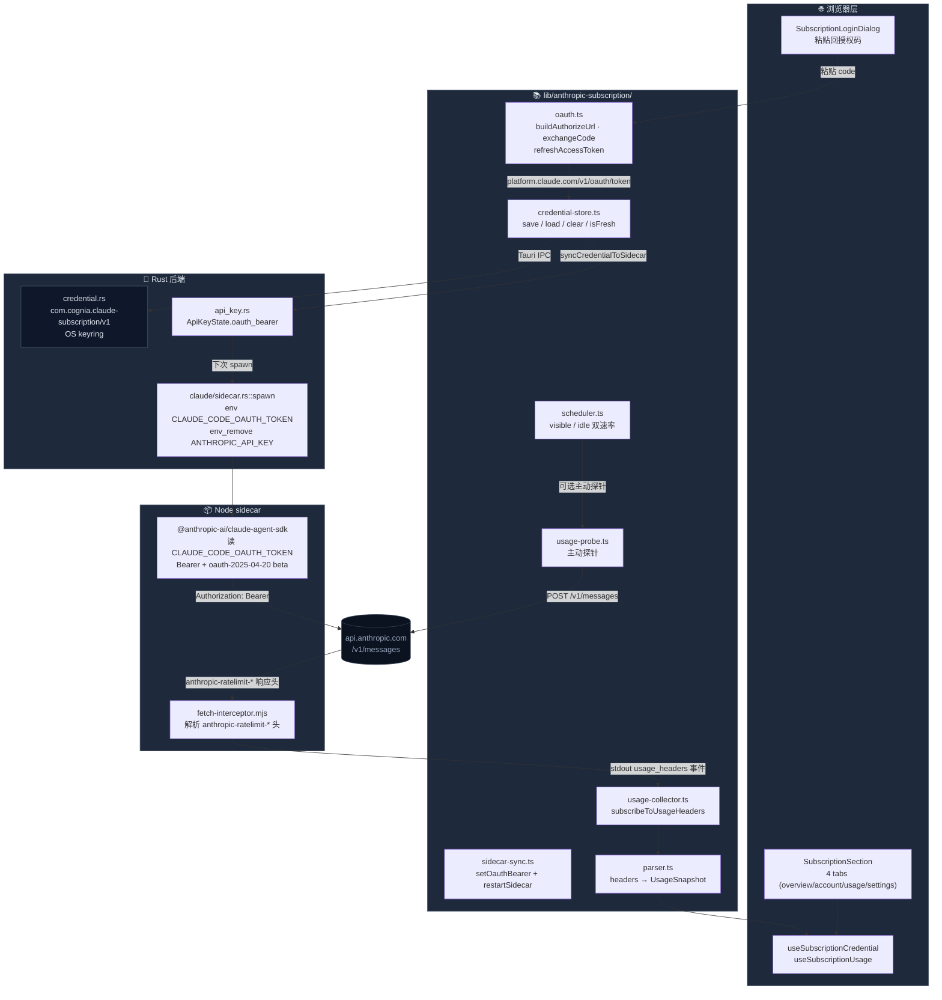

# Claude 订阅 OAuth

<Status variant="stable">stable · ADR-0010</Status>

<TLDR>
  通过粘贴回授权码的 PKCE 流程登录 Claude Pro/Max 或 Console；凭据由 OS keyring 保管， sidecar 通过
  `CLAUDE_CODE_OAUTH_TOKEN` 环境变量自动获得 Bearer 鉴权。每次真实 `/v1/messages` 响应都会被
  `fetch-interceptor.mjs` 拦截，解析 `anthropic-ratelimit-unified-*` 头并写入 Dexie，5h / 7d
  进度条因此免费可见。
</TLDR>

<StatGrid>
  <Stat label="OAuth 模式" value="2" hint="subscription / console" />
  <Stat label="Tauri 命令" value="3" hint="save / load / clear" />
  <Stat label="Dexie 表 (v20)" value="1" hint="subscriptionUsage · 1000 行" />
  <Stat label="Settings tab" value="4" hint="overview / account / usage / settings" />
</StatGrid>

订阅 OAuth 子系统让 Cognia 与官方 `claude login` CLI 平行存在，互不污染：

- 我们 **不写** `~/.claude/.credentials.json`——那个文件归 Claude Code CLI 所有。
- 我们 **只读** `anthropic-ratelimit-*` 响应头——主动探针默认关闭。
- sidecar 与 OAuth bearer **强绑定**——当 bearer 存在时，`ANTHROPIC_API_KEY` 被显式清除，
  避免 SDK 端两种鉴权混合带来的未定义行为。

## 代码位置

```
lib/anthropic-subscription/
  constants.ts       # client_id、token 端点、必带 beta header
  oauth.ts           # buildAuthorizeUrl / exchangeCodeForTokens / refreshAccessToken
  parser.ts          # anthropic-ratelimit-* 头解析为 UsageSnapshot
  credential-store.ts # 三个 Tauri 命令的薄壳
  sidecar-sync.ts    # 把 access_token 推给 sidecar 并重启
  scheduler.ts       # 可见 / 隐藏双速率的探针调度器
  usage-collector.ts # 被动样本入 Dexie（去抖 60s，上限 1000）
  usage-probe.ts     # 主动探针（opt-in，每次 ~10 输入 + 1 输出 token）
  types.ts           # OAuthMode / SubscriptionCredential / UsageSnapshot ...

src-tauri/src/anthropic_subscription/
  credential.rs      # OS keyring 读/写/清
  commands.rs        # claude_sub_save_token / load_token / clear_token

src-tauri/src/api_key.rs           # ApiKeyState.oauth_bearer 字段
src-tauri/src/claude/sidecar.rs    # spawn 时注入 CLAUDE_CODE_OAUTH_TOKEN
sidecar/fetch-interceptor.mjs      # 包裹 globalThis.fetch 捕获用量

components/settings/subscription/
  subscription-section.tsx
  login-dialog.tsx
  tabs/{overview,account,usage,settings}-tab.tsx
```

## 总览架构



## OAuth 流程

Cognia-next 走的是 **粘贴回授权码（manual code）** 变体。我们没有注册回环 redirect，
因此 Anthropic 的回调页会把授权码直接显示给用户，由用户复制回 Login 对话框。

<Steps>
<Step>
**生成 PKCE 参数**——`buildAuthorizeUrl({ mode })` 在浏览器内 `crypto.randomUUID` 构造
`code_verifier`、`SHA-256` 派生 `code_challenge`，并把 `state` 也使用同一段熵。
</Step>
<Step>
**打开授权 URL**——对话框调用 `tauri-plugin-opener` 把以下 URL 推到系统浏览器：
- subscription 模式：`https://claude.ai/oauth/authorize`
- console 模式：`https://console.anthropic.com/oauth/authorize`

两者共用 client_id `9d1c250a-e61b-44d9-88ed-5944d1962f5e`（Claude Code CLI 的公开值），
服务端通过 host + redirect URI 区分模式。

</Step>
<Step>
**用户粘贴授权码**——`extractAuthorizationCode` 容忍三种粘贴形态：完整 URL、`code#state`
形态、纯 code 串。
</Step>
<Step>
**Exchange**——`exchangeCodeForTokens` 用 `application/x-www-form-urlencoded`
POST 到 `https://platform.claude.com/v1/oauth/token`。JSON body 会被服务端返回
`400 invalid_grant`——所有 token 请求都必须 form-encoded。
</Step>
<Step>
**持久化**——`saveCredential` 走 Tauri `claude_sub_save_token` 命令把
`SubscriptionCredential` JSON 序列化后写入 OS keyring（service
`com.cognia.claude-subscription/v1`、account `default`）。
</Step>
<Step>
**推送给 sidecar**——`syncCredentialToSidecar` 调用 `setOauthBearer(token)` →
`restartSidecar()`。Rust 在下一次 spawn 时把 token 注入 `CLAUDE_CODE_OAUTH_TOKEN` 环境变量，
SDK 自动加 Bearer 头 + `oauth-2025-04-20` beta。
</Step>
</Steps>

### Refresh

`refreshAccessToken({ refreshToken, mode })` 在以下条件触发：

- Overview 启动时如果 `isCredentialFresh` 返回 false（剩余 < 60s）；
- 主动探针返回 `reason: "auth"`（401/403）——`scheduler.ts` 自动重试一次；
- 用户点击 Account tab 的"刷新令牌"按钮。

服务端 **可能在每次刷新时轮换 refresh_token**，因此 `buildCredential` 总是优先用响应中的
`refresh_token`，仅在缺失时回退到入参——任何丢弃响应中新 refresh_token 的实现都会在数天内
被服务端踢出登录态。

### 必带的 beta header

OAuth 模式向 `api.anthropic.com` 发请求时 SDK 必须带上：

```ts title="lib/anthropic-subscription/constants.ts"
export const OAUTH_REQUIRED_BETA_FEATURES = [
  "interleaved-thinking-2025-05-14",
  "fine-grained-tool-streaming-2025-05-14",
  "claude-code-20250219",
  "oauth-2025-04-20",
] as const

export const OAUTH_REQUEST_HEADERS = {
  "anthropic-version": "2023-06-01",
  "anthropic-beta": OAUTH_REQUIRED_BETA_FEATURES.join(","),
  "x-app": "cli",
} as const
```

少了 `oauth-2025-04-20` 服务端直接返回 _"OAuth authentication is currently not supported"_；
少了 `claude-code-20250219` + `x-app: cli`，Sonnet/Opus 4 系列会对 OAuth 调用方 429。`user-agent`
被设在 SDK client config 上而不是这里，因为 Node 的 undici fetch 在某些路径里不允许 `customFetch`
覆盖它。

## 凭据存储

<TypeTable
  type={{
    accessToken: {
      type: "string",
      description: "OAuth bearer，sidecar 用作 Authorization: Bearer ...；视为机密。",
    },
    refreshToken: {
      type: "string",
      description: "长期 refresh token，可能在每次刷新时轮换；总是写回最新值。",
    },
    expiresAtMs: {
      type: "number",
      description: "绝对过期时间，毫秒 epoch。`Date.now() + expires_in * 1000`。",
    },
    mode: {
      type: '"subscription" | "console"',
      description: "决定 authorize URL、redirect URI、scope。",
    },
    scope: { type: "string?", description: "服务端回显的 OAuth scope 串。" },
    email: { type: "string?", description: "账户邮箱，Account tab 展示。" },
    plan: { type: "string?", description: "套餐标签：pro / max / team / console / 其他。" },
    storedAtMs: { type: "number", description: "最近一次写入时间，毫秒 epoch。" },
  }}
/>

**Tauri-only**：keyring 在 Web 模式不可用，Overview 会渲染一条解释横幅。`isCredentialFresh`
带 60s 安全余量，所以 Refresh 在过期前一分钟启动而不是擦边。

## 用量采集——零额外开销

`anthropic-ratelimit-unified-*` 头随每个真实 `/v1/messages` 响应返回。我们采集它们的方式
是**被动的**——不发额外请求、不消耗额外 token：

<Steps>
<Step>
sidecar 进程启动时**最先**执行 `sidecar/fetch-interceptor.mjs`，把 `globalThis.fetch` 替换成包装版本。
SDK 后续的所有 fetch 都经过这一层。
</Step>
<Step>
对 `api.anthropic.com` 域名的响应，抽取所有 `anthropic-ratelimit-` 前缀的头，组装成
`{ type: "usage_headers", headers }` 一行 JSON 写到 stdout。
</Step>
<Step>
Rust `claude/sidecar.rs` 的 stdout pump 把这行转发为 Tauri 事件 `claude://message`，
浏览器侧 `onClaudeMessage` 收到。
</Step>
<Step>
`subscribeToUsageHeaders` 监听 `usage_headers` 事件，调用 `parser.parseUsageHeaders`
得到 `UsageSnapshot`，再走 `recordUsageSnapshot` 写入 Dexie。
</Step>
<Step>
**去抖 60s**——同一 `source` 在 60s 内的多次写入只保留首个。流式响应可能一秒发 5 次，
但 unified-\* 的尺度是 5h / 7d，去抖不会损失精度。
</Step>
<Step>
**容量上限 1000 行**——每次写入后 `count()` + `orderBy("fetchedAt").limit(overflow)`
裁掉最老。Usage tab 取最近 200 条画时序图。
</Step>
</Steps>

### 主动探针（opt-in）

`Settings → Subscription → Settings: 启用主动探针` 后，`scheduler.ts` 启动一个可见 / 隐藏
双速率循环：

| 状态 | 默认间隔 | 用途                                 |
| ---- | -------- | ------------------------------------ |
| 可见 | 5 分钟   | 用户停在订阅页时，进度条秒级新鲜     |
| 隐藏 | 30 分钟  | 后台 tab，避免被遗忘的浏览器耗光配额 |
| 下限 | 60 秒    | UI 不允许把任一速率设小于此值        |

每次探针发一个 `max_tokens: 1`、单字符的请求到 `claude-haiku-4-5-20251001`——是仍能
返回完整 unified-\* 头的最便宜模型。**每次探针消耗约 10 输入 + 1 输出 token**，没有官方
免费配额；UI 在勾选时会展示这条提示。`ProbeOutcome` 区分 5 种失败原因：

```ts title="lib/anthropic-subscription/usage-probe.ts"
reason: "auth" | "rate-limited" | "no-headers" | "transport" | "http"
```

`scheduler.ts` 在 `"auth"` 时自动跑一次 `refreshAccessToken` + `saveCredential` + sidecar
同步，然后重试一次；其他错误进入退避。

## 数据库表

```ts title="lib/db/schema.ts (v20)"
this.version(20).stores({
  subscriptionUsage: "++localId, fetchedAt, status, source, [source+fetchedAt]",
})
```

`subscriptionUsage` 唯一一张表：

- `localId` —— Dexie 自增主键。
- `fetchedAt` —— 采集时刻，毫秒 epoch。
- `status` —— `"allowed" | "allowed_warning" | "rate_limited" | "unknown"`。
- `source` —— `"passive" | "probe"`，Usage tab 用它在图上着色。
- `[source+fetchedAt]` —— 复合索引，用于"过去 24h 的所有 passive 样本"这类查询。

`UsageSnapshot` 同时保留 `rawHeaders`（原始 `anthropic-ratelimit-*` map），方便排查
"为什么进度条突然回退" 这类问题。

## 设置 UI 四个 tab

`Settings → Subscription`（`?section=subscription&subTab=…`）由 `SubscriptionSection`
托管，使用相同的 URL 同步模式。

<Cards>
  <Card title="Overview" description="状态徽章、5h/7d 进度条、reset 倒计时；未登录时是 CTA。">
    `tabs/overview-tab.tsx`
  </Card>
  <Card title="Account" description="邮箱 / 套餐 / 过期时间；手动刷新 + 登出。">
    `tabs/account-tab.tsx`
  </Card>
  <Card title="Usage" description="最近 200 条样本表格；按 source / status 过滤。">
    `tabs/usage-tab.tsx`
  </Card>
  <Card title="Settings" description="主动探针开关、可见/隐藏速率、警告阈值。">
    `tabs/settings-tab.tsx`
  </Card>
</Cards>

`SubscriptionLoginDialog` 是登录入口——它知道两种模式各自的 URL / scope 区别，但
**不持久化 OAuth flow state**：`OAuthFlowState`（`state` + `codeVerifier` + `mode` + `redirectUri`）
仅活在对话框组件 state 中，对话框关闭即丢弃，符合 PKCE 的 single-use 假设。

## Sidecar 鉴权优先级

`src-tauri/src/claude/sidecar.rs::spawn` 内的鉴权选择是严格优先级：

```rust title="src-tauri/src/claude/sidecar.rs"
if let Some(token) = api_key_state.get_oauth_bearer().await {
    cmd.env("CLAUDE_CODE_OAUTH_TOKEN", token);
    // 防御性清除：避免父进程残留的 API key 漏到 sidecar
    cmd.env_remove("ANTHROPIC_API_KEY");
} else if let Some(key) = api_key_state.get().await {
    cmd.env("ANTHROPIC_API_KEY", key);
}
```

也就是说：**OAuth bearer 存在则强制走 OAuth**——同时把 API key 显式抹掉。`ANTHROPIC_BASE_URL`
与鉴权模式正交，无论哪种模式都会被转发（用户通过 CCSwitch 接入第三方 proxy 时需要）。

## 关联子系统

<Cards>
  <Card
    title="Provider 系统"
    href="./provider-system"
    description="API key 路径——OAuth 是它的并行替代。"
  />
  <Card
    title="CCSwitch"
    href="./ccswitch"
    description="一键切换 50+ 第三方 Claude 服务商；与 OAuth 互斥。"
  />
  <Card
    title="Sidecar & Claude SDK"
    href="./sidecar-and-claude-sdk"
    description="env 变量如何流向 SDK。"
  />
</Cards>

## 关联 ADR

- [ADR-0010 — Claude Subscription OAuth](../adr/0010-claude-subscription-oauth) ——
  完整设计原由：为什么用 manual-code、为什么不写 `~/.claude/.credentials.json`、为什么 client_id
  可以公开。

## 已知限制

- **单账户**：`ACCOUNT` 常量硬编码为 `"default"`，多账户切换还未实现。多账户落地时
  需要把 service 串升级到 `com.cognia.claude-subscription/v2`，并保留 v1 读路径作为迁移源。
- **Cognia-next 不是 Anthropic 认证的第三方 OAuth 客户端**——`client_id` 是公开知识、
  从 Claude Code CLI 抽取出来，如果 Anthropic 修改流程我们必须同步更新 constants.ts。
- **Web 模式无可用凭据**——浏览器 `keyring` 不存在；Subscription 页面整页降级为说明横幅。
- **`/v1/oauth/token` 期望 form-encoded**——所有 fetch 都必须用 `URLSearchParams`，JSON
  body 会被服务端拒绝。
- **probe 没有官方免费配额**——UI 必须明确告知用户每次探针耗费 token；如未来 Anthropic
  开放免费 ping 端点，应优先迁移过去。
