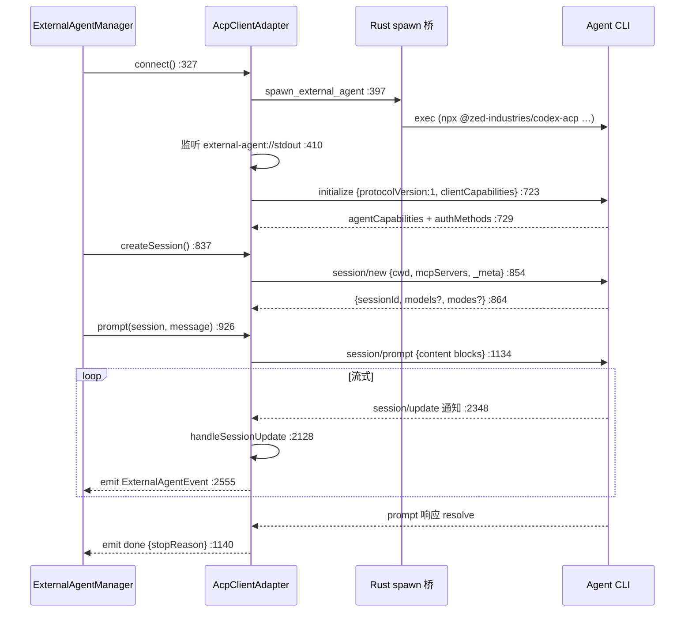

# ACP 客户端

<Status variant="stable" />

<TLDR>
  `AcpClientAdapter`（`acp-client.ts:286`）讲 [Agent Client Protocol](https://agentclientprotocol.com)：
  **JSON-RPC 2.0** 以**换行分隔 JSON** 成帧（`:1747` 的 `split("\n")`）。在桌面上它经 Rust 桥拉起 Agent
  CLI（`:397` 的 `spawn_external_agent` invoke），并监听 `external-agent://stdout|stderr|exit`；远程
  Agent 走 http/ws/sse。连接握手发送 `initialize`，`protocolVersion: 1`（`:714`），并通告客户端的 `fs` +
  `terminal` 能力（仅在 Tauri 下，`:704`）。ACP **反转**了通常的客户端/服务端角色：一旦会话运行，*Agent*
  反过来调进 Cognia 执行 `fs/read_text_file`、`terminal/create` 与 `session/request_permission`——全部由
  `handleAgentRequest`（`:1796`）派发。流式以 `session/update` 通知到达，`handleSessionUpdate`（`:2128`）
  把它们变成 Manager 产出的规范 `ExternalAgentEvent` 流。
</TLDR>

<StatGrid>
  <Stat label="文件体量" value="2632 行" hint="lib/ai/agent/external/acp-client.ts" />
  <Stat label="协议版本" value="1" hint="initialize 中发送，acp-client.ts:714" />
  <Stat label="客户端侧处理器" value="8" hint="fs ×2 · terminal ×5 · permission ×1 —— switch :1796" />
  <Stat label="会话更新种类" value="11" hint="handleSessionUpdate switch :2128" />
  <Stat label="请求超时" value="30s" hint="sendRequest 默认 :1630 · permission 300s :2001" />
  <Stat label="最大重连" value="3" hint="指数退避，attemptReconnection :2602" />
</StatGrid>

## 传输与成帧

适配器继承 `BaseProtocolAdapter` 并声明 `protocol = "acp"`。`connect`（`:327`）按传输分叉：

- **stdio（桌面）** —— `connectViaStdio`（`:377`）以 `buildSpawnArgs`（`:271`，那个幂等追加
  `--bare`/`--debug` 的导出纯辅助）给出的拉起参数 invoke `spawn_external_agent`（`:397`），然后订阅
  `external-agent://stdout` → `handleIncomingMessage`（`:410`）。
- **http / websocket / sse** —— `connectViaNetwork`（`:447`）用于远程 Agent，连接探测期间容忍 404/405
  （`:462`）。

入站字节被缓冲，并在 `processMessageBuffer`（`:1739`/`:1747`）按 `\n` 切分；每行 JSON 解析后由
`routeMessage`（`:1752`）路由：一个带非空 `id` **且**带 `method` 的对象是**Agent→客户端请求**（见反转
处理器）；带 `method` 而无 `id` 的是**通知**（见流式）；裸 `id` 是对我方某请求的**响应**
（`handleResponse` `:1777`）。

## 握手与 prompt turn

| 方法 | 行 | 发送 / 接收 |
| --- | --- | --- |
| `initialize` | 702 | `{protocolVersion:1, clientCapabilities, clientInfo}`；存 `_protocolVersion`/`_agentCapabilities`/`_authMethods`（`:729`）。客户端能力 = `{fs:{read,write}, terminal:true}` 仅在 Tauri 下（`:704`）。 |
| `session/new`（`createSession`） | 837 | `{cwd, mcpServers, _meta}`（meta 经 `buildSessionRequestMeta` `:590`）；从 `configOptions`/`modes` 推导初始模式（`:864`）。 |
| `session/load`（`loadSession`） | 1286 | 由 `_agentCapabilities.loadSession` 把守（缺失则抛）；状态经后续 `session/update` 恢复。 |
| `prompt`（本轮） | 926 | 异步生成器：构建内容块（text/image/resource + 注入文件，`:967`），发射后不管地发 `session/prompt`（`:1026`/`:1134`），产出排队事件，resolve 成 `done`（`:1140`）。 |
| `cancel` | 1117 | 通知 `session/cancel`（`:1124`），仅在执行中。 |
| `authenticate` | 741 | 对 `_authMethods` 校验，发 `authenticate {method, …credentials}`（`:753`）。 |

`prompt` **不**内联等待 `session/prompt` 请求——其响应是*本轮结束*信号，而真正内容在请求与其 resolve
之间以通知形式流入。

## 反转处理器 —— Agent 反调进来

这是 ACP 区别于普通 RPC 客户端之处：一旦本轮运行，Agent 把请求发**给 Cognia**。`handleAgentRequest`
（`:1796`）是那个 switch。

| ACP 方法 | 处理器（行） | 桥接到 |
| --- | --- | --- |
| `fs/read_text_file` | `handleReadTextFile`（1891） | Tauri `readTextFile`；遵循 `line`/`limit` 切片（`:1899`）；浏览器 → 抛错。 |
| `fs/write_text_file` | `handleWriteTextFile`（1915） | Tauri `writeTextFile`。 |
| `session/request_permission` | `handlePermissionRequest`（1931） | 权限桥（见下）。 |
| `terminal/create` | `handleTerminalCreate`（2034） | `acpTerminalCreate` → `{terminalId}`。 |
| `terminal/output` | `handleTerminalOutput`（2057） | `acpTerminalOutput`。 |
| `terminal/kill` | `handleTerminalKill`（2072） | `acpTerminalKill`。 |
| `terminal/release` | `handleTerminalRelease`（2084） | `acpTerminalRelease`。 |
| `terminal/wait_for_exit` | `handleTerminalWaitForExit`（2096） | `acpTerminalWaitForExit` → `{exitCode, exitStatus}`。 |
| `_` 前缀扩展 | `extensionHandlers.get(method)`（1839） | 插件经 `registerExtensionHandler`（`:1584`）登记；未知 → `-32601`。 |

终端方法桥接到 `@/lib/native/external-agent`，后者调用 Rust 的 ACP-terminal 子协议
（`src-tauri/src/external_agent/commands.rs` 里的 `acp_terminal_*`）。成功的处理器结果以 `sendResponse`
（`:1862`）回传；抛错变成 `-32603`（`:1855`）。

## 权限桥

当 Agent 想跑一个工具时，它发 `session/request_permission`。`handlePermissionRequest`（`:1931`）是那座桥：

1. **先自动判定。** `bypassPermissions` 模式自动选一个 allow 选项（`:1984`）；`acceptEdits` + 写类工具也
   自动选（`:1994`）。
2. **否则把它呈上。** 它把参数归一化成一个 `AcpPermissionRequest`（`:1963`）、发射一个
   `permission_request` 事件（`:2017`）、返回一个按 `requestId` 存进 `pendingPermissions` 的 Promise
   （`:2009`），并带一个 **5 分钟**超时 resolve 成 `cancelled`（`:2001`）。
3. **解析。** `respondToPermission`（`:1067`）查到待决 Promise 并 resolve 成
   `{outcome: granted ? "selected" : "cancelled", optionId}`（`:1071`），随后发射 `permission_response`
   （`:1077`）。

挑哪个 allow 选项由 `pickAllowPermissionOption`（`:1605`）决定：优先 `allow_once`、再默认 `allow`、再
任意 `allow`。这是 [hooks 闸门](./observability-hooks) 在 Manager 里拦截的接缝——一个 settings.json
`PreToolUse` hook 能在用户看到请求*之前*就拒绝。

## 会话扩展

`session/list`、`session/fork`、`session/resume` 是**不稳定**的 ACP 扩展。适配器追踪逐方法支持
（`createDefaultSessionExtensionSupport` `:253`，探测前全为 `"unknown"`），并在 Agent 未实现某个时静默降级。

| 扩展 | 方法（行） | 行为 |
| --- | --- | --- |
| `session/list` | `listSessions`（1324） | 若已缓存不支持则短路；遇 `-32601`/unsupported，缓存 `"unsupported"` 并抛一个类型化的 `UnsupportedSessionExtensionError`。 |
| `session/fork` | `forkSession`（1372） | 由 `sessionCapabilities.fork === false` 把守；相同错误分类。 |
| `session/resume` | `resumeSession`（1457） | 当存在 `loadSession` 能力时回退到 `session/load`（`:1466`、`:1538`）而非失败。 |

错误分类委托给 [`session-extension-errors.ts`](./canonical-readiness)
（`isExternalAgentMethodNotFoundError`、`isExternalAgentSessionExtensionUnsupportedForMethod`）。

## 流式 —— session/update → 事件

通知经 `handleNotification`（`:2117`）→ `notificationToEvent`（`:2341`）路由。主路径是 `session/update`
（`:2348`）→ `handleSessionUpdate`（`:2128`），一个对 `update.sessionUpdate` 的 switch：

| ACP 更新 | → 规范事件 | 行 |
| --- | --- | --- |
| `agent_message_chunk` | `message_delta`（文本） | 2139 |
| `thought_message_chunk` | `thinking` | 2151 |
| `user_message_chunk` | `message_delta` | 2159 |
| `tool_call` | `tool_use_start` | 2171 |
| `tool_call_update`（completed/error/failed） | `tool_result` | 2199 |
| `tool_call_update`（其他） | `tool_call_update` / `tool_use_delta` | 2217 / 2232 |
| `plan` | `plan_update`（带进度 %） | 2253 |
| `available_commands_update` | `commands_update` | 2272 |
| `current_mode_update` | `mode_update` | 2297 |
| `config_options_update` | `config_options_update` | 2321 |

`emitEvent`（`:2555`）把事件扇出到逐会话监听器；`prompt` 生成器已在 `:965` 注册了它的监听器，并产出落进
其队列的一切。遗留通知方法（`message/*`、`tool/*`、`thinking`、`progress`、`error`）也在
`notificationToEvent`（`:2351`–`:2504`）里映射，以兼容早于统一 `session/update` 的 Agent。

## 可靠性

- **请求超时** —— `sendRequest` 默认 30 秒（`:1630`）；`healthCheck` 以 5 秒 ping（`:1574`）。
- **进程退出** —— `handleProcessExit`（`:2575`）拒绝所有待决请求、标记会话关闭，并（若 `restartOnCrash`）
  触发 `attemptReconnection`（`:2602`），指数退避至多 3 次（`:2608`）。
- **断开清理** —— 把待决权限清成 `cancelled`、待决请求，以及扩展支持缓存（`:821`–`:827`）。
