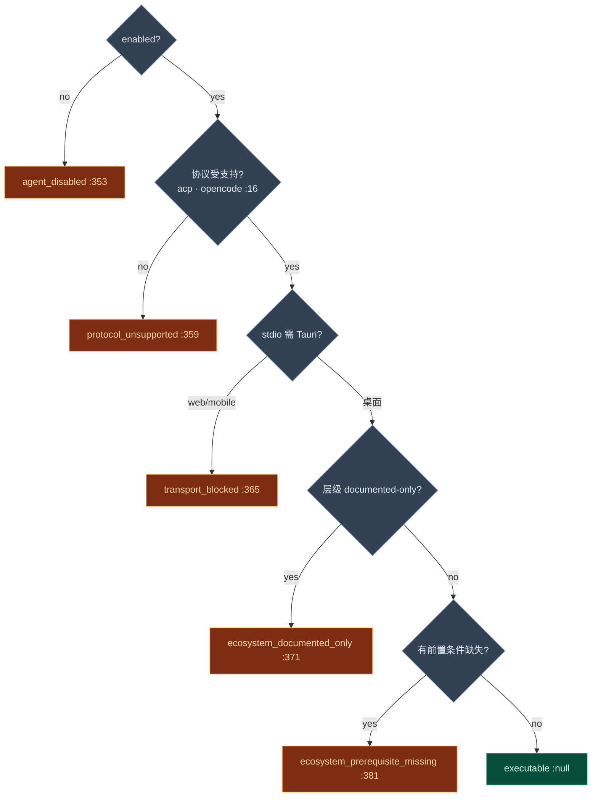

# 规范契约与就绪度

<Status variant="stable" />

<TLDR>
  三个模块回答同一个问题：**这个 Agent 能跑吗，若不能，为什么，用户该怎么办？** `canonical-contract.ts`
  拥有投影——`normalizeExternalAgentValiditySnapshot`（`:172`）拿一个部分 `ExternalAgentValiditySnapshot`
  并填上原因码、人类可读原因、执行资格、分支结果、生命周期阶段、恢复提示，从而让 Manager 的
  `updateInstanceState` 始终产出一致诊断。`config-normalizer.ts` 把原始 `CreateExternalAgentInput` 变成
  填满默认值的配置（`:400`），并经一个 5 级**执行阻断阶梯**（`:349`）外加一次活的**生态就绪度探测**
  （`:238`）计算*启动是否被阻断*。`session-extension-errors.ts` 是那套分类法，让客户端在 Agent 未实现
  `session/list|fork|resume` 时静默降级。
</TLDR>

<StatGrid>
  <Stat label="契约版本" value="1" hint="EXTERNAL_AGENT_CANONICAL_CONTRACT_VERSION —— canonical-contract.ts:13" />
  <Stat label="投影入口" value="normalize…:172" hint="唯一的部分→完整快照路径" />
  <Stat label="阻断阶梯级数" value="5" hint="getExternalAgentExecutionBlock —— config-normalizer.ts:349" />
  <Stat label="支持的协议" value="acp · opencode" hint="SUPPORTED_EXTERNAL_AGENT_PROTOCOLS :16" />
  <Stat label="归一化默认" value="300s / 3 重试" hint="DEFAULT_TIMEOUT · DEFAULT_RETRY_CONFIG" />
  <Stat label="扩展错误" value="7 个辅助" hint="session-extension-errors.ts 分类器" />
</StatGrid>

## canonical-contract.ts —— 一个投影

这是部分有效性快照变成完整快照的唯一地方。Manager 把*每次*状态变化都汇入它（`manager.ts:928`），于是
UI 永不会看到不一致的原因码/结果对。

| 符号 | 行 | 角色 |
| --- | --- | --- |
| `EXTERNAL_AGENT_CANONICAL_CONTRACT_VERSION` | 13 | 盖进每个归一化快照（`= 1`）。 |
| `createUnknownSessionExtensionSupport` | 15 | 默认的全 `unknown` 扩展支持映射。 |
| `normalizeExternalAgentValiditySnapshot` | 172 | **那个投影**——部分 → 完整快照。 |
| `validateExternalAgentBenchmarkCapabilityEntry` | 246 | 门控台账：一个 `validated` 条目需要证据；一个有意偏离需要完整偏离记录。 |
| `createExternalAgentBenchmarkBaseline` | 299 | 为 [agent-eval](../../subsystems/observability) 差距台账种下 4 个基线能力条目。 |

### 投影流水线

`normalizeExternalAgentValiditySnapshot`（`:172`）编排一串固定的内部 resolver：

**`resolveBranchOutcome`（`:86`）** 是规范的原因→结果映射（显式 `branchOutcome` 总是胜出，`:91`）：

| 原因码 | 结果 |
| --- | --- |
| `strict_failure` | `strict_failure` |
| `fallback_to_builtin` | `fallback` |
| `agent_not_found` / `configuration_missing` | `builtin` |
| 其余 + eligibility `blocked` | `blocked` |
| 其余 + eligibility `eligible` | `external` |

**`resolveCanonicalReasonCode`（`:23`）** 在无显式码且 Agent 不可执行时推导一个码：`documented-only`
生态层级 → `ecosystem_documented_only`（`:33`）；`action-required` 前置条件 →
`ecosystem_prerequisite_missing`（`:36`）；否则回退穿过
`canonicalReasonCode ?? blockingReasonCode ?? lastBranchReasonCode ?? "ok"`。

**`resolveRecoveryHints`（`:125`）** 把每个原因码映射成可操作字符串（如 `transport_blocked` →"在桌面运行"、
`health_check_failed` →"重连"）；存在时生态 `recommendedActions` 优先于这些（`:201`）。

**`mapSourceToLifecycleStage`（`:106`）** 记录生命周期走到哪：结果 `fallback` → 阶段 `fallback`；
`strict_failure` → `recovery`；来源 `config`/`connect`/`health` → 对应阶段；否则 `execution`。`blockedStage`
仅在 eligibility 为 `blocked` 时设置（`:192`）。

## config-normalizer.ts —— 默认、阻断与就绪度

`normalizeExternalAgentConfigInput`（`:400`）是前门：原始输入 → 带初始 `validitySnapshot` 的填默认值
`ExternalAgentConfig`。

| 步骤 | 行 | 做什么 |
| --- | --- | --- |
| 协议支持标记 | 416 | 不支持的协议得到 `metadata.unsupported*` 键；支持的清除。 |
| 默认值 | 427 | `id` = 缺则 `nanoid()`、`enabled` 默认 true、`defaultPermissionMode` `"default"`、`timeout` **300000**（`:440`）、`retryConfig` 来自 `DEFAULT_RETRY_CONFIG`（3 / 1s / 指数 / 30s 封顶）。 |
| 就绪度合并 | 455 | `projectExternalAgentReadinessMetadata` 把生态事实摊平进 `metadata.ecosystem*`。 |
| 有效性种子 | 463 | 阻断评估 → `normalizeExternalAgentValiditySnapshot` → 初始快照（`:464`）。 |

### 执行阻断阶梯

`getExternalAgentExecutionBlock`（`:349`）是 Manager 连接前调用的闸门（`manager.ts:1082`）。**首个命中胜出：**

### 生态就绪度

`getExternalAgentEcosystemReadiness`（`:107`）同步构建前置条件列表（从 metadata 解析面，回退到存储的
`metadata.ecosystem*` 字符串），`resolvePrerequisiteStatus`（`:91`）把它们汇总：`documented-only` →
`not-applicable`、有任一缺失 → `action-required`、有任一未知 → `unknown`、否则 `ready`。异步的
`probeExternalAgentEcosystemReadiness`（`:238`）加一次**活的 PATH 检查**——当可执行 + Tauri + stdio + 有
`checkCommandExists` 探测时，它压入一个满足/缺失的 `local-command` 前置条件（`:252`），并对 Windows 上的
Codex 追加 WSL2 建议（`:278`）。Manager 在每次连接时重跑该探测（`enrichConfigWithDynamicReadiness`，
`manager.ts:1080`）。

支撑谓词：`isSupportedExternalAgentProtocol`（`:316`）、`isTransportSupportedOnCurrentPlatform`（`:331`，
stdio 需 Tauri）、`isExternalAgentExecutable`（`:393`，阻断原因 === null）。

## session-extension-errors.ts —— 安静降级

`session/list|fork|resume` 扩展是可选且不稳定的。本模块是 [ACP 客户端](./acp-client) 用来判断一次失败是
意味着"这个 Agent 不支持它"（缓存后继续）还是真错误的分类法。

| 辅助 | 行 | 用途 |
| --- | --- | --- |
| `ExternalAgentUnsupportedSessionExtensionError` | 32 | 类型化错误；`code = "extension_unsupported"`，携带 `method`。 |
| `createExternalAgentUnsupportedSessionExtensionError` | 46 | 工厂。 |
| `getExternalAgentUnsupportedSessionExtensionMethod` | 66 | 从类型化错误或消息文本中提取方法（`session/list|fork|resume`）。 |
| `isExternalAgentMethodNotFoundError` | 91 | 检测 JSON-RPC `-32601` / "method not found"。 |
| `isExternalAgentSessionExtensionUnsupportedForMethod` | 99 | 逐方法的不支持检查（类型化 → 提取 → 启发式）。 |
| `isExternalAgentSessionExtensionUnsupportedError` | 129 | 综合会话上下文 + 不支持/method-not-found 信号的通用检测器。 |

分类阶梯是：类型化错误（快路径）→ 从消息提取方法 → JSON-RPC 码 → 对小写消息文本的启发式
（`"session" + (not supported | unsupported)`）。一次命中变成分支原因码 `extension_unsupported`，Manager
把它对该能力变成一个 `blocked` 结果——而不让整个 Agent 失败。
