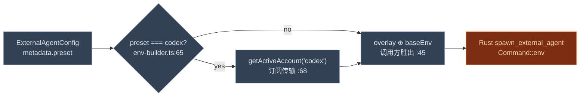

# 生态与预设

<Status variant="stable" />

<TLDR>
  这一簇回答"用户能挑**哪些**外部 Agent，每个又如何拉起？" `ecosystem-adapters.ts` 是静态产品目录：9 个
  适配器（**Codex**、**Claude Code**、**Gemini CLI**、**Copilot CLI**、**Kiro**、**Qwen Code**、**Pi**、
  **Factory Droid**、**Cursor**）暴露 16 个面（`:48`），每个打标
  `executable`、`guided` 或 `documented-only`。10 个 `executable` 面成为 `presets.ts`
  里的内置**预设**：`codex`、`codex-app-server`、`claude-code`、`gemini-cli`、`cursor-cli`、
  `copilot-cli`、`kiro`、`qwen-code`、`pi`、`droid`——除原生 codex app-server 外全为 ACP-走-stdio。
  `createAgentFromPreset` 从一个预设 id 物化出完整 `ExternalAgentConfig`，一个运行时叠加层让插件
  无需触碰封闭类型联合即可注册自己的预设。拉起时，`env-builder.ts`（`:36`）注入活跃 Codex 订阅账户的环境
  变量——那是唯一一个需要超出普通 API key 的凭据的预设。
</TLDR>

<StatGrid>
  <Stat label="产品适配器" value="9" hint="codex · claude-code · gemini-cli · copilot-cli · kiro · qwen-code · pi · droid · cursor —— ecosystem-adapters.ts:48" />
  <Stat label="面" value="16" hint="10 可执行 · 6 仅文档" />
  <Stat label="可执行预设" value="10" hint="EXTERNAL_AGENT_PRESETS（+ custom:null）" />
  <Stat label="全为 ACP / stdio" value="是" hint="每个可执行预设都是 acp + stdio" />
  <Stat label="默认超时" value="30s" hint="createAgentFromPreset :278（对比 config-normalizer 300s）" />
  <Stat label="环境叠加" value="仅 codex" hint="env-builder.ts:62 —— 订阅支撑" />
</StatGrid>

## 产品目录

`EXTERNAL_AGENT_ECOSYSTEM_ADAPTERS`（`:48`）是那份目录。每个适配器是一个产品；每个面是抵达该产品的一种
方式，并打上**支持层级**：

- **executable** —— Cognia 能直接拉起它（有 `presetId` + 进程配置）。
- **documented-only** —— 产品提供这一集成，但它在 Cognia 之外运行；UI 显示文档链接与 `limitationNote`，而非
  一个启动按钮。

| 适配器 | 面 | 层级 | 协议/传输 | 拉起命令 | 前置 | 定义行 |
| --- | --- | --- | --- | --- | --- | --- |
| **codex** | acp-stdio（Codex CLI） | executable | acp/stdio | `npx -y @zed-industries/codex-acp` | `OPENAI_API_KEY` / `CODEX_API_KEY` | 59 |
| codex | official-cli | documented-only | custom/stdio | — | 安装官方 Codex CLI | 81 |
| codex | ide-extension | documented-only | custom/http | — | 安装 IDE 扩展 | 98 |
| codex | slack | documented-only | http/http | — | 配置 Slack 应用 | 116 |
| codex | cloud | documented-only | http/http | — | ChatGPT/OpenAI 云 | 134 |
| **claude-code** | acp-stdio（Claude Code） | executable | acp/stdio | `npx -y @anthropics/claude-code --stdio` | `ANTHROPIC_API_KEY` | 160 |
| **gemini-cli** | acp-stdio（Gemini CLI） | executable | acp/stdio | `npx -y @google/gemini-cli --stdio` | `GOOGLE_API_KEY` | 210 |
| **copilot-cli** | acp-stdio（GitHub Copilot CLI） | executable | acp/stdio | `copilot --acp` | `COPILOT_GITHUB_TOKEN` / `/login` | 238 |
| **kiro** | acp-stdio（Kiro CLI） | executable | acp/stdio | `kiro-cli acp` | AWS Builder ID 登录 | 269 |
| **qwen-code** | acp-stdio（Qwen Code） | executable | acp/stdio | `npx -y @qwen-code/qwen-code --acp` | Qwen OAuth / `OPENAI_API_KEY` | 298 |
| **droid** | acp-stdio（Factory Droid） | executable | acp/stdio | `droid exec --output-format acp` | `FACTORY_API_KEY` / 设备码登录 | 359 |
| **cursor** | acp-stdio（Cursor CLI） | executable | acp/stdio | `cursor-agent`（在 PATH） | 安装 Cursor CLI | 390 |
| cursor | mcp-config | documented-only | acp/http | — | Cursor 侧 MCP 配置 | 410 |
| cursor | background-agent | documented-only | acp/http | — | 托管后台 Agent | 427 |

适配器块起始于：codex `:52`、claude-code `:175`、gemini-cli `:203`、copilot-cli `:231`、kiro `:262`、
qwen-code `:291`、pi `:320`、droid `:352`、cursor `:383`。查找/解析辅助：
`getExternalAgentEcosystemAdapter`（`:274`）、`findExternalAgentSurfaceByPresetId`（`:284`）、
`findExternalAgentSurface`（`:297`）、`checkSurfaceExecutability`（`:324`，对 `documented-only` 返回阻断）、
`listAllSurfacesWithTier`（`:348`），以及 `resolveExternalAgentSurfaceFromMetadata`（`:387`，被 Manager 的
就绪度探测使用）。

> **OpenCode 不在这份目录里。** 它是一个*协议*（`config-normalizer.ts:16`），而非打包的产品面——用户把它
> 指向一个运行中的 OpenCode 服务端，而非挑一个预设。

## 内置预设

`presets.ts` *从*可执行面派生内置预设——每个预设由 `buildPresetConfig(presetId)` 构建，它按
`presetId` 查面。目录是 `EXTERNAL_AGENT_PRESETS`：

| 预设 id | 名称 | 协议 | 传输 | 拉起 |
| --- | --- | --- | --- | --- |
| `codex` | Codex CLI | acp | stdio | `npx -y @zed-industries/codex-acp` |
| `codex-app-server` | Codex (app-server) | codex-app-server | stdio | `codex app-server` |
| `claude-code` | Claude Code | acp | stdio | `npx -y @anthropics/claude-code --stdio` |
| `gemini-cli` | Gemini CLI | acp | stdio | `npx -y @google/gemini-cli --stdio` |
| `cursor-cli` | Cursor CLI | acp | stdio | `cursor-agent` |
| `copilot-cli` | GitHub Copilot CLI | acp | stdio | `copilot --acp` |
| `kiro` | Kiro CLI | acp | stdio | `kiro-cli acp` |
| `qwen-code` | Qwen Code | acp | stdio | `npx -y @qwen-code/qwen-code --acp` |
| `droid` | Factory Droid | acp | stdio | `droid exec --output-format acp` |
| `custom` | — | — | — | `null`（用户自定义） |

`ExternalAgentPresetId`（`:26`）是一个封闭联合，但预设不是——见下一节。Pi 没有 ACP 条目：它由 `pi-rpc`
预设经原生协议驱动。曾经出现在这里的社区 `pi-acp` 桥，已连同它的 runtime 与 `npx` 允许名单条目一并移除
——见 Pi 适配器页。

### 物化一个配置

`createAgentFromPreset(presetId, overrides?)`（`:242`）把一个预设变成可运行的 `ExternalAgentConfig`：它
生成一个 id（`nanoid()`，`:252`）除非被覆盖、把 `timeout` 默认为 **30000**（`:278`）、把进程 `args`/`env`
与覆盖合并（`:262`），并盖上来源元数据——`metadata.preset`、`ecosystemAdapterId`、`ecosystemSurfaceId`、
`ecosystemSupportTier`、`ecosystemDocsUrl`（`:279`）。`isFromPreset`（`:297`）回读该来源；
`getPresetDisplayInfo`（`:313`）是 UI 子集。

### 插件贡献的预设

插件无需触碰封闭联合即可扩展该陈列。一张运行时叠加映射支撑：

| 符号 | 行 | 角色 |
| --- | --- | --- |
| `registerPreset` | 145 | 添加/替换一个动态预设（返回上一个）。 |
| `unregisterPreset` | 156 | 移除一个。 |
| `unregisterPresetsByPlugin` | 165 | 移除某插件的全部预设（返回计数）。 |
| `getPresetConfig` | 230 | 解析一个预设 id——**动态胜出**于静态。 |
| `getAvailablePresets` | 217 | 内置 ∪ 动态 id。 |
| `listDynamicPresetEntries` | 195 | 全部动态条目（"贡献"UI 标签页）。 |

它们由 `externalAgentPresets` manifest 字段与 `ctx.registerExternalAgentPreset` 驱动——见
[集成接缝](./integration)。

预设只在内置协议之上配置启动。要贡献**新协议**（适配器行为本身），插件用 `external-agent-adapter` 能力
（`externalAgentAdapters` / `ctx.agent.registerExternalAgentAdapter`）——它把一个 `() => ProtocolAdapter`
工厂注册到 `${pluginId}:${id}` 并配套一个预设，见
[贡献新协议](./integration) 与 [ADR-0051](../../adr/0051-external-agent-adapter-plugin-type)。

## env-builder.ts —— 拉起时的凭据

多数预设只需一个用户提供的 API-key 环境变量。**Codex 是例外**：它能经统一订阅系统（ADR-0025）用 ChatGPT
账户登录，所以它的环境必须在启动时注入。

`buildAgentEnv(config, baseEnv = {})`（`:36`）计算一个 `codexEnvOverlay`（`:40`）；若没有就原样返回
`baseEnv`（`:41`），否则**先**合并叠加，使调用方的 `baseEnv` 仍然胜出（`:45`）。`codexEnvOverlay`（`:62`）
返回 `null` 除非 `metadata.preset === "codex"`（`:65`），然后经订阅传输的 `getActiveAccount("codex")`
（`:68`）拉取活跃 Codex 账户并复制其环境对（`:72`）。任何错误都以一个警告被吞掉（`:77`），让一次凭据故障
永不阻断启动。结果交给 Rust 的 `spawn_external_agent` 命令，由它经 `Command::env` 应用。

这里不发生 `PATH` 或 `CLAUDE_CODE_OAUTH_TOKEN` 注入——那个 token 属于进程内 sidecar，而非外部 Agent。
Claude Code、Gemini、Cursor 原样接收基础环境。
