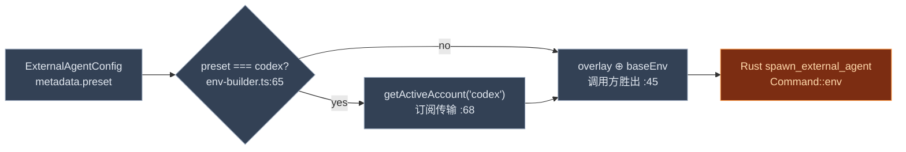

# 生态与预设

<Status variant="stable" />

<TLDR>
  这一簇回答"用户能挑**哪些**外部 Agent，每个又如何拉起？" `ecosystem-adapters.ts` 是静态产品目录：9 个
  适配器（**Codex**、**Claude Code**、**Gemini CLI**、**Copilot CLI**、**Kiro**、**Qwen Code**、**Pi**、
  **Factory Droid**、**Cursor**）暴露 16 个面（`:48`），每个打标
  `executable`、`guided` 或 `documented-only`。10 个 `executable` 面成为 `presets.ts`
  里的内置**预设**：`codex`、`codex-app-server`、`claude-code`、`gemini-cli`、`cursor-cli`、
  `copilot-cli`、`kiro`、`qwen-code`、`pi`、`droid`——除原生 codex app-server 外全为 ACP-走-stdio。
  `createAgentFromPreset` 从一个预设 id 物化出完整 `ExternalAgentConfig`，一个运行时叠加层让插件
  无需触碰封闭类型联合即可注册自己的预设。拉起时，`env-builder.ts`（`:36`）注入活跃 Codex 订阅账户的环境
  变量——那是唯一一个需要超出普通 API key 的凭据的预设。
</TLDR>

<StatGrid>
  <Stat label="产品适配器" value="9" hint="codex · claude-code · gemini-cli · copilot-cli · kiro · qwen-code · pi · droid · cursor —— ecosystem-adapters.ts:48" />
  <Stat label="面" value="16" hint="10 可执行 · 6 仅文档" />
  <Stat label="可执行预设" value="10" hint="EXTERNAL_AGENT_PRESETS（+ custom:null）" />
  <Stat label="全为 ACP / stdio" value="是" hint="每个可执行预设都是 acp + stdio" />
  <Stat label="默认超时" value="30s" hint="createAgentFromPreset :278（对比 config-normalizer 300s）" />
  <Stat label="环境叠加" value="仅 codex" hint="env-builder.ts:62 —— 订阅支撑" />
</StatGrid>

## 产品目录

`EXTERNAL_AGENT_ECOSYSTEM_ADAPTERS`（`:48`）定义适配器目录。每个适配器对应一个产品；每个接入方式描述如何连接该产品，并标明**支持层级**：

- **executable** —— Cognia 能直接拉起它（有 `presetId` + 进程配置）。
- **documented-only** —— 产品提供这一集成，但它在 Cognia 之外运行；UI 显示文档链接与 `limitationNote`，而非一个启动按钮。

| 适配器 | 面 | 层级 | 协议/传输 | 拉起命令 | 前置 | 定义行 |
| --- | --- | --- | --- | --- | --- | --- |
| **kimi** | acp-stdio（Kimi Code） | executable | acp/stdio | `kimi acp` | `kimi login` 订阅登录 | — |
| **cline** | acp-stdio (Cline CLI) | executable | acp/stdio | `cline --acp --auto-approve false` | `cline auth` / `CLINE_API_KEY` + provider/model | 52 |
| **codex** | acp-stdio（Codex CLI） | executable | acp/stdio | `npx -y @zed-industries/codex-acp` | `OPENAI_API_KEY` / `CODEX_API_KEY` | 59 |
| codex | official-cli | documented-only | custom/stdio | — | 安装官方 Codex CLI | 81 |
| codex | ide-extension | documented-only | custom/http | — | 安装 IDE 扩展 | 98 |
| codex | slack | documented-only | http/http | — | 配置 Slack 应用 | 116 |
| codex | cloud | documented-only | http/http | — | ChatGPT/OpenAI 云 | 134 |
| **claude-code** | acp-stdio（Claude Code） | executable | acp/stdio | `npx -y @anthropics/claude-code --stdio` | `ANTHROPIC_API_KEY` | 160 |
| **gemini-cli** | acp-stdio（Gemini CLI） | executable | acp/stdio | `npx -y @google/gemini-cli --stdio` | `GOOGLE_API_KEY` | 210 |
| **copilot-cli** | acp-stdio（GitHub Copilot CLI） | executable | acp/stdio | `copilot --acp` | `COPILOT_GITHUB_TOKEN` / `/login` | 238 |
| **kiro** | acp-stdio（Kiro CLI） | executable | acp/stdio | `kiro-cli acp` | AWS Builder ID 登录 | 269 |
| **qwen-code** | acp-stdio（Qwen Code） | executable | acp/stdio | `npx -y @qwen-code/qwen-code --acp` | Qwen OAuth / `OPENAI_API_KEY` | 298 |
| **droid** | acp-stdio（Factory Droid） | executable | acp/stdio | `droid exec --output-format acp` | `FACTORY_API_KEY` / 设备码登录 | 359 |
| **cursor** | acp-stdio（Cursor CLI） | executable | acp/stdio | `cursor-agent`（在 PATH） | 安装 Cursor CLI | 390 |
| cursor | mcp-config | documented-only | acp/http | — | Cursor 侧 MCP 配置 | 410 |
| cursor | background-agent | documented-only | acp/http | — | 托管后台 Agent | 427 |

适配器块起始于：codex `:52`、claude-code `:175`、gemini-cli `:203`、copilot-cli `:231`、kiro `:262`、qwen-code `:291`、pi `:320`、droid `:352`、cursor `:383`。查找/解析辅助：`getExternalAgentEcosystemAdapter`（`:274`）、`findExternalAgentSurfaceByPresetId`（`:284`）、`findExternalAgentSurface`（`:297`）、`checkSurfaceExecutability`（`:324`，对 `documented-only` 返回阻断）、`listAllSurfacesWithTier`（`:348`），以及 `resolveExternalAgentSurfaceFromMetadata`（`:387`，被 Manager 的就绪度探测使用）。

> **OpenCode 不在这份目录里。** 它是一个*协议*（`config-normalizer.ts:16`），而非打包的产品面——用户把它
> 指向一个运行中的 OpenCode 服务端，而非挑一个预设。

## 内置预设

`presets.ts` *从*可执行面派生内置预设——每个预设由 `buildPresetConfig(presetId)` 构建，它按 `presetId` 查面。目录是 `EXTERNAL_AGENT_PRESETS`：

| 预设 id | 名称 | 协议 | 传输 | 拉起 |
| --- | --- | --- | --- | --- |
| `codex` | Codex CLI | acp | stdio | `npx -y @zed-industries/codex-acp` |
| `codex-app-server` | Codex (app-server) | codex-app-server | stdio | `codex app-server` |
| `claude-code` | Claude Code | acp | stdio | `npx -y @anthropics/claude-code --stdio` |
| `gemini-cli` | Gemini CLI | acp | stdio | `npx -y @google/gemini-cli --stdio` |
| `cursor-cli` | Cursor CLI | acp | stdio | `cursor-agent` |
| `copilot-cli` | GitHub Copilot CLI | acp | stdio | `copilot --acp` |
| `kiro` | Kiro CLI | acp | stdio | `kiro-cli acp` |
| `qwen-code` | Qwen Code | acp | stdio | `npx -y @qwen-code/qwen-code --acp` |
| `droid` | Factory Droid | acp | stdio | `droid exec --output-format acp` |
| `custom` | — | — | — | `null`（用户自定义） |

`ExternalAgentPresetId`（`:26`）是一个封闭联合，但预设不是——见下一节。Pi 没有 ACP 条目：它由 `pi-rpc` 预设经原生协议驱动。曾经出现在这里的社区 `pi-acp` 桥，已连同它的 runtime 与 `npx` 允许名单条目一并移除——见 Pi 适配器页。

### 物化一个配置

`createAgentFromPreset(presetId, overrides?)`（`:242`）把一个预设变成可运行的 `ExternalAgentConfig`：它生成一个 id（`nanoid()`，`:252`）除非被覆盖、把 `timeout` 默认为 **30000**（`:278`）、把进程 `args`/`env` 与覆盖合并（`:262`），并盖上来源元数据——`metadata.preset`、`ecosystemAdapterId`、`ecosystemSurfaceId`、`ecosystemSupportTier`、`ecosystemDocsUrl`（`:279`）。`isFromPreset`（`:297`）回读该来源；`getPresetDisplayInfo`（`:313`）是 UI 子集。

### 插件贡献的预设

插件无需触碰封闭联合即可扩展该陈列。一张运行时叠加映射支撑：

| 符号 | 行 | 角色 |
| --- | --- | --- |
| `registerPreset` | 145 | 添加/替换一个动态预设（返回上一个）。 |
| `unregisterPreset` | 156 | 移除一个。 |
| `unregisterPresetsByPlugin` | 165 | 移除某插件的全部预设（返回计数）。 |
| `getPresetConfig` | 230 | 解析一个预设 id——**动态胜出**于静态。 |
| `getAvailablePresets` | 217 | 内置 ∪ 动态 id。 |
| `listDynamicPresetEntries` | 195 | 全部动态条目（"贡献"UI 标签页）。 |

它们由 `externalAgentPresets` manifest 字段与 `ctx.registerExternalAgentPreset` 驱动——见[集成接缝](./integration)。

预设只在内置协议之上配置启动。要贡献**新协议**（适配器行为本身），插件用 `external-agent-adapter` 能力（`externalAgentAdapters` / `ctx.agent.registerExternalAgentAdapter`）——它把一个 `() => ProtocolAdapter` 工厂注册到 `${pluginId}:${id}` 并配套一个预设，见[贡献新协议](./integration) 与 [ADR-0051](../../adr/0051-external-agent-adapter-plugin-type)。

## Goose 安装与会话

`goose` 预设通过 `goose acp --with-builtin developer` 启动 Goose 原生 ACP 服务。它在 macOS 和 Linux 上属于系统安装的 runtime。Cognia 检测可执行文件并通过 `goose --version` 探测版本，不需要社区桥接，也不会接管系统二进制文件。

macOS 可以使用 `brew install block-goose-cli`。CLI/TUI 的安装操作优先使用 Homebrew；没有 Homebrew 时使用官方脚本：

```sh
curl -fsSL https://github.com/aaif-goose/goose/releases/download/stable/download_cli.sh | CONFIGURE=false bash
```

运行 `goose configure` 选择 provider 和 model，或在 Agent 环境变量中配置 `GOOSE_PROVIDER`、`GOOSE_MODEL` 和对应 provider 的 API key。DeepSeek 可以使用 OpenAI 兼容 provider：`GOOSE_PROVIDER=openai`、`GOOSE_MODEL=deepseek-flash`、`OPENAI_BASE_URL=https://api.deepseek.com/v1`，并在本地提供 `OPENAI_API_KEY`。桌面设置和聊天 Agent 管理器提供同一个 Goose 预设和安装指引。Homebrew 安装可通过 `brew upgrade block-goose-cli` 更新，脚本安装可通过 `goose update` 更新。在 Cognia 中移除 Agent 只删除保存的配置；卸载系统 Goose 需通过包管理器或移除脚本安装的二进制文件。

Cognia 强制以 `approve` 模式启动 Goose，使工具请求经过现有权限处理。`plan` 对应 Goose 的 `chat`，显式 `bypassPermissions` 对应 `auto`。`default`、`acceptEdits` 和 `dontAsk` 保持 Goose `approve`，由 Cognia 执行现有审批策略。临时文件使用 Goose 已有的沙箱可写状态目录，不关闭沙箱。

共享 ACP client 提供流式回复、原生工具、会话级 MCP servers、模型和模式配置、会话列表和恢复、取消执行及删除会话。暂不声明 Windows 支持，因为 Cognia 的严格外部 Agent 沙箱目前仅支持 macOS/Linux。

安装 Goose 并加入 PATH，在本地提供 provider 凭据后，可以运行 `node scripts/smoke/build-and-run-smoke.mjs --goose-acp` 执行真实回归。该测试创建并清理临时工作区，通过 `GOOSE_PATH_ROOT` 隔离 Goose 配置。

Sources: [Goose 安装](https://goose-docs.ai/docs/getting-started/installation/)、[原生 ACP](https://goose-docs.ai/docs/gdk/acp/)、[环境变量](https://goose-docs.ai/docs/guides/environment-variables/)。

## Qoder 安装、认证与 ACP

`qoder` 预设通过 Qoder 官方 ACP 服务接入，支持在 macOS 和 Linux 上本地运行。Cognia 复用已有 ACP 客户端，无需社区桥接或单独的 SDK 适配器。

使用官方推荐的原生独立 CLI 安装方式：

```sh
curl -fsSL https://qoder.com/install | bash
qoder --version
qoder login
```

CLI/TUI 检测到命令缺失时，在 `curl` 和 `bash` 可用的情况下提供此安装操作。这是**用户管理的系统安装**，不是 Cognia 固定版本的托管发行物。运行时目录通过 `qoder --version` 探测版本；在取得真实认证验收证据前，Qoder 保持未认证状态，适用现有的版本确认策略。原生安装可单独通过 `qoder update` 更新。上游仍兼容旧 npm 安装方式，但不推荐新用户使用。

预设启动命令：

```sh
qoder --acp --permission-mode default --strict-mcp-config --settings '{"general":{"enableAutoUpdate":false}}'
```

显式指定默认权限，避免已有默认配置使进程悄悄进入跳过审批模式。进程级配置禁用后台自动更新，不修改用户的 `settings.json`。严格 MCP 配置忽略隐式的用户、项目及插件 MCP 服务；Cognia 根据协商能力，通过 ACP `session/new`、`session/load` 或 `session/resume` 传入本会话选定的服务。

可复用 Qoder CLI 已有登录，或通过 Agent 环境变量编辑器填写 `QODER_PERSONAL_ACCESS_TOKEN`，输入值以密码形式遮罩显示。Token 在 [Qoder 账号集成页面](https://qoder.com/account/integrations) 创建，不要发到聊天或提交到代码仓库。`QODER_CONFIG_DIR` 或 `--config-dir` 可以指定独立状态目录，命令行参数优先。两个宿主启动器均为该目录提供必要的沙箱写入权限，不复制登录数据，也不会同时授予默认登录目录写入权限。临时文件放在所选状态目录的 `tmp/` 下，确保启动过程符合沙箱权限。隔离 Bot 的配置目录必须位于其自有状态目录内；宿主安装仅开放 `.qoder/entry` 与 `.qoder/bin` 程序目录的只读访问。模型服务 API key 不能替代 Qoder 认证；BYOK provider/model 是否可用由 Qoder 账号支持的目录决定。

Qoder ACP 文档列出 Default 和 Bypass Permissions。新版本可能协商出更多模式：只有服务端提供时，Cognia 才分别将 `acceptEdits`、`bypassPermissions` 和 `dontAsk` 映射为 `accept_edits`、`bypass_permissions` 和 `dont_ask`。若模式目录没有 Plan，则拒绝切换，不会悄悄退回可写模式。模型选择及会话列举、加载、恢复、分叉、关闭和删除均按协商能力启用，不能仅凭 ACP 协议假定支持。删除保存的 Agent 会保留系统程序及 Qoder 原生数据。Cognia 要求已有的严格 macOS/Linux 沙箱，因此不提供 Windows 本地托管。

通过真实 Cognia 适配器与沙箱进行无需账号的验收：

```sh
node scripts/smoke/build-and-run-smoke.mjs --qoder-acp
```

此 smoke 使用临时配置，清空子进程 PAT，检查 ACP v1 初始化、缺少认证时的拒绝及重新连接，最后清理临时工作区。2026-10-01 检查了 Qoder 1.1.65：它声明支持图片/嵌入上下文、HTTP/SSE MCP 和会话生命周期能力，并在未认证时拒绝 `session/new`。另有显式启用的认证验证：`node scripts/smoke/build-and-run-smoke.mjs --qoder-acp --authenticated`。它复用 `~/.qoder` 中已有浏览器登录，发送一个不使用工具的简短请求，检查会话列举与断开重连后的加载，最后只删除自身测试会话。2026-10-01，Qoder 1.1.65 使用 Qwen3.8-Max 通过了该认证验证。同时验证了官方原生安装流程：二进制的 `install` 子命令会部署版本化程序、`qoder` 入口及 shell PATH。原生文件编辑及 MCP 工具执行仍未验收。

来源：[ACP](https://docs.qoder.com/cli/acp)、[安装](https://docs.qoder.com/cli/installation)、[认证](https://docs.qoder.com/cli/authentication)、[CLI 参数](https://docs.qoder.com/cli/cli-reference)、[自定义模型](https://docs.qoder.com/cli/custom-models)。

## env-builder.ts —— 拉起时的凭据

多数预设只需一个用户提供的 API-key 环境变量。**Codex 是例外**：它能经统一订阅系统（ADR-0025）用 ChatGPT 账户登录，所以它的环境必须在启动时注入。

`buildAgentEnv(config, baseEnv = {})`（`:36`）计算一个 `codexEnvOverlay`（`:40`）；若没有就原样返回 `baseEnv`（`:41`），否则**先**合并叠加，使调用方的 `baseEnv` 仍然胜出（`:45`）。`codexEnvOverlay`（`:62`）返回 `null` 除非 `metadata.preset === "codex"`（`:65`），然后经订阅传输的 `getActiveAccount("codex")`（`:68`）拉取活跃 Codex 账户并复制其环境对（`:72`）。任何错误都以一个警告被吞掉（`:77`），让一次凭据故障永不阻断启动。结果交给 Rust 的 `spawn_external_agent` 命令，由它经 `Command::env` 应用。


```mermaid
flowchart LR
  CFG["ExternalAgentConfig<br/>metadata.preset"]
  OVL{"preset === codex?<br/>env-builder.ts:65"}
  ACC["getActiveAccount('codex')<br/>订阅传输 :68"]
  MERGE["overlay ⊕ baseEnv<br/>调用方胜出 :45"]
  SPAWN["Rust spawn_external_agent<br/>Command::env"]

  CFG --> OVL
  OVL -- no --> MERGE
  OVL -- yes --> ACC --> MERGE
  MERGE --> SPAWN

  classDef step fill:#334155,stroke:#94a3b8,color:#e2e8f0
  classDef proc fill:#7c2d12,stroke:#fb923c,color:#fed7aa
  class CFG,OVL,ACC,MERGE step
  class SPAWN proc
```

这里不发生 `PATH` 或 `CLAUDE_CODE_OAUTH_TOKEN` 注入——那个 token 属于进程内 sidecar，而非外部 Agent。Claude Code、Gemini、Cursor 原样接收基础环境。

## Aider 安装与会话

`aider` 预设通过 `aider-cli` 接入官方 CLI。每轮使用 `aider --message-file`，并为 Cognia 会话维护独立的聊天和输入历史。支持流式文本、文件编辑、取消、模型切换及通过已知会话 ID 恢复。会话列表仅包含当前适配器已打开的会话，不会扫描所有原生 Aider 历史。没有原生 ACP 审批、结构化工具事件和 MCP。

在隔离的 Python 环境中安装已测试的 0.86.2：

```sh
uv tool install --force --python python3.12 --with pip aider-chat==0.86.2
```

在设置 → Agents 中选择 Aider，配置工作目录、参数 `--model deepseek/deepseek-flash` 及环境变量 `DEEPSEEK_API_KEY`。其他服务使用对应的 Aider model ID 和 key。Cognia 隔离原生 `.aider.conf.yml`、dotenv、OAuth key 与模型设置的自动发现，避免启动命令或凭据覆盖这里的配置。禁用 Git 提交、仓库地图上下文、自动 lint/test 和建议执行 shell 命令。需要的文件请由 Cognia 显式传入。Cognia 对传入提示、文件及恢复的历史检查 PII；Aider 自己管理内部模型调用。

`bypassPermissions` 在强制主机沙箱内自动确认 Aider 操作；`plan` 使用 `--chat-mode ask --dry-run`。拒绝其他权限模式和逐工具白名单。Cognia 提示中的 Aider slash 命令作为模型任务文本处理。使用 uv 更新，Cognia 不会卸载系统安装。关闭保留历史，删除仅清理选定的 Cognia 会话历史。

真实回归脚本为 `node scripts/smoke/build-and-run-smoke.mjs --aider-cli`，需要 PATH 中存在 Aider，并在本地提供 `AIDER_MODEL` 和对应模型凭据。

Sources: [Aider 安装](https://aider.chat/docs/install.html)、[Aider 脚本调用](https://aider.chat/docs/scripting.html)、[Aider CLI 选项](https://aider.chat/docs/config/options.html)。


## Cline 安装、认证与原生 ACP

`cline` 预设通过官方 `cline --acp --auto-approve false` 运行完整 CLI，并使用 Cognia 强制要求的 macOS/Linux 沙箱。设置 → Agents、外部 Agent 管理器提供预设、工作目录、参数与遮罩环境变量编辑器；CLI/TUI 和 Agent Teams 共用同一运行时目录。

```sh
npm install -g cline@3.0.67
cline auth
```

缺少命令时，安装入口提供经过验证的精确 npm 版本。这是**用户管理的系统安装**：Cognia 探测 `cline --version`，要求绑定可执行文件身份的未认证版本确认，不会删除或回滚系统安装及原生数据。升级另行运行 `cline update` 或包管理器命令；托管进程强制设置 `CLINE_NO_AUTO_UPDATE=1`。

可以通过已有 ACP 认证界面登录 Cline、ClinePass 或 ChatGPT；`cline auth` 保存的 OAuth 凭证会复用。其他服务商请在本地遮罩环境变量编辑器中设置 `CLINE_PROVIDER`、`CLINE_MODEL`、`CLINE_API_KEY`。固定 provider 后无法通过会话控件切换服务商。3.0.67 ACP 只恢复已保存的 OAuth 服务商，因此不能假定原生配置中保存的 BYOK key 自动可用。不要通过命令行参数传递 key，也不要提交凭证。

ACP 状态隔离使用 `CLINE_DIR` 或 `--config <root>`，实际默认根目录是 `~/.cline`，`--config` 优先于环境变量。Cognia 将状态写入与临时文件限定在选定目录；隔离 Bot 的目录不可逃出其自有状态根。3.0.67 在处理 `--data-dir` 之前已进入 ACP 分支，因此 Cognia 会拒绝该无效参数，避免产生错误的隔离承诺。

Plan 映射为原生 `plan`；Default、Accept edits、Bypass permissions 和 Don't ask 映射为 `act`，同时保留 Cognia 的逐工具权限策略。启动时原生自动审批关闭。模型、服务商、会话配置、取消、流式文本与 `session/load` 复用现有 ACP 客户端。原有 Cline 便携历史和子 Agent 导入入口继续可用。

**3.0.67 上游限制：**ACP 声明支持图片，但提示处理只读取文本；接收会话 MCP 声明，却未转发给核心运行时。Cognia 因此明确拒绝图片与会话 MCP 声明，能力界面标记 Cognia 工具投影不可用，避免静默丢失。Cline 自己的 MCP 仍可通过 `cline mcp` 在同一配置根中管理。原生 ACP 未声明列举和删除会话；删除 Cognia Agent 只删除配置，不删除 CLI 或原生历史。本次没有嵌入独立的 `@cline/sdk`。

**2026-10-01** 使用真实官方 CLI **3.0.67** 完成无需账号验证：Cognia Node 宿主与原生沙箱协商 ACP v1、拒绝无凭证会话、重连、使用合成 key 创建仅配置会话、切换 Plan/Act，并确认原生自动审批仍为 false。没有发起模型请求、OAuth 登录、原生文件编辑或 MCP 调用。将 Cline 放入 PATH 并准备现有宿主启动器后可复现：

```sh
node scripts/smoke/build-and-run-smoke.mjs --cline-acp
```

Sources: [官方 ACP 文档](https://docs.cline.bot/usage/acp)、[CLI 参考](https://docs.cline.bot/cli/cli-reference)、[ACP 实现](https://github.com/cline/cline/blob/cli-v3.0.67/apps/cli/src/acp/acpAgent.ts)、[CLI 启动与配置路由](https://github.com/cline/cline/blob/cli-v3.0.67/apps/cli/src/main.ts)。

## Kimi Code：订阅登录与原生 ACP

`kimi` 预设通过 `kimi acp` 启动持续维护的 Node.js **Kimi Code CLI**，复用公共 ACP 客户端处理文本和思考流、图片输入、工具审批、模型与配置控制、取消、MCP 和原生持久化会话。已归档的 Python `MoonshotAI/kimi-cli` 是另一个运行时，此预设不会安装它。

```bash
# Node.js >=22.19
npm install -g @moonshot-ai/kimi-code@2.1.1
kimi --version
kimi login
```

CLI/TUI 缺少命令时提供这一精确 npm 包和版本。上游也提供官方独立安装脚本 `https://code.kimi.com/kimi-code/install.sh`。这是**用户管理的系统安装**：Cognia 探测版本并要求绑定运行时身份的未认证版本确认，不卸载或回滚 CLI。更新请在托管会话之外执行 `kimi upgrade` 或使用包管理器。删除 Cognia Agent 配置会保留系统安装和 Kimi 原生数据。

执行 `kimi login` 登录 Kimi Code 订阅；ACP 认证方法也支持公共终端登录流程。订阅登录**不需要** Moonshot API key。Cognia 现有的 Kimi 订阅 provider 插件属于独立的模型服务接入，不是运行原生 CLI Agent 的前提。

`KIMI_CODE_HOME` 指定状态、配置、凭据与会话目录，默认 `~/.kimi-code`。Cognia 将沙箱写入和临时文件限定在此目录，并隔离 Bot 状态。环境变量编辑器隐藏变量值。自定义服务可在本地设置 `KIMI_MODEL_NAME`、`KIMI_MODEL_PROVIDER_TYPE`、`KIMI_MODEL_BASE_URL` 和 `KIMI_MODEL_API_KEY`，覆盖原生订阅模型；不要将密钥放进命令行参数。连接后通过 ACP 会话配置发现可用模型与思考选项，不根据 Moonshot API 模型名猜测订阅模型。

原生 ACP 声明支持会话加载、列表、恢复、关闭、删除与分叉，以及图片和 stdio/HTTP/SSE MCP。Cognia 使用协商能力和公共会话、权限控件。历史仍保存在 Kimi 原生目录；本次没有声明可移植会话导入器或迁移 provider。原生审批默认使用 `default`，工具请求继续经过 Cognia 权限策略。

设置 → Agents、外部 Agent 管理器、CLI/TUI 和 Agent Teams 共享预设与运行时目录。无需独立 SDK、终端输出桥接或启动时通过未固定版本的 `npx` 下载。Cognia 接受 Node CLI `>=2.1.1 <3.0.0`，拒绝已归档的 Python 1.x CLI。Kimi 预设启用公共 ACP 会话分叉预览控制。此版本在运行时认证流程完成前仍属于未认证版本；无需账号验证与已登录的真实验收是不同证据。

Sources: [官方快速开始](https://www.kimi.com/code/docs/kimi-code-cli/guides/getting-started), [命令参考](https://www.kimi.com/code/docs/kimi-code-cli/reference/kimi-command.html), [当前 CLI 源码](https://github.com/MoonshotAI/kimi-code)。

2026-10-01，Kimi Code 2.1.1 通过 Cognia 原生 macOS 沙箱完成无需账号的 ACP 协商，以及会话新建、列表、分叉、关闭、加载、恢复和删除。已登录订阅的真实验证还覆盖带随机标记的流式回复、实际 stdio MCP 工具回执、在专用临时工作区创建并读取标记文件、原生工具审批与应答、模型选择、识别 64×64 红色图片、取消正在执行的轮次及测试会话清理。HTTP/SSE MCP 仅有上游声明及源码证据，尚未在该真实测试中调用。上游 CLI 不暴露 ACP `provider/*` 控制器 API；自定义 provider 使用原生 CLI 配置或已记录的环境变量覆盖。
