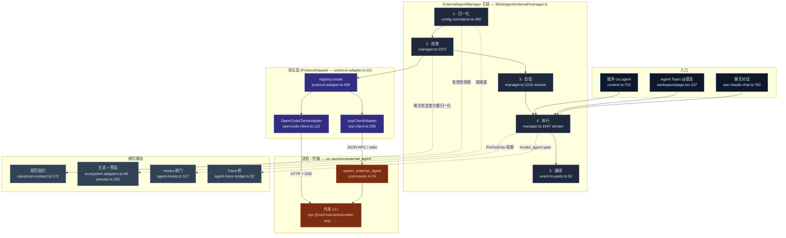

# 外部 Agent

<Status variant="stable" />

<TLDR>
  Cognia 有**三种** Agent 运行时，都渲染到同一个聊天面板：[内置 Agent](../built-in-agent)（进程内
  Claude Agent SDK）、[Agent Teams](../agent-teams)（多角色小队），以及**外部 CLI Agent**——Codex、
  Claude Code、Gemini、Cursor，以及任意 OpenCode 服务端——以**子进程**方式拉起。外部运行时位于
  `lib/ai/agent/external/`（14 个模块，约 1.54 万行）。一个单例 `ExternalAgentManager`
  （`manager.ts:199`）跑完整条主链：**归一化**原始配置（`config-normalizer.ts:400`）→ 从注册表中
  挑出协议适配器并**连接**（`protocol-adapter.ts:474`）→ 打开**会话** → **执行**一次 prompt turn
  （`manager.ts:1547` 流式 / `:1734` headless）→ 把 Agent 的原生事件**翻译**成统一的
  `ExternalAgentEvent` 流 → 把该流**投影**成 `UIMessage.parts`（`event-to-parts.ts:53`）。每个阻断
  结果都被收进同一个规范契约——`ExternalAgentValiditySnapshot`——因此 UI 永远知道一次对话究竟是外部
  执行、回退到内置 Agent、还是被阻断，以及原因。
</TLDR>

<StatGrid>
  <Stat label="核心体量" value="约 1.54 万行" hint="lib/ai/agent/external/ —— 14 个运行时模块" />
  <Stat label="协议" value="2" hint="ACP (acp-client.ts) · OpenCode (opencode-client.ts)，由 ProtocolAdapter 统一" />
  <Stat label="可执行预设" value="4" hint="codex · claude-code · gemini-cli · cursor-cli —— presets.ts:105" />
  <Stat label="生态面" value="10" hint="4 可执行 · 6 仅文档 —— ecosystem-adapters.ts:48" />
  <Stat label="分支原因码" value="18" hint="ExternalAgentBranchReasonCode —— external-agent.ts:36" />
  <Stat label="分支结果" value="5" hint="external · fallback · strict_failure · builtin · blocked" />
</StatGrid>

## 它是什么

**外部 Agent** 是 Cognia 不在进程内托管的第三方编码 Agent。Cognia 不在打包的 Node sidecar 里跑
Claude Agent SDK，而是**拉起该 Agent 自己的 CLI**（或连到它的服务端）并讲它的线缆协议。已实现两种协议：

- **ACP**——[Agent Client Protocol](https://agentclientprotocol.com)，JSON-RPC 2.0 走换行分隔的
  stdio。这是 Codex、Claude Code、Gemini、Cursor 走的路。客户端是 `acp-client.ts`（2632 行）。
- **OpenCode**——官方 `@opencode-ai/sdk`，走 HTTP + Server-Sent Events。客户端是 `opencode-client.ts`
  （1659 行）。

两者都实现同一个接口 `ProtocolAdapter`（`protocol-adapter.ts:32`），所以 Manager 及其之上的一切
（聊天、插件、Agent Teams）从不按协议分叉。这套架构满足三条约束：

1. **Agent 是一个外来进程。** 它的文件系统、终端、权限模型都归它自己；Cognia 是*客户端*。ACP 反转了
   通常的方向——Agent 反过来调**进** Cognia 来执行 `fs/read_text_file`、`terminal/create`、
   `session/request_permission`（`acp-client.ts:1796`）。Cognia 必须作为一个守规矩的 ACP 客户端来应答。
2. **静态导出没有服务端。** `next.config.ts` 强制 `output: "export"`；拉起子进程需要 Rust。真正的
   `spawn`/stdin/stdout 管道是 `src-tauri/src/external_agent/`（`commands.rs:34`）里的纯透传，所以
   外部 Agent 只在 Tauri 桌面壳里运行——web/mobile 看到的是 `transport_blocked`。
3. **每种运行时在下游都必须长得一样。** 聊天渲染器、trace 仪表盘、权限弹窗都不能关心一次对话来自
   Claude-SDK 还是 Codex 子进程。于是外部运行时**把一切归一化**——事件、有效性、分支判定——成内置
   Agent 已经在产出的相同形状。

## 架构总览

五段主链自左向右；下方的横切模块挂接进来。每个方框都标注了工作发生的文件与行号。

## 模块地图

逐模块页面给出行号级内部细节。下面每张卡片是一个文档页面。

<Cards>
  <Card title="类型与契约" href="./type-contract" description="types/agent/external-agent.ts（2168 行）：协议/传输分类法、完整的 ACP 类型面、config/session/event 模型，以及有效性与分支原因的规范类型。" />
  <Card title="Manager（主链）" href="./manager" description="ExternalAgentManager —— addAgent、带重试的 connect、executeStreaming/execute、分支判定、有效性与健康、生命周期监听、委派规则。" />
  <Card title="ACP 客户端" href="./acp-client" description="Agent Client Protocol 走 JSON-RPC/stdio：initialize、session/new、prompt turn、客户端侧 fs/terminal 处理器、权限桥、会话扩展与流式。" />
  <Card title="OpenCode 适配器" href="./opencode-adapter" description="OpenCode SDK + SSE 客户端，外加 ProtocolAdapter 接口、BaseProtocolAdapter.execute 事件折叠，以及选择 ACP vs OpenCode 的适配器注册表。" />
  <Card title="规范契约与就绪度" href="./canonical-readiness" description="单一的有效性/分支/结果投影、执行阻断阶梯、生态就绪度探测，以及会话扩展错误分类法。" />
  <Card title="生态与预设" href="./ecosystem-presets" description="产品目录（4 个适配器、10 个面）、4 个可执行预设、createAgentFromPreset、插件贡献预设，以及 codex 环境变量叠加。" />
  <Card title="事件翻译" href="./translation" description="ACP/OpenCode 更新 → 规范 ExternalAgentEvent → UIMessage parts；JSON-Schema→Zod 工具桥；result ⇄ SubAgentResult 转换。" />
  <Card title="可观测性与 Hooks" href="./observability-hooks" description="invoke_agent trace span、两套 Hook 系统（插件 System A + settings.json System B 经 Rust run_agent_hook），以及阻塞式 PreToolUse 权限闸门。" />
  <Card title="集成接缝" href="./integration" description="运行时与应用其余部分的连接处：聊天路由、插件 ctx.agent.runExternalAgent API、设置 UI、Rust 进程桥，以及 localStorage 持久化。" />
</Cards>

## 五段主链

每次外部对话——无论由哪个入口触发——都流经 `ExternalAgentManager` 上相同的五段。下表是上面各页面之间的契约。

| 阶段 | 位置 | 入口符号 | 输出 |
| --- | --- | --- | --- |
| 1 · 归一化 | `config-normalizer.ts:400` | `normalizeExternalAgentConfigInput` | 一个填满默认值的 `ExternalAgentConfig` + 初始 `validitySnapshot` |
| 2 · 连接 | `manager.ts:1072` | `connect` | 一个活的 `ProtocolAdapter`、重试循环、协商出的能力、`connected` 有效性 |
| 3 · 会话 | `manager.ts:1316` | `resolveExecutionSession` | 一个 `ExternalAgentSession`（新建或复用），已应用权限模式 |
| 4 · 执行 | `manager.ts:1547` / `:1734` | `executeStreaming` / `execute` | 一串规范 `ExternalAgentEvent`，随后一个 `ExternalAgentResult` |
| 5 · 翻译 | `event-to-parts.ts:53` | `applyExternalAgentEventToParts` | 与内置 Agent 渲染一致的 `UIMessage.parts[]` |

## 它接在哪里

外部 Agent 从不是*默认*——只有当运行时 store 这么说时，一次对话才会路由到它。三条派发边：

- **聊天** —— `use-claude-chat.ts:744` 读取 `useAgentRuntimeStore.runtime`；若为 `"external"`，动态导入
  `executeOnExternalAgent` 并在 `:782` 调用，把事件流式写入一条预分配的 assistant 消息。
- **Agent Team** —— `app/agent-teams/workspace/page.tsx:137` 把 Manager 的 `executeStreaming` 接入一个
  composite streamer，按 `@提及` 派发。
- **插件** —— `ctx.agent.runExternalAgent`（`context.ts:662`）由 `agent:dispatch-external` 权限把守
  （`:668`），必要时解析一个预设后再调用 `manager.execute`（`:702`）。

完整接线（含 Rust 进程桥与配置如何持久化到 `localStorage`，而非 Dexie）见 [集成接缝](./integration)。

## 设计不变量

- **一条规范事件流。** 无论 Agent 讲什么（ACP `session/update` 通知或 OpenCode SSE），都在别的任何东西
  看到之前被翻译成同一个 `ExternalAgentEvent` 联合。渲染器、trace 桥、result 构建器都消费这一个形状。
- **一个规范有效性契约。** `normalizeExternalAgentValiditySnapshot`（`canonical-contract.ts:172`）是
  *唯一*把部分快照变成完整快照的地方——Manager 里每次状态变化都汇入它（`manager.ts:928`），所以原因码、
  恢复提示、分支结果都被一致地计算。
- **失败时倒向内置 Agent。** 任何阻断外部对话的东西——不支持的协议、缺失的 CLI、被拒的权限、死掉的进程
  ——都解析成调用方可据以行动的分支结果（`fallback`、`blocked`、`builtin`、`strict_failure`），而非一个
  没有上下文的抛错。
- **仅桌面执行。** stdio 传输需要 Tauri；执行阻断阶梯（`config-normalizer.ts:349`）在别处返回
  `transport_blocked`，UI 据此呈现仅文档或引导态，而不是一个坏掉的启动。
