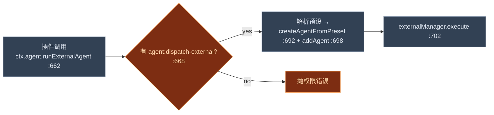

# 集成接缝

<Status variant="stable" />

<TLDR>
  `lib/ai/agent/external/` 里的运行时是自包含的；本页是它触及应用其余部分每一处的地图。一次聊天对话仅当
  `useAgentRuntimeStore.runtime === "external"` 时才路由到它——在 `use-claude-chat.ts:744` 检查，在 `:782`
  经 `executeOnExternalAgent` 派发。Agent Teams 经一个 composite streamer 驱动它（`workspace/page.tsx:137`）。
  插件经 `ctx.agent.runExternalAgent`（`context.ts:662`）抵达它，由 `agent:dispatch-external` 权限把守
  （`:668`）。执行本身仅在桌面发生：Rust `external_agent` 模块作为纯 stdio 透传拉起 CLI（`commands.rs:34`），
  而 `run_agent_hook`（`hooks/commands.rs:55`）运行 settings.json hooks。配置持久化到 **`localStorage`**
  （键 `cognia-external-agents`），而非 Dexie，并在启动时重水化进 Manager。
</TLDR>

<StatGrid>
  <Stat label="聊天咽喉点" value="use-claude-chat.ts:782" hint="executeOnExternalAgent，runtime==='external' :744" />
  <Stat label="插件 API" value="ctx.agent.runExternalAgent" hint="context.ts:662 · 闸门 :668" />
  <Stat label="权限" value="agent:dispatch-external" hint="permission-api.ts:51 · Rust 对等 cmd_lint.rs:43" />
  <Stat label="Rust 命令" value="2 个面" hint="external_agent/* spawn · hooks/run_agent_hook" />
  <Stat label="持久化" value="localStorage" hint="cognia-external-agents —— store.ts:90（非 Dexie）" />
  <Stat label="设置区段" value="agents" hint="settings-shell.tsx:330 → ExternalAgentSettings" />
</StatGrid>

## 集成地图

```mermaid
flowchart TB
  subgraph FE["前端派发"]
    CHATHK["use-claude-chat.ts:744<br/>runtime === external?"]
    TEAM["workspace/page.tsx:137<br/>composite streamer"]
    PLUG["context.ts:702<br/>ctx.agent.runExternalAgent"]
    RUNSEL["runtime-selector.tsx<br/>useAgentRuntimeStore"]
  end

  subgraph CORE["ExternalAgentManager"]
    EXEC["executeOnExternalAgent :2477<br/>execute / executeStreaming"]
  end

  subgraph PERSIST["持久化"]
    STORE["external-agent-store<br/>localStorage :90"]
    INIT["external-agent-initializer.tsx<br/>启动时重水化"]
  end

  subgraph RUST["src-tauri（仅桌面）"]
    SPAWN["external_agent::spawn_external_agent<br/>commands.rs:34"]
    HOOK["hooks::run_agent_hook<br/>commands.rs:55"]
  end

  RUNSEL -.->|"设 runtime/agentId"| CHATHK
  CHATHK -->|external| EXEC
  TEAM --> EXEC
  PLUG --> EXEC
  STORE --> INIT --> EXEC
  EXEC -->|ACP stdio| SPAWN
  EXEC -->|settings.json hooks| HOOK
  EXEC -->|变化时| STORE

  classDef fe fill:#0f172a,stroke:#38bdf8,color:#e0f2fe
  classDef core fill:#1e293b,stroke:#a78bfa,color:#ede9fe
  classDef persist fill:#334155,stroke:#94a3b8,color:#e2e8f0
  classDef rust fill:#7c2d12,stroke:#fb923c,color:#fed7aa
  class CHATHK,TEAM,PLUG,RUNSEL fe
  class EXEC core
  class STORE,INIT persist
  class SPAWN,HOOK rust
```

## 1 · 聊天路由

运行时由一个小 store `useAgentRuntimeStore` 选择，它持有 `runtime`（`"claude-sdk" | "external"`）与
`externalAgentId`。UI 选择器是 `components/agent/mode/runtime-selector.tsx`（`AgentRuntimeSelector`）——
claude-sdk（`:76`）与 external（`:83`）的单选项；一个兄弟 `<ExternalAgentSelector>` 选择*哪个* Agent 记录。

真正的派发在 `hooks/chat/use-claude-chat.ts`——**而非** `use-team-chat.ts`：

1. `const agentRuntime = useAgentRuntimeStore.getState().runtime`（`:744`）。
2. `if (agentRuntime === "external")`（`:745`）→ 读 `externalAgentId`（`:746`）。
3. 动态导入 `executeOnExternalAgent`（`:762`）与 `applyExternalAgentEventToParts`（`:763`）。
4. `await executeOnExternalAgent(effectiveText, { agentId, onEvent })`（`:782`）——事件经 `onEvent`（`:784`）
   流式写入一条预分配的 assistant 消息，每个都被 [翻译层](./translation) 折叠进 parts。

`chat-view.tsx` 只挂载 `<ExternalAgentSessionPanel />`（`:239`），它自门控于 `runtime === "external"`。
`components/agent/external-agent/` 文件夹持有管理 UI（`manager.tsx`）、ACP 专用的 `tool-approval-dialog.tsx`、
`selector.tsx`、`session-panel.tsx`，以及 `commands`/`config-options`/`plan`/状态徽章。React 胶水住在
`hooks/agent/use-external-agent.ts`——`execute`（`:995`）→ `manager.execute`（`:1039`）、`executeStreaming`
（`:1088`）→ `manager.executeStreaming`（`:1117`）。

### Agent Team 派发

Team 对话走另一条路：`app/agent-teams/workspace/page.tsx` 从 `useExternalAgent()`（`:97`）解构出
`executeStreaming` 并喂进 `createCompositeStreamer({ external: … })`（`:137`），按 `@提及` 经
`dispatchTeamMention`（`:154`）派发。这就是外部 Agent 成为 team 成员的方式——其结果由
[translators](./translation) 转成一个 `SubAgentResult`。

## 2 · 插件 API

插件经 `ctx.agent.runExternalAgent` 派发到外部 Agent——仅桌面，定义在 `lib/plugin/core/context.ts`
（`:662`）：

该权限在五处接线（标准插件权限配方）：

| 层 | 文件 | 行 |
| --- | --- | --- |
| 权限映射 | `lib/plugin/api/permission-api.ts` | 51 |
| 守卫注册表（描述 + 列表） | `lib/plugin/security/permission-guard.ts` | 143 / 185 |
| 合法权限集 | `lib/plugin/core/validation.ts` | 80 |
| 类型面（`PluginAgentAPI.runExternalAgent`） | `types/plugin/plugin.ts` | 1825 |
| Rust 对等（lint 镜像） | `crates/cognia-cli/src/cmd_lint.rs` | 43 |

插件也能经 `externalAgentPresets` manifest 字段（`types/plugin/plugin.ts:564`）/
`ctx.registerExternalAgentPreset`（`:1845`）**贡献预设**，由 `"external-agent-preset"` 叠加能力桥接
（`lib/plugin/contracts/capability-bridge-map.ts:210`）。见 [生态与预设](./ecosystem-presets)。

## 3 · 设置 UI

设置导航定义区段 id `"agents"`（`settings-nav-config.ts:158`），搜索关键词 `external`、`external agent`
（`:557`）。`settings-shell.tsx` 惰性加载 `ExternalAgentSettings`（`:123`），并为 `case "agents"`（`:330`）
渲染它；相关的 `agent-runtime` 区段（`:333`）承载运行时选择器。卡片组件是
`components/settings/agent/external-agent-settings.tsx`。

## 4 · Rust 进程桥

外部 Agent 仅在 Tauri 桌面壳执行。有**两个** Rust 面：

- **进程桥** —— `src-tauri/src/external_agent/`（`mod` 在 `lib.rs:14`），一个不解析任何东西的纯 stdio
  透传。`spawn_external_agent`（`commands.rs:34`）启动 CLI；`send_to_external_agent`（`:161`）、
  `kill_external_agent`（`:172`）、`receive_external_agent_stderr`（`:219`）驱动它；ACP 终端子协议
  （`acp_terminal_create` `:328`、`_output`、`_kill`、`_write`…）支撑 [ACP 客户端的终端处理器](./acp-client)。
  在 invoke handler 的 `lib.rs:427`–`:444` 登记。
- **Hook 运行时** —— `src-tauri/src/hooks/commands.rs`：`run_agent_hook`（`:55`，登记于 `lib.rs:308`）为一个
  外部 Agent 生命周期事件运行一个 settings.json hook（工具或会话作用域），`set_trusted_workspaces`（`:102`）
  是 project/local 信任闸门。TS 调用方是 [`agent-hooks.ts:54`](./observability-hooks)。

这种分工是有意的：因为 `external_agent` 仅 stdio 且不解析任何协议，**TypeScript 拥有全部 ACP/OpenCode 解析**
——Rust 只搬字节（`commands.rs:5` 的注释）。

## 5 · 持久化

配置持久化到 **`localStorage`，而非 Dexie**——Zustand store `stores/agent/external-agent-store/store.ts`
用 `persist`（`:84`），键 `cognia-external-agents`（`:90`），带一个 `migrate` 函数（`:93`）。启动时，
`components/providers/initializers/external-agent-initializer.tsx` 读 `store.getAllAgents()`（`:25`）并把
每个重新加入运行时 Manager（`:24`），遵循 `autoConnectOnStartup`（`:68`）。

**会话不被持久化**——它们在内存中住在 `instance.sessions`，而 ACP `session/list|fork|resume` 是回到活进程
的扩展 RPC，而非本地存储。这就是为什么重启会重新拉起 Agent，而非恢复一份记录。

## 接缝小结

| 接缝 | 边 | 文件:行 |
| --- | --- | --- |
| 聊天 | `executeOnExternalAgent` | `use-claude-chat.ts:782` |
| Agent Team | composite streamer | `workspace/page.tsx:137` |
| 插件 | `externalManager.execute`（把守） | `context.ts:702`（闸门 `:668`） |
| Hooks | `run_agent_hook` | `agent-hooks.ts:54` → `commands.rs:55` |
| 进程 | `spawn_external_agent` | `commands.rs:34`（`lib.rs:427`） |
| Trace | `invoke_agent` span | `manager.ts:1653` → `agent-trace-bridge.ts` |
| 持久化 | localStorage 重水化 | `external-agent-initializer.tsx:25` |
