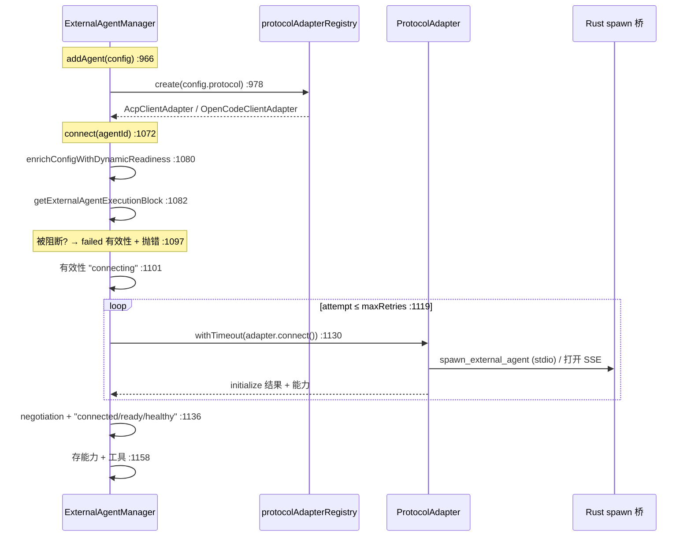
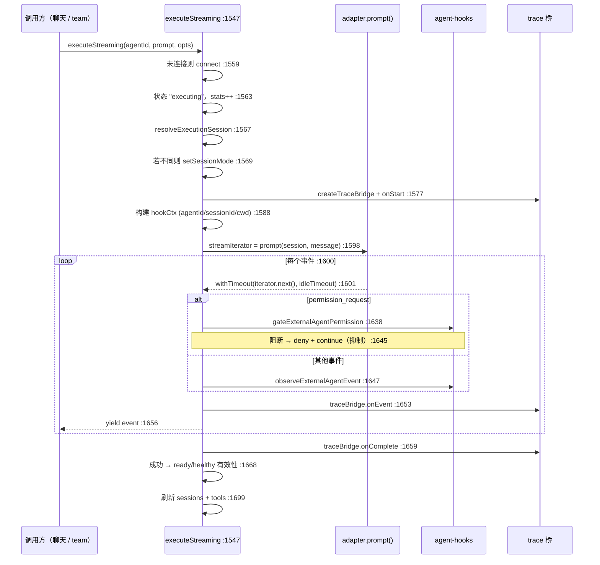

# Manager（主链）

<Status variant="stable" />

<TLDR>
  `ExternalAgentManager`（`manager.ts:199`）是一个进程级单例——`getExternalAgentManager()`（`:2460`）
  ——拥有每个外部 Agent 的完整生命周期。它持有一张 `ExternalAgentInstance` 映射（`:203`）和一张并行的
  活 `ProtocolAdapter` 映射（`:204`）。`addAgent`（`:966`）登记一份配置、向注册表要一个适配器并连接；
  `connect`（`:1072`）跑一个带超时的重试循环，并在每次状态转移时写入 `validitySnapshot`。两个执行方法
  是核心：`executeStreaming`（`:1547`）是聊天与 Agent Teams 消费的交互式异步生成器——它解析会话、构建
  trace 桥与 hook 上下文、抽取适配器的事件流、逐事件运行**阻塞式权限闸门**（`:1638`）、记录结果；
  `execute`（`:1734`）是 headless、带重试的变体。每次状态变化都汇入 `updateInstanceState`（`:830`），
  由它归一化一个 `validitySnapshot`，从而让原因码与分支结果始终一致。
</TLDR>

<StatGrid>
  <Stat label="文件体量" value="2496 行" hint="lib/ai/agent/external/manager.ts" />
  <Stat label="公开方法" value="40+" hint="从 respondToPermission :226 到 dispose :2431" />
  <Stat label="单例" value="getInstance :542" hint="模块辅助 getExternalAgentManager :2460" />
  <Stat label="执行路径" value="2" hint="executeStreaming :1547（交互） · execute :1734（headless）" />
  <Stat label="有效性咽喉" value="updateInstanceState :830" hint="→ normalizeExternalAgentValiditySnapshot :928" />
  <Stat label="状态映射" value="3" hint="instances :203 · adapters :204 · delegationRules :205" />
</StatGrid>

## 形状与单例

Manager 是一个带私有静态 `_instance`（`:200`）的类；`getInstance(config?)`（`:542`）惰性构造，
`resetInstance()`（`:552`）为测试销毁。模块级 `getExternalAgentManager(config?)`（`:2460`）是类外各处
使用的规范访问器。构造时登记默认协议适配器（`registerDefaultAdapters` `:562`），并在
`healthCheckInterval > 0` 时启动健康检查定时器（`:217`）。

状态住在三张映射与几个列表里：

| 字段 | 行 | 持有 |
| --- | --- | --- |
| `instances` | 203 | `Map<id, ExternalAgentInstance>`——配置 + 连接状态 + 会话 + 有效性 + 统计 |
| `adapters` | 204 | `Map<id, ProtocolAdapter>`——每个 Agent 的活 ACP/OpenCode 客户端 |
| `delegationRules` | 205 | 供 `checkDelegation` 用的、按优先级排序的路由规则 |
| `eventListeners` / `lifecycleListeners` | 207 / 208 | 逐 Agent 与全局订阅者 |

会话**不是**顶层映射——它们逐实例住在 `instance.sessions`（`addAgent` `:1025`）。

### 模块级入口辅助

`executeOnExternalAgent(prompt, options?)`（`:2477`）是聊天 hook 导入的东西。若给了 `options.agentId`，
它调用 `manager.execute(agentId, …)`（`:2485`）；否则跑 `checkDelegation(prompt)`（`:2489`），若有规则
命中就在被委派的 Agent 上执行；否则返回 `null`，让调用方回退到内置 Agent。

## 公开 API 面

40+ 个公开方法归为六类：

| 类别 | 方法（行） |
| --- | --- |
| **生命周期** | `addAgent`（966） · `removeAgent`（1056） · `connect`（1072） · `disconnect`（1240） · `reconnect`（1270） · `dispose`（2431） |
| **执行** | `executeStreaming`（1547） · `execute`（1734） · `cancel`（1982） |
| **会话** | `createSession`（1495） · `closeSession`（1519） · `getSession`（1535） · `listSessions`（308） · `forkSession`（375） · `resumeSession`（440） |
| **ACP 会话控制** | `respondToPermission`（226） · `setSessionMode`（238） · `setSessionModel`（250） · `getSessionModels`（258） · `setConfigOption`（278） · `getConfigOptions`（295） · `getAuthMethods`（509） · `authenticate`（527） |
| **内省** | `getAgent`（2204） · `getAllAgents`（2211） · `getConnectedAgents`（2225） · `getAgentCapabilities`（2239） · `getAgentTools`/`getAllAgentTools`（2005 / 2053） |
| **委派与健康** | `addDelegationRule`（2076） · `checkDelegation`（2095） · `performHealthCheck`（2276） · `checkAgentHealth`（2331） |

> Manager 上没有 `createAgentFromPreset`（那住在 [`presets.ts`](./ecosystem-presets)），而 "fallback"
> 不是方法——它是编进有效性快照的*结果*。ACP 能力查询返回一个 `AgentCapabilityResult<T>`（`:80`），一个
> 判别的 `ok` / `unsupported` / `error`，让 UI 不抛错也能置灰不支持的控件。

## 连接序列

`connect`（`:1072`）是围绕适配器传输打开的重试循环。适配器本身只在 `addAgent` 里被
`protocolAdapterRegistry.create(config.protocol)`（`:978`）挑**一次**——之后 Manager 再不按协议分叉。

失败时每次尝试把错误映射到一个原因码（`mapConnectionErrorToReasonCode` `:737`：protocol →
`protocol_unsupported`、transport → `transport_blocked`、timeout → `external_unavailable`，否则
`initialization_failed`），决定 `shouldRetry`（`:1183`），清理并睡眠，或抛错。彻底耗尽的循环写入一个
`external_unavailable` 快照并抛 `lastError`（`:1229`）。

## executeStreaming —— 交互式咽喉点

`executeStreaming`（`:1547`）是一个异步生成器。聊天（`use-claude-chat.ts:782`）与 Agent Teams 都驱动它，
一次一个地产出规范 `ExternalAgentEvent`。这里是 trace span、hook 闸门与有效性记账的汇聚处。

两处微妙之处让它成为*安全*咽喉点：

- **权限闸门可以抑制。** 当 `gateExternalAgentPermission`（`:1638`）返回阻断，Manager 调用 deny 回调
  （它路由到 `adapter.respondToPermission`）并 `continue`——该事件**从不被产出**，于是用户不会被询问一个
  settings.json hook 已经拒绝的工具。见 [可观测性与 Hooks](./observability-hooks)。
- **空闲超时取消本轮。** 每次 `iterator.next()` 都被 `withTimeout`（`:1601`）以
  `resolveStreamIdleTimeoutMs` 包裹；超时即取消会话，`:1704` 的 catch 把它映射成状态 `timeout` / 原因
  `external_unavailable`。

## execute —— headless 重试循环

`execute`（`:1734`）是 `executeOnExternalAgent` 与插件 API 用的非流式路径。它把 `adapter.execute`
（内部抽干 `prompt()`）包进一个重试循环（`:1787`）。Hooks 经一个包裹的 `onEvent`（`:1799`）**发射后不管**：
权限闸门仍运行（`:1804`）但无法抑制 UI——因为没有交互式流——`:1800` 的注释记录了这种不对称。同一个
trace 桥在 `:1764` 创建。可重试的失败（`isRetryableError` `:610`）在 `autoReconnect` 开启时触发重连后重试
（`:1881`）。

## 分支判定

每个终态都解析成一个 `ExternalAgentBranchOutcome`。辅助 `inferBranchOutcomeFromReason(reasonCode,
eligibility)`（`:160`）是规范映射：

| 原因码 | 结果 |
| --- | --- |
| `strict_failure` | `strict_failure` |
| `fallback_to_builtin` | `fallback` |
| `agent_not_found` / `configuration_missing` | `builtin` |
| 其余，eligibility `blocked` | `blocked` |
| 其余，eligibility `eligible` | `external` |

结果在生命周期边缘被赋值：`executeStreaming` onComplete `:1665` / onError `:1724`；`execute` onComplete
`:1902` / onError `:1972`；会话扩展闸门（`listSessions`/`forkSession`/`resumeSession`）在 `:326` / `:401`
/ `:470` 设 `blocked`。它们都经 `updateInstanceState`（`:830`）落到 `instance.validity`，由它先设
`lastBranchReasonCode` / `lastBranchReason` / `branchOutcome`（`:895`）再归一化。

## 有效性与健康

`updateInstanceState`（`:830`）是实例有效性变化的**唯一**地方。它把基础快照与更新合并（`:885`）、盖上
分支字段（`:895`）、调用 [规范契约](./canonical-readiness) 的 `normalizeExternalAgentValiditySnapshot`
（`:928`），把结果同时赋给 `instance.validity` 与 `instance.config.validitySnapshot`（`:932`），让持久化
配置始终携带最后已知状态。

健康在定时器上跑：`performHealthCheck`（`:2276`）遍历已连接 Agent、调用 `adapter.healthCheck()`
（`:2282`）、写一个 `source: "health"` 快照，并在 `autoReconnect` 开启时重连不健康的 Agent（`:2298`）。
`checkAgentHealth`（`:2331`）是手动的单 Agent 变体。

## 委派与监听

- **基于规则的路由** —— `addDelegationRule`（`:2076`）保持规则按优先级排序；`checkDelegation`（`:2095`）
  把它们（`task-type` / `capability` / `keyword` / `tool-needed` / `always` / `custom`）评估成带
  `reasonCode` 的 `ExternalAgentDelegationResult`。这就是一次内置对话被透明交给外部 Agent 的方式。
- **订阅** —— `addLifecycleListener`（`:2383`）拿到 `ExternalAgentLifecycleEvent`（状态 + 有效性 + 分支
  元数据）；`addEventListener`（`:2393`）拿到逐 Agent 的 `ExternalAgentEvent`。两者都把每个监听器包进
  try/catch（`:2413`），所以一个坏订阅者不能破坏一次对话。

## 错误与回退处理

| 机制 | 行 | 行为 |
| --- | --- | --- |
| `withTimeout` | 696 | 操作 vs 计时器竞速，运行 `onTimeout` 清理（如 `adapter.cancel`）后拒绝。 |
| `isRetryableError` | 610 | abort → 绝不重试；"unsupported protocol" / "agent not found" / "does not support" → 不可重试；timeout/network/5xx/429 → 可重试。 |
| `computeRetryDelayMs` | 597 | 指数退避，封顶 `maxRetryDelay`。 |
| 连接重试 | 1119 | 每次尝试断开清理 + 睡眠；耗尽 → `external_unavailable` 抛错。 |
| 权限抑制 | 1645 | 被阻断工具的 `permission_request` 事件被丢弃，从不展示。 |
| `dispose` | 2431 | 吞掉逐 Agent 断开错误，再清空所有映射。 |
