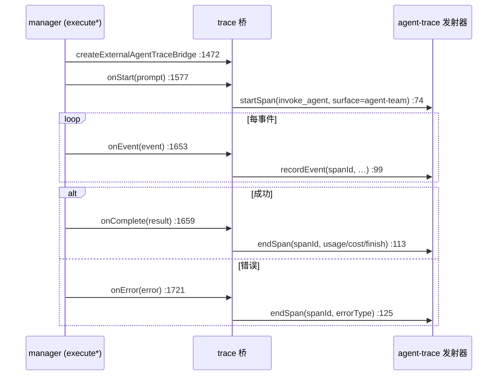
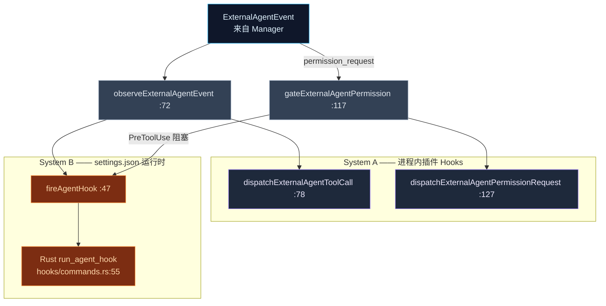

# 可观测性与 Hooks

<Status variant="stable" />

<TLDR>
  两座薄桥让外部对话在与内置 Agent 相同的轨道上可观测、可治理。`agent-trace-bridge.ts` 把一次外部运行
  变成一个 **`invoke_agent` span**，`surface = "agent-team"`（`:79`）：`createExternalAgentTraceBridge`
  （`:52`）返回 `{onStart, onEvent, onComplete, onError}`，Manager 在生命周期边缘调用它们
  （`manager.ts:1577`/`:1653`/`:1659`/`:1721`）；span 经 `@/lib/agent-trace/emitter` 落进共享的
  `agentTraces` 汇。`agent-hooks.ts` 把外部事件接入**两套** Hook 系统：进程内插件 Hooks（System A——
  `dispatchExternalAgentToolCall`、`PostToolUse`…）与 settings.json Hook 运行时（System B——`fireAgentHook`
  `:47` invoke Rust `run_agent_hook` 命令）。它最锋利的工具是 `gateExternalAgentPermission`（`:117`）：一个
  **阻塞式 `PreToolUse` hook**，能在用户被询问前就拒绝一个工具。
</TLDR>

<StatGrid>
  <Stat label="agent-trace-bridge.ts" value="254 行" hint="每次运行一个 invoke_agent span" />
  <Stat label="agent-hooks.ts" value="156 行" hint="System A（插件）+ System B（settings.json）" />
  <Stat label="Span 操作" value="invoke_agent" hint="surface=agent-team，agent-trace-bridge.ts:75" />
  <Stat label="Rust 命令" value="run_agent_hook" hint="agent-hooks.ts:54 → hooks/commands.rs:55" />
  <Stat label="阻塞闸门" value="PreToolUse" hint="gateExternalAgentPermission :117" />
  <Stat label="Tauri 把守" value="是" hint="fireAgentHook isTauri() :52 —— web/mobile 上 null" />
</StatGrid>

## agent-trace-bridge.ts —— 每次运行一个 Span

桥包裹共享发射器（`startSpan`/`recordEvent`/`endSpan`，从 `@/lib/agent-trace/emitter` 导入 `:16`），让
外部运行时产出与其他每个 Agent 相同的 span 形状。Manager 在 `createTraceBridge`（`manager.ts:1472`）
为每次运行建一个，并驱动它走完本轮。

| 方法 | 行 | Manager 何时调用 | 记录 |
| --- | --- | --- | --- |
| `onStart(prompt)` | 64 | `executeStreaming:1578` / `execute:1765` | `startSpan({operationName:"invoke_agent", surface:"agent-team", providerName, sessionId, traceId, parentSpanId, agentId, agentName, handoff, inputPreview, metadata})`（`:74`） |
| `onEvent(event)` | 94 | 每事件 `:1653` / `:1815` | `recordEvent(spanId, {name, at, attributes})`（`:99`） |
| `onComplete(result)` | 109 | `:1659` / `:1899` | `endSpan(spanId, buildCompletionInput(result))`——用量、成本、完成原因、输出预览 |
| `onError(error, context)` | 119 | `:1721` / `:1969` | `endSpan(spanId, {errorType:"external_agent_error", errorMessage, …})` |

两个值得知道的细节：

- **`providerFromProtocol`（`:137`）** 把 `anthropic`/`claude` → `"anthropic"`，把*其他一切*
  （acp/a2a/opencode）→ `"cognia.team"`。所以在 trace 仪表盘里，一次 Codex 或 Cursor 运行显示在
  `cognia.team` provider 下，而非模型厂商。
- **它吞掉每个错误。** 追踪绝不能破坏一次对话，所以四个方法都被把守，若 span 从未开始则空操作。

span 经发射器的 `agentTraces` Dexie 汇向下游持久化——与 [可观测性仪表盘](../../subsystems/observability)
读取的是同一份数据。桥本身只发射。

## agent-hooks.ts —— 两套 Hook 系统

外部 Agent 参与与内置 Agent 相同的 [hooks 机制](../built-in-agent/hooks)（ADR-0040）。`agent-hooks.ts` 是
那座适配器。每个调用都是尽力而为且被 Tauri 把守。

### 观察式 Hooks

`observeExternalAgentEvent(ctx, event)`（`:72`）对每个非权限事件被调用（`manager.ts:1647`）。它对
`event.type` 做 switch 并派发进两套系统：

| 事件 | 插件（System A） | settings.json（System B） | 行 |
| --- | --- | --- | --- |
| `session_start` | — | `fireAgentHook("SessionStart")` | 75 |
| `tool_use_start` | `dispatchExternalAgentToolCall` | — | 78 |
| `tool_result` | — | `PostToolUse` / `PostToolUseFailure`（当 `isError`） | 86 |
| `done` | — | `Stop` + `SessionEnd` | 99 |
| `error` | — | `StopFailure` | 103 |

### 阻塞式权限闸门

`gateExternalAgentPermission(ctx, event, deny)`（`:117`）是安全咽喉点。当 Agent 为一个工具请求权限时，它：

1. 发射插件 `dispatchExternalAgentPermissionRequest` 与一个 `PermissionRequest` hook（`:127`/`:133`）。
2. **等待一个阻塞式 `PreToolUse` hook**（`:138`）——本流中唯一的同步 hook。
3. 若 hook 返回 `block`，它调用 `deny(requestId, reason)`（`:145`，路由到 `adapter.respondToPermission`）、
   发射 `PermissionDenied`，并返回 **`true`**（`:153`）。
4. 否则返回 `false`。

回到 [Manager](./manager)，返回 `true` 意味着该 `permission_request` 事件**被丢弃、从不被产出**到聊天
（`manager.ts:1645`）——于是一个 settings.json 策略能静默拒绝外部 Agent 试图运行的工具，与对内置 Agent
完全一致。在 headless `execute` 路径里闸门仍运行但无法抑制 UI（没有交互式流），这是 `manager.ts:1800`
记录的有意不对称。

### Rust 接缝

`fireAgentHook(event, …)`（`:47`）被 `isTauri()`（`:52`）把守——它在 web/mobile 上返回 `null`——否则
`invoke<AgentHookDecision>("run_agent_hook", …)`（`:54`）。在 Rust 侧，`run_agent_hook`
（`hooks/commands.rs:55`）解析 PascalCase 的 `HookEvent`、解析一个受信 cwd、运行匹配的 settings.json
hooks，并返回一个 `HookDecisionDto`——在这里镜像为 `AgentHookDecision`（`:30`）。TypeScript 拥有事件
映射，因为 Rust 的 `external_agent` 模块是一个不解析任何东西的纯 stdio 透传（见 [集成接缝](./integration)）。
