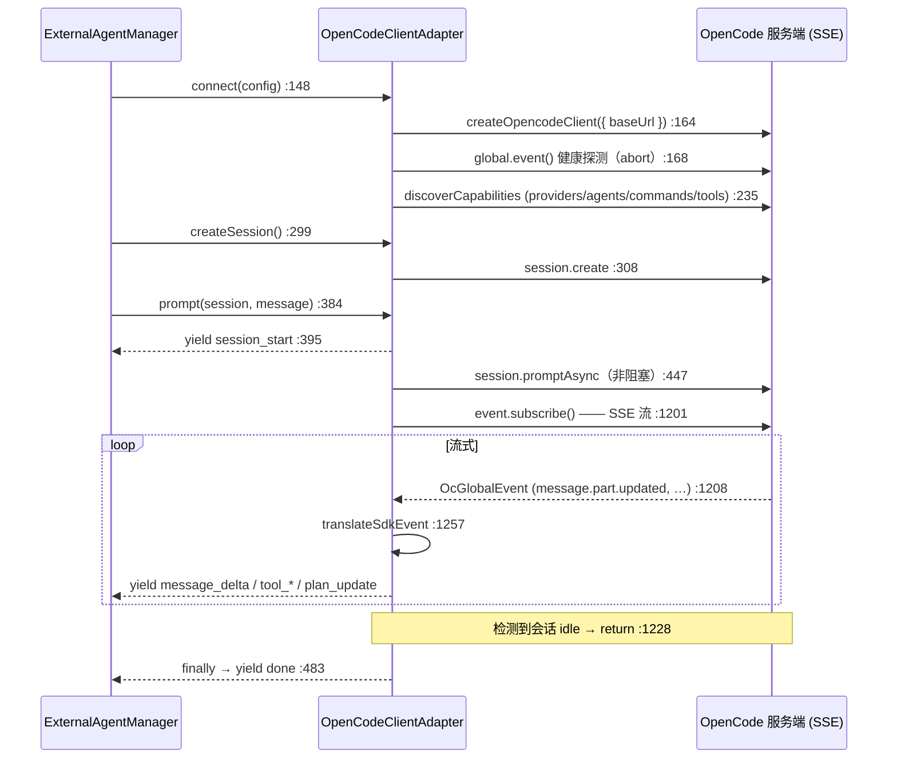

# OpenCode 适配器

<Status variant="stable" />

<TLDR>
  第二种协议。`OpenCodeClientAdapter`（`opencode-client.ts:122`）经官方 `@opencode-ai/sdk/client` 驱动
  一个 [OpenCode](https://opencode.ai) 服务端——带类型的 HTTP 调用外加一条 **Server-Sent Events** 流——
  而非 ACP 的 JSON-RPC-走-stdio。它默认连到 `http://127.0.0.1:4096`（`:154`），以 `session.promptAsync`
  非阻塞提交一个 prompt（`:447`），消费 `client.event.subscribe()` SSE（`streamSessionEvents` `:1197`），
  把每个 SDK 事件翻译成与 ACP 相同的规范 `ExternalAgentEvent` 流。两个客户端都继承 `BaseProtocolAdapter`
  （`protocol-adapter.ts:258`），并按协议 id 从 `protocolAdapterRegistry`（`:523`）查找——所以
  [Manager](./manager) 用单次 `registry.create()` 调用选择 ACP vs OpenCode，再不分叉。
</TLDR>

<StatGrid>
  <Stat label="opencode-client.ts" value="1659 行" hint="OpenCodeClientAdapter —— 唯一导出" />
  <Stat label="protocol-adapter.ts" value="523 行" hint="ProtocolAdapter + BaseProtocolAdapter + 注册表" />
  <Stat label="默认端点" value="127.0.0.1:4096" hint="opencode-client.ts:154" />
  <Stat label="传输" value="HTTP + SSE" hint="对比 ACP 的 JSON-RPC / stdio" />
  <Stat label="提交模型" value="promptAsync" hint="非阻塞，随后 SSE 流 :447" />
  <Stat label="注册表选择" value="create(protocol)" hint="protocol-adapter.ts:499" />
</StatGrid>

## ProtocolAdapter 契约

`protocol-adapter.ts` 是让两种迥异线缆协议在 Manager 眼里长得一样的抽象。三件套：

| 符号 | 行 | 角色 |
| --- | --- | --- |
| `ProtocolAdapter` | 32 | 每个客户端实现的接口——必需 `connect`/`disconnect`/`createSession`/`prompt`/`execute`/`respondToPermission`/`cancel`/`healthCheck`，外加非 ACP 适配器可省略的**可选** ACP 扩展方法（`:112`–`:193`）。 |
| `BaseProtocolAdapter` | 258 | 带共享状态（status/capabilities/tools/sessions）的抽象基类，以及一个**具体 `execute()`**（`:310`）把异步 `prompt()` 流抽干成 `ExternalAgentResult`。 |
| `ProtocolAdapterRegistry` | 474 | 按协议字符串为键的工厂注册表；`create(protocol)`（`:499`）实例化正确的适配器。全局单例是 `protocolAdapterRegistry`（`:523`）。 |

`SessionCreateOptions`（`:223`）是共享的会话建立载荷（cwd、mcpServers、permissionMode、
`instructionEnvelope` `:233`、systemPrompt、`briefMode` `:248`）。

### 为什么没有协议 `switch`

选择是**注册 + 查找**，而非分叉。Manager 在 `registerDefaultAdapters`（`manager.ts:563`）登记默认工厂，
并以 `protocolAdapterRegistry.create(config.protocol)`（`manager.ts:978`）解析一个。ACP 登记在 `"acp"`，
OpenCode 在 `"opencode"`（`opencode-client.ts:123`）。加第三种协议是一次注册，而非对 Manager 的编辑。

### 共享的 execute() 折叠

`BaseProtocolAdapter.execute()`（`:310`）是 headless 路径调用的东西。它消费协议无关的事件流并折叠成一个
结果——`:334` 的 switch：

| 事件 | 折叠动作 | 行 |
| --- | --- | --- |
| `message_delta` | 累加 text / thinking | 335 |
| `tool_use_start` | 压入待决工具调用 | 343 |
| `tool_use_end` | 设工具输入 | 352 |
| `tool_result` | 设结果 / 状态 / 错误 | 361 |
| `permission_request` | 调 `onPermissionRequest` → `respondToPermission` | 375 |
| `plan_update` / `progress` | `onProgress` | 382 / 386 |
| `done` | 成功 + token 用量 | 395 |

由于它住在基类，ACP 与 OpenCode **两者**都免费获得一致的结果组装——只有流式 `prompt()` 因协议而异。

## OpenCode：连接 → 运行 → 流式

不同于 ACP，OpenCode 是一个**服务端 SDK**：没有 stdin/stdout 成帧，会话扩展也未经探测即声明支持
（`getSessionExtensionSupport` `:609`）。适配器甚至**合成** ACP 形状的初始化元数据
（`getAcpInitializationMetadata` `:625`，硬编码 `protocolVersion: 1`），让 Manager 的协商代码统一工作。

`prompt`（`:384`）解析 system/model/agent 覆盖（`:418`）、把一个 `AbortController` 接到 `options.signal`
（`:434`）、以 `session.promptAsync` 提交（`:447`），然后流式。若异步提交抛错且本轮未被 abort，它**回退到
同步 `session.prompt`**（`:463`），并经 `emitEventsFromMessage`（`:1446`）从返回的消息发射事件。

## SDK 事件翻译

两条路径汇聚到规范事件流：经 `translateSdkEvent`（`:1257`）的活 SSE，以及经 `emitEventsFromMessage`
（`:1446`）的同步回退。SSE switch（`:1261`）：

| OpenCode SDK 事件 | → 规范事件 | 行 |
| --- | --- | --- |
| `message.part.updated` · `text` | `message_delta`（文本，用 `delta ?? part.text`） | 1284 |
| `message.part.updated` · `reasoning` | `thinking` | 1299 |
| `message.part.updated` · `tool`（pending/running） | `tool_use_start` | 1317 |
| `message.part.updated` · `tool`（completed） | `tool_result`（isError:false） | 1326 |
| `message.part.updated` · `tool`（error） | `tool_result`（isError:true） | 1336 |
| `todo.updated` | `plan_update`（计算进度/步/总数） | 1353 |
| `permission.updated` | `permission_request` | 1384 |
| `session.error` | `error`（recoverable:true） | 1407 |
| `server.connected` / `session.*` 生命周期 | 空操作（parts 另行到达） | 1262 |

流循环（`:1197`）以 `session.status.type === "idle"`（`:1224`）或一个 `session.idle` 事件（`:1234`）检测
完成，并**遇 `done` 早返回**（`:1218`）；`finally` abort SSE 控制器（`:1243`）。

## ACP vs OpenCode 一览

| 维度 | ACP（`acp-client.ts`） | OpenCode（`opencode-client.ts`） |
| --- | --- | --- |
| 线缆 | JSON-RPC 2.0，换行分隔 stdio | 带类型 SDK 走 HTTP + SSE |
| 进程 | Cognia 拉起 CLI（Rust 桥） | 连到一个运行中的服务端 |
| 角色 | **反转**——Agent 反调 fs/terminal/permission | 常规客户端 → 服务端 |
| 能力发现 | `initialize` 握手，真协商 | `discoverCapabilities` 扇出；初始化元数据合成 |
| 会话扩展 | 经探测，可能 `unsupported` | 声明支持，不探测 |
| 权限 | `session/request_permission` 请求 | `permission.updated` 事件 + `postSessionIdPermissions…` |
| 提交 | `session/prompt` 请求，经通知流式 | `session.promptAsync` + SSE 订阅 |

两者都终于同一处——一串 Manager 产出的 `ExternalAgentEvent`，由 [翻译层](./translation) 变成聊天 parts。
