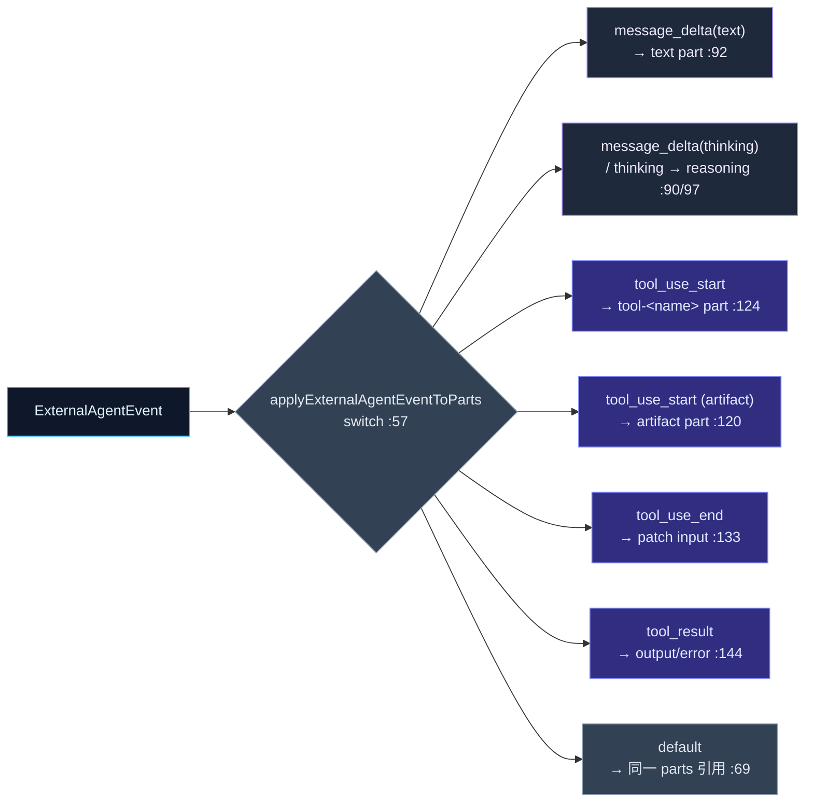

# 事件翻译

<Status variant="stable" />

<TLDR>
  两个纯模块坐在协议客户端与聊天渲染器之间。`translators.ts` 做*模型*翻译：ACP 工具定义 → 经一个完整的
  **JSON-Schema→Zod** 编译器（`acpToolToAgentTool` `:82`、`jsonSchemaToZod` `:163`）变成可执行的
  `AgentTool`、Cognia `ToolCall` ⇄ ACP tool-use、`ExternalAgentResult` ⇄ `SubAgentResult`（让外部 Agent
  能作为 Agent-Team 成员），以及一组把 `ExternalAgentEvent[]` 缩成响应文本、思考、工具调用与
  `ExternalAgentStep[]` 的流折叠（`eventsToSteps` `:721`）。`event-to-parts.ts` 做*渲染*翻译：一个无状态
  reducer（`applyExternalAgentEventToParts` `:53`），它把一个事件应用到当前 `parts[]` 并返回下一个——
  `message_delta` → `text`/`reasoning` part、`tool_use_start` → 一个 `tool-<name>` part（或一个 `artifact`
  part）、`tool_result` → 该 part 上的 output/error。随后渲染器把外部对话当作内置对话一模一样地对待。
</TLDR>

<StatGrid>
  <Stat label="translators.ts" value="981 行" hint="模型翻译 + JSON-Schema→Zod + 事件折叠" />
  <Stat label="event-to-parts.ts" value="208 行" hint="纯 event → UIMessage.parts reducer" />
  <Stat label="Schema 编译器" value="jsonSchemaToZod :163" hint="strings/numbers/arrays/objects/enum/const/oneOf/allOf/$ref" />
  <Stat label="事件→步骤折叠" value="8 个 case" hint="eventsToSteps switch :727" />
  <Stat label="发出的 part 种类" value="3" hint="text · reasoning · tool-<name>（+ artifact）" />
  <Stat label="空操作默认" value="同一引用" hint="未处理事件原样返回 parts :69" />
</StatGrid>

## translators.ts —— 模型翻译

文件按横幅分隔的关注组织织：消息翻译（`:25`）、工具翻译（`:72`）、结果翻译（`:547`）、事件翻译
（`:637`）、权限翻译（`:829`）、内容辅助（`:859`）。它既不产出规范有效性快照（那是
[规范契约](./canonical-readiness)），也不产出 UIMessage parts（那是 event-to-parts）——它转换*模型*。

### JSON-Schema → Zod 工具桥

当一个 ACP Agent 通告一个工具时，其参数以 JSON Schema 到达。为让该工具作为 `AgentTool` 可调用（带运行时
校验），`acpToolToAgentTool`（`:82`）经 `jsonSchemaToZod`（`:163`）把该 schema 编译成一个 Zod 校验器。
`acpToolsToAgentTools`（`:103`）映射多个，并以 `external_<name>` 给键加前缀。

编译器在 `convertSchemaNode`（`:196`）派发：

| Schema 构造 | 处理 | 行 |
| --- | --- | --- |
| `$ref` | `z.lazy()` 带循环保护；仅本地 `#/` ref | 206 / 506 |
| `const` / `enum` | literal / enum | 211 / 216 |
| `oneOf` / `anyOf` | `z.union` | 221 |
| `allOf` | `z.intersection` | 227 |
| `type: [..]`（可空数组） | 含 null 的联合 | 232 |
| 带类型节点（string/number/integer/boolean/null/array/object） | `convertTypedNode` switch | 278 |
| 字符串格式（email/uri/uuid/date-time/ipv4/ipv6） | Zod refinement | 318 |

这与应用内 Agent 用的是同一套模式，所以外部工具与内置工具校验方式一致。

### Result ⇄ SubAgentResult

为让外部 Agent 能成为**Agent Team 的成员**，`externalResultToSubAgentResult`（`:554`）把一个
`ExternalAgentResult` 映射进 `SubAgentResult` 形状（steps → 编号 steps、工具调用 → 工具结果、token 用量经
`externalTokenUsageToSubAgent` `:595` 映射）。`subAgentResultToExternal`（`:606`）是逆向。

### 事件折叠

为非流式消费者，若干辅助缩减一个事件数组：

| 辅助 | 行 | 产出 |
| --- | --- | --- |
| `extractResponseFromEvents` | 644 | 拼接的 `message_delta` 文本 |
| `extractThinkingFromEvents` | 659 | 拼接的思考 |
| `extractToolCallsFromEvents` | 676 | 按 `toolUseId` 折叠的工具调用 |
| `eventsToSteps` | 721 | `ExternalAgentStep[]`——主状态机 |

`eventsToSteps`（`:727` 的 switch）是规范的事件→步骤机：`message_start` 开一个消息步骤（`:728`），
`message_delta` 追加（`:741`），`message_end` 关闭它（`:755`），`tool_use_start`/`tool_use_end`/`tool_result`
构建并完成一个工具步骤（`:765`/`:782`/`:788`），`thinking` 压入一个独立步骤（`:803`），`error` 标记当前
步骤失败（`:816`）。结果就是填充 `ExternalAgentResult.steps` 的东西。

权限展示是 `formatPermissionRequest`（`:836`），它把一个 `AcpPermissionRequest` 变成 UI 友好的
`{title, description, riskLevel, …}`，带风险标签（`:843`）。

## event-to-parts.ts —— 渲染翻译

这是让聊天渲染器把外部对话当内置对话对待的纯 reducer。它刻意无状态且与 ACP 子进程解耦，从而无需子进程即可
单测（头部 `:1`）。

| 事件 | 产生的 part 变更 | 行 |
| --- | --- | --- |
| `message_delta` `{text}` | 追加/创建一个 `text` part（`state: "done"`） | 92 |
| `message_delta` `{thinking}` / `thinking` | 追加/创建一个 `reasoning` part | 90 / 97 |
| `tool_use_start`（artifact 工具） | 一个 `artifact` part——当 `artifact_create`/`artifact_update` 且 id+title 有效 | 120 / 187 |
| `tool_use_start`（其他） | 一个新 `tool-<toolName>` part（`state: "input-available"`） | 124 |
| `tool_use_end` | patch 匹配工具 part 的 `input` | 133 |
| `tool_result` | patch 成 `output-available` / `output-error`，带 `output`/`errorText` | 144 |
| 其余一切 | parts **原样**返回（同一引用） | 69 |

两个设计选择很重要：

- **当事件无 parts 副作用时返回同一引用**让调用方廉价地检测"无变化"——这很重要，因为 Manager 流式很多
  控制事件（`permission_request`/`plan_update`/`commands_update`），它们有自己的 UI 通道，不该搅动消息。
- **Artifact 提升。** 名为 `artifact_create`/`artifact_update` 的工具变成一个
  [`ArtifactPart`](../built-in-agent/runtime-loop) 而非泛型工具 part，其 `kind` 被夹到允许集
  （`ARTIFACT_KIND_ALLOWED` `:176`，回退 `"code"`）。

`buildPartsFromExternalAgentEvents`（`:77`）为测试与非流式调用方一次折叠整条流。它发出的普通 `text` /
`reasoning` / `tool-<name>` parts 是 AI-SDK 原生 UIMessage parts；[parts-extensions](../built-in-agent/runtime-loop)
模块定义共享同一 `UIMessage` 的更丰富的 Cognia parts（`A2UIPart`、`ArtifactPart`…）。
