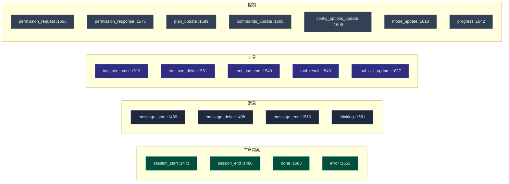

# 类型与契约

<Status variant="stable" />

<TLDR>
  `types/agent/external-agent.ts` 是整条运行时所依据的契约——2168 行，除序列化辅助与类型守卫外无任何
  运行时逻辑。它声明了**六个**类型族：**协议/传输分类法**（`ExternalAgentProtocol`，`:16`）、**规范
  诊断模型**（`ExternalAgentBranchReasonCode` `:36`、`ExternalAgentBranchOutcome` `:59`、
  `ExternalAgentValiditySnapshot` `:255`）、**ACP 线缆类型**（`Acp*`，`:325`–`:1032`）、**配置模型**
  （`ExternalAgentConfig` `:1122`）、**会话/消息模型**（`ExternalAgentSession` `:1233`），以及**流式
  事件联合**（`ExternalAgentEvent` `:1673`，21 个变体）。下游的一切——Manager、客户端、translators、UI
  ——这些形状只从这里导入，别无他处。
</TLDR>

<StatGrid>
  <Stat label="文件体量" value="2168 行" hint="types/agent/external-agent.ts —— 仅类型 + 守卫 + 序列化器" />
  <Stat label="协议 / 传输" value="6 / 4" hint="ExternalAgentProtocol :16 · ExternalAgentTransport :27" />
  <Stat label="分支原因码" value="18" hint="ExternalAgentBranchReasonCode :36" />
  <Stat label="事件变体" value="21" hint="ExternalAgentEvent union :1673" />
  <Stat label="ACP 会话更新" value="10" hint="AcpSessionUpdate :964" />
  <Stat label="类型守卫" value="9" hint="isTextContent … isPermissionEvent :2080-2168" />
</StatGrid>

## 协议/传输分类法

两条正交的轴描述 Cognia *如何*抵达一个 Agent。它们最先声明，因为其他每个类型都以它们为键。

| 类型 | 行 | 成员 | 备注 |
| --- | --- | --- | --- |
| `ExternalAgentProtocol` | 16 | `acp` · `opencode` · `a2a` · `http` · `websocket` · `custom` | 今天只有 `acp` 与 `opencode` 可执行（见 [就绪度](./canonical-readiness)）；其余保留。 |
| `ExternalAgentTransport` | 27 | `stdio` · `http` · `websocket` · `sse` | `stdio` 仅桌面（需 Tauri 拉起桥）。 |
| `ExternalAgentStatus` | 305 | `idle` · `initializing` · `ready` · `executing` · `waiting_permission` · `paused` · `completed` · `failed` · `cancelled` · `timeout` | 驱动 `EXTERNAL_AGENT_STATUS_CONFIG`（`:1931`）的 UI 标签/颜色/图标。 |
| `ExternalAgentConnectionStatus` | 295 | `disconnected` · `connecting` · `connected` · `reconnecting` · `error` | 驱动 `EXTERNAL_AGENT_CONNECTION_STATUS_CONFIG`（`:1955`）。 |

## 规范诊断模型

这是本文件的承重部分：Manager 用来解释*发生了什么、为什么*的词汇表。[规范契约](./canonical-readiness)
模块是填充这些字段的逻辑；这里是它们的形状。

| 类型 | 行 | 角色 |
| --- | --- | --- |
| `ExternalAgentBranchReasonCode` | 36 | 18 个机器可读原因码——从 `ok` 到 `agent_not_found`、`protocol_unsupported`、`transport_blocked`、`ecosystem_prerequisite_missing`、`health_check_failed`、`extension_unsupported`、`permission_denied`、`execution_failed`，直至 `strict_failure` / `fallback_to_builtin`。 |
| `ExternalAgentBranchOutcome` | 59 | 5 个终态结果：`external` · `fallback` · `strict_failure` · `builtin` · `blocked`。 |
| `ExternalAgentLifecycleCompletenessStage` | 69 | `config` · `connect` · `session_extensions` · `execution` · `fallback` · `recovery`——生命周期走到了哪一步。 |
| `ExternalAgentExecutionEligibility` | 80 | `eligible` · `blocked`。 |
| `ExternalAgentValiditySnapshot` | 255 | **聚合运行时事实**——`executable`、`lifecycleStage`、`blockedStage`、`executionEligibility`、`blockingReasonCode`、`healthStatus`、`sessionExtensions`、`negotiation`、`capabilitySnapshot`、`ecosystem`、`branchOutcome`、`recoveryHints`。同时挂在活实例与持久化配置上。 |
| `ExternalAgentLastRunSnapshot` | 145 | 持久的上次运行结果（`terminalOutcome`、`branchReasonCode`、`branchOutcome`、关联的 session/trace id）——能熬过瞬态错误横幅。 |
| `ExternalAgentEcosystemReadinessSnapshot` | 120 | 投影的就绪度事实（支持层级、执行模式、前置条件、推荐动作）。 |
| `ExternalAgentSessionExtensionSupport` | 246 | `session/list`、`session/fork`、`session/resume` 的逐方法支持映射。 |

### 支持层级与生态词汇

产品面层（见 [生态与预设](./ecosystem-presets)）也在这里定型：`ExternalAgentEcosystemSupportTier`
（`:85`，`executable | guided | documented-only`）、`ExternalAgentEcosystemExecutionMode`（`:90`，
`direct | guided | external`）、`ExternalAgentEcosystemPrerequisiteState`（`:95`），以及投影出的
`ExternalAgentEcosystemPrerequisiteStatus`（`:104`，`ready | action-required | unknown | not-applicable`）。

## ACP 线缆面

325–1032 行一比一镜像 [Agent Client Protocol](https://agentclientprotocol.com) 规范，从而让
[`acp-client.ts`](./acp-client) 能保持为一层薄传输。主要分组：

| 分组 | 行 | 关键类型 |
| --- | --- | --- |
| 权限模式与停止原因 | 325 / 336 | `AcpPermissionMode`（`default`/`acceptEdits`/`bypassPermissions`/`plan`/`dontAsk`）、`AcpStopReason` |
| 计划与斜杠命令 | 347 / 360 | `AcpPlanEntry`、`AcpAvailableCommand` |
| 会话模型 / 模式 / 配置项 | 373 / 387 / 753 | `AcpSessionModelState`、`AcpSessionModesState`、`AcpConfigOption` |
| MCP server 配置 | 401–443 | `AcpMcpServerStdio` / `Http` / `Sse` 联合（`AcpMcpServerConfig`） |
| 初始化 | 449 / 467 / 498 | `AcpClientCapabilities`、`AcpAgentCapabilities`、`AcpImplementationInfo` |
| 会话更新 | 560 / 964 | `AcpSessionUpdateType`（10）、`AcpSessionUpdate` 联合 |
| 工具调用 | 575 / 817 | `AcpToolCallStatus`、`AcpToolCallKind`、`AcpToolCallContent`（`content`/`diff`/`terminal`） |
| 文件系统与终端 | 836 / 851 | `AcpReadTextFileParams`、`AcpTerminalCreateParams`、`AcpTerminalOutputResult` |
| 权限请求/响应 | 1003 / 1024 | `AcpPermissionRequest`、`AcpPermissionResponse`、`AcpPermissionOption` |

`AcpSessionUpdate` 联合（`:964`）是下游最关键的那个——它就是 [`translators.ts`](./translation) 转换成
规范事件的原始流。

## 配置模型

`ExternalAgentConfig`（`:1122`）是被持久化并喂给 Manager 的东西。它是一个判别形状：`transport: "stdio"`
用 `process?: ExternalAgentProcessConfig`（`:1041`），网络传输用 `network?: ExternalAgentNetworkConfig`
（`:1076`）。

| 字段分组 | 行 | 备注 |
| --- | --- | --- |
| 身份 | 1122–1134 | `id`、`name`、`protocol`、`transport`、`enabled` |
| 进程拉起 | 1041 | `command`、`args`、`env`、`cwd`、`startupTimeout`、`restartOnCrash`，外加便捷标志 `bare`（`:1065`，追加 `--bare`）与 `debug`（`:1070`）。 |
| 网络 | 1076 | `endpoint`、`rpcEndpoint`、`eventsEndpoint`、认证方法/密钥、代理。 |
| 权限 | 1145–1149 | `defaultPermissionMode`、`autoApprovePatterns`、`requireApprovalFor`。 |
| 可靠性 | 1151–1159 | `timeout`、`retryConfig`（`ExternalAgentRetryConfig` `:1106`）、`maxConcurrentSessions`、`sessionIdleTimeout`。 |
| 投影 | 1166 | `validitySnapshot`——最后已知的规范快照，与配置一起持久化。 |

`CreateExternalAgentInput`（`:1177`）与 `UpdateExternalAgentInput`（`:1197`）是写入形状；默认值由
[`config-normalizer.ts`](./canonical-readiness) 应用。默认值本身是这里的常量：
`DEFAULT_EXTERNAL_AGENT_RETRY_CONFIG`（`:1907`，3 次重试 / 1s / 指数退避）与
`DEFAULT_EXTERNAL_AGENT_CONFIG`（`:1917`，5 分钟超时，3 个并发会话）。

## 会话、消息与步骤模型

| 类型 | 行 | 角色 |
| --- | --- | --- |
| `ExternalAgentSession` | 1233 | 一个活会话：`status`、`permissionMode`、发现的 `tools`、`messages`、`tokenUsage`、过期。 |
| `ExternalAgentContext` | 1271 | 传*入*会话的东西——父任务、共享上下文、工作目录、环境事实。 |
| `ExternalAgentMessage` | 1412 | 由 `ExternalAgentContent[]` 块组成的消息（`text`/`image`/`file`/`tool_use`/`tool_result`/`thinking`/`error`，联合 `:1400`）。 |
| `ExternalAgentStep` | 1702 | 一个执行步骤（`thinking`/`message`/`tool_call`/`tool_result`/`error`）——由 translators 中的 `eventsToSteps` 产出。 |
| `ExternalAgentResult` | 1727 | 终态结果：`success`、`finalResponse`、`messages`、`steps`、`toolCalls`、`duration`、`tokenUsage`。 |
| `ExternalAgentExecutionOptions` | 1762 | 每轮旋钮：`sessionId`、`systemPrompt`、`permissionMode`、`briefMode`（`:1775`）、`instructionEnvelope`（`:1785`）、`onEvent`/`onPermissionRequest`/`onProgress` 回调，以及 `traceContext`（`:1804`）。 |
| `ExternalAgentInstance` | 1823 | Manager 持有的运行时实例——`config`、`connectionStatus`、`sessions` 映射、`validity`、`lastRunSnapshot`、`stats`。 |

## 流式事件联合

`ExternalAgentEvent`（`:1673`）是每个协议都坍缩进的 21 变体判别联合。它是*协议相关*代码（客户端）与
*协议无关*代码（Manager、translators、渲染器）之间的接缝。

所有变体共享 `ExternalAgentEventBase`（`:1462`：`type`、`sessionId?`、`timestamp`）。[翻译页](./translation)
展示哪些协议更新映射到哪个变体，以及 [`event-to-parts.ts`](./translation) 如何把它们投影进聊天渲染器。

## 本文件附带的辅助

尽管是个类型文件，它把纯序列化 + 守卫辅助一并放在形状旁边：

- **序列化器** —— `serializeExternalAgentConfig`/`deserialize…`（`:1983`/`:1994`）、`…Session`
  （`:2006`/`:2022`）、`…Result`（`:2039`/`:2057`）。它们处理 `Date` ⇄ ISO 字符串的往返
  （`localStorage`/IPC）。
- **类型守卫** —— `isTextContent`（`:2080`）… `isErrorContent`（`:2130`）针对内容块；
  `isStreamingTextEvent`（`:2139`）、`isToolUseEvent`（`:2148`）、`isPermissionEvent`（`:2164`）针对事件。
- **委派** —— `ExternalAgentDelegationRule`（`:1865`）与 `ExternalAgentDelegationResult`（`:1887`）为
  Manager 在 `checkDelegation`（`manager.ts:2095`）中评估的规则路由定型。
