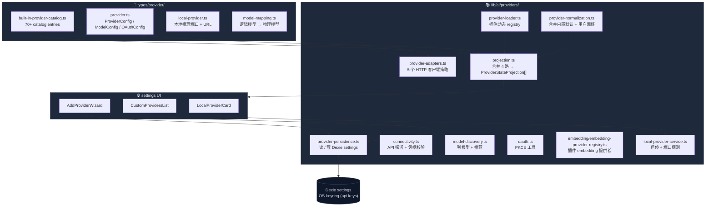
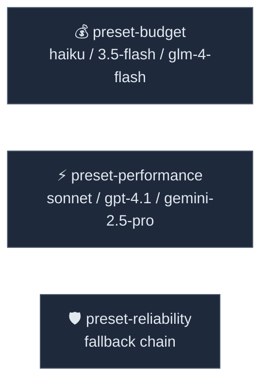

# Provider 系统

Cognia 用一份静态 catalog 维护 70+ 内置服务商（OpenAI / Anthropic / Google / DeepSeek / 本地 Ollama …），按 6 个 protocol family 映射到 5 个 adapter；插件可以动态注册自己的服务商；最后由一个 pure-function 投影层把内置 + 自定义 + 本地 + 插件四条路径合并成 UI 用的扁平数组。

Provider 系统覆盖五条职责：

1. **Catalog** —— 70+ 内置服务商的元数据（id、显示名、protocol、价格、模型列表）。
2. **Adapter** —— 把服务商映射到 5 个统一 HTTP 客户端。
3. **Registry** —— 插件运行时注册的动态服务商。
4. **Persistence** —— API key（OS keyring）+ 用户偏好（Dexie `settings`）+ 验证态。
5. **Projection** —— 把全部来源折叠成 UI / picker 用的统一投影。

OAuth 订阅路径单独有自己的子系统，见 [Claude 订阅 OAuth](./claude-subscription-oauth)；
embedding-only 服务商通过 [向量存储](../data/vector-store) 消费。

## 总览架构



## Catalog —— 70+ 内置服务商

`types/provider/built-in-provider-catalog.ts` 是静态 catalog。`BUILT_IN_PROVIDER_IDS`
按主题分组：

| 分组        | 示例 id                                                              |
| ----------- | -------------------------------------------------------------------- |
| 旗舰        | `openai` · `anthropic` · `google`                                    |
| 主流国产    | `deepseek` · `moonshot` · `zhipu` · `qwen` · `doubao` · `glm4`       |
| 聚合 / 代理 | `openrouter` · `siliconflow` · `aiproxy` · `ohmygpt` · `cliproxyapi` |
| 本地推理    | `ollama` · `lmstudio` · `llamacpp` · `vllm` · `localai` · `jan`      |
| 企业平台    | `bedrock` · `azure` · `huggingface` · `nvidia` · `replicate`         |
| 专用        | `voyage` · `jina` · `cohere` · `fal`                                 |

每个 `CATALOG_ENTRIES[id]` 是一个 `BuiltInProviderCatalogEntry`，关键字段：

<TypeTable
  type={{
    id: { type: "BuiltInProviderId", description: "稳定 id，写入 Dexie 时作为外键。" },
    name: { type: "string", description: "显示名。" },
    type: { type: '"cloud" | "local"', description: "决定是否在 LAN 上探活。" },
    protocol: {
      type: '"openai" | "anthropic" | "gemini"',
      description: "决定请求 schema / 错误码翻译。",
    },
    family: {
      type: "BuiltInProviderFamily",
      description: "6 种 family 之一，决定 adapter 选哪个。",
    },
    adapter: {
      type: "BuiltInProviderAdapterId",
      description: "5 个 adapter id 之一——HTTP 客户端实现。",
    },
    apiKeyRequired: { type: "boolean", description: "false 时跳过 keyring 写入校验。" },
    baseURLRequired: { type: "boolean", description: "默认 false——使用厂商官方域名。" },
    defaultModel: { type: "string", description: "首次选中此服务商时的默认模型 id。" },
    category: {
      type: '"flagship" | "aggregator" | "specialized" | "local" | "enterprise"',
      description: "UI 分组。",
    },
    dashboardUrl: { type: "string?", description: "Settings 的『打开控制台』按钮目标。" },
    docsUrl: { type: "string?", description: "Settings 的『查看文档』按钮目标。" },
    pricingUrl: { type: "string?", description: "价格表链接。" },
  }}
/>

Quick-add 预设（`BUILT_IN_PROVIDER_QUICK_ADD_PRESETS`）是 catalog 之外的轻量入口：
不需要完整 catalog 条目，只声明 baseURL + model 列表即可——主要用于"加一个 OpenAI 兼容
端点"这种半成品场景。

## Adapter —— 5 个 HTTP 客户端

`provider-adapters.ts` 定义了五个 adapter，每个对应一组 wire-protocol 行为：

| Adapter id                | Family                    | Protocol  | 主要消费方                              |
| ------------------------- | ------------------------- | --------- | --------------------------------------- |
| `openai-compatible`       | `openai-compatible`       | openai    | OpenAI 自家 + 几乎所有兼容端点          |
| `anthropic`               | `anthropic-native`        | anthropic | Anthropic 直连（API key 路径）          |
| `gemini`                  | `gemini-native`           | gemini    | Google Gemini 原生 API                  |
| `openrouter`              | `openrouter`              | openai    | OpenRouter 聚合（透传 `X-OR-*` 头）     |
| `local-openai-compatible` | `local-openai-compatible` | openai    | Ollama / LM Studio / vLLM / llama.cpp … |
| `cliproxyapi`             | `proxy-openai-compatible` | openai    | 本地 CLI 代理服务（特殊：仅基础 URL）   |

每个 adapter 维护两份默认 `ProviderAdapterRequirements`：

- `builtInDefaults` —— 内置 catalog 条目的默认要求（通常不要求 base URL）。
- `customDefaults` —— 用户自定义条目（通常 **要求** base URL）。

这样"OpenAI 内置"不需要填 base URL，而"自定义 OpenAI 兼容端点"必须填，这两条规则
都从同一个 adapter 派生而来。

## Dynamic registry —— 插件注册

```ts title="lib/ai/providers/provider-loader.ts"
export interface ProviderDefinition {
  id: string
  name: string
  type: "cloud" | "local" | "self-hosted"
  protocol: "openai" | "anthropic" | "google" | "mistral" | "cohere"
  apiKeyRequired: boolean
  baseURLRequired: boolean
  defaultModel: string
  defaultEnabled: boolean
  category: "core" | "specialized" | "experimental"
  description?: string
  models: ProviderModelDefinition[]
}
```

插件通过 `ai-provider` capability 在激活时调用 `registerProviderDefinition(definition, "plugin")`；
禁用时调用 `unregisterProvidersBySource("plugin")` 清理。

注册表 **纯内存**——重启后插件必须重新注册。这是有意为之：避免把插件信任级别的数据写入
catalog，并让"禁用插件"成为权威撤销动作。

embedding-only 服务商走独立的 `lib/ai/embedding/embedding-provider-registry.ts`：因为
embedding 不需要 chat tools / streaming / vision 这套字段，定义结构更紧凑。

## Persistence —— 三层存储

| 内容                                | 位置                                  | 原因                                                |
| ----------------------------------- | ------------------------------------- | --------------------------------------------------- |
| API key                             | OS keyring（`api_key` Rust 模块）     | 不落盘明文；Web 模式降级到内存                      |
| Base URL / 自定义模型 / verified 态 | Dexie `settings.providerSettings[id]` | 跨设备同步会用                                      |
| 选中的活动 provider id              | Dexie `settings.activeProviderId`     | 与 CCSwitch 共享同一字段                            |
| Custom providers 列表               | Dexie `settings.customProviders[]`    | 用户自加的端点                                      |
| OAuth 凭据 (Claude)                 | OS keyring，独立 service              | 见 [Claude 订阅 OAuth](./claude-subscription-oauth) |

`provider-persistence.ts` 负责四件事：

1. 读 `UserProviderSettings`，与 catalog 默认合并（`provider-normalization.ts`）。
2. 写入时去除空字段，避免 settings 表反复 diff。
3. 把"验证状态" `ProviderVerificationStatus` 缓存——以避免每次进 Settings 都跑 connectivity。
4. 解构旧版字段（pre-v15 schema 的兼容路径）。

## Connectivity & Discovery

- **`connectivity.ts`** —— 提供 `verifyProvider`，对 cloud 服务商发一个最便宜的请求
  （/models 或 /me），返回 `outcome: "verified" | "failed" | "limited"`。`limited` 表示
  "凭据合法但端点缺少 /models"，UI 仍把它标绿。
- **`model-discovery.ts`** —— 从服务商响应解析模型列表，与 catalog 中静态声明的模型合并、
  打上 `recommendedFor: "coding"` 等标签。
- **`local-provider-service.ts`** —— 本地推理（Ollama / vLLM / LM Studio …）的端口探活
  - 启停。Ollama 还多一个 `pull` 命令钩子。

## Routing presets



`built-in-presets.ts` 内置了 3 套路由预设——它们不是服务商而是 _策略_：preset 引用模型 id，
路由层 (`lib/ai/routing/`) 把请求映射到当前账号下可用的最便宜 / 最强 / 最稳的实际服务商。

## Projection —— UI 唯一入口

`projection.buildProviderStateProjections` 是 settings UI 唯一调用的纯函数。它的输入有 4 路：

```ts title="lib/ai/providers/projection.ts"
interface BuildProviderStateProjectionInput {
  appSettings: AppSettings
  customProviders?: CustomProviderProjectionInput[]
  dynamicProviders?: ProviderConfig[] // 来自 provider-loader registry
  verificationByProviderId?: Record<string, ProviderVerificationStatus>
}
```

输出是按 category 分组的 `ProviderStateProjection[]`，每个条目带：

- **完整 catalog 元数据**——name、icon、dashboardUrl、protocol；
- **当前用户配置**——api key 是否存在、自定义 base URL、自定义模型；
- **完成度**——`evaluateBuiltInProviderCompleteness` / `evaluateCustomProviderCompleteness`
  把"缺 api key / 缺 base URL / 无模型选中" 等编码为枚举 `ProviderNextAction`；
- **下一步建议**——"添加 API key"、"选择默认模型"、"开始使用" 等文案 key；
- **模型 discovery 快照**——`ProviderModelDiscoverySnapshot`，记录最近一次列模型的结果。

settings UI 不直接读 catalog 或 registry——这种 fan-in 把分散来源压成一份单向数据，
让 add wizard、provider list、CCSwitch picker、model selector 都看到一致视图。

## 数据流

<Steps>
  <Step>用户在 Settings → Provider 里粘贴 API key。</Step>
  <Step>
    `AddProviderWizard` 把 key 经 `lib/tauri` 写进 keyring，把其他偏好写进 Dexie `settings`。
  </Step>
  <Step>`SettingsSyncProvider` 注意到变更，触发新一轮 `buildProviderStateProjections`。</Step>
  <Step>
    projection 把新 entry 注入 UI 状态；同时把 Claude 这类有 SDK 的服务商通过 `setProviderEnv` 推到
    sidecar。
  </Step>
  <Step>
    首次发送会触发 `verifyProvider`；结果回写 `providerSettings[id].verificationStatus`， provider
    list 上的圆点变绿。
  </Step>
</Steps>

## 与其他子系统

<Cards>
  <Card
    title="Claude 订阅 OAuth"
    href="./claude-subscription-oauth"
    description="OAuth 路径——与 Anthropic API key 互斥优先。"
  />
  <Card title="CCSwitch" href="./ccswitch" description="50+ Claude 第三方端点的一键切换。" />
  <Card
    title="Chat & Skills"
    href="./chat-and-skills"
    description="发送时如何决定走哪个 provider。"
  />
  <Card
    title="向量存储"
    href="../data/vector-store"
    description="embedding provider 注册表是它的主要消费者。"
  />
</Cards>

## 扩展点

- **新的内置服务商** —— 在 `BUILT_IN_PROVIDER_IDS` 加 id、在 `CATALOG_ENTRIES` 加条目、
  选好 adapter；不需要新代码。
- **新的 adapter（罕见）** —— 通常意味着新 protocol。在 `provider-adapters.ts` 加条目、
  在 `provider-helpers.tsx` 加一个 HTTP 客户端策略，必要时在 `provider-normalization.ts`
  添加 normalization 规则。
- **插件级 chat provider** —— 实现 `ProviderDefinition` 并在 plugin activate 中调
  `registerProviderDefinition`。
- **插件级 embedding provider** —— 实现 `EmbeddingProvider` 并调
  `registerEmbeddingProvider`；向量存储会自动看见。
- **本地推理新引擎** —— 在 `types/provider/local-provider.ts` 加端口/URL 常量，并
  在 `local-provider-service.ts` 加探活逻辑。

## 已知限制

- **Verification 缓存可能过期**——如果用户在外部撤销了 API key，UI 还会显示绿色直到下次
  显式探活。最简单的修复是在每次发送失败的 401 路径上把缓存置为 `failed`。
- **Dynamic registry 不持久化**——插件每次激活都得 re-register。这是设计——避免插件
  写入级别外的数据脏掉 catalog——但它使得"禁用插件后用户还看到该 provider"成为不可能。
- **OAuth 在 catalog 中只是元数据**——真正的 OAuth 流程只针对 Anthropic（[订阅 OAuth](./claude-subscription-oauth)）
  和 OpenRouter 这种特殊情况；其他 `supportsOAuth: true` 标记目前未通线。
- **Model-mapping 是字符串映射**——`logical model id → 物理 provider model id` 没有
  类型保证，依赖 catalog 编辑时手工正确填写。
