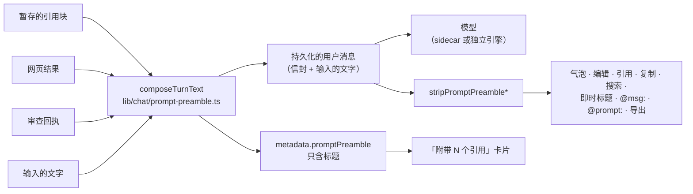
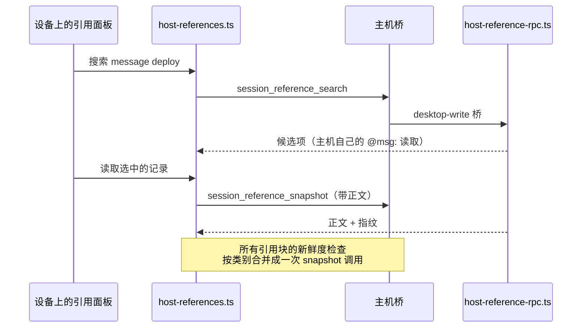

# 把内容带进对话

所有能带进对话的东西，最后都会变成一个**暂存引用**：输入框上方的一个引用块，携带记录
被冻结时的快照，随下一条消息一起发送，并在来源变化时提示你。拿到它的方式各不相同——输入
`@`、选中一段话、勾选多条消息、在手机上长按——但它们都走同一条暂存路径，所以无论从哪条
路进来，引用块和模型读到的文字都完全一样。

<TLDR>
  一份可引用记录的注册表（`lib/chat/mentions/entity-sources.ts`，[ADR-0157](../adr/0157-references-and-result-reuse)）
  加一个暂存调用（`addContextSelection`）。在转录里选中文字会弹出胶囊
  （`components/chat/message-selection-toolbar.tsx`）；多条消息通过多选模式合成一个引用块
  （`lib/chat/selection/message-set-reference.ts`）；手机从长按面板拿到同样的操作。应用给这一轮
  附加的内容装在带标记的信封里（`lib/chat/prompt-preamble.ts`），所有读取消息文本的地方都会把它
  剥掉。配对设备向主机要历史（`session_reference_search` / `session_reference_snapshot`）。
  决策见 [ADR-0181](../adr/0181-what-the-user-staged-is-what-the-model-reads)。
</TLDR>

## 入口

| 起点               | 怎么做                                                           | 暂存的内容                           |
| ------------------ | ---------------------------------------------------------------- | ------------------------------------ |
| 任何叫得出名的记录 | 输入 `@memory:`、`@issue:`、`@plan:`、`@chat:`、`@artifact:` …   | 记录正文                             |
| 任意一条消息       | 输入 `@msg:`，按说过的内容搜索                                   | 这条消息，包括工具输出               |
| 之前输入过的话     | 输入 `@prompt:`                                                  | 你的原话——或用 ⌥↵ 把它放回草稿       |
| 一个工具结果       | 输入 `^`                                                         | 结果的输出                           |
| 屏幕上的一段话     | 在转录里选中，然后点胶囊里的 **引用**                            | 这段话，关联到它所在的消息           |
| 关于一段话的回答   | 选中后点 **总结**、**解释** 或 **翻译**                          | 回答，并标明是根据这段话生成的       |
| 多条消息           | **多选消息**，勾选后点悬浮栏里的 **引用**                        | 一个引用块，按转录顺序包含所有勾选项 |
| 手机上的一条消息   | 长按，然后 **选择文本** 或 **多选消息**                          | 同上                                 |

⌘K 结果中可引用的记录，也可以通过它的 `@` 操作或 `⌘↵` 走同样的暂存。

## 在对话里选中文字

在消息列表里选中文字，会在选区旁弹出一个胶囊。它监听 `selectionchange`，所以鼠标拖选、
键盘选择和触摸选择都算数；选区一旦跑出列表（比如跑进输入框），就会被忽略。

选区至少三个字符；如果含有汉字、假名或谚文，两个字符即可（见
`lib/chat/selection/selection-text.ts` 中的 `MIN_SELECTION_CHARS` 和
`MIN_DENSE_SCRIPT_SELECTION_CHARS`）。

| 操作           | 结果                                                                                   |
| -------------- | -------------------------------------------------------------------------------------- |
| **引用**       | 把这段话暂存为带摘录的消息引用                                                         |
| **开旁支追问** | 打开工作台旁支，并把这段话以引用形式放进旁支输入框（旁支内部不提供，手机上也没有）     |
| **总结**       | 以流式把总结写进结果面板                                                               |
| **解释**       | 以流式把解释写进结果面板                                                               |
| **翻译**       | 以流式写出译文；语言菜单会记住你的选择（`selectionToolbar.translateLocale`）           |

结果面板可以停止、重试、复制，以及 **引用到对话**。引用一个回答时，它会作为来源段落的
*摘录* 暂存：引用块以原段落命名，提示词会告诉模型这段文字是应用根据用户所选内容生成的
（`lib/artifacts/format-selection-context.ts` 中的 `EXCERPT_LEADS`）。

生成时，有你自己配置的模型就用它，否则走 headless turn（`buildAgentBackedLlmClient`）。
较长的材料按每段最多 24 000 字符分段总结后再合并（`lib/ai/generation/summarize-material.ts`），
发送任何内容之前，每一段都要经过 PII 闸门。没有可用模型时，面板会显示「此处没有可用的模型」，
而不是给出一份摘要。

## 多选消息

**多选消息**——在消息菜单里，或悬停某一行时出现的复选框——会把列表切换到多选模式。

- **点击** 勾选或取消勾选一条消息；**Shift 点击** 从上一次勾选处扩展范围。
- **⌘A** 全选（在输入框里打字时不生效）。
- **Esc**、悬浮栏上的 **✕**、取消勾选最后一条，或 Android 返回键，都会退出多选。正在
  一个已有文字的输入框里打字时，Esc 不会退出。
- 仍在流式输出的回复、压缩分界线和各类提示不能勾选。

悬浮栏浮在列表底部：宽窗格里是一条胶囊，窄窗格里是一张带文字按钮的卡片。

| 操作         | 结果                                                                                             |
| ------------ | ------------------------------------------------------------------------------------------------ |
| **引用**     | 所有勾选的消息合成一个引用块，按转录顺序排列，去掉重复项，每条成员单独截断到 20 000 字符         |
| **总结**     | 结果面板里的总结；每条消息是一个独立片段，所以分段落在消息之间，除非单条消息本身超过一段         |
| **复制**     | 以文本形式复制这些消息                                                                           |
| **存为记忆** | 写入一条记忆，每段标上说话人；只要有一段来自他人，这条记忆就会被标为不可信                       |

合并引用块会列出成员，每一条都可以单独移除。只剩一条可读消息时，它就是普通的消息引用——与
`@msg:` 生成的完全一样。

这个模式只在进行中的会话里提供。只读转录（Agent SDK 会话的转录、远程会话的详情页）渲染的是
同样的消息，但不提供多选。

## 在手机上

长按一条消息会打开它的操作面板。长按不再选中手指下的那个词。

- **多选消息** 进入与桌面相同的多选模式。轻点勾选，返回手势退出。
- **选择文本** 在一个面板里打开这条消息，文字可以自由选择。下方的 **引用**、**总结**、
  **解释** 和 **翻译** 作用于选中的段落；什么都没选时，作用于整条消息。点按钮之前刚做好的
  选择会保留 800 ms，因为点击本身会让系统选区消失
  （`components/mobile/chat/message-text-selection-sheet.tsx` 中的 `BAR_PRESS_GRACE_MS`）。

手机上没有 **开旁支追问**：旁支开在桌面端工作台的停靠栏里。

## 模型收到的是什么

暂存引用会装在消息文本开头的一个信封里，随这一轮一起发送。这一轮如果带有审查回执或网页
搜索结果，也装在同一个信封里。

```text
<cognia_context_3f9a1c07b2d4>
[framing line]

Referenced context:
…

---

[web results, review receipts]
</cognia_context_3f9a1c07b2d4>

what the user typed
```

标签的后缀每一轮随机生成，所以被引用的文档里即使出现闭合标签，也提前结束不了这个块。



信封保留在已保存的文本里，因为独立（BYOK）引擎是从已保存的消息重建历史的。所有展示或复用
用户原话的地方都会把它剥掉；消息气泡根据 `metadata.promptPreamble` 显示一张折叠的
「附带 N 个引用」卡片，其中只有引用标题，从不含正文。

引用记录随这一轮一起走，所以即使会话正是由这次发送创建的，引用也会记录在消息上。同一条记录
暂存两次，会原地替换先前那个引用块。

## 来源变化时

引用块保留暂存时的正文。如果在发送前来源发生了变化，引用块会出现标记和刷新按钮；不会有任何
静默的重新读取。

- 记录引用会把来源当前的指纹与暂存时记下的指纹比较。
- 摘录会检查它的引文是否仍然出现在来源消息里：还在就是**最新**，不在了就是**已改动**，
  消息被删了就是**已消失**。重新排版的文字仍算存在，换了措辞则不算。

## 在配对的手机或浏览器上

配对设备只同步每个会话最近的一段，所以在伴侣设备上，`@msg:`、`@prompt:` 和 `^` 会去问主机，
而不是搜索本机。



| 情况                            | 搜索                                 | 正文                                 | 新鲜度检查                   |
| ------------------------------- | ------------------------------------ | ------------------------------------ | ---------------------------- |
| 桌面、headless 主机、独立浏览器 | 本机数据库                           | 本机数据库                           | 本机数据库                   |
| 配对设备，主机有应答            | 主机上的完整历史                     | 从主机读取                           | 对照主机检查                 |
| 配对设备，主机无法访问          | 设备上的副本，并提示列表不完整       | 设备上的副本，前提是副本里有这条记录 | 不检查，引用块保持原状       |

路由依据的是主机配置档（`lib/chat/mentions/host-references.ts` 中的
`historyReferencesLiveOnHost`）。主机用自己输入框运行的同一套读取来回答
（`localHistoryReference`），最多 12 个候选项、每条正文最多 40 000 字符；之后设备照常应用
自己的 20 000 字符截断。

## 代码位置

| 路径                                                      | 作用                                                                                  |
| --------------------------------------------------------- | ------------------------------------------------------------------------------------- |
| `lib/chat/mentions/entity-sources.ts`                     | 可引用类型的注册表；`@msg:`、`@prompt:` 和 `^` 经由 `historyReferenceSource` 路由     |
| `lib/chat/mentions/prompt-reference.ts`                   | `@prompt:`——用户自己输入的文字，附带 `insertText`                                     |
| `lib/chat/mentions/host-references.ts`                    | 配对设备的路由、主机客户端及其回退                                                    |
| `lib/chat/mentions/host-reference-rpc.ts`                 | 主机对 `session_reference_search` / `session_reference_snapshot` 的应答               |
| `lib/chat/prompt-preamble.ts`                             | 信封：组装、剥离、定位、摘要                                                          |
| `lib/chat/selection/message-excerpt.ts`                   | 段落与回答的引用、摘录的新鲜度                                                        |
| `lib/chat/selection/message-set-reference.ts`             | 多条消息的合并引用块                                                                  |
| `lib/chat/selection/run-selection-action.ts`              | 总结 / 解释 / 翻译，含 PII 闸门                                                       |
| `hooks/chat/use-message-selection-actions.ts`             | 桌面胶囊与手机面板共用的操作                                                          |
| `hooks/chat/use-transcript-selection.ts`                  | 多选模式的状态                                                                        |
| `components/chat/message-selection-toolbar.tsx`           | 胶囊                                                                                  |
| `components/chat/transcript-selection-bar.tsx`            | 多选悬浮栏                                                                            |
| `components/mobile/chat/message-text-selection-sheet.tsx` | 手机上的「选择文本」面板                                                              |
| `lib/chat/save-message-as-memory.ts`                      | 把一条或多条消息存为记忆                                                              |
