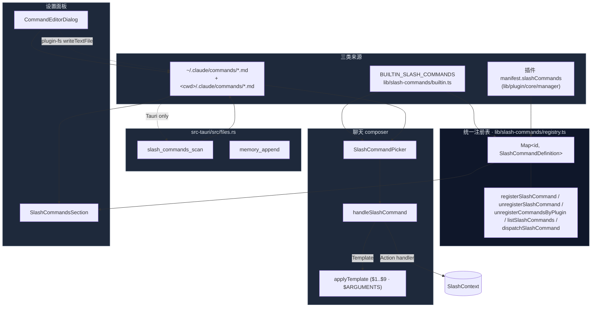
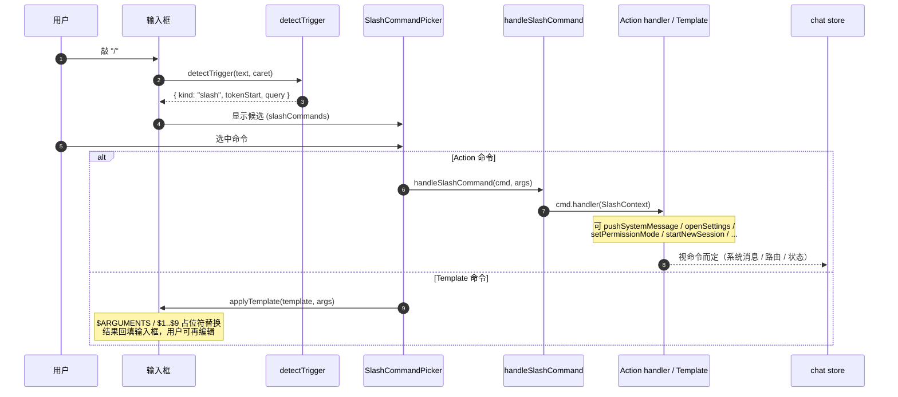

# 斜杠命令

斜杠命令（slash commands）是聊天里 `/<name> [args]` 形式的快捷指令。Cognia 把三种来源 —— 内置 Action、本地 `.md` 模板、插件贡献 —— 统一在一张注册表里，由 composer 在用户敲 `/` 时弹出 picker，并按 "Action vs Template" 两种路径分派。

单一注册表（`lib/slash-commands/registry.ts`）+ 内置命令（`builtin.ts`）+ 自定义 markdown（`custom.ts`，扫 `.claude/commands/*.md`）+ 插件贡献。Composer 弹 picker → Action 立刻执行（`SlashContext`），Template 插入文本框并支持 `$1..$9` / `$ARGUMENTS` 占位符替换。Rust 端 `slash_commands_scan` 走 frontmatter 解析与递归目录扫描。

## 适用场景

- 给 Cognia 加一条"快捷动作"（清空会话 / 切换模型 / 打开 MCP 面板……）。
- 复用一段提示模板（"code-review the changes ..."），让用户敲 `/review` 把模板抛进输入框再编辑。
- 让插件注册可发现的命令（例如 `git-tools.status`），在 settings UI 一键发现。
- 兼容外部 Claude Code 已有的 `~/.claude/commands/<name>.md` / `<cwd>/.claude/commands/<name>.md`。

## 架构图



## 关键模块与文件路径

### TypeScript

| 文件                                                            | 角色                                                                                                                                                                                                                                    |
| --------------------------------------------------------------- | --------------------------------------------------------------------------------------------------------------------------------------------------------------------------------------------------------------------------------------- |
| `lib/slash-commands/registry.ts`                                | **唯一**第三方 / 插件 / 设置面板用的统一注册表 + 派发器。`registerSlashCommand` / `unregisterSlashCommand` / `unregisterCommandsByPlugin` / `getSlashCommand` / `listSlashCommands` / `listCommandsByPlugin` / `dispatchSlashCommand`。 |
| `lib/slash-commands/builtin.ts`                                 | 内置 Action + Template 命令清单（17+ 条）。导出 `BUILTIN_SLASH_COMMANDS` 与 `SlashContext` 接口，导入即副作用调用 `seedBuiltinSlashCommands(...)` 把每条镜像到统一注册表。也导出 `applyTemplate`。                                      |
| `lib/slash-commands/custom.ts`                                  | 自定义 markdown 命令的发现 + 保存 + 删除。`loadCustomSlashCommands(cwd)` 走 `invoke("slash_commands_scan")`；`saveCustomSlashCommand` / `deleteCustomSlashCommand` 走 `@tauri-apps/plugin-fs`。                                         |
| `lib/slash-commands/actions/diagnostics.ts`                     | `/status` `/cost` `/doctor` `/context` 的 handler 实现。读 session + AppSettings + sidecar 健康度，拼成 markdown system message。                                                                                                       |
| `lib/slash-commands/actions/sessions.ts`                        | `/sessions` `/reset` `/resume` 的 handler 实现。直接走 `lib/db/sessions` 读 Dexie。                                                                                                                                                     |
| `lib/chat/slash-command-registry.ts`                            | **已 deprecated**，仅作向后兼容的薄 re-export。新代码必须从 `@/lib/slash-commands/registry` 导入。                                                                                                                                      |
| `components/chat/composer.tsx`                                  | 真正的派发入口。从 `BUILTIN_SLASH_COMMANDS + customCommands` 过滤 `hiddenFromPicker` 组成 `slashCommands`，传给 picker；`handleSlashCommand` 把 Action handler 包进 `SlashContext` 调用。                                               |
| `components/chat/message-parts/slash-command-result-chip.tsx`   | 当 system message 由 `/command` 触发时渲染的内联 chip（带命令名 + 参数 + 简介）。                                                                                                                                                       |
| `components/settings/slash-commands/slash-commands-section.tsx` | 设置面板里的统一浏览器，按 Built-in / Custom / Plugin 三段展示。Custom 行支持 Edit / Delete / + New（仅 Tauri）。                                                                                                                       |

### Rust 后端

| 命令                                  | 文件                     | 作用                                                                                                                      |
| ------------------------------------- | ------------------------ | ------------------------------------------------------------------------------------------------------------------------- |
| `slash_commands_scan(cwd?: string)`   | `src-tauri/src/files.rs` | 递归扫描 `<cwd>/.claude/commands/**/*.md` 与 `~/.claude/commands/**/*.md`，至多 8 层深度，解析 YAML frontmatter 与 body。 |
| `memory_append(scope, content, cwd?)` | `src-tauri/src/files.rs` | 给 `/memory` 命令使用：追加一行到 project 或 user 的 `CLAUDE.md`。                                                        |

## 数据流 / 控制流

### 用户敲 `/` 时发生了什么



`detectTrigger` 在 composer 里识别 `/` token；只在行首或空白后才触发，避免把 URL / 文件路径误识别为命令。`popoverDismissed` 状态防止"刚关掉就立刻又弹"的循环。

### Action vs Template 的优先级

```ts title="lib/slash-commands/builtin.ts"
// 同时声明 handler 和 template 的命令视为 Action（handler 胜）
if (cmd.handler) {
  // 走 Action 路径 — composer 清空输入框、不发 turn
  await cmd.handler(ctx)
  return true
}
if (cmd.template) {
  // 走 Template 路径 — applyTemplate 后回填输入框，等用户 Enter
  return true
}
return false
```

### Template 占位符替换

```ts title="lib/slash-commands/builtin.ts (applyTemplate)"
const positional = args.trim().split(/\s+/).filter(Boolean)
let out = template.replace(/\$ARGUMENTS/g, args.trim())
out = out.replace(/\$([1-9])/g, (_, n) => positional[Number(n) - 1] ?? "")
```

- `$ARGUMENTS` —— 整段 args 原样（前后空白已 trim）。
- `$1..$9` —— 按空白切分后的第 N 个位置参数；未填充的位置塌缩为空字符串。
- 未匹配的占位符**保留**为字面量。

### 自定义命令文件格式

```markdown title="~/.claude/commands/git/commit.md"
---
description: Make a Conventional Commit for the current changes.
argument-hint: <focus area?>
allowed-tools: [git, file_read]
model: claude-opus-4
---

Please stage and commit the current changes with a Conventional Commit
message. Focus area: $ARGUMENTS
```

Frontmatter 字段：

- `description` —— picker 与 settings 里的说明。
- `argument-hint` —— 鼠标悬停的参数提示（如 `<file>`）。
- `allowed-tools` —— 本次 turn 的工具白名单（YAML 数组）。
- `model` —— 单命令的模型覆盖。
- `paths` —— `additionalDirectories` 注入项。
- `disable-model-invocation` —— `true` 时隐藏 picker（仍可被其他 skill 程序化调用）。
- `user-invocable` —— `false` 时隐藏 picker（语义同上，单独保留为 Claude Code 兼容）。

`hiddenFromPicker = userInvocable === false || disableModelInvocation === true` 把这两个字段折叠到前端唯一布尔位上。

### 注册表与 BUILTIN 的桥接

`lib/slash-commands/builtin.ts` **导入即副作用**调用 `seedBuiltinSlashCommands(BUILTIN_SLASH_COMMANDS)`，把每条内置命令镜像到注册表，但 handler 是个 stub：

```ts title="lib/slash-commands/registry.ts:seedBuiltinSlashCommands"
const def: SlashCommandDefinition = {
  id: cmd.name,
  name: cmd.name,
  description: cmd.description,
  shortcut: cmd.argumentHint ?? null,
  source: "builtin",
  handler: () => ({
    message:
      `'/${cmd.name}' is a built-in chat command — run it from the chat composer ` +
      "to access its full context.",
  }),
}
```

原因是 builtin 的真实 handler 依赖 composer 才能拿到的 `SlashContext`（活动 session id、`pushSystemMessage`、`openSettings` 等），注册表自身只提供轻量 `SlashCommandContext`（`sessionId` + `characterId`）。设置 UI 能从一处枚举出所有命令而不需 import composer。

### 插件贡献命令

```ts title="plugin manifest example"
{
  "slashCommands": [
    {
      "id": "git-tools.status",
      "name": "git-status",
      "description": "Run git status in the workspace cwd.",
      "handler": "...js entry..."
    }
  ]
}
```

插件管理器在 enable 时 `registerSlashCommand({...def, source: "plugin", pluginId})`；在 disable 时 `unregisterCommandsByPlugin(pluginId)` 一次性清理。

### 自定义命令的保存

```ts title="lib/slash-commands/custom.ts:saveCustomSlashCommand"
const path = await resolveCommandPath(input.scope, input.name, input.cwd)
const content = buildCommandFile(input) // YAML frontmatter + body
await mkdir(dirname(path), { recursive: true })
await writeTextFile(path, content)
```

- `scope === "user"` → `<home>/.claude/commands/<name>.md`
- `scope === "project"` → `<cwd>/.claude/commands/<name>.md`

文件名校验：`/^[A-Za-z0-9][A-Za-z0-9_./-]{0,63}$/`，禁 `..`。允许嵌套（`git/commit`）。YAML 字段引号只在必要时加（破坏字符、边缘空白、保留前导符）。

## 数据库表

斜杠命令子系统**不写 Dexie**。三类数据源：

- **Built-in**：源代码常量（`BUILTIN_SLASH_COMMANDS`）。
- **Custom**：磁盘文件（`.claude/commands/*.md`），每次 composer 挂载或 settings 打开都重新扫描。
- **Plugin**：通过 `registerSlashCommand` 注入到内存中的注册表，应用重启时由 plugin manager 重新注册。

## 内置命令清单（节选）

| 命令                       | 类型     | 作用                                                                                          |
| -------------------------- | -------- | --------------------------------------------------------------------------------------------- |
| `/clear`                   | Action   | 开新会话（归档当前）。                                                                        |
| `/help`                    | Action   | 列出所有命令（pushSystemMessage）。                                                           |
| `/model`                   | Action   | 跳转 Settings → General。                                                                     |
| `/agents`                  | Action   | 跳转 Settings → Characters（详见[聊天 & 角色](./chat-and-skills)）。                          |
| `/mcp`                     | Action   | 跳转 Settings → MCP。                                                                         |
| `/permissions`             | Action   | 循环 permission mode：`default → acceptEdits → plan → bypassPermissions`。                    |
| `/permission-mode <mode?>` | Action   | 直接设置 permission mode；不带参时同 `/permissions`。                                         |
| `/add-dir <absolute path>` | Action   | 给本 session 加 `additionalDirectories` 读权限。                                              |
| `/init`                    | Template | "请分析本仓库并生成 / 更新 CLAUDE.md ..."。                                                   |
| `/review <focus area?>`    | Template | 提示 Claude code-review 当前未提交改动。                                                      |
| `/reset`                   | Action   | `/clear` 的别名（CLI 习惯）。                                                                 |
| `/sessions`                | Action   | 列出全部 session（按 updatedAt 倒序），markdown 表格。                                        |
| `/resume <id 或 title>`    | Action   | 按 id / 标题子串切换 session。                                                                |
| `/status`                  | Action   | 显示当前 session 的有效配置 + sidecar / API key / OAuth / MCP server 健康度。                 |
| `/cost`                    | Action   | 当前 session 的累计 token + 估价（USD）。                                                     |
| `/context`                 | Action   | 当前 session 的消息 + token 总览。                                                            |
| `/doctor`                  | Action   | 运行 runtime + auth + MCP 健康检查。                                                          |
| `/compact`                 | Template | `/compact` 字面量 —— Claude Agent SDK 拦截并 emit `compact_boundary` 事件，发送管线原样传递。 |
| `/export`                  | Action   | 打开 Settings → Data；提示用 chat header 的下载按钮做单 session 导出。                        |

## 配置项与扩展点

### 扩展点：注册自己的命令

```ts title="my-plugin/entry.ts"
import { registerSlashCommand } from "@/lib/slash-commands/registry"

registerSlashCommand({
  id: "my-plugin.greet",
  name: "greet",
  description: "Say hi.",
  source: "plugin",
  pluginId: "my-plugin",
  handler: async (args, ctx) => ({
    message: `Hi, ${args || "stranger"}!`,
  }),
})
```

注册重复 id 会**替换**旧定义并返回 `{ replaced: true }`；不会抛错。

### 扩展点：贡献内置 Action

在 `lib/slash-commands/actions/<category>.ts` 新建 handler，签名 `(ctx: SlashContext) => void | Promise<void>`；然后在 `BUILTIN_SLASH_COMMANDS` 添加条目并指定 `handler`。模块底部 `seedBuiltinSlashCommands(BUILTIN_SLASH_COMMANDS)` 的副作用会自动把它镜像到统一注册表。

### 扩展点：自定义模板字段

frontmatter 支持的字段在 Rust 端 `SlashCommandFile` 与 TS 端 `SlashCommand` 之间手动对齐。新增字段需要同时改：

1. `src-tauri/src/files.rs:SlashCommandFile`（serde）
2. `src-tauri/src/files.rs:collect_command_files`（解析）
3. `lib/slash-commands/custom.ts:RawCommand` + `toSlashCommand`
4. `lib/slash-commands/builtin.ts:SlashCommand`（消费侧）
5. `components/settings/slash-commands/command-editor-dialog.tsx`（编辑 UI）

## 关联子系统

- [聊天、角色、技能 & 团队](./chat-and-skills) —— composer 的派发宿主；`SlashContext.openSettings` 直通设置面板。
- [技能系统](./skills-system) —— `allowedTools` / `paths` 等字段在 send-time 与技能合并取并。
- [Agent 团队](./agent-teams) —— `/agents` 命令直接跳转角色/团队管理。
- [插件系统](../subsystems/plugin-system) —— `unregisterCommandsByPlugin` 是 plugin disable 的标准清理路径。
- [Sidecar & Claude SDK](../core/sidecar-and-claude-sdk) —— `/compact` 由 SDK 拦截、`permissionMode` 经 SDK 应用。

## 关联 ADR

- 暂无专属 ADR。设计与外部 Claude Code 的 `~/.claude/commands/<name>.md` 完整兼容，演进遵循上游 spec。

## 已知限制

- **统一注册表里的 builtin 是 descriptor-only**：直接 `dispatchSlashCommand("clear")` 只会返回提示字符串，真正执行 builtin Action 必须从 composer 经 `SlashContext`。原因见上文。
- **Custom 命令在 Web 模式不可用**：`slash_commands_scan` 是 Tauri 命令；浏览器调用会 reject，`loadCustomSlashCommands` 静默返回空数组并 `console.debug` 一行。
- **没有 namespacing 强制**：插件应自觉用 `<pluginId>.<name>` 形式的 id 避免冲突；目前 `registerSlashCommand` 不强制校验。
- **`detectTrigger` 只识别行首 `/`**：行内中段 `/<word>` 不会触发 picker（这是有意的，避免误触发）。
- **`applyTemplate` 不支持转义**：模板里写 `$ARGUMENTS` 字面量需要绕开（例如改成 `$ARG`）。
- **`/compact` 是 SDK 拦截**：cognia-next 端不能改它的行为；想覆盖请改用同义 Action 命令。
- **`memory_append` 仅追加，不去重**：连按 `/memory` 会重复入 CLAUDE.md；需要去重请用户自己整理文件。
- **plugin-fs 不同版本兼容**：`mkdir` 在旧版会因目录已存在抛错；`saveCustomSlashCommand` 用 `/exists|EEXIST/` 容忍。
