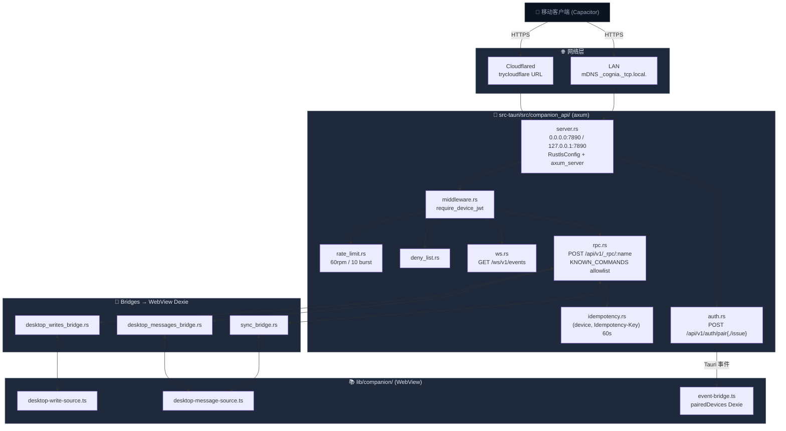

# Companion API

<Status variant="beta">beta · M2 完成</Status>

<TLDR>
  Tauri 桌面端启动一个 axum HTTPS 服务（默认端口 7890），把精选过的 Tauri 命令子集
  通过 `POST /api/v1/_rpc/<name>` 暴露给配对过的移动客户端。配对走"扫 QR → 粘贴 pair JWT
  → 服务端发 device JWT"的链路；事件经 `GET /ws/v1/events` 实时推送；同 LAN 通过 mDNS
  发现，远程通过 Cloudflared 隧道。
</TLDR>

<StatGrid>
  <Stat label="HTTP 路由" value="3" hint="/auth/pair · /auth/pair/issue · /_rpc/:name" />
  <Stat label="WS 端点" value="1" hint="/ws/v1/events" />
  <Stat label="允许的 RPC 命令" value="~40" hint="手写 allowlist" />
  <Stat label="默认端口" value="7890" hint="可在 Settings 调整" />
</StatGrid>

Companion API 是 cognia-next 的 "Server" 化分支——桌面变服务器，移动设备变客户端。
设计依据三条 ADR：

- [ADR-0012](../adr/0012-transport-abstraction) —— `lib/tauri.ts` 的 `Transport`
  抽象，让前端代码同样一份在桌面（IPC）和移动（HTTP/WS）下都跑得通。
- [ADR-0013](../adr/0013-command-manifest) —— 为什么 `/api/v1/_rpc` 是手写 allowlist 而
  不是宏生成。
- [ADR-0014](../adr/0014-capacitor-mobile-shell) —— 为什么手机用 Capacitor 壳而不是 RN
  / Flutter / 原生。

## 代码位置

```
src-tauri/src/companion_api/
  mod.rs                    # SharedState / CompanionServerState 容器
  commands.rs               # 20+ Tauri 命令（生命周期、TLS、推送 …）
  server.rs                 # axum router + Rustls TLS
  auth.rs                   # /api/v1/auth/pair{,/issue}
  rpc.rs                    # /api/v1/_rpc/:name（手写 dispatch + KNOWN_COMMANDS）
  ws.rs                     # GET /ws/v1/events
  middleware.rs             # require_device_jwt
  jwt.rs                    # HS256 pair (5min) / device (90d)
  secret.rs                 # HS256 签名密钥（OS keyring）
  redemption_lru.rs         # pair JWT 单次使用
  idempotency.rs            # 写命令的 (device, key) 60s 缓存
  rate_limit.rs             # 60rpm / 10 burst 令牌桶
  deny_list.rs              # 撤销 device id
  push.rs / push_creds.rs   # APNs + FCM 推送
  event_bus.rs              # Tauri 事件 → WS 广播 + 回放
  sync_bridge.rs            # WebView Dexie 拉取桥
  desktop_messages_bridge.rs
  desktop_writes_bridge.rs
  sync_registry.rs          # 表名白名单
  mdns.rs                   # _cognia._tcp.local. 广播
  tunnel.rs                 # cloudflared 子进程
  tls.rs                    # 自签证书 + SPKI 指纹
  spec_parity.rs            # OpenAPI 一致性测试

lib/companion/
  desktop-message-source.ts # Dexie 端 message_update / delete / list 响应
  desktop-write-source.ts   # Wave 2 写命令响应
  event-bridge.ts           # device-paired / device-seen → Dexie pairedDevices
```

## 总览架构



## 配对流程

桌面是 server，手机是 client。配对是双向身份建立的唯一时刻：

<Steps>
<Step>
**桌面打开 Settings → 移动伴侣**，点 "生成 QR"。前端调用 `companion_issue_pair_jwt`。
Rust 用 HS256 签名密钥（service `com.cognia.companion-secret`、account `default`）生成一个
**5 分钟、单次使用** 的 `scope: "pair"` JWT，`jti` 是 UUIDv4。
</Step>
<Step>
**生成 QR**——前端把 `{ baseUrl, pair_jwt, server_version }` 编码进 QR 图。`baseUrl` 是
桌面的实际可达 URL：
- LAN 模式：`https://<lan ip>:7890`
- Tunnel 模式：`https://<trycloudflare>.com`
- Loopback：`https://127.0.0.1:7890`（仅同机调试）
</Step>
<Step>
**手机扫码**——`POST /api/v1/auth/pair` body 包含：
```json
{ "pair_jwt": "...", "device_label": "iPhone 16",
  "device_platform": "ios", "device_pubkey": "...", "app_version": "..." }
```
</Step>
<Step>
**服务端校验**——`auth.rs::pair_handler` 走 `verify(pair_jwt, "pair")`，然后用
`RedemptionLru::redeem(jti)` 强制单次使用（第二次同 jti 返回 410 Gone）。
</Step>
<Step>
**发 device JWT**——校验通过后生成 `scope: "device"` 的 90 天 JWT，`device_id` 是
UUIDv4。响应：
```json
{ "device_id": "...", "device_jwt": "...", "server_version": "..." }
```
</Step>
<Step>
**桌面持久化**——`auth.rs` 在响应发出后 emit Tauri 事件 `companion://device-paired`。
WebView 的 `event-bridge.ts` 接收事件，调 `addPairedDevice` 把行写入 Dexie `pairedDevices`。
Settings UI 的 "Paired devices" 表立即更新。
</Step>
</Steps>

### JWT scope

```rust title="src-tauri/src/companion_api/jwt.rs"
const PAIR_TTL_SECS: i64 = 5 * 60;             // 5 分钟
const DEVICE_TTL_SECS: i64 = 90 * 24 * 3600;   // 90 天
```

`pair` token 不绑 device_id（配对前手机还没 id）；`device` token 不带 jti（不需要单次
使用语义）。所有后续请求带 `Authorization: Bearer <device_jwt>`，WebSocket 用 `?token=`
查询串（浏览器对 WS 自定义 header 支持不可靠）。

## RPC 命令清单

`KNOWN_COMMANDS` 是 [ADR-0013](../adr/0013-command-manifest) 决定的手写 allowlist。
**手写而不是宏生成** 的核心理由：

1. **The allowlist IS the API** —— 每个能被手机调用的命令都在这里能搜到，没有意外暴露。
2. **安全审计可控** —— 评审人看 40 行而不是 200 行。
3. **per-command shape control** —— `tauri::State` / `AppHandle` 这种 ergonomic 入参在
   IPC 路径里"自动"传入，但在 HTTP 路径下必须手动绑定；shim 层负责这个转换。

允许的命令大体分四组：

| 分组        | 代表命令                                                                                                 |
| ----------- | -------------------------------------------------------------------------------------------------------- |
| Claude SDK  | `claude_send` · `claude_interrupt` · `claude_approve` · `claude_close_session` · `claude_sidecar_status` |
| 凭据        | `claude_sub_save_token` · `claude_set_api_key` · `claude_set_oauth_bearer` · `claude_set_provider_env`   |
| 技能 / MCP  | `skills_load_registry` · `skills_scan_native` · `mcp_server_status` · `test_mcp_server`                  |
| Mobile 专用 | `sync_pull` · `message_update` · `message_delete` · `session_list` · `register_push_token`               |
| Wave 2 写   | `character_upsert` · `skill_set_enabled` · `plugin_set_enabled` · `app_settings_update`                  |

### 幂等性

```text
POST /api/v1/_rpc/character_upsert
Authorization: Bearer <device-jwt>
Idempotency-Key: <client-uuid>
{ ...args... }
```

带 `Idempotency-Key` 的写命令命中后被缓存 60s（按 `(device_id, Idempotency-Key)` 键）。
第二次同样请求直接返回缓存的响应体，**不重复执行**。`READ_ONLY_COMMANDS`（如
`claude_sidecar_status`、`sync_pull`）跳过缓存——它们结构性幂等，重跑代价低。

### 速率限制

`rate_limit.rs` 是 in-house 令牌桶：60 rpm / 10 burst，按 `DeviceContext::device_id`
分桶。在 JWT 中间件 _之后_ 运行——意味着 pair endpoint 和未鉴权请求不限流。拒绝时返回
`429` 带 `Retry-After`。

## WebSocket 事件

`GET /ws/v1/events?token=<jwt>&since=<seq>`：

<Steps>
<Step>
中间件用 query 中的 token 验 JWT，注入 `DeviceContext`。
</Step>
<Step>
握手成功后服务端检查 `since`——如果客户端要的序号比 event_bus 的环形缓冲还老，发一帧
`{ "type": "resync_required" }` 并关闭连接，迫使手机重拉全量。
</Step>
<Step>
否则回放 `seq > since` 的所有缓冲帧（按顺序）。
</Step>
<Step>
之后实时转发新帧；25s 服务端 ping，90s 客户端无消息触发空闲断开。
</Step>
</Steps>

`event_bus.rs` 同时承担两件事：(a) 桥接 Tauri 事件 → WS 广播，(b) 维护环形缓冲让重连客户端
能"回看"几分钟内的事件。

## WebView 桥

axum handler 跑在 Rust，但要写 / 读的数据在 WebView 的 Dexie。三套 bridge 解决这个：

| Bridge                       | 方向             | 用途                                         |
| ---------------------------- | ---------------- | -------------------------------------------- |
| `sync_bridge.rs`             | Rust → TS → Rust | `sync_pull` 拉 Dexie 表的增量                |
| `desktop_messages_bridge.rs` | Rust → TS → Rust | `message_update` / `delete` / `session_list` |
| `desktop_writes_bridge.rs`   | Rust → TS → Rust | Wave 2 的 7 个 character/skill/plugin 写命令 |

协议都一样的形状：Rust emit `companion://<kind>-request` 带 `request_id`；WebView 处理后
通过 `companion_*_response` Tauri 命令回写 `request_id + result`；Rust 端的 `oneshot::Receiver`
resolve 后 HTTP handler 把 result 写进响应。**30 秒超时**——足够让睡眠中的桌面醒来跑完
Dexie 扫描。

## 发现 + 远程

### mDNS（同 LAN）

`mdns.rs` 广播 `_cognia._tcp.local.`，TXT 包括 server*version + TLS SHA-256 指纹。同网手机
可以扫到，跳过手动输入 baseUrl。默认 \_off*——用户必须在 Settings 打开。

### Cloudflared 隧道（远程）

`tunnel.rs` 起一个 `cloudflared tunnel --url https://127.0.0.1:7890 --no-tls-verify` 子进程
（`--no-tls-verify` 因为自签证书）。解析 stderr 拿到 `https://<random>.trycloudflare.com`，
QR 用这个 URL 而不是 LAN IP。**不打包 cloudflared 二进制**——用户需要自己装。

### TLS

`tls.rs` 在首启时生成自签证书 + SPKI 指纹，放在 app data 目录。指纹随 QR 一起带到手机，
mobile 客户端做证书 pinning——所以"自签"对手机不是问题，但桌面浏览器访问会提示不安全。

## 鉴权失败错误码

```json
{ "code": "missing_token",      "message": "..." }      // 401
{ "code": "invalid_token",      "message": "..." }      // 401
{ "code": "device_revoked",     "message": "..." }      // 401
{ "code": "unknown_command",    "message": "..." }      // 404
{ "code": "malformed_request",  "message": "..." }      // 400
{ "code": "validation_failed",  "message": "..." }      // 400
{ "code": "rate_limited",       "message": "..." }      // 429
{ "code": "internal_error",     "message": "..." }      // 500
```

所有响应统一 envelope：成功直接返回 JSON 主体；失败按上表用 `RpcError` 包裹。

## 推送 (APNs + FCM)

`push.rs` 是轻量自研 dispatcher，没引 `fcm-rust` / `a2-rs`：

- `PushTokenRegistry` —— 按 `device_id` 维护 APNs / FCM token，持久化到
  `<app_data>/cognia/companion/push-tokens.json`。
- 当 server 想推消息时——先看该 device 有没有活动 WS 会话；有则跳过推送（WS 事件已覆盖）；
  没有才走 dispatcher。
- 凭据：FCM service-account JSON + APNs `.p8` key，由 `push_creds.rs` 写到 OS keyring。

## Settings UI

`components/settings/companion/companion-section.tsx` 渲染三个 card：

<Cards>
  <Card
    title="Server status"
    description="主开关 + 绑定模式（loopback / LAN）+ 实时 'running on …' 状态行。"
  />
  <Card title="Pair a new device" description="生成一次性 pair JWT → QR + 5 分钟倒计时。" />
  <Card
    title="Paired devices"
    description="`useLiveQuery(listPairedDevices)`；每行 revoke 按钮同时写 Dexie + Rust deny-list。"
  />
</Cards>

## 与其他子系统

<Cards>
  <Card
    title="移动架构"
    href="./mobile-architecture"
    description="server-client 视图：Capacitor 壳 + LAN/tunnel + JWT 配对。"
  />
  <Card
    title="远程控制"
    href="./remote-control"
    description="同一套 device JWT 也驱动 desktop ↔ desktop 的远端控制信道。"
  />
</Cards>

## 关联 ADR

- [ADR-0012 — Transport Abstraction](../adr/0012-transport-abstraction) —— 为什么前端
  必须先有 `Transport` 抽象才能让 Capacitor 跑同一份代码。
- [ADR-0013 — Companion API Command Manifest](../adr/0013-command-manifest) —— allowlist
  vs 宏生成 vs codegen 的取舍详细记录。
- [ADR-0014 — Capacitor Mobile Shell](../adr/0014-capacitor-mobile-shell) —— 移动壳的
  选型对比（Capacitor vs RN vs Flutter vs PWA）。
- [ADR-0015 — Mobile V2 Completion](../adr/0015-mobile-v2-completion) —— V2 mobile
  实现的完成度对账。

## 已知限制

- **单一签名密钥**——HS256 secret 是 process 范围共享的，多账户 / 多 vault 需要 service-name
  版本升级 (`com.cognia.companion-secret/v2`)。
- **Cloudflared 不打包**——用户必须手动 `brew install cloudflared` / `winget install cloudflare.cloudflared`
  / apt。我们只 orchestrate 子进程。
- **自签证书 + SPKI pinning**——桌面浏览器访问 QR 中的 baseUrl 会拒绝；这只在手机
  pinning 路径有效。让用户直接访问 baseUrl 是反模式。
- **mDNS 在公司网络通常被防火墙阻断**——多数企业 LAN 屏蔽多播；远程访问必须走 Cloudflared。
- **回放窗口有限**——event_bus 缓冲是固定环形大小；手机超过窗口长时间离线一定收到
  `resync_required`，要重拉 Dexie 全量。
- **没有 OpenAPI codegen**——`spec_parity.rs` 测试只断言 `KNOWN_COMMANDS` 与 OpenAPI spec
  路径一一对应，但没有从一方生成另一方。任何对 dispatch 的修改都要同步改 spec。
