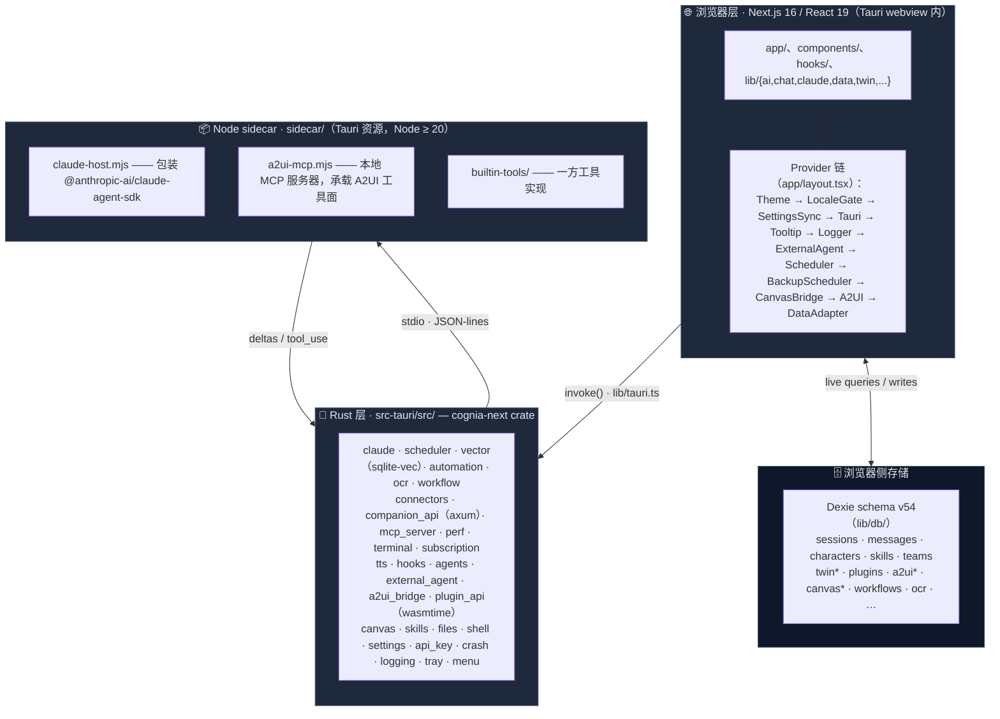

# 架构

Cognia 由四个相互协作的层组成。判断一项改动属于哪一层，是参与代码库时最重要的架构决策。



## 第 1 层 —— 浏览器 / React

`app/`、`components/`、`hooks/` 以及 `lib/` 的大部分都在 webview 内运行，包括：

- **路由**（`app/`）—— 聊天工作台、孪生工作台、调度器、agent-teams、A2UI、画板、技能、日志。
- **状态** —— Zustand store 用于短暂 UI 状态；Dexie（IndexedDB）持久化数据；`lib/settings/` 存放用户偏好。
- **AI 编排** —— `lib/ai/`、`lib/claude/build-options.ts`、`lib/twin/runtime/apply-twin-context.ts`。
- **领域逻辑** —— `lib/character/`（经 `lib/claude/types.ts`）、`lib/skills/`、`lib/data/`（备份）……

浏览器层**不直接访问** OS 资源 —— 所有原生操作必须经由第 2 层。

### `app/layout.tsx` 的 Provider 顺序

`app/layout.tsx` 中 Provider 的顺序是有讲究的：

1. `ThemeProvider`（next-themes）—— 类策略暗色模式驱动。
2. `LocaleGate` —— 等待 `next-intl` 翻译加载完毕。
3. `SettingsSyncProvider` —— 读写 Dexie `settings` 表。
4. `TauriProvider` —— 提供 `isTauri()` 上下文、OS 信息、深链事件。
5. `TooltipProvider` —— Radix；全局只挂一次。
6. `LoggerProvider` —— 浏览器 logger 接入 Rust 日志桥。
7. `ExternalAgentInitializer`、`SchedulerInitializer` —— 首屏即启动子系统。
8. `BackupSchedulerProvider` —— 定时加密自动备份（仅桌面）。
9. `CanvasBridgeProvider`、`A2UIDispatchProvider` —— 把 Claude 响应路由到对应表面。
10. `DataAdapterProvider` —— 把 Dexie 适配器注入 data-hooks。

新 Provider 依赖 locale → 放进 `LocaleGate`；依赖 Tauri → 放进 `TauriProvider`。这条链是有意分层的，不要折叠。

## 第 2 层 —— IPC 桥（`lib/tauri.ts`）

`lib/tauri.ts` 是**唯一**调用 Tauri `invoke()` 的位置。每个 Rust 命令都有一个类型化封装。业务代码从 `@/lib/tauri` 导入命名函数，**永远不要**直接 `invoke()`。

```ts
import { greet, isTauri } from "@/lib/tauri"
if (isTauri()) {
  greet("World").then(console.log)
}
```

`isTauri()` 让同一组件在 Web 与桌面下都能工作 —— 仅在 `window.__TAURI_INTERNALS__` 存在时返回 `true`。

封装在 `lib/tauri/index.ts` 集中导出，按插件分组（clipboard、dialog、fs、notification、opener、os、process、store…）。新增封装的方式见 [运行时 & Tauri](./runtime-and-tauri)。

## 第 3 层 —— Rust 后端（`src-tauri/src/`）

`cognia-next` crate 由约三十个子模块组成。主要的几块：

| 模块                                                                                                                                                       | 用途                                                                                       |
| ---------------------------------------------------------------------------------------------------------------------------------------------------------- | ------------------------------------------------------------------------------------------ |
| `claude`                                                                                                                                                   | 派生并监督 Node sidecar；API key 变更时重启。                                              |
| `scheduler`                                                                                                                                                | 跨平台原生调度器 —— Task Scheduler（Win）、launchd（macOS）、systemd（Linux）+ sqlite 元数据。 |
| `vector`                                                                                                                                                   | sqlite-vec 后端；在任何连接打开前加载 FFI 扩展。                                           |
| `automation`                                                                                                                                               | Computer Use（Win UIA、macOS AX、Linux AT-SPI）+ 三级权限模型。                            |
| `ocr`                                                                                                                                                      | OCR 派发表（Tesseract / Windows.Media.Ocr / Apple Vision / ocrs / Paddle）。               |
| `workflow`                                                                                                                                                 | 可视化工作流运行时（cron 守护进程 + 执行分片）。                                           |
| `connectors`                                                                                                                                               | 平台连接器适配器（Lark 长连接、WeCom WS …）。                                              |
| `companion_api`                                                                                                                                            | 面向移动端 + 远程客户端的 axum HTTP/WS 服务器（`/api/v1/*`）。                             |
| `mcp_server`                                                                                                                                               | 面向外部客户端的 MCP HTTP 服务器（External Bridge）。                                      |
| `plugin_api`                                                                                                                                               | WASM 插件运行时（wasmtime 26 + WIT 绑定）。                                                |
| `signaling`、`webrtc`                                                                                                                                      | 移动外壳的广域网传输 peer。                                                                |
| `terminal`                                                                                                                                                 | PTY 内置终端（portable-pty / ConPTY）。                                                    |
| `subscription`                                                                                                                                             | Claude Code OAuth + 统一订阅模块。                                                         |
| `perf`                                                                                                                                                     | 推送给 Rust 性能仪表盘的样本流（ADR-0035）。                                               |
| `tts`、`hooks`、`agents`、`external_agent`、`a2ui_bridge`、`canvas`、`skills`、`files`、`shell`、`settings`、`api_key`、`crash`、`logging`、`tray`、`menu` | 较小的叶子模块。                                                                           |

外加在 `lib.rs` 注册的 Tauri 插件：`single-instance`、`deep-link`、`autostart`、`global-shortcut`、`cli`、`store`、`updater`、`dialog`、`fs`、`notification`、`clipboard-manager`、`opener`、`os`、`process`、`shell`、`positioner`、`upload`、`persisted-scope`、`log`、`window-state`。

桌面专属模块由 `cfg(desktop)` 与 `cfg(not(any(target_os = "android", target_os = "ios")))` 守护。

## 第 4 层 —— Node sidecar（`sidecar/`）

Sidecar 是 Tauri 启动时拉起的小型 Node 进程，承载：

- `claude-host.mjs` —— 官方 `@anthropic-ai/claude-agent-sdk`，通过 stdio 上的 JSON-lines 协议暴露。
- `a2ui-mcp.mjs` —— 本地 MCP 服务器，承载 A2UI 工具面（`builtin-tools/`）。

为什么独立进程？

- Claude Agent SDK 有 Node-only 依赖，无法在 webview 中运行。
- 进程隔离让宿主可以杀死/重启 sidecar 而不影响主应用（例如 API key 变更）。
- Sidecar 可以 fork 自己的子进程来执行 shell 工具。

Rust 侧（`src-tauri/src/claude/sidecar.rs`）通过 `SidecarState` 持有子进程句柄，并暴露 `claude_send`、`claude_set_api_key`、`claude_restart_sidecar` 等命令。

## 横切关注点

### 存储策略

| 数据                                            | 位置                                                              | 原因                                                                            |
| ----------------------------------------------- | ----------------------------------------------------------------- | ------------------------------------------------------------------------------- |
| 聊天会话、角色、技能、团队、孪生表              | Dexie（IndexedDB）                                                | webview 本地、低延迟、可建索引。Schema 版本只增不改，不要修改旧 `version().stores()` 块。 |
| 向量嵌入                                        | `<app_data>/cognia/vectors.sqlite`（桌面）或远程（Web）           | 原生定长向量索引需要 sqlite-vec；Web 退回云端后端。                             |
| 备份快照                                        | 用户通过 Tauri 对话框选择的文件夹                                 | 默认 AES-GCM 加密。                                                             |
| 调度器元数据                                    | sqlite（Rust 侧 `metadata_store.rs`）                             | 跨重启保留；交叉引用原生 task ID。                                              |
| 设置                                            | Dexie `settings` 表（单行 key 为 `"singleton"`）+ `lib/settings/` | 启动时由 `SettingsSyncProvider` 从 Rust 同步。                                  |
| API key                                         | OS keyring（`keyring` crate）                                     | 永不以明文落盘。                                                                |

### 日志

浏览器 logger（`lib/logging/`）通过 `tauri-log-bridge` 镜像到 Rust。Rust 用 `fern` 分发到：

- Tauri 日志插件（文件 + 控制台）。
- 原生平台日志（Windows Event Log、macOS `os_log`、Linux `systemd-journald` / `syslog`）。

也就是说，React 中的一次 `logger.error(...)` 直接出现在 OS 原生日志查看器里，无需额外接线。

### 可观测性

`lib/observability/` 是 `@opentelemetry/api` 的薄壳。AI 供应商、孪生流水线、调度器都会发 span，dev 控制台可见。

## 下一篇

<Cards>
  <Card title="运行时 & Tauri" href="./runtime-and-tauri" description="IPC 桥的实际用法。" />
  <Card title="Sidecar & Claude Agent SDK" href="./sidecar-and-claude-sdk" description="基于 stdio 的 JSON-lines 协议。" />
  <Card title="存储" href="../data/storage" description="Dexie schema 细节。" />
  <Card title="插件系统" href="../subsystems/plugin-system" description="沙箱 + 权限模型。" />
</Cards>
