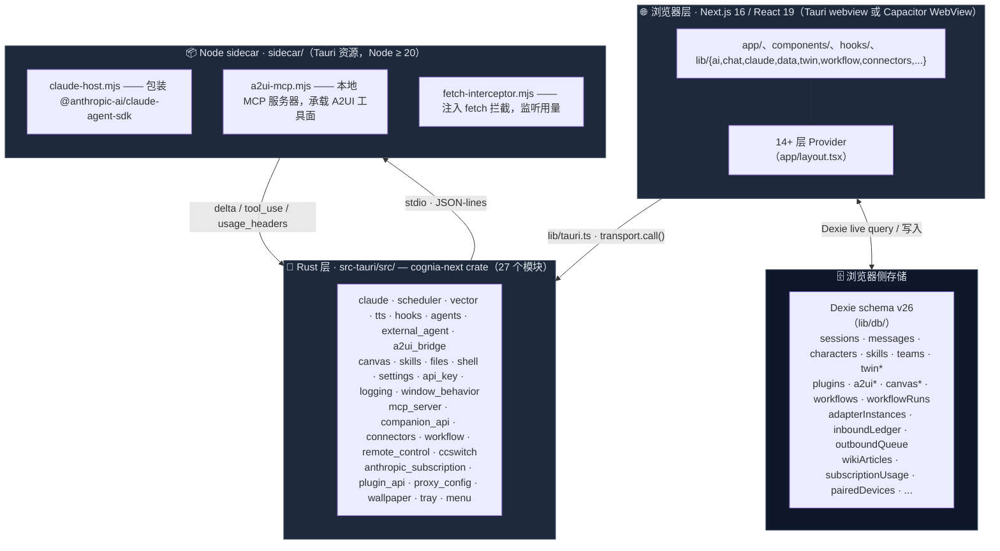

# 架构

Cognia 由四个相互协作的层组成。理解某项工作属于哪一层，是参与代码库时最重要的架构判断。

<TLDR>
  - **四层**：浏览器（React 19 + Dexie v26）→ IPC 桥（`lib/tauri.ts` + 多 transport）→ Rust 后端（27
  个模块）→ Node sidecar（Claude SDK + A2UI MCP）。 - **Provider 链**：`app/layout.tsx` 嵌套 14+ 个
  Provider，先后驱动主题、本地化、设置同步、Tauri、Logger、外部 Agent、Agent Team
  Runtime、Scheduler、备份、Companion
  事件桥、Canvas、A2UI、DataAdapter、ConnectorBus、订阅用量、Companion
  Boot、桌面同步源、桌面消息源。 - **运行时分支三向**：`isTauri()`（桌面）/ `isCapacitor()`（移动）/
  都为 false（Web）—— 同一组件三态共存。 - **Rust 子系统按职责切分**：聊天（claude
  sidecar）、调度、向量、TTS、MCP
  HTTP、Companion、连接器、工作流、远程控制、CCSwitch、订阅、插件、文件、shell、设置、API
  key、Logging、Wallpaper、Proxy、a2ui_bridge、external_agent、agents、canvas、skills、hooks、window_behavior、tray、menu。
</TLDR>



## 第 1 层 —— 浏览器 / React

`app/`、`components/`、`hooks/` 以及 `lib/` 的大部分都在 webview 内运行：

- **路由**（`app/`）—— 聊天工作台、孪生工作台、调度器、agent-teams、A2UI、画板、技能、日志、工作流编辑器、工作流运行历史、Inbox（平台连接器）、设置、share-target 入口、移动壳子。
- **状态** —— Zustand store 用于短暂 UI 状态（含 zundo 用于 undo/redo）；Dexie（IndexedDB）持久化数据；`lib/settings/` 存放用户偏好。
- **AI 编排** —— `lib/ai/`、`lib/claude/build-options.ts`、`lib/twin/runtime/apply-twin-context.ts`、`lib/workflow/runtime/` 的工作流引擎。
- **领域逻辑** —— `lib/character/`（经由 `lib/claude/types.ts`）、`lib/skills/`、`lib/data/`（备份）、`lib/connectors/`（出站队列）、`lib/wiki/`（Wiki 索引）……

浏览器层**不直接访问** OS 资源 —— 所有原生操作必须经由第 2 层。

### `app/layout.tsx` 的 Provider 顺序

`app/layout.tsx` 中 Provider 的顺序是有讲究的：

```text
<ThemeProvider>
  <SettingsHydrator />        # 从 Dexie 把 settings 单例同步到 zustand
  <LocaleGate>                # 等 next-intl 翻译加载完毕
    <SettingsSyncProvider>    # 双向同步 settings 表
      <TauriProvider>         # 提供 isTauri()、OS 信息、深链事件
        <TooltipProvider>     # Radix；全局只挂一次
          <LoggerProvider>    # 浏览器 logger ↔ Rust 日志桥
            <ExternalAgentInitializer />
            <AgentTeamRuntimeInitializer />
            <SchedulerInitializer />
            <BackupSchedulerProvider>
              <CompanionEventBridgeProvider>  # Tauri ↔ React 事件转发
                <CanvasBridgeProvider>
                  <A2UIDispatchProvider>
                    <DataAdapterProvider>     # 注入 Dexie 适配器到 data-hooks
                      <BackgroundApplier />
                      <CustomThemeApplier />
                      <ConnectorBusProvider>
                        <ConnectorDeepLinkRouter>
                          <SubscriptionUsageProvider>
                            <CompanionBootProvider>
                              <DesktopSyncSourceProvider>
                                <DesktopMessageSourceProvider>
                                  <MobileShellWrapper>
                                    <DesktopAppShell>
                                      {children}
```

新建 Provider 的规则：

| 它依赖什么……              | 就放到这一层之内            |
| ------------------------- | --------------------------- |
| 翻译                      | `LocaleGate`                |
| Tauri / 桌面 API          | `TauriProvider`             |
| Dexie 数据查询            | `DataAdapterProvider`       |
| 平台连接器入站事件        | `ConnectorBusProvider`      |
| Companion 配对状态        | `CompanionBootProvider`     |
| 桌面同步源（移动 → 桌面） | `DesktopSyncSourceProvider` |

这条链是有意分层的，不要折叠。

## 第 2 层 —— IPC 桥（`lib/tauri.ts` + transport 矩阵）

`lib/tauri.ts` 是**唯一**调用 Tauri `invoke()` 的位置。每个 Rust 命令都有一个类型化封装。业务代码从 `@/lib/tauri` 导入命名函数，**不要**直接用 `invoke()`。

```ts title="lib/tauri.ts"
import { transport } from "./tauri/transport-instance"

export function isTauri(): boolean {
  return typeof window !== "undefined" && "__TAURI_INTERNALS__" in window
}

export function isCapacitor(): boolean {
  return (
    typeof window !== "undefined" &&
    typeof (window as { Capacitor?: { isNativePlatform?: () => boolean } }).Capacitor
      ?.isNativePlatform === "function" &&
    (
      window as unknown as { Capacitor: { isNativePlatform: () => boolean } }
    ).Capacitor.isNativePlatform() === true
  )
}

export async function greet(name: string): Promise<string> {
  return transport.call<string>("greet", { name })
}
```

两个守卫互斥但都可能为 false（纯 Web 模式）。Transport 在 `lib/tauri/transport-instance.ts` 选择具体实现：

- `transport-tauri.ts` —— 桌面默认，直接走 `invoke()`。
- `transport-companion.ts` —— Capacitor / Web 模式连回桌面 Companion API。
- `transport-web.ts` —— 纯 Web 模式的 stub，调用大多返回 `Promise.reject(notSupported)`。

详见 [运行时 & Tauri](./runtime-and-tauri) 与 [移动架构](../ui/mobile-architecture)。封装统一在 `lib/tauri/index.ts` 集中导出，按职责分组（clipboard、dialog、fs、notification、opener、os、process、store、canvas、cli、deep-link、events、autostart、webview-zoom、remote-control、companion-storage、pinned-fetch……）。

## 第 3 层 —— Rust 后端（`src-tauri/src/`）

`cognia-next` crate 是产品级 Rust 后端，由 27 个模块构成。按职责分组列出：

### 聊天与 Agent

| 模块                     | 用途                                                                                                                                                   |
| ------------------------ | ------------------------------------------------------------------------------------------------------------------------------------------------------ |
| `claude`                 | 启动并监督 Node sidecar（`SidecarState`）；API key / OAuth 变更时重启；提供 `claude_send`/`claude_interrupt`/`claude_approve`/`claude_close_session`。 |
| `agents`                 | Agent 配置文件读写（`read_agent_config` / `write_agent_config`）。                                                                                     |
| `external_agent`         | 外部 CLI agent（如 Claude Code CLI、OpenCode）派生、ACP 终端管理。                                                                                     |
| `a2ui_bridge`            | webview ↔ A2UI MCP sidecar 之间的桥；监听 `a2ui_dispatch` 行。                                                                                         |
| `ccswitch`               | 一键切换 Claude Code 提供商档案 + MCP 服务器 + 提示词；详见 [CCSwitch](../chat/ccswitch)。                                                                   |
| `anthropic_subscription` | Claude Pro/Max OAuth 凭证持久化（OS keyring）；详见 [Claude 订阅 OAuth](../chat/claude-subscription-oauth)。                                                 |

### 数据与基础设施

| 模块              | 用途                                                                                                                               |
| ----------------- | ---------------------------------------------------------------------------------------------------------------------------------- |
| `vector`          | sqlite-vec 后端；在任何连接打开前加载 FFI 扩展；详见 [向量库](../data/vector-store)。                                                    |
| `scheduler`       | 跨平台原生调度器 —— `windows.rs`（Task Scheduler）、`macos.rs`（launchd）、`linux.rs`（systemd）；sqlite 元数据表用于恢复。        |
| `files` / `shell` | 文件操作（含工作区扫描、claude skills 扫描）、shell 执行（在受信任工作区内放行）。                                                 |
| `settings`        | Claude Code user / project / local / effective 设置读写。                                                                          |
| `api_key`         | Anthropic API key + OAuth bearer 内存态；与 sidecar env 同步。                                                                     |
| `logging`         | `fern` 分发链：tauri-plugin-log（文件 + webview）+ 平台原生日志（EventLog / OSLog / journald）。详见 [可观测性](../subsystems/observability)。 |

### 输出 / UI

| 模块              | 用途                                                                     |
| ----------------- | ------------------------------------------------------------------------ |
| `canvas`          | 画板文档落盘 + 原生 Python 执行；详见 [画板](../subsystems/canvas)。                 |
| `skills`          | 技能资源解析 + 沙箱准备 + 远程注册表；详见 [技能系统](../chat/skills-system)。 |
| `tts`             | 语音供应商密钥保管库（keyring）、Edge-TTS WebSocket 桥、通用 HTTP 代理。 |
| `wallpaper`       | 用户壁纸保存 / 列出 / 删除 / 解析路径 / data URL 转换。                  |
| `hooks`           | 生命周期钩子（chat send、response、error）。                             |
| `window_behavior` | "关闭到托盘" 偏好与窗口事件。                                            |
| `tray` / `menu`   | 桌面"外壳"（系统托盘、菜单栏）。                                         |

### 外部桥与连接器

| 模块             | 用途                                                                                                                                   |
| ---------------- | -------------------------------------------------------------------------------------------------------------------------------------- |
| `mcp_server`     | Rust 侧 HTTP MCP 服务器，暴露 Wiki + RAG 给外部代理；详见 [Tauri MCP 服务器](../subsystems/mcp-server-tauri)。                                     |
| `companion_api`  | 移动配对 API（axum + axum-server TLS）、JWT 配对、mDNS 广播、cloudflared 隧道、推送配置；详见 [Companion API](../subsystems/companion-api)。       |
| `connectors`     | 平台连接器底层：HTTP / WebSocket / keyring / 适配器服务器；详见 [平台连接器](../subsystems/platform-connectors)。                                  |
| `workflow`       | 工作流 cron 守护进程 + webhook 路由（axum）+ SQLite 运行态镜像；详见 [可视化工作流](../subsystems/visual-workflows)。                              |
| `remote_control` | 远程控制入站监听器 + HMAC 签名；详见 [远程控制](../subsystems/remote-control)。                                                                    |
| `proxy_config`   | 系统代理探测、HTTP 测试、统一 HTTP 请求函数。                                                                                          |
| `plugin_api`     | 插件生命周期、权限、API 桥、文件系统监视、窗口操作、快捷键、上下文菜单、签名、备份、市场、devtools；详见 [插件系统](../subsystems/plugin-system)。 |

在 `lib.rs` 注册的 Tauri 插件：`single-instance`、`deep-link`、`autostart`、`global-shortcut`、`cli`、`store`、`updater`、`dialog`、`fs`、`notification`、`clipboard-manager`、`opener`、`os`、`process`、`log`、`window-state`。

**`cognia-server` headless 二进制** —— `src-tauri/Cargo.toml` 还注册了一个独立的 `[[bin]]`，路径为 `src/bin/cognia-server.rs`。它复用 `companion_api` 与 `app_lib` 中的核心数据平面，让 Cognia 可以作为无 UI 服务运行（Phase D / ADR-0014）。

桌面专用模块用 `cfg(desktop)` 与 `cfg(not(any(target_os = "android", target_os = "ios")))` 守护。`cognia-server` 与 Companion 服务器在 headless / 受限环境下也能工作。

## 第 4 层 —— Node sidecar（`sidecar/`）

Sidecar 是 Tauri 启动时拉起的小型 Node 进程，承载：

- `claude-host.mjs` —— 官方 `@anthropic-ai/claude-agent-sdk`，通过 stdio 上的 JSON-lines 协议暴露。
- `a2ui-mcp.mjs` —— 本地 MCP 服务器，承载 A2UI 工具面（`builtin-tools/`），通过 stdio 与 Claude Agent 通信，通过 socket 与 Rust 侧 `a2ui_bridge` 通信。
- `fetch-interceptor.mjs` —— 在 Claude Agent SDK 加载**之前** monkey-patch `globalThis.fetch`，监听 `api.anthropic.com` 的响应头并以 `usage_headers` 事件回传，驱动 [Claude 订阅 OAuth](../chat/claude-subscription-oauth) 的 5h/7d 用量可视化。
- `builtin-tools/` —— 一方工具实现（fs、shell、git、search……）。
- `dispatch/` —— A2UI 工具的 dispatch 实现。

为什么独立进程？

- Claude Agent SDK 有 Node-only 依赖，无法在 webview 中运行。
- 进程隔离让宿主可以杀死/重启 sidecar 而不影响主应用（例如 API key 变更）。
- Sidecar 可以 fork 自己的子进程来执行 shell 工具。
- 拦截 `fetch` 让 Cognia 拿到响应头，而不用包装 SDK。

Rust 侧（`src-tauri/src/claude/sidecar.rs`）通过 `SidecarState` 持有子进程句柄，并暴露 `claude_send`、`claude_set_api_key`、`claude_set_provider_env`（CCSwitch 用）、`claude_set_oauth_bearer`、`claude_restart_sidecar` 等命令。

## 横切关注点

### 存储策略

| 数据                                                    | 位置                                                                  | 原因                                                                                        |
| ------------------------------------------------------- | --------------------------------------------------------------------- | ------------------------------------------------------------------------------------------- |
| 聊天会话、角色、技能、团队、孪生表、工作流、连接器表    | Dexie（IndexedDB），schema v26，40+ 张表                              | webview 本地、低延迟、可建索引。Schema 版本只增不改，不要修改旧的 `version().stores()` 块。 |
| 向量嵌入                                                | `<app_data>/cognia/vectors.sqlite`（桌面）或远程（Web）               | 原生定长向量索引需要 sqlite-vec；Web 退回云端后端。详见 [向量库](../data/vector-store)。          |
| 备份快照                                                | 用户通过 Tauri 对话框选择的文件夹                                     | 默认 AES-GCM 加密。详见 [备份 & 数据传输](../data/backup-and-data)。                              |
| 调度器元数据                                            | sqlite（Rust 侧 `metadata_store.rs`）                                 | 跨重启保留；交叉引用原生 task ID。                                                          |
| 工作流运行态                                            | sqlite 镜像（Rust 侧）+ `workflowRuns` / `workflowRunEvents` Dexie 表 | 双写让重启后能恢复 in-flight runs。                                                         |
| MCP 审计日志                                            | Dexie `mcpAuditLog` 表（最多保留 5000 条最新）                        | 防止权限越界，写入即触发审计。                                                              |
| 设置                                                    | Dexie `settings` 表（单行 key 为 `"singleton"`）+ `lib/settings/`     | 启动时由 `SettingsSyncProvider` 从 Rust 同步。                                              |
| API key / OAuth bearer / TTS provider keys / 连接器凭证 | OS keyring（`keyring` crate）                                         | 永不以明文落盘。                                                                            |
| 推送凭证（FCM / APNs）                                  | OS keyring + Dexie 持久化的 dispatcher 配置                           | 详见 [Companion API](../subsystems/companion-api)。                                                     |

### 日志

浏览器 logger（`lib/logging/`）通过 `tauri-log-bridge` 镜像到 Rust。Rust 用 `fern` 分发到：

- Tauri 日志插件（文件 + 控制台 + webview）。
- 原生平台日志（Windows Event Log、macOS `os_log`、Linux `systemd-journald` / `syslog`）。

也就是说，React 中的一次 `logger.error(...)` 直接出现在 OS 原生日志查看器里，无需额外接线。详见 [可观测性](../subsystems/observability)。

### 可观测性

`lib/observability/` 是 `@opentelemetry/api` 的薄壳。AI 供应商、孪生流水线、调度器、工作流引擎都会发 span，dev 控制台可见。

### 运行时分支

桌面 / Web / Mobile 三模式的差异不是少数几个 if，而是分布在整个代码库。常见模式：

```ts
import { isTauri, isCapacitor } from "@/lib/tauri"

if (isTauri()) {
  // 直接走 Rust 命令
} else if (isCapacitor()) {
  // 走 Companion 客户端
} else {
  // Web stub / 优雅降级
}
```

对应的 Provider 也会感知这三态：例如 `DesktopSyncSourceProvider` 在桌面上接 Tauri 事件、在移动上接 Companion 客户端拉取、在 Web 上禁用。详见 [移动架构](../ui/mobile-architecture) 与 [同步系统](../data/sync-system)。

## 下一篇

<Cards>
  <Card title="运行时 & Tauri" href="./runtime-and-tauri" description="IPC 桥的实际用法" />
  <Card
    title="Sidecar & Claude SDK"
    href="./sidecar-and-claude-sdk"
    description="基于 stdio 的 JSON-lines 协议"
  />
  <Card title="存储" href="./storage" description="Dexie schema v26 细节" />
  <Card title="插件系统" href="./plugin-system" description="沙箱 + 权限模型" />
  <Card title="External Bridge" href="./external-bridge" description="把 Cognia 暴露给外部代理" />
  <Card
    title="平台连接器"
    href="./platform-connectors"
    description="Telegram / Discord / Slack / Lark / QQ"
  />
  <Card title="Companion API" href="./companion-api" description="移动配对 + LAN + 隧道" />
  <Card title="远程控制" href="./remote-control" description="入站令牌 + HMAC 签名" />
  <Card title="可视化工作流" href="./visual-workflows" description="cron / webhook / 节点执行" />
  <Card title="移动架构" href="./mobile-architecture" description="Capacitor 运行时与同步" />
</Cards>
