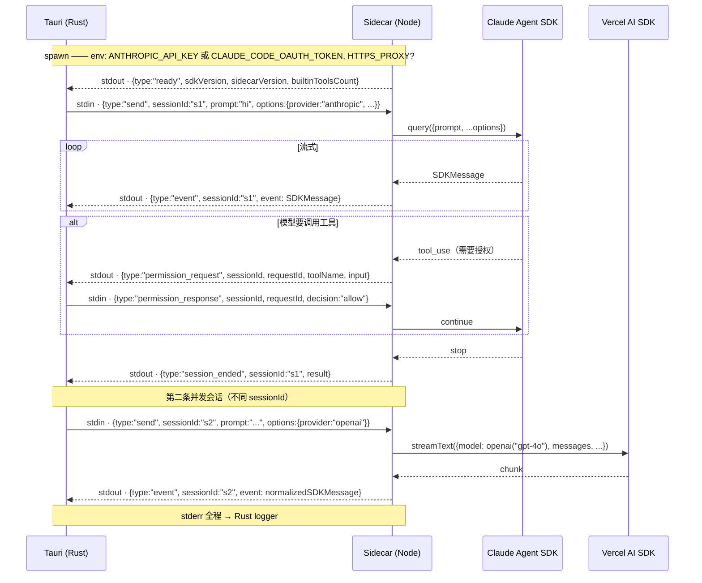
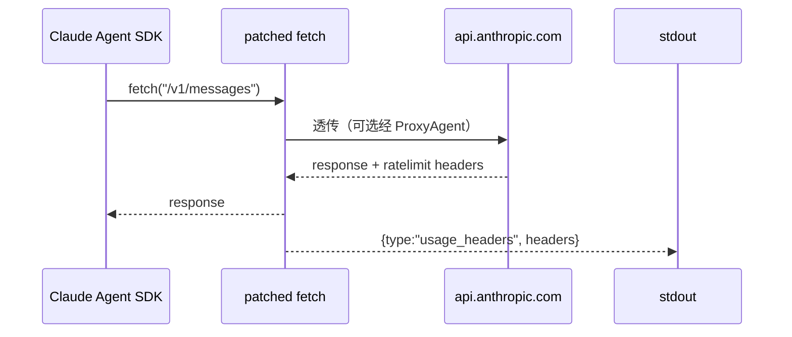

# Sidecar & Claude Agent SDK

Cognia 内嵌一个小型 Node 主机（**sidecar**），通过 stdio 上的 **JSON-lines 协议** 与 Tauri 父进程通信。默认 dispatcher 包装官方 [`@anthropic-ai/claude-agent-sdk`](https://www.npmjs.com/package/@anthropic-ai/claude-agent-sdk)，非 Anthropic 供应商则走 **Vercel AI SDK**（`ai` 包 + `@ai-sdk/*` 家族）。每条消息都带 `sessionId`，支持并行会话；权限请求/响应、用量头采集、OAuth bearer 注入都在这一层。

## 为何独立进程

Agent SDK 和 Vercel AI SDK 都依赖 Node-only 能力（filesystem、child_process、原生模块、`undici`
代理），无法在 webview 中运行。曾考虑三个方案：

1. **纯 Web** —— 在 React 中直接调用 Anthropic REST API。
   被否决：会失去 SDK 的 tool-use 循环、hooks、MCP 集成、凭证发现等能力。
2. **嵌入 Rust** —— 在 Rust 中和 Anthropic 通信。
   被否决：SDK 是 JS-first 的，Rust 重写要复制大量逻辑。
3. **Sidecar** —— Tauri 拉起一个 Node 进程，通过 stdio 通信。
   选用。SDK 不变；Rust 侧负责生命周期与凭证。

## `sidecar/` 内容

```
sidecar/
├── claude-host.mjs          # 主入口 —— 读 stdin、emit stdout、维护 sessionId → Session
├── fetch-interceptor.mjs    # 副作用导入 —— monkey-patch globalThis.fetch
├── dispatch/                # 供应商分发层
│   ├── index.mjs            # 按 sendOptions.provider 选 dispatcher
│   ├── anthropic.mjs        # 包装 @anthropic-ai/claude-agent-sdk
│   ├── ai-sdk.mjs           # 包装 Vercel AI SDK（streamText）
│   ├── event-adapter.mjs    # 把 AI SDK 流事件归一化到 SDKMessage
│   └── input-stream.mjs     # 把"多轮 user push"折叠成单条 SDK input
├── builtin-tools/           # 内置 MCP（cognia-tools）的工具实现
│   ├── index.mjs            # buildCogniaToolsServer + 分类禁用
│   ├── environment.mjs · file-extras.mjs · git.mjs
│   ├── process.mjs · shell-advanced.mjs · safety.mjs
├── a2ui-mcp.mjs             # 独立 A2UI MCP 二进制（旧路径，新代码走 a2ui-tools/）
├── a2ui-tools/              # buildA2UIBridgeServer —— in-process A2UI MCP
├── package.json             # Node 依赖（不在 pnpm workspace 内）
└── README.md
```

Sidecar **不在**根 pnpm workspace 内，原因：

- Node-only 依赖会与浏览器 bundle 冲突。
- 它作为 Tauri **资源**打包（见 `tauri.conf.json` → `bundle.resources`）—— 整个 `node_modules/`
  会随安装包一起发给用户。
- 版本独立于主应用。

<Callout type="info" title="双 SDK 共存">
  `sidecar/package.json` 同时声明 `@anthropic-ai/claude-agent-sdk` 与 `ai` + `@ai-sdk/{openai,
anthropic,google,mistral,cohere}`。前者负责 Anthropic 路径（保留 tool-use 循环、hooks、MCP 集成、凭证发现）；
  后者负责 OpenAI、Google、Mistral、Cohere、DeepSeek、Groq、OpenRouter 等。 选择哪个由
  `sendOptions.provider` 决定 —— 默认 `anthropic`。
</Callout>

## 协议：基于 stdio 的 JSON-lines

Tauri 侧用 `tauri::api::process::Command` 拉起 sidecar。通信约定：

- **每条消息是一个 JSON 对象，独占一行**，以 `\n` 结束。
- **父进程 → sidecar** 的数据写入 sidecar 的 `stdin`。
- **Sidecar → 父进程** 的数据写入 `stdout`。
- `stderr` 专门用于 sidecar 自身日志，会镜像到 Rust logger。
- **每条消息都携带 `sessionId`** —— 支持同一 sidecar 进程内并行运行多个会话。

### 消息形态

完整协议定义在 `sidecar/claude-host.mjs` 头注释。两个方向：

| 方向 | type                  | payload                                                                                                              |
| ---- | --------------------- | -------------------------------------------------------------------------------------------------------------------- |
| →    | `send`                | `{ sessionId, prompt, options? }` —— 发起新会话或追加 user 轮。`prompt` 是字符串或内容块数组。                       |
| →    | `interrupt`           | `{ sessionId }` —— 请求 SDK 中断当前生成。                                                                           |
| →    | `permission_response` | `{ sessionId, requestId, decision: "allow"\|"allow_always"\|"deny", updatedInput?, message? }` —— 回答工具权限请求。 |
| →    | `close`               | `{ sessionId }` —— 优雅结束某个会话；进程不退出。                                                                    |
| ←    | `event`               | `{ sessionId, event: SDKMessage }` —— 流式 SDK 消息（assistant 增量、tool_use、tool_result……）。                     |
| ←    | `permission_request`  | `{ sessionId, requestId, toolName, input, title?, displayName?, description? }` —— 工具调用前请求授权。              |
| ←    | `session_ended`       | `{ sessionId, result?: SDKResultMessage, error?: string }` —— 本会话结束。                                           |
| ←    | `ready`               | `{ sdkVersion?, sidecarVersion?, builtinToolsCount? }` —— sidecar 启动完成。                                         |
| ←    | `log`                 | `{ level, message }` —— sidecar 想说话（一般是 warn / error）。                                                      |



每个 `sessionId` 在 `sessions: Map<string, Session>` 中保留一份状态 —— SDK 句柄、待批权限映射、输入流写入器。
`session_ended` 时该项被删除。

### `send.options` 字段

`options` 由 `lib/claude/build-options.ts:resolveSendOptions` 装配，是 UI 状态 → SDK 入参的唯一翻译点。
其中只有白名单字段会传给 Claude Agent SDK：

- `cwd` · `model` · `fallbackModel` · `systemPrompt` · `appendSystemPrompt`
- `allowedTools` · `disallowedTools` · `additionalDirectories` · `permissionMode`
- `mcpServers`（合并了内置 cognia-tools 与 a2ui-bridge）· `maxTurns` · `maxThinkingTokens`
- `includePartialMessages` · `settingSources` · `agents` · `strictMcpConfig` · `effort` · `resume`

以下是 **sidecar 协议私有** 字段，由 sidecar 在 dispatch 之前消化（不传给 SDK）：

- `builtinTools`：每个分类（"environment" / "process" / "git" / …）的启用映射，
  禁用项会被加入 `disallowedTools`。
- `bareMode` · `debugMode` · `briefMode`：写入 sidecar 的 env / settingSources 模式。
- `aliasResolution` · `routingDecision`：上游 `ProviderRoutingEngine` 的决策快照，便于追踪。
- `provider` · `providerCredentials`：选 dispatcher 与凭证。

详见 [provider-system](../chat/provider-system) 与 [chat-and-skills](../chat/chat-and-skills)。

## Dispatcher 选择

`sidecar/dispatch/index.mjs` 根据 `sendOptions.provider` 路由：

```js title="sidecar/dispatch/index.mjs"
const provider = params.sendOptions.provider ?? "anthropic"
if (provider === "anthropic") {
  return dispatchAnthropic(params)
}
return dispatchAiSdk({ ...params, provider })
```

| provider 值                                                         | dispatcher | SDK / 包                         |
| ------------------------------------------------------------------- | ---------- | -------------------------------- |
| `anthropic`（默认）                                                 | anthropic  | `@anthropic-ai/claude-agent-sdk` |
| `openai`、`openrouter`、`deepseek`、`groq`、`mistral-openai-compat` | ai-sdk     | `@ai-sdk/openai`（openai 协议）  |
| `google`、`gemini`                                                  | ai-sdk     | `@ai-sdk/google`                 |
| `mistral`                                                           | ai-sdk     | `@ai-sdk/mistral`                |
| `cohere`                                                            | ai-sdk     | `@ai-sdk/cohere`                 |
| 任意自定义 id（带 `providerCredentials.protocol`）                  | ai-sdk     | 按 `protocol` 选包               |

<Callout type="warn" title="工具能力差异">
  P2 阶段，**只有 Anthropic dispatcher 接通工具调用、MCP 服务器与 A2UI**。 AI SDK dispatcher
  走纯文本流；当活动角色声明 `allowedTools` 但选了非 Anthropic 供应商时， composer 会禁用 Send
  按钮以避免静默掉能力。详见 [provider-system](../chat/provider-system)。
</Callout>

## `fetch-interceptor.mjs`

`sidecar/claude-host.mjs` 在加载任何 SDK 之前 **副作用导入** `fetch-interceptor.mjs`。它做两件事：

1. **采集 `anthropic-ratelimit-*` 响应头** —— 所有命中 `api.anthropic.com` 的响应都触发
   `{ type: "usage_headers", headers }` 事件，让渲染端的 usage-collector 实时画出 5h / 7d 用量进度。
   见 [claude-subscription-oauth](../chat/claude-subscription-oauth)。
2. **代理透传** —— 当 `HTTPS_PROXY` / `HTTP_PROXY` 设置在 sidecar 环境中时，通过 `undici.setGlobalDispatcher`
   把 `globalThis.fetch` 路由到 `ProxyAgent`。Tauri 的 `src-tauri/src/claude/sidecar.rs` 在拉起 sidecar
   时按用户设置注入这两个变量。



失败模式是 **静默** —— 任何头采集 / 代理安装错误都不能阻断真实响应。

## 生命周期（Rust 侧）

`src-tauri/src/claude/sidecar.rs` 持有子进程句柄：

```rust title="src-tauri/src/claude/sidecar.rs"
pub struct SidecarState {
    inner: Arc<Mutex<Option<CommandChild>>>,
    // ...
}
```

会影响 sidecar 的事件：

- **首次 `claude_send`** —— 懒加载启动，后续调用复用同一进程。
- **`claude_set_api_key` / `claude_set_oauth_bearer`** —— 把新凭证写入 `ApiKeyState`（仅内存，永不落盘）。
  下次 spawn 时通过 env 传入。详见 [claude-subscription-oauth](../chat/claude-subscription-oauth)。
- **`claude_restart_sidecar`** —— 杀掉当前 sidecar，下次 send 时 fork 新进程（SDK 在 init 时读取环境变量）。
- **应用退出** —— `RunEvent::ExitRequested` 处理器调用 `kill_sidecar`，避免遗留 Node 进程。

Sidecar 在 Unix 上用 SIGTERM、Windows 上用 `TerminateProcess` 杀掉；如 5 秒后仍未退出，升级为 SIGKILL。

## 构建发送选项

`lib/claude/build-options.ts:resolveSendOptions` 是 UI 状态 → sidecar `send.options` 的唯一转换点。它组合：

1. **角色系统提示** —— 当前 `Character.systemPrompt`。
2. **Agent Mode**（`lib/agent/`）—— 内置或自定义模式追加 system prompt、覆盖 model / temperature / maxTokens。
3. **技能解析** —— 启用的技能 markdown 经 `renderSkillsSection` 追加进系统提示，工具白名单取并（详见
   [技能子系统](../subsystems/skills/loading-and-injection)）。
4. **A2UI** —— 当 `Character.a2uiEnabled` 时，注入 `A2UI_SYSTEM_PROMPT` 与 a2ui 工具白名单（`namespacedA2UIToolNames`）。
5. **孪生上下文（可选）** —— 当活动角色设置了 `twinId` 且 `ctx.twinDeps` + `ctx.twinUserMessage` 提供时，
   `lib/twin/runtime/apply-twin-context.ts` 包装消息，附加召回片段 + 风格少样本。详见
   [employee-twin](../subsystems/employee-twin)。
6. **MCP 配置** —— 内置 MCP 服务器（`lib/claude/builtin-mcp/`）与用户服务器（`lib/db/mcp-servers.ts`）合并。
7. **Provider routing** —— `ProviderRoutingEngine` 把 alias（如 `claude-fast`）解析成具体
   `provider:model`，并写入 `aliasResolution` / `routingDecision` 字段。
8. **模型 + token 上限** —— `lib/ai/model-limits.ts` 按模型解析 token 上限。

## Hooks

`lib/claude/hooks.ts` 定义用户可挂的生命周期钩子：

- `onSend(payload)` —— 在父 → sidecar `send` 之前。
- `onResponse(content, usage)` —— 在一轮结束之后。
- `onError(err)` —— sidecar 上报错误时。

Hooks 跑用户定义的代码（存在 Dexie 中的代码片段，或 shell 命令）。它们**不是** Cognia 内部用的 ——
内部逻辑放在 `lib/chat/`。Rust 侧（`src-tauri/src/hooks/`）允许 hooks 跑 shell 命令而不必经过主 webview。

## A2UI 工具面

A2UI 把"交互式 UI 卡片 / 表单 / 列表"作为 MCP 工具暴露给模型。两条接入路径：

- **In-process（默认）** —— `sidecar/a2ui-tools/index.mjs` 提供 `buildA2UIBridgeServer({ sessionId, emit })`，
  在 `dispatchAnthropic` 中作为 MCP 服务器条目并入 `mergedMcpServers`。同进程，无独立 stdio。
- **独立 sidecar（旧路径）** —— `sidecar/a2ui-mcp.mjs` 是早期的独立 MCP 二进制，仍保留以便外部 MCP 客户端调试。

A2UI 通路：

- `src-tauri/src/a2ui_bridge/` —— Rust 桥，仲裁 webview 与 MCP 之间的通信。
- `lib/a2ui/` —— 前端分发与渲染。
- `components/a2ui/` —— 渲染 A2UI 节点的 React 组件。

外部 MCP 服务器（非 sidecar 内嵌）参考 [MCP 系统](../subsystems/mcp)。

## 认证

Sidecar 启动时只读环境变量；凭证由 Rust 侧注入：

<TypeTable
  type={{
    ANTHROPIC_API_KEY: {
      description: "直接 API key。优先级最高，覆盖 OAuth bearer。",
      type: "env 变量",
    },
    CLAUDE_CODE_OAUTH_TOKEN: {
      description:
        "Claude Pro / Max OAuth bearer。由 `claude-subscription` 子系统写入 OS keyring 后注入。 设置后 ANTHROPIC_API_KEY 会被 *主动 unset*。",
      type: "env 变量",
    },
    "AWS_BEDROCK_*、GCP_VERTEX_*": {
      description: "云端供应商凭证（Bedrock、Vertex 上的 Anthropic）。",
      type: "env 变量",
    },
    "providerCredentials（per-send）": {
      description:
        "AI SDK dispatcher 路径的 per-call 凭证 —— apiKey + baseURL + 可选 protocol，随每个 send 一起传。",
      type: "send.options 字段",
    },
  }}
/>

<Callout type="warn" title="永不明文">
  Rust 侧**绝不**直接读 `~/.claude/` —— 只是用合适的环境变量启 sidecar。UI 输入的 API key 存在
  `ApiKeyState`（内存）+ OS keyring（`keyring` crate），通过环境变量在 spawn 时传给 sidecar，
  **永不**写入配置文件。OAuth bearer 路径见
  [claude-subscription-oauth](../chat/claude-subscription-oauth)。
</Callout>

## 添加新工具

<Tabs groupId="tool-path" persist items={["内置（cognia-tools）", "MCP 服务器"]}>
  <Tab value="内置（cognia-tools）">
    适用于希望随 Cognia 一起发布、始终可用的工具：

    <Steps>
      <Step>
        ### 加实现

        在 `sidecar/builtin-tools/<category>.mjs` 新增一个工具定义。每个工具属于一个
        **分类**（environment / process / git / file-extras / shell-advanced / safety），
        分类整体可被 `sendOptions.builtinTools` 关闭。

        ```js title="sidecar/builtin-tools/my-category.mjs"
        export const tools = [
          {
            name: "my_tool",
            description: "...",
            inputSchema: { /* JSON Schema */ },
            handler: async (input, ctx) => {
              return { content: [{ type: "text", text: "..." }] }
            },
          },
        ]
        ```
      </Step>
      <Step>
        ### 在 `index.mjs` 注册

        在 `sidecar/builtin-tools/index.mjs` 顶部的导入区加入新模块，
        并在 `buildCogniaToolsServer` 中纳入。
      </Step>
      <Step>
        ### 写测试

        测试与源同目录：`sidecar/builtin-tools/__tests__/<name>.test.mjs`，
        用 `pnpm sidecar:test` 运行（`node --test dispatch/` + builtin 测试）。
      </Step>
    </Steps>

    <Callout type="warn" title="包体积">
      内置工具会随 Cognia 每次发版分发。避免重依赖 ——
      特殊场景优先用 MCP。
    </Callout>

  </Tab>
  <Tab value="MCP 服务器">
    绝大多数第三方集成走 MCP 路径，因为不必修改 sidecar 自身。

    <Steps>
      <Step>
        ### 决定内置还是用户配置

        - **内置** —— 写入 `lib/claude/builtin-mcp/`；始终加载。
        - **用户配置** —— 让用户通过 UI 添加（`lib/db/mcp-servers.ts`）。
      </Step>
      <Step>
        ### 加预设（可选）

        在 `lib/claude/mcp-presets.ts` 加一项，让用户看到一键安装。
      </Step>
      <Step>
        ### 测试往返

        在包含此服务器的角色下发起聊天。Anthropic dispatcher 的 MCP 客户端会自动发现；
        工具调用通过 `permission_request` / `permission_response` + `event` 流转。
      </Step>
    </Steps>

  </Tab>
</Tabs>

## 调试 sidecar

独立运行：

```bash
cd sidecar
node claude-host.mjs           # 从 stdin 读 JSON 行
node claude-host.mjs --smoke   # 一次性冒烟（启动一个 sessionId="smoke-1" 的会话）
```

把样例 `send` 喂进去看响应：

```bash
echo '{"type":"send","sessionId":"s1","prompt":"hi","options":{}}' | node claude-host.mjs
```

应用运行时，sidecar 的 `stderr` 会镜像到 Rust logger，并出现在 `app/logs/`。`{type:"log"}` 出站消息也会被
Rust 侧记录到结构化日志。

## 测试

- TS 单元测试与源码同目录 —— 例如 `lib/claude/build-options.test.ts`、`lib/claude/sync.test.ts`。
- Sidecar 的单元测试用 Node test runner：`pnpm sidecar:test` —— 跑 `dispatch/` 与 `builtin-tools/__tests__/` 下的所有 `*.test.mjs`。
- 真实拉起 sidecar 的集成测试位于 `src-tauri/tests/`。

## 相关

<Cards>
  <Card title="聊天 & 技能" href="../chat/chat-and-skills" description="调用 claude_send 的用户面。" />
  <Card title="Provider 系统" href="../chat/provider-system" description="多供应商路由 + alias 解析。" />
  <Card title="Claude 订阅 OAuth" href="../chat/claude-subscription-oauth" description="OAuth bearer 注入与用量头采集。" />
  <Card title="MCP 系统" href="../subsystems/mcp" description="A2UI MCP 与外部 MCP 客户端。" />
  <Card title="插件系统" href="../subsystems/plugin-system" description="插件如何借 MCP 扩展 sidecar。" />
  <Card title="运行时 & Tauri" href="./runtime-and-tauri" description="拥有 sidecar 生命周期的 Rust 侧。" />
</Cards>
