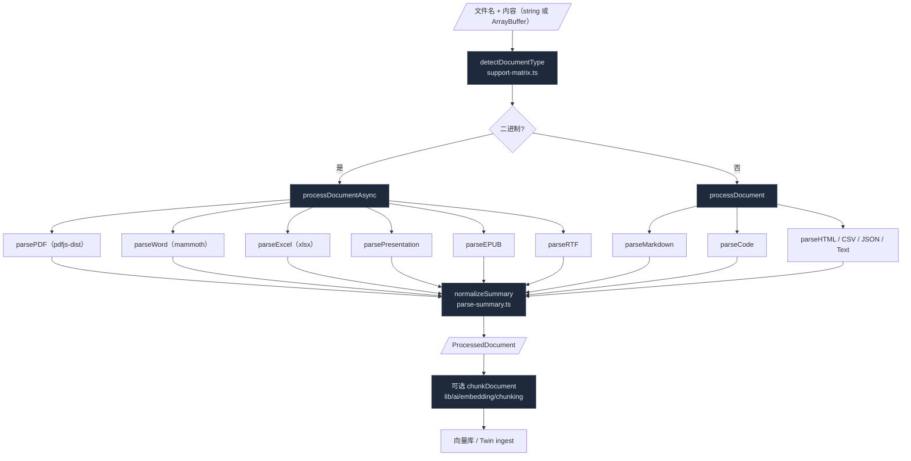

# 文档处理

`lib/document/` 是 Cognia 的"读文件"层。它把十一种主流格式折叠成同一份 `ProcessedDocument`：原文 + 可嵌入文本 + 结构化元数据 + 解析诊断。Twin ingest、知识库、画板的"导入文档"操作都走这一层；上层调用方不需要为每种格式写自己的 parser。
## 总览



## 类型识别

`lib/document/support-matrix.ts` 维护一张文件名后缀 → `DocumentType` 的查表：

```ts title="lib/document/support-matrix.ts"
const DOCUMENT_TYPE_EXTENSIONS: Record<Exclude<DocumentType, "unknown">, string[]> = {
  markdown: ["md", "markdown", "mdx"],
  code: ["js", "ts", "tsx", "py", "go", "rs", "cpp" /* ...30+ */],
  text: ["txt"],
  json: ["json"],
  pdf: ["pdf"],
  word: ["docx", "doc", "docm", "odt"],
  excel: ["xlsx", "xls", "xlsm", "ods"],
  csv: ["csv", "tsv"],
  html: ["html", "htm", "xhtml"],
  rtf: ["rtf"],
  epub: ["epub"],
  presentation: ["pptx", "ppt", "pptm", "odp"],
}

const BINARY_EXTENSIONS = new Set([
  "pdf",
  "docx",
  "doc",
  "docm",
  "odt",
  "xlsx",
  "xls",
  "xlsm",
  "ods",
  "pptx",
  "ppt",
  "pptm",
  "odp",
  "epub",
])
```

`detectDocumentType(filename)` 是上层唯一需要调用的工具。`DocumentSupportSurface` 区分三个使用面：

- `vector` —— 进向量库的格式（多数文档类型）。
- `knowledge-base` —— 知识库导入（text/markdown/json/code）。
- `ppt-material` —— PPT 工作流的素材白名单。

每个面有自己的允许后缀列表；UI 文件选择器据此过滤。

## 同步路径：纯文本格式

```ts title="lib/document/document-processor.ts"
export function processDocument(
  id: string,
  filename: string,
  content: string,
  options: ProcessingOptions = {}
): ProcessedDocument
```

只接受 `string`，专门处理：

- **markdown** —— `parseMarkdown` 抽取标题、frontmatter（含 tags），`extractEmbeddableContent` 剥代码块/链接元信息得到嵌入用纯文本。
- **code** —— `parseCode` 按 `code-parser.ts` 的语言侦测得到 function / import 计数，`extractCodeEmbeddableContent` 保留注释与签名，剔除高频样板。
- **json** —— `JSON.parse` 判 array / object，统计 keys；解析失败回落到 text 路径。
- **text** （含 unknown）—— 仅做行/词计数 + 语言侦测。

返回的 `ProcessedDocument`：

```ts
{
  id, filename, type, content,
  embeddableContent,       // 喂给 embed 的版本
  metadata: { size, lineCount, wordCount, title?, language?, ... },
  parseSummary,            // 面包屑用
  parseDiagnostics: [],    // 警告/错误
  chunks?,                 // 仅当 options.generateChunks === true
}
```

## 异步路径：二进制 + rich 格式

`processDocumentAsync` 对 PDF / Word / Excel / Presentation / EPUB / RTF 必走，对其他类型如果调用方拿到的是 `ArrayBuffer` 也支持。它按 type 动态 `import()` 具体 parser，控制初始 bundle 大小。

```ts title="lib/document/document-processor.ts"
case "pdf": {
  const { parsePDF, extractPDFEmbeddableContent } = await import("./parsers/pdf-parser")
  const buffer = typeof data === "string" ? stringToArrayBuffer(data) : data
  const parsed = await parsePDF(buffer)
  content = parsed.text
  embeddableContent = opts.extractEmbeddable ? extractPDFEmbeddableContent(parsed) : content
  metadata = { ...metadata, title, pageCount, author }
  parseResult = parsed
  parseSummary = normalizePDFSummary(parsed)
  break
}
```

### PDF（`parsers/pdf-parser.ts`）

底层 pdfjs-dist。`PDFParseResult` 输出：

- `text` —— 全文（按页拼接，layout-aware）。
- `pages: PDFPage[]` —— 每页 `pageNumber / text / width / height`。
- `metadata` —— title / author / subject / keywords / creator / dates。
- 可选 `outline` —— 目录树。
- 可选 `annotations` —— 注释 + 高亮。
- 支持 `password` 选项；`startPage / endPage` 做范围抽取。

### Word（`parsers/office-parser.ts` + `parsers/open-document-parser.ts`）

- `.docx / .docm` —— `mammoth`，得到 `text` / `html` / `messages`（warning + error）/ `images` / `metadata` / `headings`。messages 会被 `mapWordMessages` 转成 `ParseDiagnostic`，让 UI 显示"图像无 alt"之类的提示。
- `.odt` —— `parseOpenDocumentText`，自家 ODF 解析。
- 极旧的 `.doc` 仍归 word，由 mammoth 给出 "convert to .docx" 的诊断。

### Excel / CSV（`parsers/office-parser.ts` + `parsers/csv-parser.ts`）

xlsx 拆 sheet → 每张表的行列 + 公式 + 日期类型 + 合并单元格。`csv-parser` 处理 TSV 与各种引号转义。结果归一化成 `ExcelParseResult` / `CSVParseResult`，`parseSummary` 按 sheet 分段。

### Presentation（`parsers/presentation-parser.ts`）

PPTX 拆 slide → 每张幻灯片的标题 + 文本 + 备注。`parseSummary` 按 slide 索引；ppt 工作流可借此显示"第 3 页"。

### EPUB / RTF

`parsers/epub-parser.ts`：EPUB 拆章节 + metadata + 封面。`parsers/rtf-parser.ts`：剥 RTF 控制字符提纯文本。

### HTML / Markdown（含 frontmatter）

虽然 HTML 是文本，但有自己的 parser：剥 `<script>` / `<style>`、保留段落语义、抽 og: 元数据。Markdown 在 sync 路径已有，但 ArrayBuffer 形式也走 async 解码。

## 解析诊断

`parse-diagnostics.ts` 定义 `ParseDiagnostic`：

```ts
{
  code: "parse_failed" | "image_no_alt" | "encoding_guess" | ...,
  severity: "info" | "warning" | "error",
  message: string,
}
```

`attachDiagnosticToError(err, diagnostic)` 把诊断挂到 Error 对象上，调用方 catch 时可以 `err.diagnostic` 拿到结构化信息。这让上层 UI 决定是显示"密码保护文件请重传"还是"无法识别编码请选择"。

`normalizeDocumentParseError(label, error)` 集中识别"密码 / 损坏 / 旧 PPT" 这几类已知错误，挂上对应诊断。

## 解析摘要

`parse-summary.ts` 把每种 parser 的输出归一化成 `ParseSummary`：

```ts
{
  parser: "pdf" | "word" | "excel" | ...,
  segments: ParseSummarySegment[],   // 按 page / sheet / slide / chapter / heading
  warnings?: string[],
  // ... 每种 parser 自己的字段
}
```

UI 用 `parseSummary` 渲染左侧的目录/分页器；导出到 vector 时按 segment 切 chunk 也更稳。

## 表格抽取

`table-extractor.ts` 是单独的工具：从 Markdown / HTML / 普通文本里识别表格 → `ExtractedTable[]`：

```ts
{
  headers: string[],
  rows: string[][],
  title?: string,
  sourceType: "markdown" | "html" | "text",
  startIndex, endIndex,
}
```

`extractedTableToTableData` 转成画板/导出层用的 `TableData`。聊天里 AI 输出含 Markdown 表格时，这一层把它当成结构化对象，方便后续"导出为 Excel"。

## Chunk 生成

`ProcessingOptions.generateChunks === true` 时，`processDocument` 会调用 `chunkDocument` （来自 `lib/ai/embedding/chunking`）：

- 默认 `strategy = "semantic"` —— 按段落/标题/语义边界切。
- 支持 `chunkingOptions` 透传 chunk size / overlap / 策略。
- 输出 `chunks: DocumentChunk[]` 直接喂向量库。

Twin ingest 不直接调 `processDocument` 生成 chunks —— 它有自己的 `prepareChunks` 流程（按 markdown / code / chat 三种 chunker）；但底层 parser 完全复用 `lib/document/`。详见 [员工数字孪生](../subsystems/employee-twin)。

## Knowledge-RAG 占位

`lib/document/knowledge-rag.ts` 是 Cognia 原项目的 Project 知识库 RAG 接口，cognia-next 暂未实现，留下 stub 让调用 `retrieveKnowledge / searchKnowledgeBaseAdvanced` 的代码（Cognia 的原有 build-options 测试）能编译。

```ts title="lib/document/knowledge-rag.ts"
export async function retrieveKnowledge(_options): Promise<KnowledgeChunk[]> {
  return [] // 等真正 RAG 层接入
}
```

实际生效的 RAG 路径是 Twin runtime（见 [员工数字孪生](../subsystems/employee-twin)）。

## 文件验证

`validateFile()`（在 `document-processor.ts`）支持：

- `maxFileSize` —— 大小硬上限。
- `allowedTypes` —— 仅放行白名单类型。
- 返回 `{ valid, errors[], warnings[] }`，UI 上传组件据此提前拦截。

## 文档对比

`document-processor.ts` 还导出 `DocumentDiff`：

```ts
{
  added: string[],      // 仅在 after 出现的行
  removed: string[],    // 仅在 before 出现的行
  modified: { line, before, after }[],
  similarity: number,   // 0..1
}
```

为画板/编辑器的"对比上一版"功能服务。

## 与上层集成

文档处理层主要被以下场景消费：

- **Twin ingest** —— `lib/twin/ingest/parse.ts` 调 `processDocumentAsync` 把上传文件转成纯文本，再走自己的 redact → chunk → embed。
- **画板导入** —— 用户拖文件进画板时，按类型选择落点（编辑器 / 演示文稿 / 表格视图）。
- **知识库 UI** —— 上传时即时解析，预览首段 + 元数据。
- **Skill / 插件** —— 通过 `lib/document/index.ts` 公共导出消费。

UI 入口：`components/document/document-format-toolbar.tsx` 是 markdown 编辑工具栏，绑定到画板上的活跃编辑器（详见 [画板](../subsystems/canvas)，若已存在）。

## 关联文档

<Cards>
  <Card
    title="员工数字孪生"
    href="../subsystems/employee-twin"
    description="Twin ingest 复用本模块的 parse 阶段"
  />
  <Card title="artifacts 沙箱" href="../subsystems/artifacts-sandbox" description="生成的文档落地" />
  <Card title="向量库" href="./vector-store" description="chunks 的下一站" />
  <Card title="存储" href="./storage" description="文件如何落到 Dexie / 文件系统" />
</Cards>

## 在哪里入手

| 目标                | 文件                                                                                                                                                 |
| ------------------- | ---------------------------------------------------------------------------------------------------------------------------------------------------- |
| 新增一种文件格式    | `support-matrix.ts` 加后缀 → `parsers/<name>-parser.ts` 写 parser → `parse-summary.ts` 加 normalize → `document-processor.ts` async switch 新增 case |
| 改 PDF 分页策略     | `parsers/pdf-parser.ts` 的 `extractPDFEmbeddableContent`                                                                                             |
| 调整 chunk 默认策略 | `ProcessingOptions.chunkingOptions` 默认值 + `lib/ai/embedding/chunking.ts`                                                                          |
| 加新诊断类型        | `parse-diagnostics.ts:ParseDiagnostic.code` 联合扩展 + i18n 字符串                                                                                   |
| 表格识别规则        | `table-extractor.ts`                                                                                                                                 |
