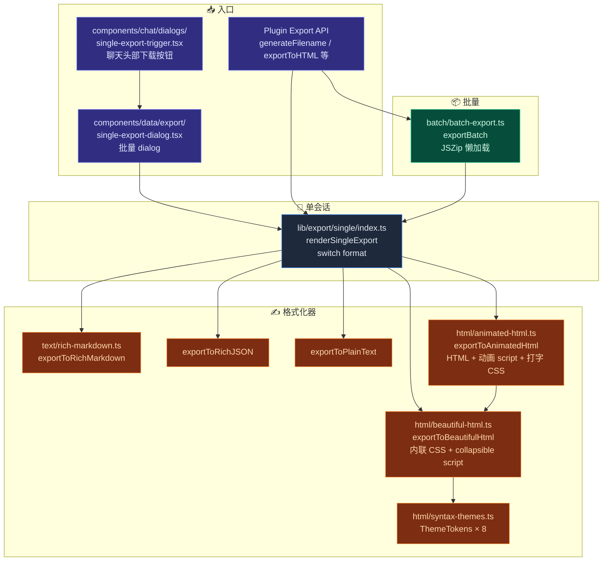
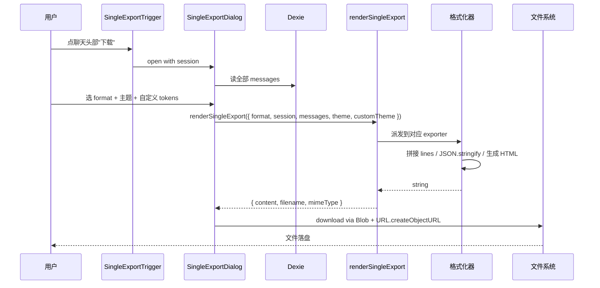
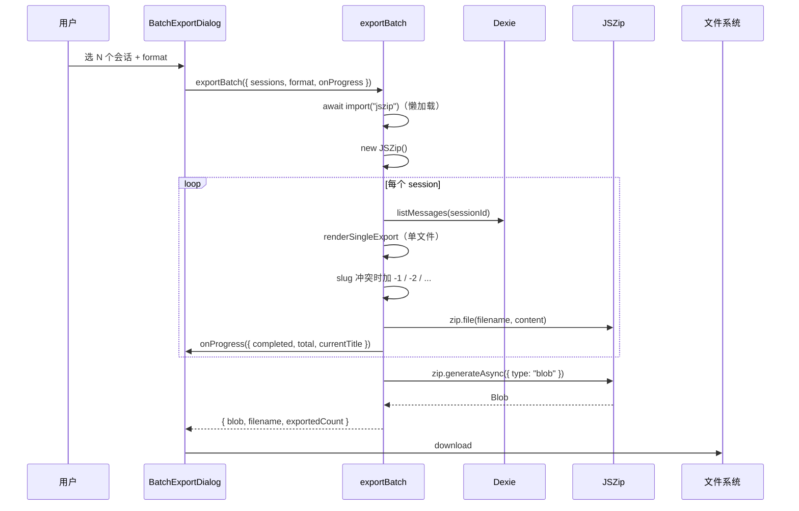

# 导出系统

## 适用场景

| 场景                                        | 格式                                                                |
| ------------------------------------------- | ------------------------------------------------------------------- |
| 上交给 GitHub / Obsidian 等 markdown 阅读器 | Rich Markdown（保留 tool 调用块、reasoning fenced block）           |
| 程序处理 / 编程接入                         | Rich JSON（保留 `UIMessage.parts` 原始结构）                        |
| 复制到邮件 / 简单文档                       | Plain text（去格式）                                                |
| 离线分享给非技术读者                        | Beautiful HTML（自包含，主题精美）                                  |
| 演示用、电影感播放                          | Animated HTML（淡入 + 打字效果，类似终端回放）                      |
| 历史归档                                    | Batch ZIP（per-session 文件命名按 slug 唯一）                       |
| 自定义品牌色                                | Beautiful / Animated HTML + `customTheme: ThemeTokens` 覆盖默认主题 |

对于**整库快照（多设备搬运 + 加密）**，请用 [备份与数据](./backup-and-data) 的 `BackupPackageV3` 流水线 —— 那是一条独立的、加密的、覆盖全部 Dexie 表的导出路径。本页的导出系统专注于"单会话 / 多会话的可读副本"。

## 架构图



## 关键模块与文件路径

### 公共 API

| 文件                  | 用途                                                                                  |
| --------------------- | ------------------------------------------------------------------------------------- |
| `lib/export/index.ts` | 桶导出 + `generateFilename(title, ext)`；插件期望的稳定 API 别名（`exportToHTML` 等） |

```ts
// 插件 / UI 推荐写法
import { renderSingleExport, exportToHTML, generateFilename } from "@/lib/export"
```

### 单会话编排

| 文件                              | 用途                                                         |
| --------------------------------- | ------------------------------------------------------------ |
| `lib/export/single/index.ts`      | `renderSingleExport(opts) → { content, filename, mimeType }` |
| `lib/export/single/index.test.ts` | 五种格式 + slug + mime 边界测试                              |

### 文本写入器

| 文件                               | 函数                                                              |
| ---------------------------------- | ----------------------------------------------------------------- |
| `lib/export/text/rich-markdown.ts` | `exportToRichMarkdown` / `exportToRichJSON` / `exportToPlainText` |

每个写入器接受 `RichExportData = { session, messages, exportedAt, includeMetadata?, includeTokens? }`。Markdown 输出可在 GitHub / Obsidian / VS Code 直接渲染（toolcall 用 ` ``` ` fenced，reasoning 用 collapsible note）。

### HTML 写入器

| 文件                                | 用途                                                                                                      |
| ----------------------------------- | --------------------------------------------------------------------------------------------------------- |
| `lib/export/html/beautiful-html.ts` | 内联 `<style>` 块（构建自 `ThemeTokens`）+ `<details>` collapsible tool/reasoning + 紧凑 readable 布局    |
| `lib/export/html/animated-html.ts`  | wraps beautiful；在 `</body>` 前注入一段 `<style>` 和 `<script>` 实现淡入 + 逐字打字（默认 12 ms/char）   |
| `lib/export/html/syntax-themes.ts`  | `ThemeId × 8`（light / dark / sepia / github / dracula / nord / solarized / monokai）+ `ThemeTokens` 接口 |

`ThemeTokens` 11 个 token：`bg` / `surface` / `text` / `muted` / `border` / `accent` / `userBg` / `assistantBg` / `codeBg` / `codeText` / `detailBg`。dialog 中的"自定义主题"编辑器（`components/data/export/custom-theme-editor.tsx`）实时改 token 直接覆盖默认。

### 批量

| 文件                               | 用途                                                                                                         |
| ---------------------------------- | ------------------------------------------------------------------------------------------------------------ |
| `lib/export/batch/batch-export.ts` | `exportBatch({ sessions, format, theme?, customTheme?, onProgress? })` —— JSZip 懒加载；slug 冲突自动加 `-N` |

### UI 触发

| 文件                                                | 用途                                                           |
| --------------------------------------------------- | -------------------------------------------------------------- | ------------------------------------- |
| `components/chat/dialogs/single-export-trigger.tsx` | 聊天头部下载图标按钮；`variant: "icon"                         | "labeled"`；打开 `SingleExportDialog` |
| `components/data/export/single-export-dialog.tsx`   | 格式 picker + 主题 picker + 自定义主题编辑器 + 预览 + 下载按钮 |
| `components/data/export/batch-export-dialog.tsx`    | 批量选择 + 进度条                                              |
| `components/data/export/custom-theme-editor.tsx`    | 11 个 token 的颜色选择器，实时预览                             |
| `components/data/export/schedule-card.tsx`          | 把批量导出绑定到调度器任务（"每周日导出最近一周")              |

## 数据流：单会话导出



## 数据流：批量导出



## 数据库表

导出系统**不引入新 Dexie 表**：

- 读：`sessions` / `messages` 既有表。
- 写：直接到本地文件系统（Blob + `URL.createObjectURL` + `<a download>` 点击；Tauri 模式可走 `tauri-plugin-dialog` 让用户选保存位置）。

定时批量导出走调度器（参见 [调度器](../subsystems/scheduler)），任务元数据进 `scheduledTasks` 表，导出本身不持久化产物。

## 配置项与扩展点

### 单会话选项

```ts
interface SingleExportOptions {
  format: "markdown" | "json" | "text" | "html" | "animated"
  session: ChatSession
  messages: StoredMessage[]
  exportedAt?: Date
  theme?: ThemeId // HTML 格式专用
  customTheme?: ThemeTokens // 覆盖 theme
  includeMetadata?: boolean
  includeTimestamps?: boolean
  includeTokens?: boolean // markdown 写入器是否展示 tool token 计数
}
```

### Beautiful HTML 选项

```ts
interface BeautifulHtmlOptions {
  session
  messages
  exportedAt
  theme?: ThemeId
  customTheme?: ThemeTokens
  includeMetadata?: boolean // 默认 true
  includeTimestamps?: boolean // 默认 true
  expandDetails?: boolean // 工具/reasoning collapsible 默认展开
}
```

### Animated HTML 选项

继承 Beautiful HTML 全部选项，加：

```ts
typingSpeedMs?: number // 每字符毫秒，默认 12
```

### 文件名生成

```ts
generateFilename(title: string, extension: string): string
```

slugify 规则：`toLowerCase` → 非字母数字替换为 `-` → 截 60 字符 → 空时回退 `"conversation"`。

### 插件稳定 API 别名

```ts
export { exportToBeautifulHtml as exportToHTML } from "./html/beautiful-html"
export { exportToAnimatedHtml as exportToAnimatedHTML } from "./html/animated-html"
```

历史大小写保留，方便第三方插件调用。

## 关联子系统

<Cards>
  <Card title="聊天与技能" href="../chat/chat-and-skills" description="导出的源头是聊天会话 + 消息" />
  <Card
    title="备份与数据"
    href="./backup-and-data"
    description="加密整库快照走另一条 BackupPackageV3 流水线"
  />
  <Card title="调度器" href="../subsystems/scheduler" description="批量导出可挂载到定时任务" />
</Cards>

## 关联 ADR

本子系统在 ADR 体系前已建立，未单独立 ADR。设计原则：

- 输出文件**自包含、零运行时依赖** —— 主题 token 全内联到 `<style>` 块。
- 内置 JSZip **懒加载** —— 不开批量 dialog 不进 bundle。
- **公共 API 稳定** —— `generateFilename` / `exportToHTML` 等给插件长期保证向后兼容。

## 已知限制

- **HTML 不渲染 Mermaid / Math** —— 当前 Beautiful / Animated HTML 输出原始代码块；如果用户需要 Mermaid 渲染，请走 markdown 后再用支持 Mermaid 的渲染器（GitHub README、Obsidian 等）。
- **批量 ZIP 内存模型**：JSZip 把全部内容放内存；几百 MB 级别 OK，GB 级别请逐个会话单独导出。
- **slug 冲突 fallback 简单**：同标题第 2 份起加 `-1` / `-2` / …；不带时间戳。
- **animated HTML 大文件不友好**：同时给数万字符做打字效果可能在低端浏览器卡顿；演示场景请缩范围。
- **不导出附件 / 工件**：附件 / artifact 的 blob 不打包进导出文件 —— 当前仅文本 / Markdown / JSON 内引用路径。把附件捎上是 Phase 2 工作。
- **plain text 丢失结构**：tool 调用、reasoning、引用等会被压扁。要保留结构请走 Markdown / JSON。
- **整库迁移请走备份系统**：本子系统不处理 characters / skills / teams / twin / settings 等的导出 —— 那是 `BackupPackageV3` 的工作（见 [备份与数据](./backup-and-data)）。
