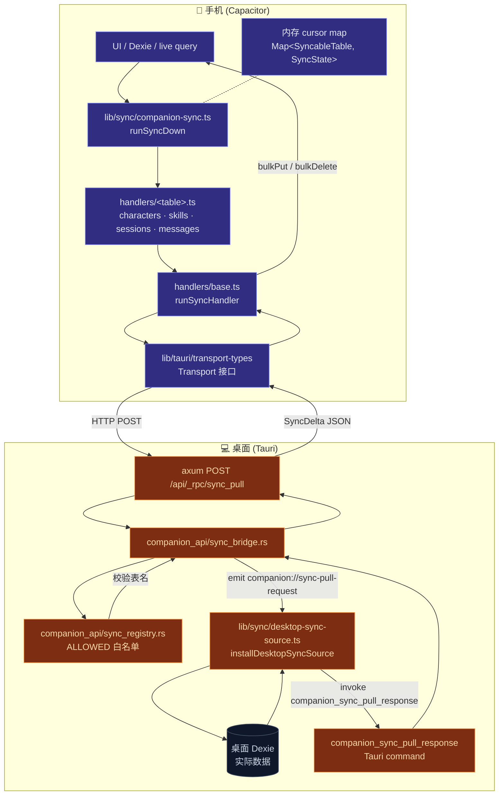

# 同步系统

## 适用场景

| 场景                  | 表与策略                                                                           |
| --------------------- | ---------------------------------------------------------------------------------- |
| 移动端浏览历史会话    | `sessions` + `messages`（最近 200）                                                |
| 移动端切换孪生 / 角色 | `characters` + `twinProfile`                                                       |
| 移动端查看工作流定义  | `workflows`（只读视图）                                                            |
| 移动端切插件开关      | `plugins`（读 → settings 走 outbound 上传，未来 V2）                               |
| 移动端的连接器策略    | `adapterInstances`（mode / quietHours 只读视图）                                   |
| 同步用户偏好          | `settings` 单行 `"singleton"` —— `since === 0` 时一次全量，之后按 `updatedAt` 增量 |

## 架构图



## 关键模块与文件路径

### 客户端（手机）

| 文件                              | 用途                                                                          |
| --------------------------------- | ----------------------------------------------------------------------------- |
| `lib/sync/types.ts`               | `SyncableTable` / `SyncCursor` / `SyncDelta` / `SyncOutcome` / `SyncFailure`  |
| `lib/sync/companion-sync.ts`      | 顶层编排：`runSyncDown` / `installForegroundSync` / `installEventDrivenSync`  |
| `lib/sync/handlers/base.ts`       | `runSyncHandler<TRow>` —— 单次 RPC 往返 + `bulkPut` + `bulkDelete` + 错误归类 |
| `lib/sync/handlers/characters.ts` | `syncCharacters` —— `rowFilter: row => !row.isBuiltIn`（防覆盖本地内置）      |
| `lib/sync/handlers/skills.ts`     | `syncSkills`                                                                  |
| `lib/sync/handlers/sessions.ts`   | `syncSessions`                                                                |
| `lib/sync/handlers/messages.ts`   | `syncMessages` —— 仅最新 200 行                                               |

### 桌面侧响应器

| 文件                                   | 用途                                                                                                                |
| -------------------------------------- | ------------------------------------------------------------------------------------------------------------------- |
| `lib/sync/desktop-sync-source.ts`      | `installDesktopSyncSource` —— 监听 `companion://sync-pull-request`；查 Dexie；invoke `companion_sync_pull_response` |
| `lib/sync/desktop-sync-source.test.ts` | 全表 + 边界覆盖                                                                                                     |

### Rust 桥（companion API）

| 文件                                           | 用途                                                          |
| ---------------------------------------------- | ------------------------------------------------------------- |
| `src-tauri/src/companion_api/sync_bridge.rs`   | `_rpc/sync_pull` HTTP handler —— 把请求转给 webview，等响应   |
| `src-tauri/src/companion_api/sync_registry.rs` | `ALLOWED` 白名单 —— 防止手机伪造请求拉非允许表                |
| `src-tauri/src/companion_api/rpc.rs`           | RPC 路由器 —— `"sync_pull"` 走 `sync_bridge`                  |
| `src-tauri/src/companion_api/commands.rs`      | `companion_sync_pull_response` —— webview 通过它把 delta 回传 |

## 数据流：一次 sync_pull

```mermaid
sequenceDiagram
  participant App as 手机 UI
  participant Orch as runSyncDown
  participant H as handlers/&lt;table&gt;
  participant B as handlers/base
  participant T as Transport
  participant R as Rust _rpc/sync_pull
  participant Reg as sync_registry
  participant Br as sync_bridge
  participant S as desktop-sync-source
  participant D as 桌面 Dexie

  App->>Orch: runSyncDown()
  loop 每个 table（顺序）
    Orch->>H: syncXxx(transport, { since: cursor })
    H->>B: runSyncHandler<TRow>(opts, transport, cursor)
    B->>T: transport.call("sync_pull", { table, since })
    T->>R: HTTP POST /api/_rpc/sync_pull
    R->>Reg: validateTable(table)
    alt 表不在白名单
      Reg-->>T: 404 Not Implemented
    else
      Reg->>Br: enqueue pull
      Br->>S: emit companion://sync-pull-request<br/>{ request_id, table, since }
      S->>D: 读对应表 where updatedAt > since
      D-->>S: 行集
      S->>S: finalizeDelta（计算 next_since）
      S->>Br: invoke companion_sync_pull_response<br/>{ requestId, delta }
      Br-->>T: SyncDelta JSON
    end
    T-->>B: SyncDelta
    B->>B: rowFilter（可选）
    B->>App: 本地 Dexie bulkPut(rows) + bulkDelete(deleted_ids)
    B-->>H: SyncOutcome
    H-->>Orch: SyncOutcome
    Orch->>Orch: 更新 cursor + lastSyncAt
  end
```

## 三种触发方式

| 触发        | 实现                                                                                          |
| ----------- | --------------------------------------------------------------------------------------------- |
| 手动        | UI "Sync now" 按钮调 `runSyncDown()`                                                          |
| Foreground  | `installForegroundSync` 监 `document.visibilitychange`；变 `visible` 时跑                     |
| WS 事件驱动 | `installEventDrivenSync` 订阅 `transport.subscribe("sync://invalidate", ...)`；服务端通知时拉 |

`runSyncDown` re-entrant：同时第二次调用复用进行中的 promise，不会并发四个 RPC。

## 表与 cursor 策略

| 表                 | rowFilter        | cursor 字段                                                        | 备注                                                            |
| ------------------ | ---------------- | ------------------------------------------------------------------ | --------------------------------------------------------------- |
| `characters`       | `!row.isBuiltIn` | `updatedAt`                                                        | 桌面侧也过滤，客户端二次过滤防错                                |
| `skills`           | -                | `updatedAt`                                                        | -                                                               |
| `sessions`         | -                | `updatedAt`                                                        | -                                                               |
| `messages`         | -                | `createdAt`（仅 200）                                              | 表只有 `[sessionId+createdAt]` 索引，先全表扫再排序后截最新 200 |
| `workflows`        | -                | `updatedAt`                                                        | 只读视图（手机不写）                                            |
| `twinProfile`      | -                | `updatedAt`（可空）                                                | 旧行无 `updatedAt` 时一次同步后稳定                             |
| `plugins`          | -                | `updatedAt`（可空）                                                | 同上                                                            |
| `adapterInstances` | -                | `updatedAt`                                                        | mode / quietHours 只读                                          |
| `settings`         | -                | `singleton` 单行；`since===0` 时一次全量；否则 `updatedAt > since` | 没有 per-row updatedAt，cursor 是文档级                         |

## 数据库表

同步系统**不引入新 Dexie 表**：

- 用桌面已有的 9 张表的现有 `updatedAt` / `createdAt` 字段做增量游标。
- 手机端复用同名表，行数据格式 1:1。
- cursor map 是**内存**的（V1 限制）—— 重启 app 时 cursor 重置到 0，意味着一次冷启动会拉全量。V2 计划加一张 `_syncCursors` 表持久化。

## 配置项与扩展点

### `SyncableTable` 联合

要加新表：

1. 在 `lib/sync/types.ts:SyncableTable` 加上类型字面量；
2. 在 `lib/sync/desktop-sync-source.ts:readDexieDelta` 加新分支；
3. 在 `lib/sync/handlers/` 加 `syncXxx`；
4. 在 `lib/sync/companion-sync.ts:DEFAULT_HANDLERS` 注册；
5. 在 Rust `companion_api/sync_registry.rs` 的 `ALLOWED` 白名单加表名。

任一步缺位都会 fail-safe：白名单缺失 → 404 Not Implemented → 客户端归为 `reason: "not_implemented"`，UI 标"服务端尚未支持"而不是红色错误。

### Transport 抽象

走 `lib/tauri.ts:transport`：

- **Tauri 桌面**：no-op（同台机器本地 Dexie，无需同步）
- **Capacitor（手机）**：HTTP 实现，调桌面的 axum app
- **Web**：no-op（无配对桌面）

底层接口在 `lib/tauri/transport-types.ts`。

### 错误归类

`classifyTransportError` 区分：

- `not_implemented` —— 404 / "command not found" / "not implemented" → UI 静默
- `transport` —— 网络问题 → UI 红色
- `schema` —— Dexie `bulkPut` 抛错 → UI 红色 + 暗示需要升级
- `unknown` —— 兜底

## 关联子系统

<Cards>
  <Card title="存储" href="./storage" description="同步针对的 Dexie 表的源头" />
  <Card
    title="备份与数据"
    href="./backup-and-data"
    description="跨设备的另一种数据搬运 —— 离线、全量、加密快照"
  />
</Cards>

## 关联 ADR

- [ADR 0014 — Capacitor Mobile Shell](../adr/0014-capacitor-mobile-shell)
- [ADR 0015 — Mobile V2 Completion](../adr/0015-mobile-v2-completion)
- [ADR 0012 — Transport Abstraction](../adr/0012-transport-abstraction)

## 已知限制

- **V1 不支持 tombstone**：删除操作不会同步过去。V2 计划在每张表加 `deletedAt` 索引；目前请用 `applyDomainImport` 全量替换的方式处理删除。
- **Cursor 内存态**：app 重启重置；冷启动一次全量。V2 加 `_syncCursors` 表持久化。
- **手机仅只读**：写操作不走 sync；写要走 outbound 队列（`mobile-outbound-queue.ts` 已经在 schema 里占位）。
- **messages 只拉最近 200**：历史向上滚动到边界要走 V2 的"按 sessionId 拉历史"扩展。
- **`settings` 单行同步语义**：`since === 0` 一次全量；之后 `updatedAt > since`；缺 `updatedAt` 的旧 settings 行会一次性同步后再不触发，直到行被真正改动。
- **顺序拉而非并发**：避免对桌面打四个同时 RPC。慢一点但安全。
- **Built-in 双过滤**：服务端 + 客户端都过滤 `isBuiltIn`，防止某天桌面侧漏过滤而把手机的本地内置覆盖。
