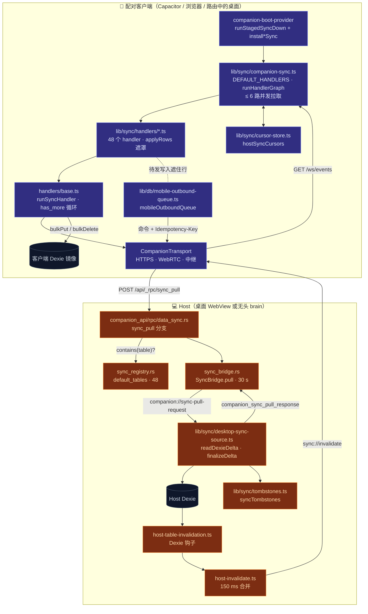

# 同步系统

<Status variant="beta" />

<TLDR>
  Host（桌面或无头）是真相源；配对客户端维护一份 Dexie 镜像。客户端通过 `POST /api/_rpc/sync_pull` 拉取 delta，Host
  的 Rust 层把请求转发给 webview，webview 读取 Dexie 并返回 `SyncDelta`。已注册 48 张表
  （`COMPANION_SYNC_PROTOCOL_TABLE_NAMES`），分三个阶段拉取（`critical` → `interactive` → `background`），最多 6 路并发。
  游标持久化在 `hostSyncCursors`，删除以墓碑传递，客户端的写入经 outbound 队列回传，不走同步。
</TLDR>

<StatGrid>
  <Stat
    label="可同步表"
    value="48"
    hint="lib/data-governance/table-catalog.ts 中的 COMPANION_SYNC_PROTOCOL_TABLE_NAMES"
  />
  <Stat label="拉取阶段" value="3" hint="critical · interactive · background" />
  <Stat label="并发拉取" value="6" hint="SYNC_MAX_CONCURRENT_PULLS" />
  <Stat label="消息追赶" value="500" hint="新客户端先取最新 500 条，之后分页" />
</StatGrid>

## 适用场景

所有场景均通过 `sync_pull` 命令读取 Host。区别在于各表的拉取阶段，这决定了客户端在配对或恢复后多久能获得相应数据。

| 场景 | 表 | 阶段 |
| --- | --- | --- |
| 打开应用即看到会话列表 | `settings`、`characters`、`sessions`、`sessionState`、`sessionFolders`、`conversationOverrides` | `critical` |
| 阅读对话及其运行 | `messages`（分页）、`executionRuns`、`executionRunBindings`、`workflowRuns`、`plans`、`goals`、`agentTasks`、`agentTaskAttempts`、`agentTeamBoard` | `interactive` |
| 处理收件箱 | `connectorDrafts`、`outboundQueue`、`connectorHeartbeats`、`projects`、`botInstallations`、`botEventDeliveries` | `interactive` |
| 浏览议题 | `labels`、`issueProjects`、`issues`、`issueEvents`、`issueRuns`、`issueCycles` | `background` |
| 孪生、角色与模板 | `twinProfile`、`twins`、`twinDrafts`、`chatTemplates`、`templateDefinitions`、`templatePackages`、`templateInstances` | `background` |
| 能力与连接器 | `skills`、`plugins`、`mcpServers`、`memories`、`workflows`、`adapterInstances`、`platformIdentities`、`connectorCallbackBindings`、`workflowDeployments`、`terminalHistory` | `background` |
| Agent 团队与机器人 | `agentTeams`、`agentTeammates`、`agentTeamTasks`、`botDefinitions` | `background` |
| 在客户端上修改 | 无：写入走 `mobileOutboundQueue`，下一次拉取带回 Host 的结果 | 不适用 |

客户端可以是 Capacitor 手机、配对到 Host 的浏览器，或路由到远端 Host 的 Tauri 桌面。Host 要么是桌面应用（由它的 WebView 应答），要么是无头 brain（由它的 Node 运行时从自己的 Dexie 应答）。

## 架构图

```mermaid
flowchart TB
  subgraph Client["📱 配对客户端（Capacitor / 浏览器 / 路由中的桌面）"]
    direction TB
    Boot[companion-boot-provider<br/>runStagedSyncDown + install*Sync]
    Orch[lib/sync/companion-sync.ts<br/>DEFAULT_HANDLERS · runHandlerGraph<br/>≤ 6 路并发拉取]
    Handlers[lib/sync/handlers/*.ts<br/>48 个 handler · applyRows 遮罩]
    Base[handlers/base.ts<br/>runSyncHandler · has_more 循环]
    CursorStore[lib/sync/cursor-store.ts<br/>hostSyncCursors]
    Outbound[lib/db/mobile-outbound-queue.ts<br/>mobileOutboundQueue]
    Transport[CompanionTransport<br/>HTTPS · WebRTC · 中继]
    Mirror[(客户端 Dexie 镜像)]
  end

  subgraph Host["💻 Host（桌面 WebView 或无头 brain）"]
    direction TB
    RPC[companion_api/rpc/data_sync.rs<br/>sync_pull 分支]
    Registry[sync_registry.rs<br/>default_tables · 48]
    Bridge[sync_bridge.rs<br/>SyncBridge.pull · 30 s]
    Source[lib/sync/desktop-sync-source.ts<br/>readDexieDelta · finalizeDelta]
    Tomb[lib/sync/tombstones.ts<br/>syncTombstones]
    Hooks[host-table-invalidation.ts<br/>Dexie 钩子]
    Inval[host-invalidate.ts<br/>150 ms 合并]
    HostDexie[(Host Dexie)]
  end

  Boot --> Orch --> Handlers --> Base --> Transport
  Orch <--> CursorStore
  Base -- "bulkPut / bulkDelete" --> Mirror
  Handlers -. "待发写入遮住行" .- Outbound
  Outbound -- "命令 + Idempotency-Key" --> Transport
  Transport -- "POST /api/_rpc/sync_pull" --> RPC
  RPC -- "contains(table)?" --> Registry
  RPC --> Bridge
  Bridge -- "companion://sync-pull-request" --> Source
  Source --> HostDexie
  Source --> Tomb
  Source -- "companion_sync_pull_response" --> Bridge
  HostDexie --> Hooks --> Inval
  Inval -- "sync://invalidate" --> Transport
  Transport -- "GET /ws/events" --> Orch

  classDef phone fill:#312e81,stroke:#818cf8,color:#e0e7ff
  classDef desk fill:#7c2d12,stroke:#fb923c,color:#fed7aa
  classDef storage fill:#0f172a,stroke:#475569,color:#cbd5e1
  class Boot,Orch,Handlers,Base,CursorStore,Outbound,Transport phone
  class RPC,Registry,Bridge,Source,Tomb,Hooks,Inval desk
  class Mirror,HostDexie storage
```

## 关键模块与文件路径

### 客户端

| 文件 | 作用 |
| --- | --- |
| `lib/sync/types.ts` | `SyncableTable`（由 `COMPANION_SYNC_PROTOCOL_TABLE_NAMES` 派生）、`PAGED_SYNC_TABLES`、`SyncCursor`、`SyncDelta`、`SyncOutcome`、`SyncFailure`、`SyncCursorRow`、`SyncTombstoneRow` |
| `lib/sync/companion-sync.ts` | `DEFAULT_HANDLERS`（表、阶段、`after` 边）、`runSyncDown`、`runStagedSyncDown`、拉取预算、游标加载、所有 `install*Sync` 触发器、`COMPANION_SYNC_DOMAINS` |
| `lib/sync/handlers/base.ts` | `runSyncHandler`：一张表的拉取、`has_more` 分页循环、分片 `bulkPut` / `bulkDelete`、`classifyTransportError` |
| `lib/sync/handlers/*.ts` | 每张表一个 handler（38 个文件、48 个同步函数）；按表的 `rowFilter`、`applyRows` 合并和待发写入遮罩 |
| `lib/sync/handlers/app-settings.ts` | 基于 `CROSS_PLATFORM_SETTING_KEYS` 的 `settings` 合并 |
| `lib/sync/cursor-store.ts` | 基于 `hostSyncCursors` 的 `loadCursors` / `saveCursor` / `clearCursorsForServer` |
| `lib/sync/scheduling.ts` | `whenIdle` / `yieldToMain`，在阶段之间和分页之间使用 |
| `lib/db/mobile-outbound-queue.ts` | 持久写入队列：入队、认领、重试、死信 |
| `components/providers/companion-boot-provider.tsx` | 移动端接线：先跑 critical 阶段，再安装触发器 |
| `components/providers/web-companion-boot-provider.tsx` | 配对到 Host 的浏览器的同样接线 |

### Host 应答端

| 文件 | 作用 |
| --- | --- |
| `lib/sync/desktop-sync-source.ts` | `installDesktopSyncSource`：从 Dexie 应答 `companion://sync-pull-request`；`readDexieDelta`（每张表一个分支）、`readCursorDelta`（分页表）、`finalizeDelta`（墓碑与 `next_since`） |
| `lib/sync/tombstones.ts` | `recordTombstones`、`readTombstonesSince`、`pruneTombstones`（保留 90 天） |
| `lib/sync/host-table-invalidation.ts` | `SYNC_TABLE_SOURCES`，以及在任一同步表变化时发出通知的 Dexie 钩子 |
| `lib/sync/host-invalidate.ts` | `publishSyncInvalidate`：按表 150 ms 合并 `sync://invalidate` |
| `lib/headless/runtimes/desktop-sync-source.ts` | 无头 brain 的注册：同一个 source，换成 socket 桥 |
| `components/providers/desktop-sync-source-provider.tsx` | 桌面（Tauri）上安装 source 与失效钩子 |

### Rust

| 文件 | 作用 |
| --- | --- |
| `src-tauri/src/companion_api/rpc/data_sync.rs` | `sync_pull` 与 `sync_list_tables` 分支：参数检查、租户、注册表、桥选择 |
| `crates/cognia-companion-bus/src/sync_registry.rs` | `SyncTableRegistry`、`default_tables()`（48 个描述符：`name`、`description`、`has_tombstones`） |
| `crates/cognia-companion-bus/src/sync_bridge.rs` | `SyncBridge.pull`：发出请求、等待响应，30 秒超时 |
| `src-tauri/src/companion_api/commands.rs` | `companion_sync_pull_response`，WebView 的回复路径 |
| `crates/cognia-companion/src/ws_bridge.rs` | brain socket：无头 Host 的回复路径，以及 `sync://invalidate` 的发布主题 |

## 数据流：一次 sync_pull

```mermaid
sequenceDiagram
  participant O as runSyncDown
  participant H as handlers/&lt;table&gt;
  participant B as runSyncHandler
  participant T as CompanionTransport
  participant R as data_sync.rs sync_pull
  participant Br as SyncBridge
  participant S as desktop-sync-source
  participant D as Host Dexie
  participant M as 客户端 Dexie

  O->>O: 从 hostSyncCursors 加载游标（每个 Host 一次）
  O->>O: withPullBudget（每个传输 + Host ≤ 6）
  O->>H: run(transport, since, cursor)
  loop has_more 期间（≤ 100 页）
    H->>B: runSyncHandler
    B->>T: call("sync_pull", table, since, content_protocol_version, cursor?)
    T->>R: POST /api/_rpc/sync_pull
    R->>R: 租户检查 · validate_content_protocol · registry.contains(table)
    alt 表未注册
      R-->>T: not exposed to mobile sync
    else
      R->>Br: pull（优先 brain socket，否则 WebView）
      Br->>S: companion://sync-pull-request
      S->>S: 与已解锁账户核对 account
      S->>D: readDexieDelta / readCursorDelta
      S->>D: readTombstonesSince(table, since)
      S-->>Br: companion_sync_pull_response（delta）
      Br-->>T: SyncDelta：rows、deleted_ids、next_since、next_cursor?、has_more?
    end
    T-->>B: SyncDelta
    B->>B: 校验 delta；游标必须前进
    B->>M: rowFilter → applyRows 或 bulkPut（每片 200）→ bulkDelete(deleted_ids)
  end
  B-->>O: SyncOutcome
  O->>O: nextSince 未回退则推进游标
  O->>M: saveCursor(serverKey, table, since, cursor, lastSyncAt, lastError)
```

在若干页之后失败的拉取会携带 `progress`，因此游标仍会越过已应用的那些页。`rate_limited` 失败会等待（`retryAfterMs`，否则 1 秒，最多 30 秒），每张表最多重试三次，并从该 progress 继续。

## 触发方式

| 触发 | 实现 |
| --- | --- |
| 配对 / 启动 | `companion-boot-provider` 等待 `runStagedSyncDown(...).critical`，然后安装下列触发器。`interactive` 与 `background` 在主线程空闲时跟进（`whenIdle`，500 ms 截止） |
| 手动 | 同步状态卡片（`components/settings/companion/sync-status-card.tsx`）执行全量拉取或 `only: [table]`；`use-dexie-first-query` 与 host 编排也会调用 `runSyncDown` |
| 前台 | `installForegroundSync` 监听 `visibilitychange`，由 `claimForegroundSync` 控制：应用至少离开 5 秒，两次运行至少间隔 30 秒 |
| 恢复 | `installResumeSync`（原生恢复），同样的门槛。Web 上不安装 |
| 网络 | `installNetworkSync`：网络恢复时全量拉取 |
| 推送 | `installEventDrivenSync` 订阅 `sync://invalidate` 并拉取指定的表，按表合并 100 ms；不带表名的载荷会拉取所有 handler 表 |
| 工作流运行状态 | `installWorkflowRunStatusSync` 根据 `workflow://run-status` 修补 `workflowRuns` 行，或拉取 `workflowRuns` |
| 事件缺口 | 事件流报告缺口时，`remoteEventResyncCoordinator` 运行 `runSyncDown` |

`runSyncDown` 可重入：Host、配置代次与数据库一致时，全量运行会复用进行中的 promise。定向运行（`only` 或 `stages`）绕过这一点，但每张表最多只有一个进行中的拉取和一个排在其后的拉取（`scheduleTablePull`）。运行中途 Host 发生变化时，剩余拉取以 `Sync host changed` 失败，而不是把一个 Host 的行写到另一个 Host 的游标下。

### 推送这一半

在 Host 上，`installHostTableInvalidation` 在每张同步表的源表上挂 `creating` / `updating` / `deleting` 钩子（`SYNC_TABLE_SOURCES`，带类型约束，新增协议表却没有源表会编译失败）。每次变化都调用 `publishSyncInvalidate(table, conversationKey?)`，它为每张表维持一个 150 ms 的计时器，每个窗口发布一次 `{ table }`；只有窗口内每次写入都指向同一个 `conversationKey` 时，它才会保留下来。`publishHostEvent` 在注册了无头桥时经它发送，否则经 Tauri `emit` 发送，companion 服务端再把它转发给 `GET /ws/events` 上的客户端。本设备自身正路由到远端 Host 时，它什么也不做。工作流运行事件直接发布，绕过合并器。

## 表与游标策略

48 张表即 `lib/data-governance/table-catalog.ts` 中的 `COMPANION_SYNC_PROTOCOL_TABLE_NAMES`，同一组表也是 `sync_registry.rs` 中的 `default_tables()`。有两个线上名称与 Dexie 表名不同：`goals` 对应 `chatGoals`，`plans` 对应 `agentPlans`。

### 阶段与依赖

| 阶段 | 表 | `after` 边 |
| --- | --- | --- |
| `critical`（6） | settings、characters、sessions、conversationOverrides、sessionState、sessionFolders | sessions → characters |
| `interactive`（15） | messages、agentTasks、agentTaskAttempts、plans、goals、agentTeamBoard、executionRuns、workflowRuns、connectorDrafts、outboundQueue、projects、botInstallations、botEventDeliveries、executionRunBindings、connectorHeartbeats | agentTaskAttempts → agentTasks；botEventDeliveries → botInstallations；executionRunBindings → executionRuns |
| `background`（27） | skills、workflows、twinProfile、twins、twinDrafts、labels、issueProjects、issues、issueEvents、issueRuns、issueCycles、plugins、adapterInstances、platformIdentities、connectorCallbackBindings、workflowDeployments、memories、mcpServers、terminalHistory、chatTemplates、templateDefinitions、templatePackages、templateInstances、agentTeams、agentTeammates、agentTeamTasks、botDefinitions | twins → twinProfile；twinDrafts → twins；issueProjects → labels；issues → issueProjects；issueEvents、issueRuns、issueCycles → issues；platformIdentities、connectorCallbackBindings、workflowDeployments → adapterInstances；templateInstances → templateDefinitions + templatePackages；agentTeammates、agentTeamTasks → agentTeams |

`runHandlerGraph` 在一张表 `after` 中列出的表都完成后才启动它，每个传输与 Host 同时最多 `SYNC_MAX_CONCURRENT_PULLS = 6` 个拉取（`withPullBudget`）。指向本次运行之外的表的边会被忽略，环会在最早注册的 handler 处断开。结果按注册顺序返回。

### 游标

| 类型 | 表 | 如何前进 |
| --- | --- | --- |
| 水位 | 44 张表 | `since` 是见过的最大 `updatedAt`（否则 `createdAt`）与最新墓碑 `deletedAt` 中较晚者。Host 返回其上的行 |
| 不透明、分页 | `messages`、`executionRuns`、`workflowRuns`、`connectorHeartbeats`（`PAGED_SYNC_TABLES`） | 客户端发送 `cursor`（从空字符串开始）；Host 返回 `next_cursor` 与 `has_more`。游标是包含版本、表、位置、id 与墓碑水位的 JSON，上限 4096 字节 |

分页表（由 `readCursorDelta` 读取）：

- **`messages`**：新客户端按 `[createdAt+id]` 拿到最新 `MESSAGES_PAGE_SIZE = 500` 条，钉在消息时钟的修订号上。之后按 `[syncRevision+id]` 每页 500 条分页，因此对旧消息的编辑也能送达。旧版本的游标会被重置并重新排空。
- **`executionRuns`**：按 `updatedAt` 与 id 每页 200 条。
- **`workflowRuns`**：按 `[syncActivityAt+id]` 每页 200 条；首次同步回看 30 天，行会先做同步投影。
- **`connectorHeartbeats`**：按 `at` 每页 500 条；首次同步回看一小时。客户端会清理超过 48 小时的镜像心跳。

`memories` 在冷客户端上同样从最新 500 条开始，并要求 `content_protocol_version: 1`。handler 在 `has_more` 为真时持续拉取，每页之间让出主线程，每次运行最多 100 页；游标不前进的一页属于 `schema` 失败。

### 墓碑

`finalizeDelta` 把 `readTombstonesSince(table, since)` 作为 `deleted_ids` 并入每一张表的每个 delta。因此 Host 上的删除恰好在删除路径调用了 `recordTombstones` 时才会到达客户端（会话级联删除会以同一时间戳为会话、消息和会话状态记录墓碑）。注册表的 `has_tombstones` 标志并不控制这一点，它只是 `sync_list_tables` 返回的元数据。客户端在应用行之后以 `bulkDelete` 应用 `deleted_ids`。

### 按表行为

| 表 | 行为 |
| --- | --- |
| `settings` | Host 把单例投影为跨平台键（`projectMirroredSettings`）。客户端把这些键合并到自己的单例上，保留设备本地字段，并跳过 outbound 队列中仍有 `app_settings_update` 处于 pending 或 sending 的键 |
| `characters`、`workflows` | 客户端 `rowFilter: !row.isBuiltIn`；Host 也会丢弃内置角色 |
| `sessions` | 合并 `executionContext` 的可移植部分 |
| `sessionState` | 待发的 `session_mark_read` / `session_mark_unread` 任务会覆盖传入的未读数 |
| `conversationOverrides`、`botInstallations` | 跳过有待发写入的行 |
| `connectorDrafts` | 本地已决定的草稿不会被更旧的 Host 行回退为 `pending` |
| `outboundQueue` | Host 投影任务（不含 segments，标记 `syncedFromHost`）；从别的 Host 镜像来的行被排除 |
| `plugins` | 不发送插件的 `storage` |
| `mcpServers` | 从 `mcpServerSummaries` 读取，从不读取含密钥的配置 |
| `chatTemplates` | 有行被应用时调用 `notifyChatTemplatesChanged` |

## 数据库表

同步读取 Host 已有的表，另外自带三张表：

- `hostSyncCursors`（`&[serverKey+table]`）：客户端按 Host、按表持久化的游标，重启后从中断处继续，不再拉全量快照。`serverKey` 按账户和 Host 划分命名空间，因此一部手机配对多个 Host 时互不干扰。
- `syncTombstones`（`[table+id]`）：Host 在删除的同一事务里，为每次真正的用户删除记一行（`lib/sync/tombstones.ts`），并作为 `deleted_ids` 并入每次 delta。90 天后清理。
- `mobileOutboundQueue`：客户端的持久写入队列（见「已知限制」）。

## 配置项与扩展点

### 游标命名空间

`serverKey` 是 `companionCursorNamespace(config)`：URI 编码后的账户命名空间与 Host id（`targetId`，否则 `deviceId`）以 `:` 连接。游标按 Host、数据库和配置代次各加载一次。如果 `hostSyncCursors` 中存在别的 Host 的键，客户端会在拉取之前清空除 `settings` 之外的所有镜像表，确保两个 Host 永远不共用一份镜像。以旧的设备 id 为键保存的游标会被接管。

### 新增一张表

1. 把线上名称加入 `lib/data-governance/table-catalog.ts` 的 `COMPANION_SYNC_PROTOCOL_TABLE_NAMES`。`SyncableTable` 随之变化，下面这些带类型的映射在补上条目之前无法编译。
2. 在 `crates/cognia-companion-bus/src/sync_registry.rs` 的 `default_tables()` 中加一个描述符。
3. 在 `lib/sync/desktop-sync-source.ts` 的 `readDexieDelta` 中加一个分支，并在 `lib/sync/host-table-invalidation.ts` 的 `SYNC_TABLE_SOURCES` 中加一个源表。
4. 编写 `lib/sync/handlers/<table>.ts`，在 `DEFAULT_HANDLERS` 中以一个阶段和所需的 `after` 边注册；添加它的 `COMPANION_SYNC_DOMAINS` 条目（敏感度、游标类型、删除策略）。
5. 如果删除必须到达客户端，在该表的删除路径中记录墓碑。
6. 更新 `protocol/companion-request-schemas.json` 中 `sync_pull` 的表枚举。

目录、`DEFAULT_HANDLERS` 与 Rust 注册表不一致时，`pnpm audit:data-governance` 会失败；`lib/data-governance/table-catalog.test.ts` 把目录与协议枚举钉在一起。

### Transport

由 `lib/tauri/transport-instance.ts` 选择传输：

- **Capacitor**：`CompanionTransport`。`sync_pull` 是 `POST {baseUrl}/api/_rpc/sync_pull`；不在局域网时可以走 WebRTC 数据通道或中继，失败再回落到 HTTPS。事件从 `GET /ws/events` 到达。
- **配对到 Host 的浏览器**：`CompanionTransport`。
- **Tauri 桌面**：基于本地传输的 `RoutingTransport`；只有路由到远端 Host 时才同步。
- **没有 Host 的 Web**：`WebStubTransport`。

在 Host 上，`sync_pull` 优先交给已连接的 brain socket，否则交给桌面 WebView；两者都没有时回答 503。

### 错误归类

失败的拉取带有一个 `SyncFailure.reason`。`classifyTransportError`（`handlers/base.ts`）映射传输错误；`schema` 与 `upgrade_required` 由 `runSyncHandler` 自己抛出：

- `no_host`：未配对，或没有 Host 传输。不记录游标和错误
- `upgrade_required`：Host 与客户端一方对另一方太旧（例如保存了分页游标，而 Host 不返回 `next_cursor`）
- `rate_limited`：429，附带 `retryAfterMs`
- `not_implemented`：not found、unknown command、404
- `schema`：delta 格式错误，或分页游标没有前进
- `transport`：其他一切，包括达到分页上限
- `unknown`：非传输错误的兜底

## 关联子系统

<Cards>
  <Card title="存储" href="./storage" description="同步针对的 Dexie 表的源头" />
  <Card
    title="备份与数据"
    href="./backup-and-data"
    description="跨设备的另一种数据搬运 —— 离线、全量、加密快照"
  />
</Cards>

## 关联 ADR

- [ADR 0014 — Capacitor Mobile Shell](../adr/0014-capacitor-mobile-shell)
- [ADR 0015 — Mobile V2 Completion](../adr/0015-mobile-v2-completion)
- [ADR 0012 — Transport Abstraction](../adr/0012-transport-abstraction)
- [ADR 0027 — 移动端离线容忍与服务器发现](../adr/0027-mobile-offline-and-discovery)

## 已知限制

- **墓碑按表记录，并非每张表都有。** 只有 Host 的删除路径调用了 `recordTombstones`，删除才会到达客户端；会话、消息、工作流、角色、议题以及大多数标记 `has_tombstones: true` 的表都会这样做。`botDefinitions` 与 `botInstallations` 虽被标记，删除路径却不记录任何东西。技能、记忆、MCP 服务器、插件和模板相关的表在用户删除时还不记墓碑，所以 Host 上删掉的行会留在客户端。见 `docs/plans/2026-09-30-collaboration-multi-device-gap-analysis.md` 缺口 B2。
- **客户端写入走 outbound 队列，不走同步。** `MOBILE_OUTBOUND_COMMANDS` 中的命令被持久排队（`pending → sending → sent | deadlettered | rejected | conflicted`），由 Host 的 24 小时幂等账本去重。待发写入在落定前会遮住传入的行。
- **Host 优先。** 传入的行直接覆盖镜像（`bulkPut`）；只有 `settings` 会合并一组白名单内的跨平台键。这个平面上没有字段级合并。
- **消息历史分页获取。** 新客户端先收到最新 500 条消息，更早的历史走会话记录分页，不走同步拉取。
- **Host 的表中约有 48 张参与同步。** 产物、画布、知识库、草稿、媒体和模型服务商配置不做镜像。
- **移动端没有后台同步。** 拉取只在前台、恢复、网络变化和 `sync://invalidate` 时运行，没有 BGTask 或 WorkManager 任务。
- **Built-in 双过滤**：服务端 + 客户端都过滤 `isBuiltIn`，防止某天桌面侧漏过滤而把手机的本地内置覆盖。
