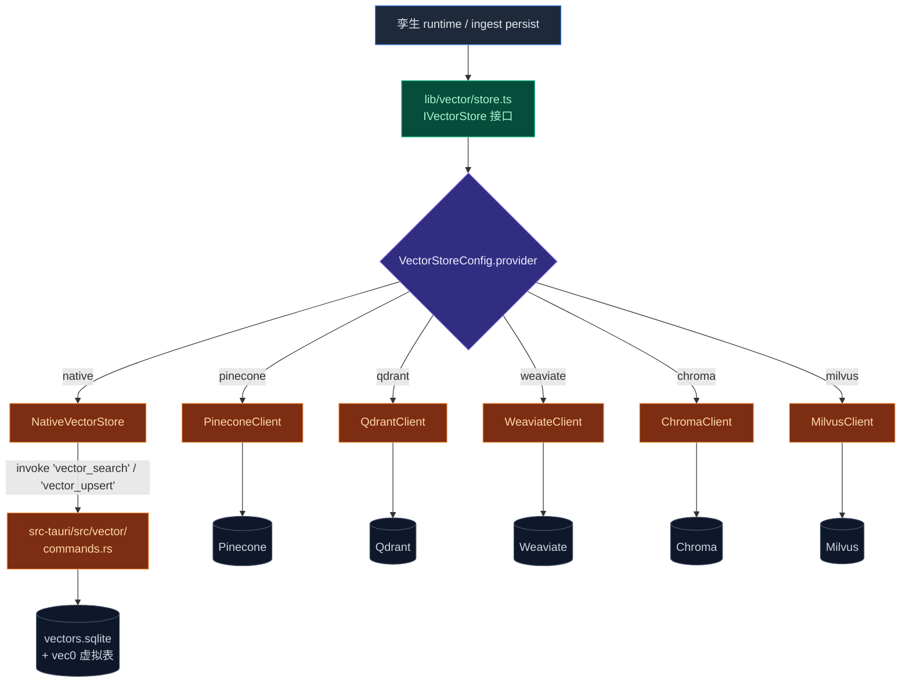

# 向量库

<Status variant="stable">Stable</Status>

<TLDR>
  Cognia 在一层薄抽象 `IVectorStore`（`lib/vector/store.ts`）后面，分发到 6 种后端 —— 桌面默认
  sqlite-vec（原生 Rust + auto-extension），云端 Pinecone / Qdrant / Weaviate / Chroma / Milvus。
  接口除了 CRUD 之外还覆盖 scroll（大规模迭代）、import/export（后端迁移）、stats（健康检查）。 孪生
  collection 形如 `cognia_twin_{twinId}`，每条 chunk 都打上 `vectorBackend` + `vectorCollection`
  标签，便于将来 re-host 时不必重 embed。
</TLDR>

Cognia 的 [员工数字孪生](../subsystems/employee-twin) 需要向量索引来支持 RAG。整个向量库藏在 `IVectorStore`
（`lib/vector/store.ts`）后面，应用其余部分不必关心活动后端是哪一个。

完整设计原由参见 [ADR-0004](../adr/0004-vector-native-backend)。

<StatGrid>
  <Stat label="支持后端" value="6" hint="chroma · pinecone · qdrant · milvus · native · weaviate" />
  <Stat
    label="支持 embedding 供应商"
    value="5"
    hint="openai · google · cohere · mistral · transformersjs"
  />
  <Stat label="接口方法" value="14+" hint="CRUD · scroll · export · import · stats" />
</StatGrid>

## 后端

| 后端                     | 适用       | 备注                                                    |
| ------------------------ | ---------- | ------------------------------------------------------- |
| **sqlite-vec（native）** | 仅桌面     | 桌面默认。数据位于 `<app_data>/cognia/vectors.sqlite`。 |
| **Pinecone**             | Web + 桌面 | `@pinecone-database/pinecone`                           |
| **Qdrant**               | Web + 桌面 | `@qdrant/js-client-rest`                                |
| **Weaviate**             | Web + 桌面 | `weaviate-client`                                       |
| **Chroma**               | Web + 桌面 | `chromadb`                                              |
| **Milvus**               | Web + 桌面 | `@zilliz/milvus2-sdk-node`                              |

Web 模式（`!isTauri()`）会在孪生设置中隐藏 native 选项；必须用云端。`VectorStoreProvider` 类型枚举
六个值，与 `lib/vector/store.ts:10` 的定义一一对应。

<Tabs groupId="vector-backend" persist items={["sqlite-vec", "Pinecone", "Qdrant", "Weaviate", "Chroma", "Milvus"]}>
  <Tab value="sqlite-vec">
    **优点**：零运维、单文件、无网络往返、易备份。
    **缺点**：仅桌面、无水平扩展、暴力扫描（≤ 10 万 chunk 内表现良好）。

    文件：`<app_data>/cognia/vectors.sqlite`。可用 `sqlite3 <path> .tables` 检视。

  </Tab>
  <Tab value="Pinecone">
    托管云，搭建最快。在 `VectorStoreConfig` 里填 `pineconeApiKey` + `pineconeIndexName` +
    `pineconeNamespace`。
    **注意**：延迟以地域为主 —— 选最靠近用户的区域。
  </Tab>
  <Tab value="Qdrant">
    可自托管或托管。过滤能力丰富（payload filter）。`VectorStoreConfig.qdrantUrl` +
    `qdrantApiKey` + `qdrantCollectionName`。希望数据留在自有基础设施时是好选择。
  </Tab>
  <Tab value="Weaviate">
    模块化，自带混合搜索。`weaviateUrl` + `weaviateApiKey`。基础设施开销较重。
  </Tab>
  <Tab value="Chroma">
    最轻的云端选项。支持嵌入模式与 server 模式（`chromaMode: "embedded" | "server"`，server 走
    `chromaServerUrl`）。适合原型；企业特性较后期。
  </Tab>
  <Tab value="Milvus">
    超大规模（百万到十亿级）首选。`milvusAddress` + `milvusToken`，或 username/password；可选
    SSL 与 collection 名。搭建最重。仅在 sqlite-vec / 更小后端不够用时再考虑。
  </Tab>
</Tabs>

<Callout type="info" title="切换后端">
  重新嵌入需**手动**。切后端后请在孪生 Sources tab 用"重新嵌入"动作 —— 维度、距离度量、元数据 schema
  可能不同。
</Callout>

## 桌面为何选 sqlite-vec

ADR-0004 选择 sqlite-vec 的理由：

- **单文件** —— 易备份、易跨设备拷贝、可用任何 sqlite 工具检查。
- **无服务器** —— 零运维成本；数据与 Cognia 其他数据放在一起。
- **可打包进 Tauri** —— `sqlite-vec` 在任何连接打开前作为 SQLite **auto-extension** 注册一次（见下）。
- **足够快** —— 一个用户的孪生通常 < 100k chunk，sqlite-vec 的 SIMD 暴力扫描足够，免去 HNSW 维护复杂度。

## 原生后端内部

```
src-tauri/src/vector/
  mod.rs          # 公共 API
  db.rs           # 连接池、auto-extension 注册、迁移
  schema.rs       # 表定义 + MIGRATIONS 列表
  filters.rs      # 元数据过滤的 WHERE 构造（build_where）
  types.rs        # Point / Collection / SearchHit / Filter
  commands.rs     # #[tauri::command] 封装
  error.rs        # 向量专用错误类型（Result<T>）
```

### 表结构

存储 collection 与 vec0 虚拟表的组合：

```sql title="src-tauri/src/vector/schema.rs（示意）"
CREATE TABLE collections (
  id          INTEGER PRIMARY KEY,
  name        TEXT UNIQUE NOT NULL,
  dimension   INTEGER NOT NULL,
  created_at  TEXT NOT NULL,
  metadata    TEXT
);

-- 每个 collection_id 对应一张 vec0 虚拟表 + 一张 metadata 普通表：
CREATE VIRTUAL TABLE vec_<collection_id> USING vec0(
  embedding float[<dim>]
);

CREATE TABLE meta_<collection_id> (
  id        TEXT PRIMARY KEY,
  content   TEXT NOT NULL,
  metadata  TEXT
);
```

`vec0` 虚拟表是 sqlite-vec 索引；元数据表是普通 SQL，方便在相似度搜索之前/期间按 source / chunk 类型等过滤。

### Auto-extension 加载

`src-tauri/src/vector/db.rs:30` 用 `std::sync::Once` 在进程内仅注册一次：

```rust title="src-tauri/src/vector/db.rs"
static REGISTER_VEC_EXTENSION: Once = Once::new();

fn register_vec_extension() {
    REGISTER_VEC_EXTENSION.call_once(|| {
        unsafe {
            rusqlite::ffi::sqlite3_auto_extension(Some(std::mem::transmute(
                sqlite_vec::sqlite3_vec_init as *const (),
            )));
        }
    });
}
```

注册发生在第一次 `VectorStore::new` 调用前，对应 sqlite-vec 上游集成测试的写法。后续所有连接都自动继承该扩展。
连接采用 `WAL + NORMAL` pragma，并用 `parking_lot::Mutex<Connection>` 做进程内串行化。

### 查询

原生 `query` 命令接收：

- 查询嵌入（Float32 数组）。
- 集合名。
- 可选元数据过滤（`Filter` + `FilterMode = And | Or`）。
- `topK` 上限。

返回 `SearchHit { id, score, content, metadata }`，按余弦相似度排序。score 范围 `[0, 1]`
（sqlite-vec 返回 `1 - cosine`）。

## 架构速览



## 前端抽象（`lib/vector/`）

```
lib/vector/
  index.ts            # 公共 API + Pinecone 类型 re-export
  store.ts            # IVectorStore 接口 + 所有实现
  embedding.ts        # 嵌入客户端（孪生 ingest 也用它）
  readiness.ts        # 健康检查（被 SettingsSyncProvider 使用）
  pinecone-client.ts  # 云端客户端实现
  qdrant-client.ts
  weaviate-client.ts
  chroma-client.ts
  milvus-client.ts
```

## `IVectorStore` 接口

`store.ts:501` 暴露 14 个方法（含可选）：

```ts title="lib/vector/store.ts"
export interface IVectorStore {
  readonly provider: VectorStoreProvider

  // ── CRUD ─────────────────────────────────────────────────────────
  addDocuments(collectionName: string, documents: VectorDocument[]): Promise<void>
  updateDocuments(collectionName: string, documents: VectorDocument[]): Promise<void>
  deleteDocuments(collectionName: string, ids: string[]): Promise<void>
  deleteAllDocuments?(collectionName: string): Promise<number>
  getDocuments(collectionName: string, ids: string[]): Promise<VectorDocument[]>

  // ── 搜索 ─────────────────────────────────────────────────────────
  searchDocuments(collectionName, query, options?): Promise<VectorSearchResult[]>
  searchByEmbedding?(collectionName, embedding, options?): Promise<VectorSearchResult[]>
  searchDocumentsWithTotal?(collectionName, query, options?): Promise<SearchResponse>

  // ── 迭代 / 迁移 ──────────────────────────────────────────────────
  scrollDocuments?(collectionName, options?: ScrollOptions): Promise<ScrollResponse>
  exportCollection?(name): Promise<CollectionExport>
  importCollection?(data, overwrite?: boolean): Promise<void>

  // ── 集合管理 ─────────────────────────────────────────────────────
  createCollection(
    name,
    options?: { dimension?; metadata?; embeddingModel?; embeddingProvider?; description? }
  ): Promise<void>
  deleteCollection(name): Promise<void>
  renameCollection?(oldName, newName): Promise<void>
  truncateCollection?(name): Promise<void>
  listCollections(): Promise<VectorCollectionInfo[]>
  getCollectionInfo(name): Promise<VectorCollectionInfo>

  // ── 统计 ─────────────────────────────────────────────────────────
  countDocuments?(collectionName, options?): Promise<number>
  getStats?(): Promise<VectorStats>
}
```

`?` 标记的方法在某些后端可能不实现（例如 `exportCollection` 在云端实现里可能基于 scroll 模拟）。
孪生 runtime 主要走 `searchByEmbedding`（带预计算 embedding 调用），ingest 主要走 `addDocuments` +
`createCollection`。

### 迁移用法

**后端切换时不会自动搬数据**。但 `exportCollection` + `importCollection` 提供了人工触发的迁移路径：

```ts title="迁移示意"
// 1. 从源后端导出
const data = await sourceStore.exportCollection("cognia_twin_user1")

// 2. 在目标后端导入（含 overwrite 标志）
await targetStore.importCollection(data, /* overwrite */ true)
```

注意 export 携带原始 embedding 向量；如果新后端使用不同的 embedding 模型，`importCollection` 不会
重新生成向量 —— 那种情况下应该走孪生 Sources tab 的"重新嵌入"流程（详见下文）。

## Embedding 供应商

`lib/ai/embedding/embedding.ts` 是统一 embedding 客户端，支持 5 种 provider：

| Provider         | 默认模型                  | 默认维度 |
| ---------------- | ------------------------- | -------- |
| `openai`         | `text-embedding-3-small`  | 1536     |
| `google`         | `text-embedding-004`      | 768      |
| `cohere`         | `embed-english-v3.0`      | 1024     |
| `mistral`        | `mistral-embed`           | 1024     |
| `transformersjs` | `Xenova/all-MiniLM-L6-v2` | 384      |

`DEFAULT_EMBEDDING_MODELS`（`lib/vector/embedding.ts:21`）持有默认配置。`Character.embeddingProviderId`
可独立于 chat provider 设置 —— 例如用 Anthropic 聊天、用 OpenAI 做 embedding。

## Embedding 配置版本化与迁移

`apply-twin-context.ts:27` 定义了 `TwinRuntimeEmbeddingConfig`：

```ts title="lib/twin/runtime/apply-twin-context.ts"
export interface TwinRuntimeEmbeddingConfig {
  provider: "openai" | "google" | "cohere" | "mistral" | "transformersjs"
  model: string
  apiKey: string
  baseURL?: string
}
```

切换 embedding 模型或 provider 意味着 **维度 / 距离度量 / 语义空间** 都可能变。当前实现：

- **chunk 行打标签** —— `twinChunks` 每行带 `vectorBackend` + `vectorCollection` + `embeddingModel`
  - `embeddingDimensions`（在 metadata 里）。
- **检测 + banner** —— 工作台 Settings tab 在检测到当前 `Character.embeddingProviderId` 与 chunk 标签
  不匹配时显示 "re-embed required" banner。
- **重新嵌入** —— 用户在 Sources tab 触发"重新嵌入"动作；ingest 流水线跳过 parse + redact，直接
  从 `embed` 阶段开始（用现有的脱敏文本），写回新维度的向量。**不会**清空原 chunk，而是新建一个
  新 collection 然后切换 `Character.embeddingProviderId`。

旧 collection 保留以便回滚或人工 export → import 到其他后端。

## 设置

用户在 **设置 → 孪生 → 向量库** 选择后端：

- 后端单选（sqlite-vec / Pinecone / Qdrant / Weaviate / Chroma / Milvus）。Web 模式隐藏 native 项。
- 云端后端的连接信息（URL、API key、namespace）。
- 嵌入维度 —— 必须与所选嵌入模型输出一致（OpenAI text-embedding-3-small 默认 1536）。

`readiness.ts` 在保存时跑健康检查：一次小的 upsert + query 往返。失败则提示用户清晰错误，原后端保持不动。

## 切换后端时的重新 embed

切换后端**不会**自动迁移。两条路径：

1. **离线迁移** —— 在旧后端调 `exportCollection`，在新后端调 `importCollection`。维度 / 距离度量必须一致。
2. **重新嵌入** —— 在孪生工作台 Sources tab 触发"重新嵌入"，针对新后端重跑 ingest 流水线的 embed + persist
   阶段。这是切换 embedding model 或 provider 时唯一正确的选择。

实现参考：`apply-twin-context.ts:120-125` 的 retrieve 路径；切换时 collection 名 `cognia_twin_{twinId}`
通常保持不变，但若 backend 改变 collection 命名约定也可能跟着改。

## 性能要点

<TypeTable
  type={{
    批量大小: {
      description:
        "每次 LLM 嵌入 100 chunk，每次后端 upsert 100 行。可在 `lib/twin/ingest/{embed,persist}.ts` 调。",
      type: "调参",
    },
    "并发 ingest": {
      description: "每个孪生一次一个，由 job worker 强制（`maxConcurrentIngest = 1`）。",
      type: "不变量",
    },
    原生查询延迟: {
      description: "2024 笔电上 ~50k chunk 的 `topK ≤ 20` < 50ms。",
      type: "指标",
    },
    云端延迟: {
      description: "往返为主；从非美用户访问 Pinecone us-east-1 通常 80–150ms。",
      type: "指标",
    },
  }}
/>

<Callout type="info" title="不要混维度">
  切换嵌入模型意味着切换向量维度 —— 在查询之前必须重新嵌入所有 chunk。
  存储不会自动检测维度错配；你只会拿到无意义的最近邻，而不是清晰错误。 工作台 Settings tab 的
  "re-embed required" banner 是发现错配的唯一稳定路径。
</Callout>

## 向量文档 ID 设计

`lib/twin/ingest/persist.ts:49` 生成 `vectorDocId`：

```ts title="lib/twin/ingest/persist.ts"
function newVectorDocId(twinId: string, sourceId: string, idx: number): string {
  return `${twinId}__${sourceId}__${idx.toString(36)}_${Math.random().toString(36).slice(2, 8)}`
}
```

- **唯一性** —— 同一孪生下不同 source 的 chunk 不会撞 id。
- **可定位** —— 从 vectorDocId 即可解析回 twinId + sourceId（在审计 / 调试时方便）。
- **稳定** —— Dexie 写完后不会变；远程后端的 vector point id 直接复用。

Runtime 查询时拿到一批 `vectorDocId`，调 `getTwinChunksByVectorDocIds` 一次性回查 chunk 全文。这避免了
"一次相似度搜索 = N 次 Dexie 读"的扇出。

## 在哪里入手

| 目标                 | 文件                                                                |
| -------------------- | ------------------------------------------------------------------- |
| 加一个新云端后端     | `lib/vector/<provider>-client.ts`，在 `store.ts` 注册，加设置 UI    |
| 调 sqlite-vec schema | `src-tauri/src/vector/schema.rs`（在 `MIGRATIONS` 数组追加一项）    |
| 加新的元数据过滤     | `src-tauri/src/vector/filters.rs:build_where` + `IVectorStore` 类型 |
| 改进 readiness 检查  | `lib/vector/readiness.ts`                                           |
| 加新 embedding 模型  | `lib/vector/embedding.ts:DEFAULT_EMBEDDING_MODELS` + 设置 UI        |

## 测试

- 每个云端客户端 mock 自己的 SDK（`*-client.test.ts`）。
- `lib/vector/store.test.ts` 覆盖分发逻辑与 `IVectorStore` 形态。
- 原生后端有 Rust 集成测试在 `src-tauri/src/vector/` 各模块的 `#[cfg(test)] mod tests` 块中：
  建临时 DB、auto-extension 注册、upsert 向量、查询、scroll。

## 相关

<Cards>
  <Card title="员工数字孪生" href="./employee-twin" description="向量库的最大消费者" />
  <Card
    title="Provider 系统"
    href="./provider-system"
    description="embedding provider 选择 + alias"
  />
  <Card title="搜索系统" href="./search-system" description="非向量的关键字 / FTS 搜索路径" />
  <Card
    title="备份 & 数据传输"
    href="./backup-and-data"
    description="默认向量数据不在备份内 —— 只备份 twin sources 与 chunk 元数据"
  />
  <Card title="存储" href="./storage" description="承载 chunk 元数据的 Dexie 表" />
</Cards>
