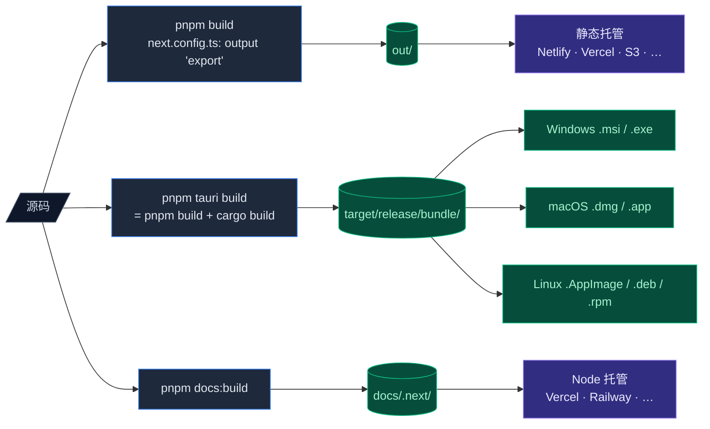

# 部署

Cognia 有三种发布形式：

1. **Web** —— 静态导出，可部署到任意静态托管。
2. **桌面** —— Tauri 打包的 Windows / macOS / Linux 安装包。
3. **文档** —— Fumadocs Next.js 服务，独立部署。



每种各有自己的构建管线。

## Web 构建

```bash
pnpm build
```

`next.config.ts` 设置了 `output: "export"`，构建会把完整静态站点产到 `out/`。**没有 Node.js 服务器** —— 每页要么预渲染，要么客户端渲染。

含义：

- 主应用不支持 API 路由（用 Rust 后端或外部服务）。
- `next/image` 走非优化模式（在 `next.config.ts` 中配置）。
- 路由是文件系统式；宿主需要为未知路径回落到 `index.html`（或开启 trailing-slash）。

部署到：

- **Netlify / Cloudflare Pages / GitHub Pages** —— 指向 `out/`。
- **静态 Nginx / Apache** —— 把 `out/` 拷到文档根；配置 SPA 回落。
- **S3 / CloudFront** —— 把 `out/` 同步到 bucket；设 index document。

Web 模式下 UI 层会通过 `isTauri()` 检查隐藏桌面专属功能（原生向量库、定时备份、原生调度器提升）。

### 环境变量

只有 `NEXT_PUBLIC_*` 暴露给浏览器。在宿主上构建期设置：

```bash
NEXT_PUBLIC_APP_NAME="Cognia" \
NEXT_PUBLIC_API_URL="https://api.example.com" \
pnpm build
```

`lib/env.ts` 在首次访问时校验必需变量。

### 缓存头

为了最佳缓存：

```
out/_next/static/**/*  →  Cache-Control: public, max-age=31536000, immutable
out/**/*.html          →  Cache-Control: no-cache
```

Tailwind v4 输出的 CSS 带哈希；可长缓存。

## 桌面构建（Tauri）

```bash
pnpm tauri build
```

它会：

1. 跑 `beforeBuildCommand` → `pnpm build` → 生成 `out/`。
2. 以 release 模式编译 Rust crate。
3. 把 `out/` 目录 + `sidecar/` 资源 + Rust 二进制打成平台安装包。

### 输出位置

<Tabs groupId="os" persist items={["Windows", "macOS", "Linux"]}>
  <Tab value="Windows">
    ```
    src-tauri/target/release/bundle/
      msi/Cognia_<version>_x64_en-US.msi
      nsis/Cognia_<version>_x64-setup.exe   # 如配置
    ```

    企业批量分发首选 `.msi`；NSIS `.exe` 更小，首次运行体验更友好。

  </Tab>
  <Tab value="macOS">
    ```
    src-tauri/target/release/bundle/
      dmg/Cognia_<version>_<arch>.dmg
      macos/Cognia.app
    ```

    分发 `.dmg`。Apple Silicon 用户取 `aarch64` 包，Intel 用户取 `x86_64`。
    需要单文件可用 `lipo` 合并为通用二进制。

  </Tab>
  <Tab value="Linux">
    ```
    src-tauri/target/release/bundle/
      appimage/cognia_<version>_amd64.AppImage
      deb/cognia_<version>_amd64.deb        # 如配置
      rpm/cognia-<version>.x86_64.rpm        # 如配置
    ```

    AppImage 兼容性最好。用户 `chmod +x` 后即可运行。

  </Tab>
</Tabs>

### 构建参数

```bash
pnpm tauri build --target x86_64-pc-windows-msvc   # 指定目标三元组
pnpm tauri build --debug                            # 含调试符号（更大、更慢）
pnpm tauri build --bundles none                     # 跳过安装包（仅二进制）
pnpm tauri build --bundles deb,rpm,appimage         # 指定 bundle 类型
```

### 跨平台编译

Tauri 跨编译需要可观的搭建（Docker 镜像、sysroot）。日常做法：

- 用各平台原生 CI runner 各自构建。
- GitHub Actions 矩阵是标准模式；见 `.github/workflows/release.yml`。

### 资源

`tauri.conf.json` → `bundle.resources` 列出要拷到包里的文件：

```jsonc
"resources": [
  "../sidecar/claude-host.mjs",
  "../sidecar/a2ui-mcp.mjs",
  "../sidecar/package.json",
  "../sidecar/node_modules/**/*"
]
```

Sidecar 的整个 `node_modules/` 都被打进去，因为 sidecar 作为独立 Node 进程运行，需要这些依赖。生产用户**不**需要本地 Node —— 包内的 Node 二进制（或宿主系统的）会运行 sidecar。

## 代码签名

未签名的 Cognia 在首次运行时会触发 SmartScreen / Gatekeeper / Linux 信任警告。要广泛分发：

<Tabs groupId="os" persist items={["Windows", "macOS", "Linux"]}>
  <Tab value="Windows">
    - 申请 EV 或 OV 代码签名证书（DigiCert、Sectigo……）。
    - 在 `tauri.conf.json` 设 `bundle.windows.certificateThumbprint`（或 CI 中用 env 注入）。
    - Tauri 使用 `signtool.exe`；CI 中确保 Windows SDK 在 PATH。
  </Tab>
  <Tab value="macOS">
    - Apple Developer 账号 + Developer ID Application 证书。
    - 公证：设 `APPLE_ID`、`APPLE_PASSWORD`（应用专用）、`APPLE_TEAM_ID` 环境变量；Tauri 自动调 `notarytool`。
    - 通用二进制：分别构建 `aarch64-apple-darwin` 与 `x86_64-apple-darwin`，再 `lipo` 合并。
  </Tab>
  <Tab value="Linux">
    AppImage / DEB / RPM 通常不签代码。可以改为：

    - 通过 flathub 或 snapcraft 分发以获得信任。
    - 用 GPG 签 release tag，发分离签名。

  </Tab>
</Tabs>

仓库自带 `.github/workflows/release.yml`，在多 OS 矩阵上跑 Tauri 构建并把安装包作为 release asset 上传。代码签名 env 注释保留 —— 拿到证书后取消注释。

## 应用内更新

`tauri-plugin-updater` 默认**禁用**（`tauri.conf.json` → `plugins.updater.active = false`）。Cognia 已搭好管线，但等维护者主动开启。

启用步骤：

<Steps>
  <Step>
    ### 生成签名密钥对

    ```bash
    pnpm tauri signer generate -w ~/.tauri/cognia-next.key
    ```

    <Callout type="error" title="切勿提交私钥">
      私钥 `cognia-next.key` 不可入仓、不可分享。
      只分发 `cognia-next.key.pub`。
    </Callout>

  </Step>
  <Step>
    ### 把公钥写进 `tauri.conf.json`

    ```jsonc
    "plugins": {
      "updater": {
        "active": true,
        "endpoints": [
          "https://github.com/MaxQian888/cognia-next/releases/latest/download/latest.json"
        ],
        "pubkey": "<paste public key here>"
      }
    }
    ```

  </Step>
  <Step>
    ### 设置 CI secrets

    - `TAURI_PRIVATE_KEY` —— 私钥文件 base64。
    - `TAURI_KEY_PASSWORD` —— 密码（或留空字符串）。

  </Step>
  <Step>
    ### 打 tag 发版

    Tauri GitHub Action 会发布 `latest.json` 清单，updater 在启动时轮询。

  </Step>
</Steps>

完整指南见 `src-tauri/UPDATER.md`。

### `latest.json` 形态

```jsonc
{
  "version": "0.2.0",
  "notes": "Release notes",
  "pub_date": "2026-05-03T12:00:00Z",
  "platforms": {
    "darwin-aarch64": {
      "signature": "<base64>",
      "url": "https://github.com/.../Cognia_0.2.0_aarch64.dmg",
    },
    "windows-x86_64": {
      /* ... */
    },
    "linux-x86_64": {
      /* ... */
    },
  },
}
```

## 文档站点构建

```bash
pnpm docs:build
```

输出：`docs/.next/`。这是**完整 Next.js 服务端构建**（不是静态导出），因为 Fumadocs 用路由处理器实现全文搜索。

部署到：

- **Vercel** —— 导入项目时把根目录设为 `docs/`，Vercel 自动识别 Next.js。
- **Railway / Render / Fly.io** —— 推 `docs/` 目录；跑 `pnpm install && pnpm build && pnpm start`。
- **自建 Node** —— `cd docs && pnpm install --prod && pnpm build && pnpm start`。默认端口 3001。

文档构建独立于主应用 —— 没有共享输出目录。两者可同时部署而不冲突。

### 搜索索引

Fumadocs 用 Orama 在浏览器内做全文搜索。索引在构建期由 MDX 内容生成并发到客户端。无需外部服务。

## CI/CD

仓库自带 `.github/workflows/`：

| Workflow           | 触发                     | 内容                                             |
| ------------------ | ------------------------ | ------------------------------------------------ |
| `ci.yml`（或等价） | PR、push                 | Lint、typecheck、test、Web 构建、有时 Tauri 冒烟 |
| `release.yml`      | 匹配 `v*.*.*` 的 tag     | Tauri 构建矩阵 → 把安装包作为 release asset 上传 |
| `docs.yml`         | 推送到 `main`、docs/\*\* | 构建 + 部署文档                                  |

如要 fork Cognia 并发布二进制，把这些 workflow 一起 fork —— 它们编码了矩阵目标和签名接线。

## 版本管理

Cognia 在 `package.json` 与 `Cargo.toml` 都用 **semver**，需手动同步。

`tauri.conf.json` → `version` 是用户可见版本（关于对话框、updater 都用它），必须与 npm/Cargo 版本一致。

发版流程：

1. 在 `package.json`、`src-tauri/Cargo.toml`、`src-tauri/tauri.conf.json` 改版本号。
2. 更新 `CHANGELOG.md`。
3. `git tag v0.2.0 && git push --tags`。
4. release workflow 跑剩余流程。

## 冒烟测试

发版前在每个平台跑：

| 表面    | 冒烟                                                           |
| ------- | -------------------------------------------------------------- |
| Web     | `pnpm build && npx serve out` —— 浏览器打开、发一条消息        |
| 桌面    | `pnpm tauri build` —— 安装并启动产物；发消息；提升一个调度任务 |
| Sidecar | `node sidecar/claude-host.mjs --smoke`                         |
| 更新    | 安装 N-1，把 `latest.json` 设到 N，验证自动更新                |

## 在哪里入手

| 目标                | 文件                                                                   |
| ------------------- | ---------------------------------------------------------------------- |
| 加新构建目标        | `src-tauri/Cargo.toml`（target 依赖）、`tauri.conf.json`               |
| 调发版流水线        | `.github/workflows/release.yml`                                        |
| 自定义安装包        | `tauri.conf.json` → `bundle.windows` / `bundle.macOS` / `bundle.linux` |
| 加 runtime 环境变量 | `lib/env.ts`、`.env.example`、部署文档                                 |

## 中文文档到此结束

<Cards>
  <Card title="概览" href="./" description="回到中文文档首页" />
  <Card
    title="ADR-0001 · 备份 schema v3"
    href="../adr/0001-backup-schema-v3"
    description="为什么备份长成现在这样"
  />
  <Card
    title="ADR-0002 · 调度器"
    href="../adr/0002-scheduler-full-agent-resolution"
    description="应用内 vs 原生分层"
  />
  <Card
    title="ADR-0003 · 员工数字孪生"
    href="../adr/0003-employee-digital-twin"
    description="仓库里最深的设计文档"
  />
  <Card
    title="ADR-0004 · 向量后端"
    href="../adr/0004-vector-native-backend"
    description="为何桌面默认 sqlite-vec"
  />
</Cards>

<Callout type="info" title="读到这里？">
  如果你发现文档与实际代码不符，请提 PR 或 issue。文档漂移是一类 bug ——
  这些页面对齐当前实现，不是愿景文档。
</Callout>
