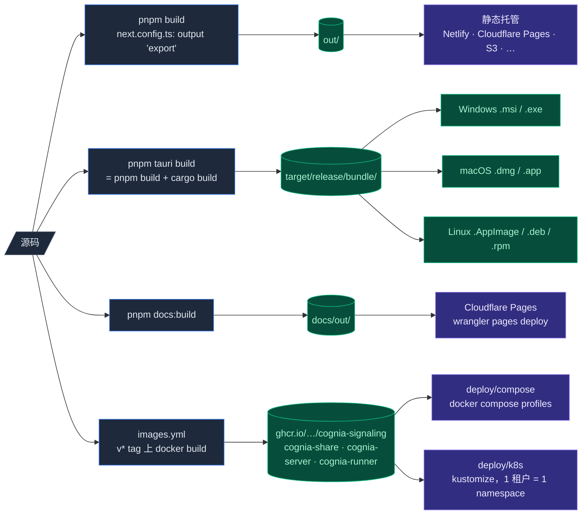

# 部署
Cognia 有四种发布形式：

1. **Web** —— 静态导出，可部署到任意静态托管。
2. **桌面** —— Tauri 打包的 Windows / macOS / Linux 安装包。
3. **文档** —— Fumadocs **静态导出**，部署到 Cloudflare Pages。
4. **自托管云端套件** —— ADR-0059 的云服务（signaling、share、headless cognia-server）以 GHCR 容器镜像发布，配 compose 套件与 k8s kustomize 树。



每种各有自己的构建管线。

## Web 构建

```bash
pnpm build
```

`next.config.ts` 设置了 `output: "export"`，构建会把完整静态站点产到 `out/`。**没有 Node.js 服务器** —— 每页要么预渲染，要么客户端渲染。

含义：

- 主应用不支持 API 路由（用 Rust 后端或外部服务）。
- `next/image` 走非优化模式（在 `next.config.ts` 中配置）。
- 路由是文件系统式；宿主需要为未知路径回落到 `index.html`（或开启 trailing-slash）。

部署到：

- **Netlify / Cloudflare Pages / GitHub Pages** —— 指向 `out/`。
- **静态 Nginx / Apache** —— 把 `out/` 拷到文档根；配置 SPA 回落。
- **S3 / CloudFront** —— 把 `out/` 同步到 bucket；设 index document。

Web 模式下 UI 层会通过 `isTauri()` 检查隐藏桌面专属功能（原生向量库、定时备份、原生调度器提升、平台连接器收发、Workflow webhook 等）。

### 环境变量

只有 `NEXT_PUBLIC_*` 暴露给浏览器。在宿主上构建期设置：

```bash
NEXT_PUBLIC_APP_NAME="Cognia" \
NEXT_PUBLIC_API_URL="https://api.example.com" \
pnpm build
```

`lib/env.ts` 在首次访问时校验必需变量。

### 缓存头

为了最佳缓存：

```text
out/_next/static/**/*  →  Cache-Control: public, max-age=31536000, immutable
out/**/*.html          →  Cache-Control: no-cache
```

Tailwind v4 输出的 CSS 带哈希；可长缓存。

## 桌面构建（Tauri）

```bash
pnpm tauri:build:bundled
```

内置模式是默认发布模式：所有由应用启动的 JavaScript 进程统一使用随 Cognia
打包且经过校验的 Node 26。需要更小的安装包时，使用
`pnpm tauri:build:system-node`。轻量模式仍会打包 sidecar 代码与
`node_modules`，只排除 Node 可执行文件；首次启动会检测 Node.js 26 或更高版本，
缺失或版本过旧时应用仍可打开，并提供官方安装页面的直接入口。对应的开发命令是
`pnpm tauri:dev:bundled` 与 `pnpm tauri:dev:system-node`。

<Callout type="warn" title="请使用 profile 命令">
  不要直接执行 `tauri build --features system-node-runtime`。package 命令还会移除
  包内 Node 资源及其准备步骤；Cargo feature 只负责选择运行时行为。
</Callout>

它会：

1. 跑 `beforeBuildCommand` → `pnpm build` → 生成 `out/`。
2. 以 release 模式编译 Rust crate。
3. 把 `out/` 目录 + `sidecar/` 资源 + Rust 二进制打成平台安装包。

### 输出位置

<Tabs groupId="os" persist items={["Windows", "macOS", "Linux"]}>
  <Tab value="Windows">
    ```text
    target/release/bundle/
      msi/Cognia_<version>_x64_en-US.msi
      nsis/Cognia_<version>_x64-setup.exe   # 如配置
    ```

    企业批量分发首选 `.msi`；NSIS `.exe` 更小，首次运行体验更友好。

  </Tab>
  <Tab value="macOS">
    ```text
    target/release/bundle/
      dmg/Cognia_<version>_<arch>.dmg
      macos/Cognia.app
    ```

    分发 `.dmg`。Apple Silicon 用户取 `aarch64` 包，Intel 用户取 `x86_64`。
    需要单文件可用 `lipo` 合并为通用二进制。

  </Tab>
  <Tab value="Linux">
    ```text
    target/release/bundle/
      appimage/cognia_<version>_amd64.AppImage
      deb/cognia_<version>_amd64.deb        # 如配置
      rpm/cognia-<version>.x86_64.rpm        # 如配置
    ```

    AppImage 兼容性最好。用户 `chmod +x` 后即可运行。

  </Tab>
</Tabs>

### 构建参数

```bash
pnpm tauri build --target x86_64-pc-windows-msvc   # 指定目标三元组
pnpm tauri build --debug                            # 含调试符号（更大、更慢）
pnpm tauri build --bundles none                     # 跳过安装包（仅二进制）
pnpm tauri build --bundles deb,rpm,appimage         # 指定 bundle 类型
```

### 跨平台编译

Tauri 跨编译需要可观的搭建（Docker 镜像、sysroot）。日常做法：

- 用各平台原生 CI runner 各自构建。
- GitHub Actions 矩阵是标准模式；见 `.github/workflows/build-tauri.yml`，由 `release.yml` 调用。

### 资源

`tauri.conf.json` → `bundle.resources` 列出要拷到包里的文件（节选 —— 实际约 17 项，还包括 `vscode-ext-host/`、`webclone/`、终端 shell-integration 脚本和 `hooks/builtin/`）：

```jsonc title="src-tauri/tauri.conf.json"
"resources": [
  "../sidecar/claude-host.mjs",
  "../sidecar/a2ui-mcp.mjs",
  "../sidecar/package.json",
  "../sidecar/node_modules/**/*",
  "../sidecar/webclone/package.json",
  // …完整列表见 tauri.conf.json
]
```

两种模式都会打包 Sidecar 的整个 `node_modules/`，因为 sidecar 作为独立 Node
进程运行，需要这些依赖。内置模式不会回退到系统 Node，轻量模式也不会回退到包内
runtime；Agent、MCP helper、webclone、OAuth helper 与 JavaScript 插件会在同一
进程内统一使用一个经过校验的 runtime。

<Callout type="warn" title="tauri-build 在编译期校验这些路径">
  `bundle.resources` 里每个普通文件路径在任何编译 Rust crate 的地方都必须存在 —— 包括 headless 的 `Dockerfile.cognia-server` 构建。新增资源但不同步扩 Dockerfile 的 COPY 集会弄坏容器镜像；`images.yml` 的 PR paths 已覆盖编译输入，让它在 CI 就失败而不是拖到打 tag。
</Callout>

### 已安装 Tauri 插件

`tauri.conf.json` + `Cargo.toml` 中目前接入的 Tauri 插件包括：

- `plugin-autostart`、`plugin-cli`、`plugin-clipboard-manager`、`plugin-deep-link`（`cognia://` scheme）、`plugin-dialog`、`plugin-fs`、`plugin-notification`、`plugin-opener`、`plugin-os`、`plugin-process`、`plugin-store`、`plugin-updater`（已启用，见下）、`plugin-window-state`。

deep-link 的桌面 scheme 是 `cognia`，移动端列表留空（[移动端架构](../ui/mobile-architecture)章节单独管）。

## 代码签名

未签名的 Cognia 在首次运行时会触发 SmartScreen / Gatekeeper / Linux 信任警告。要广泛分发：

<Tabs groupId="os" persist items={["Windows", "macOS", "Linux"]}>
  <Tab value="Windows">
    - 申请 EV 或 OV 代码签名证书（DigiCert、Sectigo……）。
    - 在 `tauri.conf.json` 设 `bundle.windows.certificateThumbprint`（或 CI 中用 env 注入）。
    - Tauri 使用 `signtool.exe`；CI 中确保 Windows SDK 在 PATH。
  </Tab>
  <Tab value="macOS">
    - 仓库已配置 Tauri ad-hoc 基线 `bundle.macOS.signingIdentity: "-"`，避免 Apple Silicon 拒绝从 GitHub 下载的构建；用户仍可能需要在“隐私与安全性”中批准应用。
    - Apple Developer 账号 + Developer ID Application 证书。
    - 公证：设 `APPLE_ID`、`APPLE_PASSWORD`（应用专用）、`APPLE_TEAM_ID` 环境变量；Tauri 自动调 `notarytool`。
    - 通用二进制：分别构建 `aarch64-apple-darwin` 与 `x86_64-apple-darwin`，再 `lipo` 合并。
  </Tab>
  <Tab value="Linux">
    AppImage / DEB / RPM 通常不签代码。可以改为：

    - 通过 flathub 或 snapcraft 分发以获得信任。
    - 用 GPG 签 release tag，发分离签名。

  </Tab>
</Tabs>

仓库通过 `release.yml` → `build-tauri.yml` 在多 OS 矩阵上跑 Tauri 构建并把安装包上传到已发布的 release。updater 签名已通过 `TAURI_SIGNING_*` secrets 生效；macOS 已有 ad-hoc 签名基线，经过认证的操作系统信任签名（SmartScreen / 公证）仍按上文各平台自行接入。

## 应用内更新

`tauri-plugin-updater` **已启用**：`tauri.conf.json` 带上了 release endpoints、真实公钥和 `createUpdaterArtifacts: true`，每次 release 构建都会产出带签名的 updater 产物。`release.yml`（`v*` tag）以继承 secrets 的方式调用 `build-tauri.yml`，发布 updater 启动时轮询的签名 `latest.json`。

设置、命令面板、托盘操作和后台检查统一复用 `lib/tauri/updater.ts`。该客户端会合并并发拉取、释放过期的原生更新资源、应用自定义超时和当前网络代理，并将下载与安装拆分。设置 → 关于提供自动检查间隔、后台下载、安装后重启、请求超时和代理选项。Tauri capability 仅开放 `allow-check`、`allow-download`、`allow-install` 和进程重启，不开放组合式下载安装与进程退出权限。

CI 签名 secrets（Tauri **v2** 名称 —— v1 的 `TAURI_PRIVATE_KEY` / `TAURI_KEY_PASSWORD` 不会被读取）：

- `TAURI_SIGNING_PRIVATE_KEY` —— 私钥文件内容。
- `TAURI_SIGNING_PRIVATE_KEY_PASSWORD` —— 私钥密码（无密码则空字符串）。

<Callout type="error" title="切勿提交私钥">
  入仓的只有公钥。换钥会让所有已安装的构建失去更新通道 —— 把私钥当 root 凭据对待。
</Callout>

Fork 的话：用 `pnpm tauri signer generate -w ~/.tauri/cognia-next.key` 生成自己的密钥对，替换 `plugins.updater.pubkey` + `endpoints`，配好上面两个 secrets。本地不签名构建：覆盖 `createUpdaterArtifacts` 为 `false`，不要删公钥。

完整指南见 `src-tauri/UPDATER.md`。

### `latest.json` 形态

```jsonc
{
  "version": "0.2.0",
  "notes": "Release notes",
  "pub_date": "2026-05-03T12:00:00Z",
  "platforms": {
    "darwin-aarch64": {
      "signature": "<base64>",
      "url": "https://github.com/.../Cognia_0.2.0_aarch64.dmg",
    },
    "windows-x86_64": {
      /* ... */
    },
    "linux-x86_64": {
      /* ... */
    },
  },
}
```

## 文档站点构建

```bash
pnpm docs:build
```

输出：`docs/out/` —— 文档站和主应用一样是**静态导出**（`docs/next.config.ts` → `output: "export"`）。没有需要运行的 Node 服务；`docs/package.json` 的 `next start` 对导出产物不适用。

部署到：

- **Cloudflare Pages**（已接线的路径）—— `deploy.yml` 的 `deploy-docs` job 执行 `wrangler pages deploy docs/out`。
- **任意静态托管** —— 指向 `docs/out/`。

文档构建独立于主应用 —— 没有共享输出目录。两者可同时部署而不冲突。

### 搜索索引

Fumadocs 用 Orama 在浏览器内做全文搜索。索引在构建期由 MDX 内容生成、随静态资产发布 —— 没有路由处理器，也无需外部服务。

## 自托管云服务（ADR-0059）

云端组件 —— `signaling`（WebRTC 会合，7892）、`share`（公开分享链接，8787）、headless 的 `cognia-server` 大脑宿主（**27890**，HTTPS）—— 以 GHCR 镜像发布，由 `images.yml` 在 `v*` tag 上构建：

```
ghcr.io/maxqian888/cognia-signaling
ghcr.io/maxqian888/cognia-share
ghcr.io/maxqian888/cognia-server        # -slim / -full 两个变体
ghcr.io/maxqian888/cognia-runner        # T2 每 agent 一容器的 runner 镜像
```

- **Compose 套件** —— `deploy/compose/`，用 profile 承载阶段阶梯（`server`、`tls` Caddy/ACME 前门、`observability` Prometheus、`logto` 自托管 OIDC IdP），另有把外部 agent 拆到独立 runner 容器的 T2 override。入口见 [`deploy/compose/README.md`](https://github.com/MaxQian888/cognia-next/blob/master/deploy/compose/README.md)。
- **Kubernetes** —— `deploy/k8s/` kustomize 树，1 租户 = 1 namespace；kind 冒烟与生产注意事项（gVisor RuntimeClass、必填 `publicUrl`、按租户接 Logto）见 `deploy/k8s/README.md`。
- **冒烟** —— `scripts/smoke/compose-smoke.mjs` 按 tier（`services` / `server` / `tls`）驱动运行中的栈；`compose-e2e.yml` 在每个触及套件的 PR 上跑它。
- 完整架构与隔离/拓扑阶梯：ADR-0059（英文版：`docs/content/docs/en/adr/0059-cloud-deployment-headless-brain.md`）。

headless host 明确区分两个信令 URL。`COGNIA_SIGNALING_URL` 是宿主内部的会合端点（Compose 与 Kubernetes 均为 `ws://signaling:7892/v2/signaling`）；`COGNIA_PUBLIC_SIGNALING_URL` 是从部署公开 URL 推导出的客户端可见端点（`https` 转为 `wss`，路径固定为 `/v2/signaling`）。Caddy 与 Kubernetes Ingress 将该公开路径路由到 `signaling:7892` Service，其余应用路径仍由 `cognia-server` 处理。

### 浏览器 Companion 安全要求

生产环境的 Web 客户端只接受以下 Companion 通道：

- 公共 CA 信任的 HTTPS；
- 管理员本地 CA 签发、且浏览器已经信任的 HTTPS；或
- 加密 WebRTC（直连或 TURN 中继）。

浏览器无法自动安装或绕过本地 CA。配对前必须先把 CA 安装到操作系统/浏览器信任库，并在浏览器中验证完整证书链；Companion server 同时配置对应证书和私钥。生产构建拒绝明文 HTTP。只有非生产构建显式设置 `NEXT_PUBLIC_ALLOW_INSECURE_COMPANION_HTTP=1` 时才允许 HTTP，并持续显示不安全警告；高风险控制不得使用该模式。

Web Origin 必须按完整 HTTPS Origin（`scheme://host[:port]`）精确授权。带认证的接口禁止使用 `*`；methods、headers 和 preflight 保持最小范围，Private Network Access 也只能放行管理员明确配置的 Origin。排障时分别识别证书不受信、Origin/CORS、PNA、JWT 过期或撤销、缺少 TURN、宿主离线，不能统一显示为“网络错误”。

同一浏览器账号可以保存多个加密 Companion 目标，但一次只激活一个。Provider key、设备私钥与 signaling 私钥只进入浏览器 Vault；OIDC token 与五分钟 DPoP access token 仅保留在内存。公开目标簿只保存连接元数据；每个目标还拥有独立 IndexedDB 数据库和 outbound queue 作用域。

## CI/CD

`.github/workflows/` 的真实清单：

| Workflow               | 触发                                     | 内容                                                                             |
| ---------------------- | ---------------------------------------- | -------------------------------------------------------------------------------- |
| `ci.yml`               | `master`/`develop` 的 push/PR            | 编排 `quality.yml` + `test.yml`（lint、typecheck、Jest 分片、覆盖率门禁、E2E）   |
| `build-tauri.yml`      | `workflow_call` / 手动                   | 桌面构建矩阵；updater 签名走 `TAURI_SIGNING_*` secrets                           |
| `release.yml`          | `v*` tag                                 | 继承 secrets 调用 `build-tauri.yml` → draft release + 签名 `latest.json`         |
| `images.yml`           | `v*` tag / 手动 / 容器输入相关 PR        | 构建并发布四个 GHCR 镜像；PR 上对 `cognia-server` 跑 `cargo check` 编译门禁      |
| `deploy.yml`           | **仅手动 dispatch** / `workflow_call`    | GitHub Environments + `DEPLOY_ENABLED` 双门禁：Workers（wrangler）、Fly、docs Pages |
| `compose-e2e.yml`      | `deploy/compose/**`、services、smoke 的 PR | 在 CI 里拉起 compose 套件并跑分层冒烟                                            |
| `signaling-server.yml` | `master`/`dev` push + 服务相关 PR        | 服务 CI：clippy + 测试 + 覆盖率 + worker-build 校验                              |
| `share-server.yml`     | `master`/`dev` push + 服务相关 PR        | 服务 CI：clippy + 测试 + core↔Worker 常量一致性                                  |

普通 push 不会部署任何东西 —— `deploy.yml` 是刻意 opt-in 的（fork 无 secrets 也保持绿色）。

## 版本管理

Cognia 作为**一个整体**用 [Changesets](https://github.com/changesets/changesets) 管理版本 —— 根 `package.json` 的 version 是唯一事实源。

发版流程：

1. 开发期间，每个用户可见的变更都随代码提交一条 `pnpm changeset` 记录。
2. `pnpm release:version` —— 先 `changeset version`（消费积累的条目、抬根版本、更新 `CHANGELOG.md`），再 `pnpm version:sync` 把新版本传播到 `src-tauri/tauri.conf.json`、各 `Cargo.toml`、`cli/`、`sidecar/`、`mobile/`、`docs/`。
3. 提交，`git tag v0.2.0 && git push --tags`。
4. `release.yml` + `images.yml` 跑剩余流程（安装包 + 容器镜像）。

## 冒烟测试

发版前在每个平台跑：

| 表面    | 冒烟                                                           |
| ------- | -------------------------------------------------------------- |
| Web     | `pnpm build && npx serve out` —— 浏览器打开、发一条消息        |
| 桌面    | `pnpm tauri build` —— 安装并启动产物；发消息；提升一个调度任务 |
| Sidecar | `node sidecar/claude-host.mjs --smoke`                         |
| 更新    | 安装 N-1，把 `latest.json` 设到 N，验证自动更新                |

## 在哪里入手

| 目标                | 文件                                                                   |
| ------------------- | ---------------------------------------------------------------------- |
| 加新构建目标        | `src-tauri/Cargo.toml`（target 依赖）、`tauri.conf.json`               |
| 调发版流水线        | `.github/workflows/release.yml` + `build-tauri.yml`                    |
| 自定义安装包        | `tauri.conf.json` → `bundle.windows` / `bundle.macOS` / `bundle.linux` |
| 加 runtime 环境变量 | `lib/env.ts`、`.env.example`、部署文档                                 |

## 中文文档到此结束

<Cards>
  <Card title="概览" href="./" description="回到中文文档首页" />
  <Card
    title="移动端架构"
    href="../ui/mobile-architecture"
    description="Capacitor + Web 一体化的移动客户端"
  />
  <Card title="伴随 API" href="../subsystems/companion-api" description="远端 / 云端客户端对应的服务端协议" />
  <Card
    title="运行时 & Tauri"
    href="../core/runtime-and-tauri"
    description="桌面运行时的 IPC、命令、事件模型"
  />
</Cards>

<Cards>
  <Card
    title="ADR-0001 · 备份 schema v3"
    href="../adr/0001-backup-schema-v3"
    description="为什么备份长成现在这样"
  />
  <Card
    title="ADR-0002 · 调度器"
    href="../adr/0002-scheduler-full-agent-resolution"
    description="应用内 vs 原生分层"
  />
  <Card
    title="ADR-0003 · 员工数字孪生"
    href="../adr/0003-employee-digital-twin"
    description="仓库里最深的设计文档"
  />
  <Card
    title="ADR-0004 · 向量后端"
    href="../adr/0004-vector-native-backend"
    description="为何桌面默认 sqlite-vec"
  />
</Cards>

<Callout type="info" title="读到这里？">
  如果你发现文档与实际代码不符，请提 PR 或 issue。文档漂移是一类 bug ——
  这些页面对齐当前实现，不是愿景文档。
</Callout>
