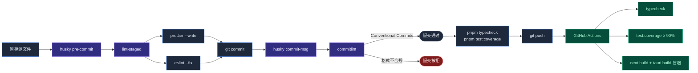

# 开发工作流

<Status variant="stable" />

<TLDR>
  从仓库根用 **pnpm**。<Kbd>pnpm dev</Kbd> 跑 Web，<Kbd>pnpm tauri dev</Kbd>
  跑桌面。测试与源同目录，≥90% 覆盖率阈值。Pre-commit 钩子（Husky + lint-staged +
  commitlint）保证代码树整洁。
</TLDR>

<StatGrid>
  <Stat label="覆盖率阈值" value="90%" hint="行 · 分支 · 函数" />
  <Stat label="shadcn/ui 组件" value="57" hint="均已预装" />
  <Stat label="路径别名" value="6" hint="@/components、@/lib、@/ui、……" />
  <Stat label="语言" value="2" hint="en + zh-CN" />
</StatGrid>

本页覆盖在 Cognia 代码库中高效工作所需的一切：日常脚本、约定、钩子、测试。

## 日常脚本

```bash
# 前端（主应用 — 端口 3000）
pnpm dev              # Next.js 开发服务器
pnpm build            # 静态导出 → out/  （Tauri 生产构建依赖）
pnpm start            # Next.js 生产服务器（构建后）
pnpm lint             # ESLint（eslint.config.mjs flat config）
pnpm lint:fix         # ESLint 自动修复
pnpm format           # Prettier 写入
pnpm format:check     # Prettier 检查（不写入）
pnpm typecheck        # TypeScript --noEmit（严格模式）

# 测试
pnpm test             # Jest
pnpm test:watch       # Jest watch
pnpm test:coverage    # Jest 覆盖率（≥90% 阈值）
pnpm sidecar:test     # Sidecar/builtin-tools 的 Node test runner
pnpm audit:slots      # 扫描插件 slot 契约（contracts/plugin-points.ts）

# 桌面（Tauri）
pnpm tauri dev        # 桌面热重载
pnpm tauri build      # 当前平台生产安装包
pnpm tauri info       # 工具链诊断
pnpm tauri icon       # 由源 PNG 生成桌面图标

# 文档站点（端口 3001）
pnpm docs:dev         # Fumadocs 开发（同时生成 docs/.source/）
pnpm docs:build       # 文档生产构建
pnpm docs:start       # 文档生产服务器

# 移动端（Capacitor）
pnpm mobile:sync      # next build + capacitor sync
pnpm mobile:open:ios
pnpm mobile:open:android

# Monaco 编辑器（自动通过 predev / prebuild 运行）
pnpm monaco:copy      # 把 Monaco 资源复制到 public/
```

### 隐式运行

- `predev` 与 `prebuild` 调用 `node scripts/copy-monaco-assets.mjs`，让 Monaco 在 Next.js 启动前就绪。
- `prepare`（在 `pnpm install` 后运行）安装 Husky git hooks。
- `tauri build` 的 `beforeBuildCommand` 会先跑 `pnpm build`，免去你手动连跑。

## 项目结构速览

<Files>
  <Folder name="cognia-next" defaultOpen>
    <Folder name="app">
      <File name="layout.tsx" />
      <File name="page.tsx" />
      <File name="globals.css" />
      <Folder name="twin">
        <File name="page.tsx" />
      </Folder>
      <Folder name="scheduler" />
      <Folder name="agent-teams" />
      <Folder name="canvas" />
      <Folder name="skills" />
      <Folder name="a2ui" />
      <Folder name="workflows" />
      <Folder name="inbox" />
      <Folder name="logs" />
    </Folder>
    <Folder name="components">
      <Folder name="ui">— vendored shadcn（不写测试）</Folder>
      <Folder name="ai-elements">— vendored（不写测试）</Folder>
      <Folder name="chat" />
      <Folder name="twin" />
      <Folder name="settings" />
      <Folder name="scheduler" />
      <Folder name="plugin" />
      <Folder name="workflow" />
      <Folder name="inbox" />
      <Folder name="providers" />
    </Folder>
    <Folder name="lib">
      <File name="tauri.ts">— 唯一 invoke() 调用点</File>
      <File name="utils.ts" />
      <Folder name="claude">— Agent SDK 胶水</Folder>
      <Folder name="twin">— ingest / distill / runtime</Folder>
      <Folder name="vector">— sqlite-vec + 5 个云端后端</Folder>
      <Folder name="data">— 备份 schema v3 + 20 个域</Folder>
      <Folder name="scheduler" />
      <Folder name="plugin" />
      <Folder name="connectors" />
      <Folder name="workflow" />
      <Folder name="external-bridge" />
      <Folder name="anthropic-subscription" />
      <Folder name="db">— Dexie schema v26</Folder>
      <Folder name="ai" />
      <Folder name="appearance" />
      <Folder name="i18n" />
      <Folder name="themes" />
    </Folder>
    <Folder name="hooks">— 共享 React hooks</Folder>
    <Folder name="i18n">
      <Folder name="messages">
        <File name="en.json" />
        <File name="zh-CN.json" />
      </Folder>
    </Folder>
    <Folder name="types" />
    <Folder name="sidecar">
      <File name="claude-host.mjs" />
      <File name="a2ui-mcp.mjs" />
      <Folder name="builtin-tools" />
    </Folder>
    <Folder name="src-tauri">
      <Folder name="src">
        <File name="lib.rs" />
        <File name="commands.rs" />
        <Folder name="claude" />
        <Folder name="scheduler" />
        <Folder name="vector" />
        <Folder name="workflow" />
        <Folder name="connectors" />
        <Folder name="tts" />
      </Folder>
      <File name="tauri.conf.json" />
      <File name="Cargo.toml" />
    </Folder>
    <Folder name="docs">— Fumadocs 文档站点（即本站）</Folder>
    <File name="package.json" />
    <File name="pnpm-workspace.yaml" />
    <File name="next.config.ts" />
    <File name="tsconfig.json" />
    <File name="components.json" />
    <File name="jest.config.ts" />
  </Folder>
</Files>

## 路径别名

| 别名           | 映射到           | 常见用途                            |
| -------------- | ---------------- | ----------------------------------- |
| `@/*`          | 仓库根           | 通配（例如 `@/types`、`@/scripts`） |
| `@/components` | `components/`    | UI                                  |
| `@/lib`        | `lib/`           | 逻辑                                |
| `@/ui`         | `components/ui/` | shadcn 原语                         |
| `@/hooks`      | `hooks/`         | 共享 hooks                          |
| `@/utils`      | `lib/utils.ts`   | `cn()`                              |

在 `tsconfig.json` 与 `components.json` 中配置。新增别名时**两处都要改**。

文档包（`docs/`）：

| 别名                 | 映射到                | 备注                     |
| -------------------- | --------------------- | ------------------------ |
| `@/*`                | `docs/`               | 文档包内部               |
| `collections/server` | `docs/.source/server` | 由 fumadocs-mdx 自动生成 |

## 代码约定

### TypeScript

- 严格模式（`tsconfig.json`）。
- 避免 `any`；用 `unknown` + 类型保护，或正确的类型。
- 状态机用判别联合（如 `ScheduledTask.trigger`）。
- 类型导入用 `import type { ... }` —— bundle 更小。

### React

- 仅函数组件。
- Hooks 顶层调用，不可条件。
- 类型与组件同放：`components/foo/foo.tsx` 的 `FooProps` 与 `Foo` 一起。
- RSC vs 客户端：路由优先 RSC；只在需要 state、effect、浏览器 API、Tauri 时加 `"use client"`。

### 命名

| 类别        | 约定                 | 示例                          |
| ----------- | -------------------- | ----------------------------- |
| 组件        | PascalCase           | `UserProfile.tsx`             |
| 组件文件    | kebab-case           | `user-profile.tsx`            |
| Hooks       | `use*` camelCase     | `useTwinProfile()`            |
| 工具函数    | camelCase            | `formatDate()`                |
| 类型 / 接口 | PascalCase           | `UserData`                    |
| 常量        | SCREAMING_SNAKE_CASE | `MAX_RETRIES`                 |
| Tauri 命令  | snake_case           | `claude_send`、`vector_query` |

shadcn/ui 组件遵循 shadcn 命名（kebab-case 文件名，PascalCase 导出 —— `components/ui/button.tsx` 导出 `Button`）。

### 样式

- Tailwind utility-first；除非动态值无法用类表达，否则避免 `style={{...}}`。
- 用 `@/lib/utils` 的 `cn()` 安全合并类：

  ```tsx
  cn("base-classes", condition && "conditional", className)
  ```

- 优先用主题 token（`bg-background`、`text-foreground`）而非硬编码颜色。
- 暗色变体：`dark:bg-foo`（`dark` 变体基于 class）。

### 状态管理

- **本地状态** —— React `useState` / `useReducer`。
- **跨组件短暂状态** —— Zustand store（`stores/...`）。
- **持久化状态** —— Dexie 表（`lib/db/`）；用 `dexie-react-hooks` 的 `useLiveQuery` 让 React 自动响应变化。
- **设置** —— 走 `SettingsSyncProvider`，不要直接动 Dexie。
- **跨 tab 状态** —— 用 Tauri 事件（Rust 侧）或 `BroadcastChannel`（Web）；不要轮询 Dexie。

### 导入顺序

ESLint 强制：

1. 内置 / 外部模块（`react`、`next`、第三方）。
2. 路径别名内部模块（`@/components/...`）。
3. 相对模块（`./...`、`../...`）。
4. 样式 import 最后。

跑 `pnpm lint:fix` 自动整理。

## 测试规范



### 覆盖率阈值

每个源文件必须达到 **≥90% 覆盖率**（行、分支、函数）。

```bash
pnpm test:coverage
```

Jest 配置（`jest.config.ts`）通过 `coverageThreshold` 按文件强制阈值。CI 拒绝低于阈值的 PR。

### 测试位置

- **TypeScript / TSX** —— 与源文件同目录的 `xxx.test.ts(x)`。`lib/avatar.ts` ↔ `lib/avatar.test.ts`。**不要**用 `__tests__/` 或 `tests/` 子目录。
- **Rust** —— 同 `.rs` 文件底部 `#[cfg(test)] mod tests {}` 块。集成测试可放 `src-tauri/tests/`。
- **Sidecar** —— `sidecar/builtin-tools/__tests__/*.test.mjs`，用 `pnpm sidecar:test` 运行（Node test runner）。

### 排除覆盖

- `components/ui/` —— vendored shadcn/ui（去 shadcn 上游测，不测这里的副本）。
- `components/ai-elements/` —— vendored ai-elements。
- 仅类型文件（`types/...` 无 runtime 代码）。

### 测试模式

| 需求                | 工具                                 |
| ------------------- | ------------------------------------ |
| 渲染 React          | `@testing-library/react`             |
| 用户交互            | `@testing-library/user-event`        |
| jest-dom 匹配器     | `@testing-library/jest-dom`          |
| IndexedDB / Dexie   | `fake-indexeddb`                     |
| Mock fetch          | Jest `jest.spyOn(global, "fetch")`   |
| Mock Tauri `invoke` | 每个测试 mock `@tauri-apps/api/core` |
| Fake timers         | Jest modern fake timers              |
| Snapshot            | 仅纯渲染可用；不用于行为断言         |

### 测试样板

```tsx title="components/ui/button.test.tsx"
import { render, screen } from "@testing-library/react"
import userEvent from "@testing-library/user-event"
import { Button } from "./button"

describe("Button", () => {
  it("renders children", () => {
    render(<Button>Click me</Button>)
    expect(screen.getByRole("button", { name: "Click me" })).toBeInTheDocument()
  })

  it("calls onClick", async () => {
    const onClick = jest.fn()
    render(<Button onClick={onClick}>X</Button>)
    await userEvent.click(screen.getByRole("button"))
    expect(onClick).toHaveBeenCalledTimes(1)
  })
})
```

Rust：

```rust title="src-tauri/src/scheduler/mod.rs"
#[cfg(test)]
mod tests {
    use super::*;

    #[test]
    fn cron_parser_handles_wildcard() {
        let p = CronParser::parse("* * * * *").unwrap();
        // ...
    }
}
```

## shadcn/ui 用法

57 个组件已预装在 `components/ui/`。直接 import：

```tsx
import { Button } from "@/components/ui/button"
import { Dialog, DialogContent, DialogHeader } from "@/components/ui/dialog"
```

**不要**对已有组件再跑 `pnpm dlx shadcn@latest add <name>`（会覆盖本地修改）。

`TooltipProvider` 已经挂在 `app/layout.tsx`，无需额外包裹。

需要全新组件（不在 shadcn 目录中）时，写在 `components/<feature>/` 下，而不是塞进 `components/ui/`。

## Git hooks

Husky 安装：

| 钩子                 | 工具        | 职责                                 |
| -------------------- | ----------- | ------------------------------------ |
| `pre-commit`         | lint-staged | 对暂存文件跑 Prettier + ESLint --fix |
| `commit-msg`         | commitlint  | 校验 Conventional Commits            |
| `prepare-commit-msg` | （无）      | —                                    |

如果钩子拖慢提交，用 `lint-staged --debug` 排查。

钩子由 `pnpm install` 自动安装（`prepare` 脚本）。如需手动重装：`pnpm exec husky`。

## Conventional Commits

```text
<type>(<scope>): <description>
```

允许的 type：`feat`、`fix`、`docs`、`style`、`refactor`、`perf`、`test`、`build`、`ci`、`chore`、`revert`。

示例：

```text
feat(twin): add per-source re-embed action
fix(scheduler): handle DST transitions in cron next()
docs(adr): add 0004 vector backend
chore(deps): bump tauri to 2.9.1
```

<Callout type="warn" title="钩子会拒绝不规范的消息">
  commit-msg 钩子拒绝不符合 Conventional Commits 的消息。 rebase 时如需绕过，优先用 `git commit
  --amend`（仍会跑钩子），而非 `--no-verify`。
</Callout>

## Linting

`eslint.config.mjs` 是 flat config，扩展 `eslint-config-next`。关键规则：

- React 19 / Next.js 16 约定。
- TypeScript 感知规则（`@typescript-eslint/*`）。
- `react-hooks/exhaustive-deps` 报错（不是警告）。
- 集成 Prettier（格式化问题导致 lint 失败）。

提交前跑 `pnpm lint`；`pnpm lint:fix` 能自动修绝大部分。

## 类型检查

```bash
pnpm typecheck
```

对整个仓库跑 `tsc --noEmit`。CI 应当跑这个；`pnpm test` 不做类型检查。

## 调试

| 表面                 | 工具                                                                |
| -------------------- | ------------------------------------------------------------------- |
| 浏览器层             | DevTools（F12）—— 与普通 Web 一致                                   |
| Rust 层              | `RUST_LOG=debug pnpm tauri dev`，看控制台与 `app/logs/`             |
| Sidecar              | sidecar 的 `stderr` 镜像到 Rust 日志、`app/logs/`                   |
| Dexie                | DevTools → Application → IndexedDB → `cognia-claude`                |
| 原生日志             | OS 原生日志查看器（事件查看器 / Console.app / `journalctl --user`） |
| 向量库（sqlite-vec） | `sqlite3 <app_data>/cognia/vectors.sqlite` 然后 `.tables`           |
| 结构化追踪           | 见 [可观测性](../subsystems/observability)：sidecar / Tauri / Web 三段链路      |

## 常见重构模式

| 想要……                          | 做法                                                          |
| ------------------------------- | ------------------------------------------------------------- |
| 抽取共享 hook                   | 移到 `hooks/` 并更新 import                                   |
| 加 Tauri 命令                   | 见 [运行时 & Tauri](../core/runtime-and-tauri) §"添加新的 IPC 命令" |
| 升级 Dexie schema               | 见 [存储](../data/storage) §"新增表"                                |
| 加 executor / importer / 域传输 | 加注册项；遵循既有模式                                        |
| 国际化字符串                    | 见 [主题 & 国际化](../ui/theming-and-i18n) §"加新翻译 key"        |

## 在哪里入手

如果你刚来：

1. 挑小事开始 —— 一条翻译、一个 ESLint 警告、一处测试空缺。
2. 跑 `pnpm test:coverage` 找未达 90% 的文件，挑一个补到位。
3. 动一个子系统前先读它的 ADR。
4. 早开 draft PR；评审者可在你走远之前先校准方向。

## 下一篇

<Cards>
  <Card title="可观测性" href="./observability" description="日志、追踪、Sentry 接线" />
  <Card title="shadcn/ui 接入" href="./shadcn-ui-setup" description="57 个组件的工程约定" />
  <Card title="部署" href="./deployment" description="Web、桌面、文档站点的构建" />
  <Card title="架构" href="./architecture" description="所有约定背后的分层设计" />
</Cards>
