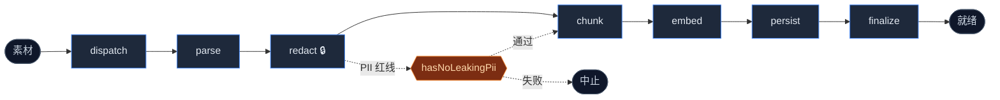
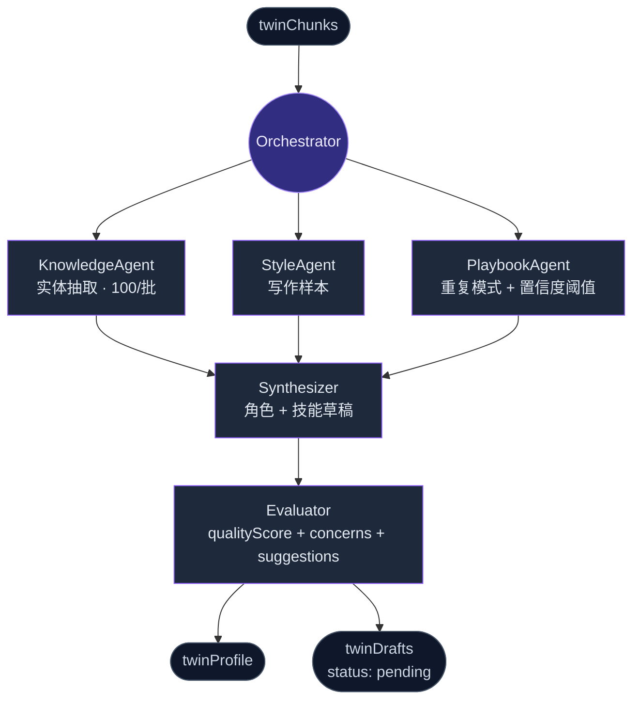
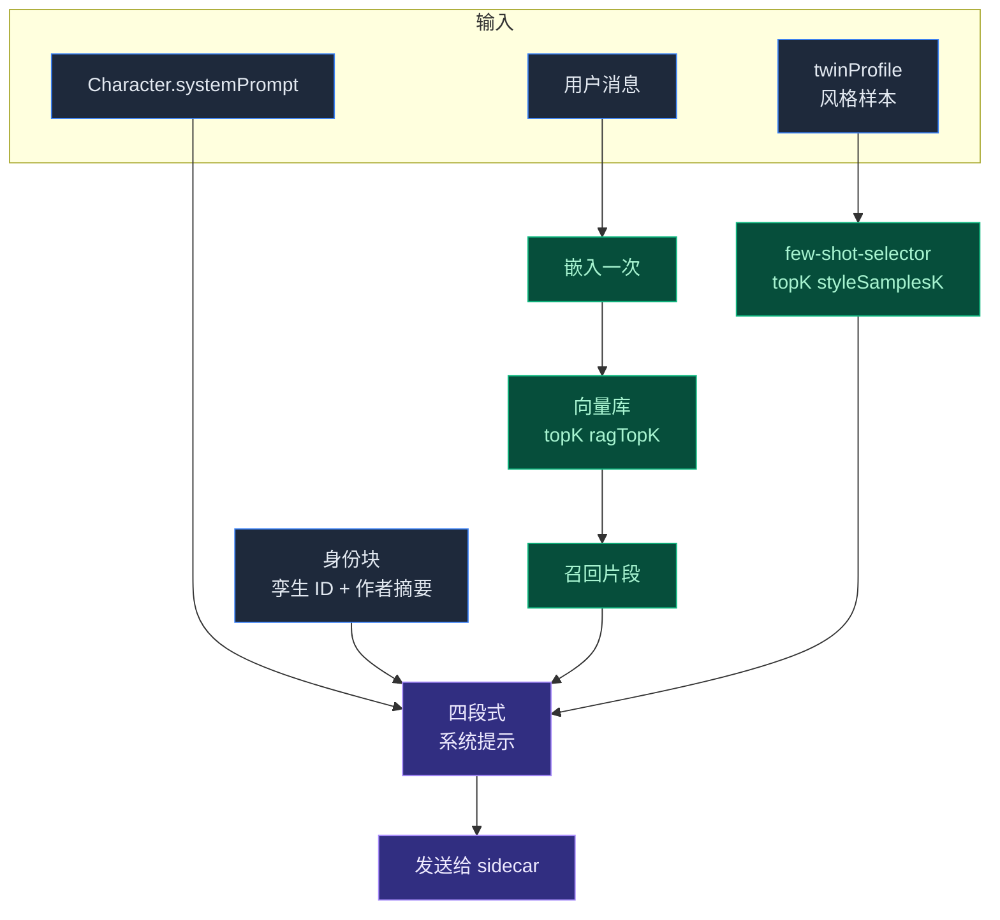

# 员工数字孪生

<Status variant="beta">Beta · phase 8</Status>

<TLDR>
  把文档、聊天导出与代码蒸馏成一个可对话的孪生。发送时召回 top-K 相关 chunk
  与风格少样本，让助手保持作者语气。PII 在**任何** embed 或 LLM 调用之前被替换为 占位符 ——
  逆向映射加密落盘。
</TLDR>

<StatGrid>
  <Stat label="流水线阶段" value="7" hint="ingest" />
  <Stat label="蒸馏 agent" value="5" hint="同一编排器下" />
  <Stat label="Dexie 表" value="5" hint="schema v14" />
  <Stat label="工作台 tab" value="4" hint="Sources / Jobs / Drafts / Settings" />
</StatGrid>

**员工数字孪生** 是 Cognia 最深的定制化层。它把用户的文档、聊天导出与代码蒸馏成：

- **知识索引（RAG）** —— 发送时检索相关片段。
- **风格画像** —— 在少样本提示中复现用户的语气。
- **Playbook 库** —— 重复的工作模式（由蒸馏 agent 抽取）。
- **角色 + 技能草稿** —— 自动合成，进入待用户审核队列。

本页概述实现，完整设计原由参见 [ADR-0003](../adr/0003-employee-digital-twin)。

## 代码位置

```
lib/twin/
  ingest/        # 7 阶段 ingest 流水线
  distill/       # 5 个 agent 的 distill 流水线
  runtime/       # 发送时 RAG + 风格少样本
  job-worker.ts  # 消费 twinJobs 队列
  importers/     # 第三方导出 → TwinSource

types/twin/      # 共享类型
components/twin/ # 工作台 UI
app/twin/        # 工作台路由
lib/db/twin-*.ts # 5 张 Dexie 表（schema v14 加入）
```

5 张 Dexie 表（schema v14）：

- `twinSources` —— 用户原始素材（文本、格式提示、redaction map）
- `twinChunks` —— 切分并嵌入后的片段（每行一个 chunk）
- `twinProfile` —— 蒸馏后的画像（风格样本、playbook、实体词典）
- `twinDrafts` —— 自动合成的角色/技能草稿，待审核
- `twinJobs` —— ingest + distill 任务队列

## 软绑定

"孪生"只是一个字符串 id。角色通过 `Character.twinId` 启用，并通过 `Character.twinSettings` 调参：

<TypeTable
  type={{
    enableRag: {
      description: "发送时是否从绑定孪生召回 chunk。",
      type: "boolean",
      default: "true",
    },
    ragTopK: {
      description: "每次发送从向量库取多少个 chunk。",
      type: "number",
      default: "5",
    },
    enableStyleFewShot: {
      description: "是否在系统提示中加入风格少样本。",
      type: "boolean",
      default: "true",
    },
    styleSamplesK: {
      description: "包含多少条风格样本（按主题相似度排序）。",
      type: "number",
      default: "3",
    },
  }}
/>

多个角色可以共享一个孪生（例如"个人"孪生与"工作"孪生都绑到同一个用户角色）。一个 Dexie 数据库里可同时存在多个孪生。

## Ingest 流水线（7 阶段）

实现：`lib/twin/ingest/`。编排器：`runIngestJob()`（`job-runner.ts`）。



<Callout type="warn" title="隐私红线">
  第 3 阶段（`redact`）是隐私红线 —— `hasNoLeakingPii(text)` 是脱敏后的断言。
  失败则流水线中止并报清晰错误。任何 embedding 或 LLM 调用都看不到未脱敏文本。
</Callout>

### 1. dispatch

根据 `TwinSource.format` 决定下游 parser。支持格式：`markdown`、`text`、`json`、`code`、`chat-export`、`html`、`pdf`、`office`。代码：`dispatch.ts`。

### 2. parse

委派给 `lib/document/document-processor`。输出标准化的文本 + 元数据：

- Markdown：保留标题树。
- 代码：按 AST（JS/TS 用 Babel，其他用 language server）切。
- 聊天导出：保留每轮结构（messages 数组）。
- Office 文档：DOCX 用 `mammoth`、PDF 用 `pdfjs-dist`。

### 3. redact

**这是隐私红线。** `lib/twin/ingest/redact.ts` 在**任何 embed 或 LLM 调用之前**把 PII 替换为 `<KIND_NNN>` 占位符：

| 类别        | 检测                                              |
| ----------- | ------------------------------------------------- |
| `EMAIL`     | RFC 宽松正则                                      |
| `PHONE`     | E.164 + 中国手机号                                |
| `CN_ID`     | 中国身份证号（省份码 + 出生日期 + 类 Luhn 校验）  |
| `BANK_CARD` | 通过 Luhn 的 13–19 位数字                         |
| `NAME`      | 提示驱动（前面有 "name:"、"by"、"——"、"from" 等） |

逆向映射用 AES-GCM 加密落盘（`twinSources.redactionMapEnc`），密钥派生自用户主密钥。Runtime 永不持久化未脱敏文本。

`hasNoLeakingPii(text)` 是脱敏后的断言。失败则流水线终止并报清晰错误。

### 4. chunk

`chunk.ts` 中的格式感知策略：


稳定哈希驱动重复 ingest 的去重 —— chunk 内容相同 → 哈希相同 → 不会产生重复行。

### 5. embed

`lib/ai/embedding/embedding.ts` 是嵌入客户端，默认走 OpenAI text-embedding-3（可配置）。批量 100 一组嵌入，限流时重试。

### 6. persist

双写：

- 本地 —— `twinChunks` Dexie 表（chunk + 嵌入 + 元数据）。
- 远程 —— 当前向量后端（`lib/vector/`），用于 runtime 相似度搜索。

远程写失败时，chunk 仍在本地存好，由 job worker 重试。

### 7. finalize

更新 source 行为 `status: "ready"`，并发完成事件供工作台订阅。

整个流水线持续更新 `TwinJob.phase` 与 `progress`，Jobs tab 实时展示进度。

## Distill 流水线（5 个 agent）

实现：`lib/twin/distill/`。编排器：`orchestrator.ts`。每个 agent 都通过 `LlmClient` 接口（`llm.ts`），生产环境绑 `createAnthropicLlmClient`，测试用 mock。



### KnowledgeAgent

按 100 chunk 一批遍历，抽取实体（人物、项目、术语、决策）。输出：以规范名为键的实体词典。

### StyleAgent

抽取代表性写作样本——短、中、长形式——保留用户语气。输出：`StyleSample[]`，存入 `twinProfile.styleSamples`。

### PlaybookAgent

寻找重复的工作模式（"X 怎么处理 Y？"）。每个 playbook 有置信度评分，低于阈值的会被丢弃。

### Synthesizer

接收前三个 agent 的输出，起草：

- 一个或多个 **角色草稿** —— 系统提示采用用户人格。
- 一个或多个 **技能草稿** —— 重复任务的能力包。

草稿写入 `twinDrafts`，状态 `status: "pending"`。

### Evaluator

从"新人视角"审阅草稿 —— 一位同事是否能理解这个角色的意图与风格？输出 `qualityScore`，加上 `concerns` 与 `suggestions` 数组。在 Drafts tab 展示。

## Runtime（发送时）

实现：`lib/twin/runtime/`。唯一入口：`applyTwinContext(messages, twinId, settings)`（`apply-twin-context.ts`）。

<Steps>
  <Step>
    ### 嵌入用户消息

    通过 `lib/ai/embedding/embedding.ts` 把最近一条用户消息嵌入**一次**。

  </Step>
  <Step>
    ### 召回 top-K chunk

    在当前向量库做 RAG，取 top `ragTopK`（默认 5）。
    后端选择见 [向量库](./vector-store)。

  </Step>
  <Step>
    ### 选择风格样本

    从 `twinProfile.styleSamples` 取 top `styleSamplesK`（默认 3），
    `few-shot-selector.ts` 按主题相似度排序。

  </Step>
  <Step>
    ### 装配四段式系统提示

    | # | 段落 | 来源 |
    | --- | --- | --- |
    | 1 | 角色系统提示 | 已在 `messages` 中 |
    | 2 | 身份块 | 孪生 ID + 作者摘要 |
    | 3 | 召回片段 | 第 2 步 |
    | 4 | 风格示例 | 第 3 步，少样本格式 |

  </Step>
</Steps>

<Callout type="info" title="优雅降级">
  `applyTwinContext` **总是返回** —— 永不抛错。向量库故障时降级为"无上下文"发送， 而不是中断聊天。
</Callout>



> **Phase 8 说明** —— 与 `lib/claude/build-options.ts:resolveSendOptions` 的集成留为**可选**。需要 runtime 注入的调用点显式调用 `applyTwinContext`，而不是免费拿到。这是有意为之，让昂贵路径（embed + RAG）可被发现。

少样本选择器（`few-shot-selector.ts`）按主题相似度排名，而非仅看语气，使提示更聚焦。

## 工作台 UI

路由：`app/twin/`。组件：`components/twin/`。四个 tab：

| Tab          | 用途                                                                                                   |
| ------------ | ------------------------------------------------------------------------------------------------------ |
| **Sources**  | 粘贴 / 拖入文本。格式选择、状态标记、ingest 按钮。列出已有 sources 与大小、状态。                      |
| **Jobs**     | ingest 与 distill 任务的实时进度。展示 `twinJobs` 中的 `phase` 与 `progress`。手动入队 / 取消 / 重试。 |
| **Drafts**   | 优先排序待审核草稿。Accept 流写入真实 `Character` / `Skill` 行 + 把 draft 标记为已接受。               |
| **Settings** | 只读画像统计（chunk 数、风格样本数、上次蒸馏时间、向量后端）。                                         |

工作台是孪生生命周期的主入口，所有动作都从这里发起。

## Job worker

`lib/twin/job-worker.ts` 同时消费 `twinJobs` 队列里的 `ingest` 与 `distill` 任务。Phase 4（ADR-0003）默认**立即执行**：

- 新任务一旦 worker 空闲就处理。
- 失败任务以指数退避重试（3 次失败后置 `status: "failed"`）。
- Worker 是每浏览器 tab 单租户（`lib/scheduler/tab-lock.ts` 保证只有一个 tab 跑 worker）。

通过调度器执行器实现 cron 触发的重试（如"每周重新 ingest"）是后续追加的能力。

## 隐私要点

| 风险           | 缓解                                                           |
| -------------- | -------------------------------------------------------------- |
| chunk 中的 PII | `redact.ts` 在 embed/LLM 调用前替换为占位符                    |
| 逆向映射       | 加密落盘（`twinSources.redactionMapEnc`）                      |
| API key        | `keyring` crate；永不以明文落盘                                |
| 云端外发       | 默认关闭 —— 桌面默认 sqlite-vec，除非用户主动选择              |
| 审计           | 每次 embed 调用都记录到 `lib/observability/`；可在日志面板查看 |

## 测试

<Callout type="error" title="安全关键：脱敏测试">
  `lib/twin/ingest/redact.test.ts` 是整个仓库最安全关键的测试 —— 在合成 PII 串语料上断言
  `hasNoLeakingPii`。 改动它必须极为谨慎；只能加 fixture，绝不能删。
</Callout>

`lib/twin/runtime/apply-twin-context.test.ts` 断言"优雅降级"契约（向量库故障不能抛错）。

## 在哪里入手

| 目标                     | 文件                                                                            |
| ------------------------ | ------------------------------------------------------------------------------- |
| 加一种 ingest 格式       | `lib/twin/ingest/dispatch.ts`、`lib/document/document-processor.ts`、`parse.ts` |
| 加强脱敏                 | `lib/twin/ingest/redact.ts`（连同测试！）                                       |
| 加新的蒸馏 agent         | `lib/twin/distill/agents/`，在 `orchestrator.ts` 注册                           |
| 调整 runtime 上下文形态  | `lib/twin/runtime/system-prompt-template.ts`                                    |
| 在新发送路径接入 runtime | 在你的 build-options helper 中调用 `applyTwinContext`                           |

## 相关

<Cards>
  <Card title="向量库" href="./vector-store" description="RAG 的真正执行层" />
  <Card title="备份 & 数据传输" href="./backup-and-data" description="孪生表是备份载荷的一部分" />
  <Card title="存储" href="./storage" description="5 张 Dexie 孪生表细节" />
  <Card title="聊天 & 技能" href="./chat-and-skills" description="启用孪生的角色 / 技能绑定" />
</Cards>
