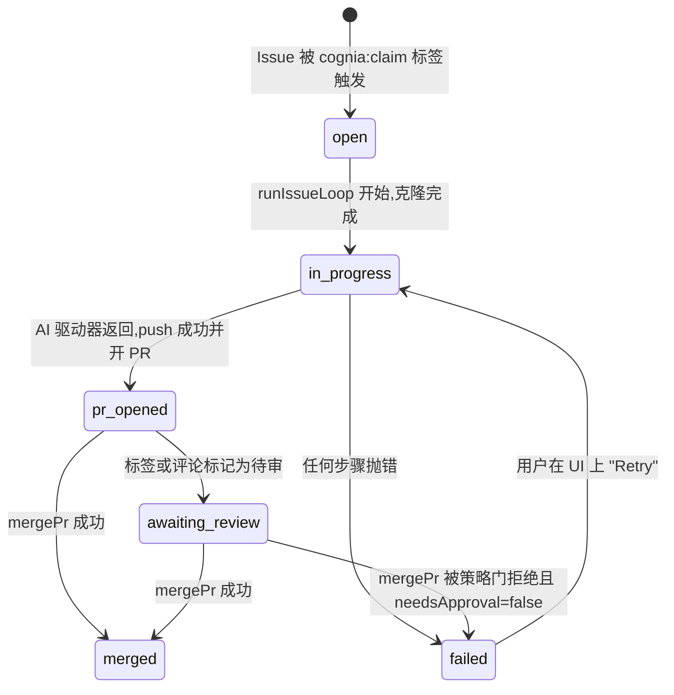

# 审计与工单

<TLDR>
  GitHub Delivery 把每一次策略决定(允许 + 拒绝)写到命名空间下的 `audit` 表; 表容量上限 5000
  行,溢出时按 `at` 升序剔除最旧的几行。Issue → PR 闭环的状态机 则反映在 `workOrders` 表中,在
  `/github-delivery` 独立页面以 6 列看板展示。 两张表都通过 M0 的"插件 Dexie 表"机制存放,实际全名带
  `github-delivery:` 前缀。
</TLDR>

## `audit` 表

### Schema

```ts title="plugins/github-delivery/plugin.json"
{
  "name": "audit",
  "schema": "++id, [repoFullName+at], runId, &[runId+stepId+at]"
}
```

| 索引                         | 用途                                             |
| ---------------------------- | ------------------------------------------------ |
| `++id`                       | 自增主键                                         |
| `[repoFullName+at]`          | Audit Tab 按仓库 + 时间倒序拉取                  |
| `runId`                      | 工作流 Run 详情页按 runId 过滤                   |
| `&[runId+stepId+at]`(unique) | 防止同一 step 在同一时刻重复写两行(再写时被覆盖) |

### 行结构(`GhAuditEntry`)

| 字段           | 类型             | 必填 | 说明                                                                         |
| -------------- | ---------------- | ---- | ---------------------------------------------------------------------------- |
| `id`           | `number`         | 否   | 自增主键                                                                     |
| `repoFullName` | `string`         | 是   | `owner/name`                                                                 |
| `runId`        | `string`         | 否   | 触发该 action 的 workflow run id;脱离 workflow 调用时为 `undefined`          |
| `stepId`       | `string`         | 否   | 节点 id;脱离 workflow 时为 `undefined`                                       |
| `action`       | `GhAction`       | 是   | 6 类判别式之一(`merge` / `push` / `release` / `comment` / `label` / `close`) |
| `decision`     | `PolicyDecision` | 是   | `{ allow: true }` 或 `{ allow: false, reason, mustWait?, needsApproval? }`   |
| `reason`       | `string`         | 否   | 自由文本(provider 返回 / 错误码 / "HITL approved (draft xxx)" 等)            |
| `at`           | `number`         | 是   | wall-clock 毫秒                                                              |

### 写入路径

唯一的写入入口是 `requireGithubRuntime().recordAudit(row)`,内部实现是
`plugins/github-delivery/src/index.ts:persistAudit`:

```ts title="persistAudit 行为"
1. table.put(row)                        // upsert by ++id
2. const count = await table.count()
3. if (count > 5000):
     const overflow = count - 5000
     const oldest = await table.orderBy("at").limit(overflow).primaryKeys()
     await table.bulkDelete(oldest)      // FIFO capped delete
```

约定:**每一次 `checkPolicy` 调用都要写一行**(由 `guardedExecutor` 统一处理)。
HITL 流程会写两行(一次 deny 标志 needsApproval、一次根据用户结果的 allow/deny)。

### 读取路径

| 入口                                   | 查询                                                                                                                                                             |
| -------------------------------------- | ---------------------------------------------------------------------------------------------------------------------------------------------------------------- |
| Settings → GitHub Delivery → Audit Tab | `table.where("[repoFullName+at]").between(...).reverse().toArray()`                                                                                              |
| Workflow run 详情页                    | `table.where("runId").equals(runId).toArray()`                                                                                                                   |
| 安全:`maxDailyMerges` 计数             | `audit.where("[repoFullName+at]").between([repo, startOfUtcDay], [repo, Number.MAX_SAFE_INTEGER])` → filter `action.kind === "merge" && decision.allow === true` |

### Audit Tab UI

`components/settings/github-delivery/tabs/audit-tab.tsx` 是一个 `useLiveQuery` 表格,
列:

| 列         | 来源                                                                                |
| ---------- | ----------------------------------------------------------------------------------- |
| Time       | `at`(本地时区)                                                                      |
| Repo       | `repoFullName`                                                                      |
| Action     | `action.kind` + 详情(merge → `#42`,release → `tag`,comment → `pr/#n` 或 `issue/#n`) |
| Decision   | `decision.allow ? Allow : Deny`,deny 时高亮 reason                                  |
| Run / Step | `runId.slice(-6)` + `stepId`(可点开跳到 run 详情)                                   |
| Reason     | 灰色小字补充行                                                                      |

过滤器:仓库下拉、`decision.allow` 二选一、`action.kind` 多选、时间窗口。所有过滤都
走 Dexie 索引,UI 不再二次扫表。

## `workOrders` 表

### Schema

```ts title="plugins/github-delivery/plugin.json"
{
  "name": "workOrders",
  "schema": "++id, [status+repoFullName], issueNumber, prNumber, createdAt, updatedAt"
}
```

| 索引                      | 用途                              |
| ------------------------- | --------------------------------- |
| `++id`                    | 自增主键                          |
| `[status+repoFullName]`   | 看板列按状态 + 仓库分组的高效查询 |
| `issueNumber`             | Issue → PR 闭环按 issue 反查      |
| `prNumber`                | PR 维度反查                       |
| `createdAt` / `updatedAt` | 排序                              |

### 行结构(`GhWorkOrder`)

| 字段           | 类型              | 说明                                                                           |
| -------------- | ----------------- | ------------------------------------------------------------------------------ |
| `id`           | `number`          | 自增主键                                                                       |
| `repoFullName` | `string`          | `owner/name`                                                                   |
| `issueNumber`  | `number`          | 触发该工单的 Issue                                                             |
| `status`       | `WorkOrderStatus` | `open` / `in_progress` / `pr_opened` / `awaiting_review` / `merged` / `failed` |
| `worktreePath` | `string?`         | 本地路径或沙盒 id                                                              |
| `branch`       | `string?`         | 工作分支(默认 `cognia/issue-<n>`)                                              |
| `prNumber`     | `number?`         | PR 号(`pr_opened` 起有值)                                                      |
| `aiDriver`     | `string?`         | `claude-code` 是当前唯一驱动器                                                 |
| `lastError`    | `string?`         | 上一次失败原因(进入 `failed` 时写)                                             |
| `createdAt`    | `number`          | wall-clock                                                                     |
| `updatedAt`    | `number`          | wall-clock                                                                     |

### 状态机



写入路径都从 `requireGithubRuntime().upsertWorkOrder(...)` 进入,内部
`plugins/github-delivery/src/index.ts:upsertWorkOrder` 做"查现有 + 合并 + put"原子化。
更新永远不会失败业务主流程 —— `runIssueLoop` 用 `safeUpdateWorkOrder` 包了一层 try/catch,
任何 Dexie 错误只写到 console。

### `/github-delivery` 看板页

源代码:`app/github-delivery/page.tsx`。客户端组件,直接对外部全名访问表:

```ts
const NAMESPACED_TABLE = "github-delivery:workOrders"
const t = db.table<GhWorkOrder, number>(NAMESPACED_TABLE)
const orders = useLiveQuery(() => t.orderBy("updatedAt").reverse().toArray())
```

6 列从左到右:`open / in_progress / pr_opened / awaiting_review / merged / failed`。
每张卡片显示:

- `#<issueNumber>` + `<repoFullName>`(截断)
- `aiDriver` 徽标
- `failed` 列:`<AlertTriangleIcon/>` + `lastError`(截断)
- `prNumber` 行(若有)

页面在插件未启用时(`getDb()` 抛 `Table not found`)显示一个引导卡片,提示用户去
Settings → Plugins 启用。

## `events` 表

虽然不是审计的一部分,但它和 audit/workOrders 一起构成"事件链路"。
schema:

```ts title="plugins/github-delivery/plugin.json"
{
  "name": "events",
  "schema": "&deliveryId, [repoFullName+seenAt], kind, source"
}
```

| 字段                    | 说明                                                                                   |
| ----------------------- | -------------------------------------------------------------------------------------- |
| `deliveryId`            | 唯一去重键:webhook 用 `x-github-delivery`,polling 用 sha1(kind‖repoFullName‖primaryId) |
| `[repoFullName+seenAt]` | Audit Tab "最近事件" 区域排序                                                          |
| `kind`                  | `NormalizedGhEventKind`(11 种)                                                         |
| `source`                | `"webhook"` 或 `"polling"`                                                             |

每条 webhook / polling 都会先在 `events` 上"upsert by deliveryId"。如果命中已有 deliveryId
就跳过 —— 这就是为什么 webhook 和 polling 同时启用不会双倍触发工作流。

## 留存与清理

| 表           | 上限     | 策略                                                                        |
| ------------ | -------- | --------------------------------------------------------------------------- |
| `audit`      | 5000 行  | `persistAudit` 在每次写入后检查 count,溢出按 `at` 升序删                    |
| `events`     | 无硬上限 | webhook payload 不大,通常以年为单位增长缓慢;可在用量 Tab 手动清理           |
| `workOrders` | 无硬上限 | 看板状态从 `merged` / `failed` 出去后用户可以手动归档(M4 之后),目前不自动删 |
| `repos`      | 无硬上限 | 仓库由用户手动添加/删除                                                     |

<Callout type="warn">
  **插件卸载时.** 按 M0 的保留规则,默认保留全部数据(`removePluginTables(..., "keep")`)。 如果在
  Settings → Plugins 选 "Delete data" 卸载,4 张表全部 drop —— 包括 audit。 导出审计请先在 Audit Tab
  用 "Export CSV"。
</Callout>

## 源码索引

| 文件                                                          | 用途                                                |
| ------------------------------------------------------------- | --------------------------------------------------- |
| `plugins/github-delivery/plugin.json`                         | 4 张表 schema 声明                                  |
| `plugins/github-delivery/src/index.ts`                        | `persistAudit`(capped delete)、`upsertWorkOrder`    |
| `plugins/github-delivery/src/workflow/shared.ts`              | `guardedExecutor` 调 `recordAudit` 的全部时机       |
| `plugins/github-delivery/src/workflow/issue-loop.ts`          | `safeUpdateWorkOrder` 状态机转换                    |
| `plugins/github-delivery/src/github-poll.ts`                  | webhook + polling 共享的 `events` 去重              |
| `plugins/github-delivery/src/connector/inbox-bridge.ts`       | `events` → Inbox 消息(只读)                         |
| `components/settings/github-delivery/tabs/audit-tab.tsx`      | Audit Tab UI                                        |
| `components/settings/github-delivery/tabs/audit-tab.test.tsx` | Audit Tab 测试                                      |
| `app/github-delivery/page.tsx`                                | 6 列看板独立页                                      |
| `lib/plugin/dexie/namespace.ts`                               | `toNamespacedTableName("github-delivery", "audit")` |
