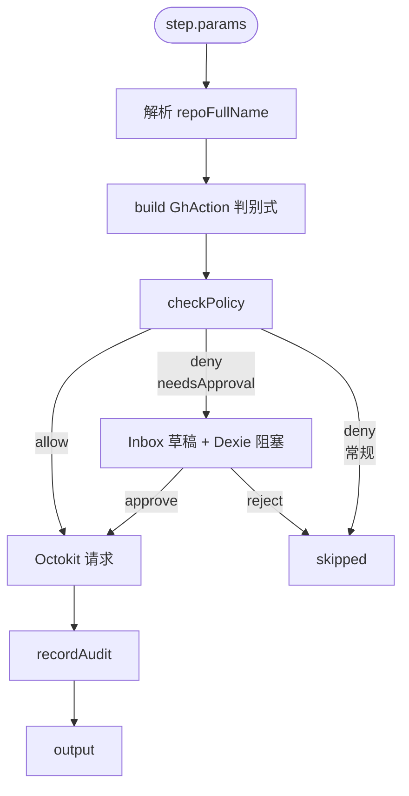

# 节点参考

<TLDR>
GitHub Delivery 向工作流注入 **13 个 `action.github.*` 节点**,全部在
`plugins/github-delivery/src/workflow/nodes.ts` 注册,通过 `guardedExecutor`
统一处理 repo 解析、Octokit 获取、策略门、HITL 审批、审计写入。每个节点都接
两个通用字段:`repoFullName`(`owner/name`)和可选的 `policyOverride`
(`Partial<GhPolicy>`)。除 `generateChangelog` 是只读、`reviewPrInline` 自带 LLM 调用、
`runIssueLoop` 跑长任务以外,其余节点都是单次 Octokit 请求的薄包装。
</TLDR>

## 通用约定

### 共享字段

| 字段             | 类型                  | 必填 | 说明                                                                                  |
| ---------------- | --------------------- | ---- | ------------------------------------------------------------------------------------- |
| `repoFullName`   | `string`              | 是   | `owner/name`。表达式 `{{ $trigger.payload.body.repository.full_name }}` 常见。         |
| `policyOverride` | `Partial<GhPolicy>?`  | 否   | 节点级覆盖,深合并到仓库级或全局策略。详见 [policies](./policies)                       |

### 输出结构

| 形状                                                  | 时机                                                                                |
| ----------------------------------------------------- | ----------------------------------------------------------------------------------- |
| `{ ...nodeSpecific }`                                 | 成功调用 Octokit                                                                    |
| `{ skipped: true, reason, mustWait? }`                | 策略门拒绝且非 HITL 软拒绝                                                          |
| `{ skipped: true, reason: "HITL rejected: ...", draftId }` | HITL 草稿被人工拒绝                                                            |
| 抛错                                                  | Octokit 抛非 2xx;orchestrator 记录 error,按 workflow retry policy 重试            |

### 通用前置流程



只读节点(`generateChangelog`)的 `action` 函数返回 `null`,直接跳过 policy 而仍写一行
`"[read-only]"` audit。

---

## `action.github.openPr`

**用途.** 在仓库里开一个新 PR。

**策略 action.** `{ kind: "push", repo: <repoFullName>, branch: <head> }` —— 由分支保护决定能否放行。

**参数.**

| 字段             | 类型      | 必填 | 说明                                                            |
| ---------------- | --------- | ---- | --------------------------------------------------------------- |
| `head`           | `string`  | 是   | 源分支(如 `cognia/feature-xxx`)。命中 `branchProtection` 会被拒。|
| `base`           | `string`  | 是   | 目标分支(如 `main`)。                                          |
| `title`          | `string`  | 是   | PR 标题。                                                       |
| `body`           | `string?` | 否   | PR 描述,Markdown 支持。                                        |
| `draft`          | `boolean?`| 否   | 默认 `false`。                                                  |

**输出.** `{ number: number, htmlUrl: string }`

**Octokit.** `POST /repos/{owner}/{repo}/pulls`

```ts title="示例 — 在 cognia/issue-42 上开 PR"
{
  "kind": "action.github.openPr",
  "params": {
    "repoFullName": "{{ $trigger.payload.body.repository.full_name }}",
    "head": "cognia/issue-42",
    "base": "main",
    "title": "Resolves #42",
    "body": "AI-generated PR. See workflow run `{{ $runId }}`."
  }
}
```

---

## `action.github.closePr`

**用途.** 关闭(不合并)一个 PR。

**策略 action.** `{ kind: "close", target: { repo, prNumber } }` —— 检 `allowedAuthors`。

**参数.**

| 字段       | 类型     | 必填 | 说明 |
| ---------- | -------- | ---- | ---- |
| `prNumber` | `number` | 是   | PR 号。|

**输出.** `{ number: number, state: string }`(`state` 应为 `"closed"`)

**Octokit.** `PATCH /repos/{owner}/{repo}/pulls/{pull_number}` `{ state: "closed" }`

---

## `action.github.mergePr`

**用途.** Merge 一个 PR。**最严格**的节点 —— 默认要求 CI 绿、人审批、未触顶日 merge 上限。

**策略 action.** `{ kind: "merge", pr: { repo, prNumber }, mergeMethod? }`

**参数.**

| 字段            | 类型                              | 必填 | 说明                                                  |
| --------------- | --------------------------------- | ---- | ----------------------------------------------------- |
| `prNumber`      | `number`                          | 是   | PR 号。                                               |
| `mergeMethod`   | `"merge" \| "squash" \| "rebase"` | 否   | 默认 `"merge"`。                                      |
| `commitTitle`   | `string?`                         | 否   | merge commit 标题(squash/merge 模式可写)。           |
| `commitMessage` | `string?`                         | 否   | merge commit body。                                   |

**输出.** `{ merged: boolean, sha: string }`

**Octokit.** `PUT /repos/{owner}/{repo}/pulls/{pull_number}/merge`

<Callout type="warn">
**HITL 软拒.** `requireHumanApproval` 命中时返回 `needsApproval: true`,被路由到 Inbox 草稿。
用户在 `<DraftEditor/>` 上 Approve 才会继续 merge。
</Callout>

---

## `action.github.reviewPr`

**用途.** 在 PR 上提交一次 review(`APPROVE` / `COMMENT` / `REQUEST_CHANGES`),可附带
逐行 inline 评论(legacy 字段 `position`,需是 diff 中的位置)。

**策略 action.** `{ kind: "comment", pr: { repo, prNumber }, body }` —— 检 `allowedAuthors`。

**参数.**

| 字段        | 类型                                                          | 必填 | 说明                                          |
| ----------- | ------------------------------------------------------------- | ---- | --------------------------------------------- |
| `prNumber`  | `number`                                                      | 是   | PR 号。                                       |
| `event`     | `"APPROVE" \| "REQUEST_CHANGES" \| "COMMENT"`                | 是   | review 类型。                                 |
| `body`      | `string`                                                      | 是   | 总体 review 正文,Markdown 支持。              |
| `comments`  | `Array<{ path: string; position: number; body: string }>?`    | 否   | legacy 行级评论(基于 diff `position`)。       |

**输出.** `{ id: number, state: string }`

**Octokit.** `POST /repos/{owner}/{repo}/pulls/{pull_number}/reviews`

<Callout type="info">
**首选 `reviewPrInline`.** 新写的工作流应该用 `action.github.reviewPrInline` —— 它接受
`line` + `side`(更稳),并自带 LLM 调用以输出结构化评论。`reviewPr` 用于人工拼装的场景。
</Callout>

---

## `action.github.reviewPrInline`

**用途.** 由 LLM 直接在 PR 的 diff 上生成结构化 review,带行级评论。一次调用同时
完成"读 diff → LLM → POST review"。

**策略 action.** `{ kind: "comment", pr: { repo, prNumber }, body: "[inline review]" }`

**参数.**

| 字段           | 类型      | 必填 | 说明                                                                    |
| -------------- | --------- | ---- | ----------------------------------------------------------------------- |
| `prNumber`     | `number`  | 是   | PR 号。                                                                 |
| `provider`     | `string`  | 是   | LLM provider id,例如 `anthropic` / `openrouter` / `ollama`。            |
| `model`        | `string`  | 是   | 模型 id,例如 `claude-sonnet-4-6`。                                     |
| `apiKey`       | `string`  | 是   | provider 凭据(可绑表达式 `{{ $static.anthropicKey }}`)。                |
| `baseURL`      | `string?` | 否   | 自定义 endpoint(OpenAI-compatible 时常用)。                            |
| `maxFiles`     | `number?` | 否   | 默认 5,硬上限 30。                                                     |
| `focus`        | `string?` | 否   | 自由文本,例如 `"security"` / `"performance"`。                          |

**输出.**

| 字段              | 类型      | 说明                                                                |
| ----------------- | --------- | ------------------------------------------------------------------- |
| `reviewId`        | `number`  | GitHub review id。                                                  |
| `body`            | `string`  | 提交给 GitHub 的高层总结(LLM JSON 解析失败时退化为完整 LLM 输出)。 |
| `commentCount`    | `number`  | 行级评论数(LLM 上限 8)。                                          |
| `filesAnalysed`   | `number`  | 实际取到 patch 的文件数(≤ `maxFiles`)。                            |
| `parsedStructured`| `boolean` | LLM 是否产出可解析 JSON。                                           |

**Octokit.**
- `GET /repos/{owner}/{repo}/pulls/{pull_number}/files`(取 patch)
- `POST /repos/{owner}/{repo}/pulls/{pull_number}/reviews`

**实现关键.** `plugins/github-delivery/src/workflow/review-pr-inline.ts:runPRReviewAgent`。
LLM 被要求输出严格 JSON `{ body, comments: [{ path, line, side, body }] }`,带宽松 fence
剥离 + 缺字段容错。每个文件的 diff 截断到 1500 字符。

---

## `action.github.commentPr`

**用途.** 在 PR 评论区(也就是 Issue 评论端点)发一条普通评论。

**策略 action.** `{ kind: "comment", pr: { repo, prNumber }, body }`

**参数.**

| 字段       | 类型      | 必填 | 说明                |
| ---------- | --------- | ---- | ------------------- |
| `prNumber` | `number`  | 是   | PR 号。              |
| `body`     | `string`  | 是   | Markdown 评论正文。  |

**输出.** `{ id: number, htmlUrl: string }`

**Octokit.** `POST /repos/{owner}/{repo}/issues/{issue_number}/comments`
(GitHub 模型:PR 是一种 Issue;评论用 issues 端点)

---

## `action.github.commentIssue`

**用途.** 在 Issue 评论区发一条评论。

**策略 action.** `{ kind: "comment", issue: { repo, issueNumber }, body }`

**参数.**

| 字段          | 类型      | 必填 | 说明 |
| ------------- | --------- | ---- | ---- |
| `issueNumber` | `number`  | 是   | Issue 号。 |
| `body`        | `string`  | 是   | Markdown 评论正文。|

**输出.** `{ id: number, htmlUrl: string }`

**Octokit.** `POST /repos/{owner}/{repo}/issues/{issue_number}/comments`

---

## `action.github.labelIssue`

**用途.** 在 Issue / PR 上加 / 删标签(GitHub 把 PR 当成 Issue 的子类型,同一端点)。

**策略 action.** `{ kind: "label", target: { repo, issueNumber }, labels: [...add, ...remove] }`

**参数.**

| 字段          | 类型        | 必填 | 说明                                            |
| ------------- | ----------- | ---- | ----------------------------------------------- |
| `issueNumber` | `number`    | 是   | Issue 或 PR 号。                                |
| `add`         | `string[]?` | 否   | 要追加的标签(数组,顺序无关)。                 |
| `remove`      | `string[]?` | 否   | 要移除的标签。                                  |

**输出.** `{ added: string[], removed: string[] }`

**Octokit.**
- 若 `add` 非空:`POST /repos/{owner}/{repo}/issues/{issue_number}/labels`
- 对 `remove` 中每个 label:`DELETE /repos/{owner}/{repo}/issues/{issue_number}/labels/{name}`

---

## `action.github.closeIssue`

**用途.** 关闭一个 Issue,可选附带 `reason`(`completed` / `not_planned`)。

**策略 action.** `{ kind: "close", target: { repo, issueNumber } }` —— 检 `allowedAuthors`。

**参数.**

| 字段          | 类型                                | 必填 | 说明                                                      |
| ------------- | ----------------------------------- | ---- | --------------------------------------------------------- |
| `issueNumber` | `number`                            | 是   | Issue 号。                                                |
| `reason`      | `"completed" \| "not_planned"?`     | 否   | GitHub UI 上的 "Close as ..." 选项。                       |

**输出.** `{ number: number, state: string }`

**Octokit.** `PATCH /repos/{owner}/{repo}/issues/{issue_number}` `{ state: "closed", state_reason }`

---

## `action.github.createRelease`

**用途.** 创建 GitHub Release(默认 `draft: true`,只在草稿状态生成,不公开)。

**策略 action.** `{ kind: "release", repo, tag, draft }` —— 非 draft 且 `requireHumanApproval`
时返回 `needsApproval: true`。

**参数.**

| 字段              | 类型      | 必填 | 说明                                                                 |
| ----------------- | --------- | ---- | -------------------------------------------------------------------- |
| `tag`             | `string`  | 是   | release tag(如 `v1.2.3` 或 `1.2.3`)。tag 必须存在。                  |
| `targetCommitish` | `string?` | 否   | 若 tag 不存在,GitHub 会按 commitish(分支名或 SHA)创建。            |
| `name`            | `string?` | 否   | release 显示名(默认与 tag 同)。                                    |
| `body`            | `string?` | 否   | Markdown release 笔记。通常喂 `generateChangelog.markdown`。          |
| `draft`           | `boolean?`| 否   | 默认 `true`(草稿,安全)。                                            |
| `prerelease`      | `boolean?`| 否   | 默认 `false`。                                                       |

**输出.** `{ id: number, htmlUrl: string, tag: string }`

**Octokit.** `POST /repos/{owner}/{repo}/releases`

---

## `action.github.generateChangelog`

**用途.** **只读.** 用 GitHub compare 端点取 commits → 按 Conventional Commits 解析 →
计算 semver bump → 输出 Markdown 笔记。

**策略 action.** `null`(完全跳过策略门;仅写一行 `"[read-only]"` audit)。

**参数.**

| 字段              | 类型      | 必填 | 说明                                                  |
| ----------------- | --------- | ---- | ----------------------------------------------------- |
| `since`           | `string`  | 是   | 起点 tag 或 SHA(例如 `v1.0.0`、`abc1234`)。           |
| `currentVersion`  | `string?` | 否   | 当前版本字符串(用于 `applyBump`)。默认 `"0.0.0"`。    |

**输出.**

| 字段           | 类型                                            | 说明                                                  |
| -------------- | ----------------------------------------------- | ----------------------------------------------------- |
| `bump`         | `"major" \| "minor" \| "patch" \| "none"`       | 由 `feat` / `fix` / `breaking` 决定。                  |
| `nextVersion`  | `string`                                        | applyBump 后的版本号(无前缀 `v`)。                   |
| `markdown`     | `string`                                        | 分类的 Markdown 笔记(按 Features / Bug Fixes / … 分组)。|
| `commitCount`  | `number`                                        | 解析成功的提交数(非 conventional 的会被丢弃)。       |

**Octokit.** `GET /repos/{owner}/{repo}/compare/{basehead}`(basehead 形如 `since...HEAD`)

**Conventional Commits 实现.** `lib/github/changelog.ts`。grammar:`<type>(<scope>)!:
<subject>` + 可选 body + `BREAKING CHANGE:` footer。`!` 或 footer 命中即 major bump;
`feat` → minor、`fix` → patch、其他 → none。

---

## `action.github.pushTag`

**用途.** 在仓库上推送一个 git tag(把 tag 指到某个 SHA)。

**策略 action.** `{ kind: "push", repo, branch: "refs/tags/<tag>" }` —— 走 `branchProtection`
正则,可保护 `^refs/tags/release/` 风格的 tag。

**参数.**

| 字段   | 类型     | 必填 | 说明                       |
| ------ | -------- | ---- | -------------------------- |
| `tag`  | `string` | 是   | tag 名(不含 `refs/tags/`)。|
| `sha`  | `string` | 是   | 要打 tag 的 commit SHA。   |

**输出.** `{ tag: string, sha: string }`

**Octokit.** `POST /repos/{owner}/{repo}/git/refs` `{ ref: "refs/tags/<tag>", sha }`

---

## `action.github.runIssueLoop`

**用途.** Issue → PR 闭环。克隆代码 → 调 Claude sidecar 跑 AI(在 worktree 里改文件)
→ commit + push → 开 PR。**长任务**,会通过 `lib/workflow/runtime/long-step-runner.ts`
写 checkpoint,进程崩溃后可恢复。

**策略 action.** `{ kind: "push", repo, branch: <branchTemplate.replace("{n}", issueNumber)> }`

**参数.**

| 字段              | 类型                  | 必填 | 说明                                                                    |
| ----------------- | --------------------- | ---- | ----------------------------------------------------------------------- |
| `issueNumber`     | `number`              | 是   | 触发的 Issue 号。                                                       |
| `worktreeMode`    | `"local" \| "e2b"`    | 否   | 默认 `local`。`e2b` 需启用 `e2b-sandbox` 插件并提供 API key。            |
| `branchTemplate`  | `string?`             | 否   | 默认 `cognia/issue-{n}`,`{n}` 占位符替换为 issueNumber。                |

**输出.** `RunIssueLoopResult`

```ts
{
  status: "pr_opened" | "skipped" | "failed",
  branch?: string,
  prNumber?: number,
  prUrl?: string,
  durationMs?: number,
  reason?: string,
}
```

**实现关键.** `plugins/github-delivery/src/workflow/issue-loop.ts:runIssueLoop`。
60 分钟硬超时 (`HARD_TIMEOUT_MS`);通过 `IssueLoopDriver` 接口注入 AI;driver 在插件
activate 时配为 `SidecarIssueLoopDriver`(连接到 Claude sidecar)。Checkpoint 写到
`workflowRunEvents`,phase `running` → `completed`,resume 时直接复用 `summary`。

<Callout type="warn">
**前提.** Claude provider 必须配置(Settings → Providers)。否则 driver 在 `run` 内部抛错,
节点返回 `{ status: "failed", reason: "No issue-loop AI driver is registered. ..." }`。
</Callout>

---

## 错误回放与重试

`guardedExecutor` 内部 `try / catch` 把任意抛错记到 `step.log("error", msg)`,然后**重新抛出**。
Orchestrator 按节点的 `retryPolicy` 决定:

| retryPolicy           | 行为                                            |
| --------------------- | ----------------------------------------------- |
| `none`(默认)         | 一次失败即 step error,整个 run 走错误分支     |
| `fixed { times, delayMs }` | 等待 → 重试                              |
| `exponential { times, baseMs }` | 指数退避                              |

幂等动词(GET / HEAD / PUT / DELETE)在 Octokit 内部已有最多 3 次自动重试。POST / PATCH
**不**会被 Octokit 重试 —— 这是为了避免 `mergePr` / `createRelease` 多发。如果你确实想
重试 POST,在工作流节点上配 retryPolicy,审计会记录每次尝试。

## Dry-run 行为

工作流编辑器 "Run" 按钮的 "Dry run" 模式下,`guardedExecutor` 在所有 deny / HITL 路径上都
返回 `{ skipped: true }` 而不真正调 Octokit。对于 allow 路径,Octokit 调用照常发生 —— 因为
GitHub 的"做事"动作没有官方 dry-run 接口,**dry-run 主要是验证策略门和 wiring**,不能完全
模拟"真实点击 merge 后会发生什么"。

## 源码索引

| 文件                                                          | 用途                                               |
| ------------------------------------------------------------- | -------------------------------------------------- |
| `plugins/github-delivery/src/workflow/nodes.ts`               | 13 个执行器的注册点(单一文件)                    |
| `plugins/github-delivery/src/workflow/shared.ts`              | `guardedExecutor` 工厂                            |
| `plugins/github-delivery/src/workflow/issue-loop.ts`          | `runIssueLoop` 长任务实现                          |
| `plugins/github-delivery/src/workflow/review-pr-inline.ts`    | `runPRReviewAgent` LLM 代理                       |
| `plugins/github-delivery/src/workflow/runtime.ts`             | `GithubRuntime` 单例接口                           |
| `plugins/github-delivery/src/index.ts`                        | 注册路径(`setGithubRuntime` + `setIssueLoopDriver`)|
| `lib/github/octokit-factory.ts`                               | 节点拿到的 Octokit 实例配置                        |
| `lib/github/policy-gate.ts`                                   | `checkPolicy` —— 每个节点都过                      |
| `lib/github/changelog.ts`                                     | `generateChangelog` 的实际解析与渲染              |
| `lib/github/workspace.ts`                                     | `runIssueLoop` 的 clone / commit / push           |
| `lib/workflow/runtime/long-step-runner.ts`                    | `runIssueLoop` checkpoint 续跑机制                |
| `plugins/github-delivery/src/approval/draft-bridge.ts`        | HITL 草稿桥(merge / 非 draft release)           |
