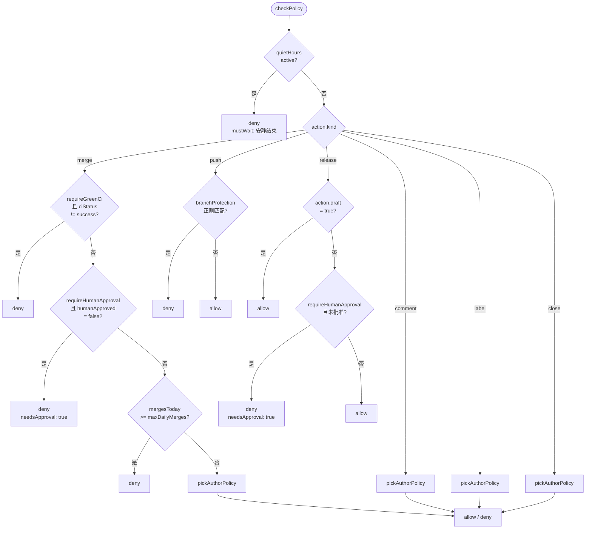

# 策略门(Policy)

<TLDR>
`lib/github/policy-gate.ts:checkPolicy(action, ctx)` 是 GitHub Delivery 的统一策略门。
它接收一个 `GhAction` 判别式和一个 `GhPolicyContext`,返回 `PolicyDecision`(`{ allow: true }`
或 `{ allow: false, reason, mustWait?, needsApproval? }`)。其中带 `needsApproval: true` 的
拒绝是"软拒绝",会被 `guardedExecutor` 路由到 Inbox HITL 草稿;其他拒绝是"硬拒绝",
执行器立即跳过。默认策略在 `DEFAULT_GH_POLICY`,可仓库级或节点级覆盖。
</TLDR>

## `GhPolicy` 字段

<TypeTable
  type={{
    allowedLabels: {
      description: "必需标签集合。PR 或 Issue 必须含其中至少一个。可选。",
      type: "string[] | undefined",
      default: "undefined",
    },
    requireGreenCi: {
      description: "merge 前 CI 必须 success。该字段只影响 action.kind === 'merge'。",
      type: "boolean",
      default: "true",
    },
    requireHumanApproval: {
      description:
        "merge / 非 draft release 必须经过人审批。被拒时返回 needsApproval: true,会路由到 HITL 草稿。",
      type: "boolean",
      default: "true",
    },
    maxDailyMerges: {
      description:
        "机器人每 UTC 日 merge 最多次数。当天的计数从 audit 表 [repoFullName+at] 索引扫出来。",
      type: "number",
      default: "5",
    },
    quietHours: {
      description:
        "安静时段窗口。复用 lib/connectors/outbound-runner 的 isInQuietHours 算法。可选。",
      type: "QuietHoursWindow | undefined",
      default: "undefined",
    },
    branchProtection: {
      description: "禁止直推的分支正则列表。命中则 push 类 action 被拒。",
      type: "string[]",
      default: '["^main$", "^master$", "^release/"]',
    },
    allowedAuthors: {
      description:
        "允许机器人对其 PR/Issue 动手的作者集合。三种 kind:collaborators / members / explicit(显式 logins 数组)。",
      type: "AllowedAuthors",
      default: '{ kind: "collaborators" }',
    },
  }}
/>

```ts title="lib/github/types.ts(节选)"
export interface QuietHoursWindow {
  from: string // "HH:MM" 24h
  to: string // "HH:MM" 24h
  tz: string // IANA tz,例如 "Asia/Shanghai"
}

export type AllowedAuthors =
  | { kind: "collaborators" }
  | { kind: "members" }
  | { kind: "explicit"; logins: string[] }

export const DEFAULT_GH_POLICY: GhPolicy = {
  requireGreenCi: true,
  requireHumanApproval: true,
  maxDailyMerges: 5,
  branchProtection: ["^main$", "^master$", "^release/"],
  allowedAuthors: { kind: "collaborators" },
}
```

## 6 类 `GhAction` 的判定

`checkPolicy` 先做"全局 pre-flight"(安静时段),然后按 `action.kind` 分支:



### `merge`

| 检查项                 | 失败时                                                                                    |
| ---------------------- | ----------------------------------------------------------------------------------------- |
| `requireGreenCi`       | `deny("merge requires CI=success but got '<status>'")`                                    |
| `requireHumanApproval` | `denyAwaitingApproval("merge requires explicit human approval")` —— `needsApproval: true` |
| `maxDailyMerges`       | `deny("daily merge cap of N reached (M today)")`                                          |
| `allowedAuthors`       | 见下                                                                                      |

### `push`

| 检查项                  | 失败时                                                         |
| ----------------------- | -------------------------------------------------------------- |
| `branchProtection` 正则 | `deny("branch '<branch>' matches protection regex '<regex>'")` |

例:`action.github.openPr` 把 `head` 当成 push 分支,所以 `head` 命中保护正则会被拒。
`action.github.pushTag` 把 `refs/tags/<tag>` 当成 push 分支 —— 若你想保护 `release/v*` 风格的
tag,可以加上 `^refs/tags/release/` 正则。

### `release`

| 检查项                                                           | 失败时                                                                          |
| ---------------------------------------------------------------- | ------------------------------------------------------------------------------- |
| `action.draft === true`                                          | 总是 allow(草稿可随便建,不会被外部看到)                                         |
| `requireHumanApproval && humanApproved !== true`(且 draft=false) | `denyAwaitingApproval("publishing a release requires explicit human approval")` |

### `comment` / `label` / `close`

只检 `allowedAuthors`(由 `pickAuthorPolicy` 处理):

```ts title="lib/github/policy-gate.ts"
function pickAuthorPolicy(policy, ctx, authorLogin) {
  if (!authorLogin) return ALLOW // 没作者信息直接放过
  switch (policy.allowedAuthors.kind) {
    case "explicit":
      return logins.includes(authorLogin)
        ? ALLOW
        : deny(`author "${authorLogin}" is not in the explicit allow-list`)
    case "collaborators":
    case "members":
      // 上游 step 通过 ctx.knownAllowedLogins 传入 collaborator/member 列表;
      // 这里不再发请求,只做集合判定。
      if (!ctx.knownAllowedLogins)
        return deny(`cannot evaluate "<kind>" policy: caller did not pass knownAllowedLogins`)
      return ctx.knownAllowedLogins.includes(authorLogin)
        ? ALLOW
        : deny(`author "${authorLogin}" is not in the <kind> list`)
  }
}
```

## HITL 审批分支

只有 `merge` 和"非 draft release"会产生 `needsApproval: true` 的"软拒绝"。
`guardedExecutor`(`plugins/github-delivery/src/workflow/shared.ts`)拿到这种 decision 后:

<Steps>
<Step>
**写一行 audit。** `decision.allow === false`,`reason` = `denyAwaitingApproval` 的 reason。
</Step>
<Step>
**调用 `requestHitlApproval(...)`.** 在 `connectorDrafts` 表写一行 pending 草稿,带上
`actionSummary`(默认 `<action.kind> <repoFullName>`,可由 `describe` 覆盖)和 `proposedBody`
(评论 / review 节点会传)。等用户在 Inbox 的 `<DraftEditor/>` 上点 Approve / Reject。
</Step>
<Step>
**Dexie 轮询阻塞。** bridge 用 `liveQuery` 等 `connectorDrafts` 行被改成 `approved` 或 `rejected`。
该等待会通过 `step.signal` 响应取消(orchestrator 调 `abort`)。
</Step>
<Step>
**根据 outcome 决定下一步.**

- `approve`:再写一行 `HITL approved (draft <id>)` 的 allow audit,继续执行 Octokit 调用;
  `approval.editedBody` 被 `guardedExecutor` 透传给 `run`,执行器优先用编辑后的正文。
- `reject`:写一行"user rejected HITL approval"的 deny audit,执行器返回
  `{ output: { skipped: true, reason: "HITL rejected: ...", draftId } }`。
    </Step>
</Steps>

<Callout type="info">
  **重启安全。** 草稿留在 Dexie。进程崩溃后,工作流被 `resume-controller` 重新拉起时, bridge 会先查
  `connectorDrafts` 里是否已有 `(runId, stepId)` 的 pending 行 —— 有的话直接复用,
  不会再开一条新草稿。`runIssueLoop` 用 `long-step-runner` 也做了类似的 checkpoint 续跑。
</Callout>

## 安静时段算法

复用 `lib/connectors/outbound-runner` 的两个工具函数:

| 函数                                  | 用途                                                                  |
| ------------------------------------- | --------------------------------------------------------------------- |
| `isInQuietHours(nowMs, from, to, tz)` | 判断 nowMs 是否落在 [from, to] 区间。处理跨午夜场景。                 |
| `msUntilQuietEnd(nowMs, to, tz)`      | 返回距离 to 的毫秒数。用于 `mustWait.until = now + msUntilQuietEnd`。 |

```ts title="lib/github/policy-gate.ts"
function checkQuietHours(policy, now) {
  const qh = policy.quietHours
  if (!qh) return ALLOW
  if (!isInQuietHours(now, qh.from, qh.to, qh.tz)) return ALLOW
  const until = msUntilQuietEnd(now, qh.to, qh.tz)
  return deny("quiet hours active", { until: now + until })
}
```

被拒后,工作流编辑器在 audit 行上显示"安静时段到 hh:mm 后才会重试"。配合 cron 触发器,
这是一种廉价的"夜间不发 release"实现。

## 节点级覆盖

每个 `action.github.*` 节点的 Inspector 表单都有一个 `policyOverride` 字段(可选)。
它会作为 `Partial<GhPolicy>` 被 `mergePolicy(base, override)` 深合并到仓库级或全局策略上:

```ts title="lib/github/policy-gate.ts:mergePolicy"
export function mergePolicy(base: GhPolicy, override?: Partial<GhPolicy>): GhPolicy {
  if (!override) return base
  return {
    ...base,
    ...override,
    quietHours: override.quietHours ?? base.quietHours,
    allowedLabels: override.allowedLabels ?? base.allowedLabels,
    branchProtection: override.branchProtection ?? base.branchProtection,
    allowedAuthors: override.allowedAuthors ?? base.allowedAuthors,
  }
}
```

数组字段(`allowedLabels` / `branchProtection`)是**替换**,不是合并 —— 如果你想"放宽一点"
覆盖,自己把基础数组复制进来再加。

典型用法:

| 场景                                   | `policyOverride` 写法                                                 |
| -------------------------------------- | --------------------------------------------------------------------- |
| 紧急 release 跳过人审批                | `{ requireHumanApproval: false }`                                     |
| 让某节点临时绕过 quiet hours           | `{ quietHours: undefined }`(注意:由于 ??,需在表单里清空)              |
| 仅放过 release branch                  | `{ branchProtection: ["^main$", "^master$"] }`                        |
| 允许非 collaborator 的 PR 也被自动评论 | `{ allowedAuthors: { kind: "explicit", logins: ["all"] } }`(但要谨慎) |

## Audit 写入

每次 `checkPolicy` 调用都会被 `guardedExecutor` 写一行 audit:

| 字段               | 值                                                  |
| ------------------ | --------------------------------------------------- |
| `repoFullName`     | 从 action 中提取(`pr.repo` / `issue.repo` / `repo`) |
| `runId` / `stepId` | 当前 workflow run / step                            |
| `action`           | `GhAction` 判别式(原样存)                           |
| `decision`         | `PolicyDecision` 判别式                             |
| `reason`           | 决定的 reason 字段(allow 时填 "policy allowed")     |
| `at`               | wall-clock 毫秒                                     |

HITL 流程会写**两行** audit(一次 deny + 一次 allow / 最终 deny),工作流编辑器的 audit Tab
会自动把它们合并展示。详见 [audit](./audit)。

## 源码索引

| 文件                                                        | 用途                                        |
| ----------------------------------------------------------- | ------------------------------------------- |
| `lib/github/types.ts`                                       | `GhPolicy` / `PolicyDecision` / `GhAction`  |
| `lib/github/policy-gate.ts`                                 | `checkPolicy` + `mergePolicy` 实现          |
| `lib/connectors/outbound-runner.ts`                         | 共享的 `isInQuietHours` / `msUntilQuietEnd` |
| `plugins/github-delivery/src/workflow/shared.ts`            | `guardedExecutor` —— 调用 policy + 写 audit |
| `plugins/github-delivery/src/approval/draft-bridge.ts`      | HITL 草稿桥                                 |
| `components/settings/github-delivery/tabs/policies-tab.tsx` | 仓库级策略 UI                               |
