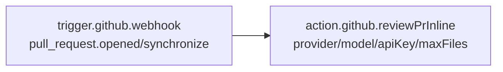
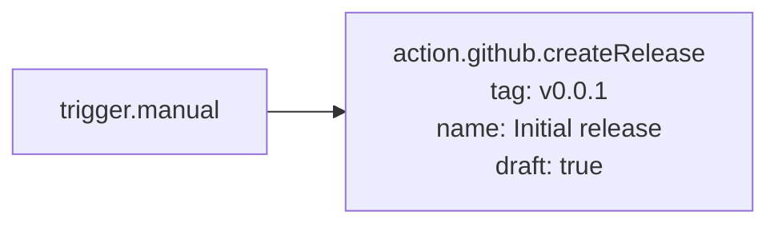

# 模板参考

<TLDR>
  GitHub Delivery 出厂带 **8 个内置工作流模板**(`lib/workflow/definition/seed-github.ts`), 都标记为
  `isBuiltIn: true` + `isTemplate: true`。用户在工作流库点 "Use template" 后会 fork
  出一份可编辑的副本,id 重新生成,但节点 / 边结构原样保留。所有模板都只用已注册的执行器, 开箱即跑。
</TLDR>

## 速查表

| #   | 模板 id                              | 名称                                   | 触发                                       | 主流程                                  |
| --- | ------------------------------------ | -------------------------------------- | ------------------------------------------ | --------------------------------------- |
| 1   | `wf_builtin_gh_pr_auto_review`       | [GitHub] PR auto-review                | webhook(`pull_request.opened/synchronize`) | AI prompt → 提交 review                 |
| 2   | `wf_builtin_gh_pr_inline_review`     | [GitHub] PR inline AI review           | webhook(`pull_request.opened/synchronize`) | reviewPrInline(LLM 自带行级评论)        |
| 3   | `wf_builtin_gh_issue_triage`         | [GitHub] Issue smart triage            | webhook(`issues.opened`)                   | AI 分类 → 打标签                        |
| 4   | `wf_builtin_gh_issue_pr_loop`        | [GitHub] Issue → PR loop               | webhook(`issues.labeled`)                  | runIssueLoop(Claude sidecar)            |
| 5   | `wf_builtin_gh_release_conventional` | [GitHub] Release: Conventional Commits | `trigger.cron`(`0 18 * * *`)               | generateChangelog → createRelease(草稿) |
| 6   | `wf_builtin_gh_release_continuous`   | [GitHub] Release: continuous           | webhook(`pull_request.closed`)             | changelog → pushTag → release(正式)     |
| 7   | `wf_builtin_gh_release_manual`       | [GitHub] Release: manual               | `trigger.manual`                           | 直接 createRelease(草稿)                |
| 8   | `wf_builtin_gh_ci_diagnose`          | [GitHub] CI failure diagnosis          | webhook(`check_run.completed`)             | AI 诊断 → commentPr                     |

`buildGithubDeliveryTemplates()` 的导出顺序就是 1 → 8,但 UI 库列表通常按"主题分组"排序。

## 表达式速查

所有模板里出现的 `{{ ... }}` 都是工作流表达式语言(见
[Workflows → Expression language](/zh/workflows/expression-language),M2 阶段写)。
GitHub Delivery 模板里常见的 anchor:

| 表达式                                                    | 内容                                   |
| --------------------------------------------------------- | -------------------------------------- |
| `$trigger.payload.body.repository.full_name`              | `"owner/name"`                         |
| `$trigger.payload.body.pull_request.number`               | PR 号                                  |
| `$trigger.payload.body.pull_request.title`                | PR 标题                                |
| `$trigger.payload.body.pull_request.body`                 | PR 描述                                |
| `$trigger.payload.body.pull_request.merge_commit_sha`     | 合并后的 commit SHA                    |
| `$trigger.payload.body.issue.number`                      | Issue 号                               |
| `$trigger.payload.body.issue.title` / `.body`             | Issue 标题 / 描述                      |
| `$trigger.payload.body.check_run.name` / `.conclusion`    | CI check 信息                          |
| `$trigger.payload.body.check_run.pull_requests[0].number` | check 关联的 PR                        |
| `$node['<id>'].out.<field>`                               | 上游节点输出                           |
| `$static.<key>`                                           | 工作流级静态变量(在编辑器 Settings 配) |

---

## 1. PR auto-review

**id.** `wf_builtin_gh_pr_auto_review`

**用途.** PR 被开 / 推新提交时,让 AI 浏览标题 + 描述,输出一段总结性评审。本模板是**快通道**
版本 —— 不读 diff、不做行级评论,只发一条 `COMMENT` 级别的 review。

**节点图.**

```mermaid
flowchart LR
    T[trigger.github.webhook<br/>pull_request.opened/synchronize] --> A[ai.prompt<br/>'You are a senior reviewer...']
    A --> R[action.github.reviewPr<br/>event: COMMENT<br/>body: {{ ai.completion }}]
```

**参数填法.**

| 节点        | 字段           | 模板默认值                                                                                                                    |
| ----------- | -------------- | ----------------------------------------------------------------------------------------------------------------------------- |
| `n_trigger` | `events`       | `["pull_request.opened", "pull_request.synchronize"]`                                                                         |
| `n_ai`      | `systemPrompt` | `"You are a senior reviewer. Read the PR title + body + diff summary. Decide APPROVE / COMMENT / REQUEST_CHANGES. Be terse."` |
| `n_ai`      | `userPrompt`   | `{{ $trigger.payload.body.pull_request.title }}\n\n{{ $trigger.payload.body.pull_request.body }}`                             |
| `n_review`  | `event`        | `"COMMENT"`                                                                                                                   |
| `n_review`  | `body`         | `{{ $node['n_ai'].out.completion }}`                                                                                          |

**所需凭据.**

- GitHub App 或 PAT(`reviewPr` 走 `comment` 策略 action)。
- AI provider(LLM)的 API key —— 配在 `n_ai` 节点的 Inspector,或通过 `$static.anthropicKey` 引入。

**定制建议.**

- **改成 `APPROVE` / `REQUEST_CHANGES` 的真分流.** AI 输出后加 `flow.switch` 节点,按
  AI 文本里关键字判定。
- **读 diff.** 用 `action.github.reviewPrInline`(模板 2)替代 —— 不需要再串一个 `ai.prompt`。

---

## 2. PR inline AI review

**id.** `wf_builtin_gh_pr_inline_review`

**用途.** 升级版的 PR 自动审阅。让 LLM 直接读 diff,输出结构化 JSON,逐行注释。

**节点图.**



**参数填法.**

| 节点        | 字段           | 模板默认值                                            |
| ----------- | -------------- | ----------------------------------------------------- |
| `n_trigger` | `events`       | `["pull_request.opened", "pull_request.synchronize"]` |
| `n_review`  | `repoFullName` | `{{ $trigger.payload.body.repository.full_name }}`    |
| `n_review`  | `prNumber`     | `{{ $trigger.payload.body.pull_request.number }}`     |
| `n_review`  | `provider`     | `"anthropic"`                                         |
| `n_review`  | `model`        | `"claude-sonnet-4-6"`                                 |
| `n_review`  | `apiKey`       | `""`(模板留空,fork 后必须填)                          |
| `n_review`  | `maxFiles`     | `5`                                                   |

**所需凭据.** GitHub + LLM provider。

**定制建议.**

- **指定关注点.** 加上 `focus: "security"` 或 `focus: "performance"`,LLM 会在 systemPrompt
  里看到额外的"specific focus"提示。
- **更长输入.** 把 `maxFiles` 抬到 10–20(硬上限 30)。
- **改 model.** 默认是 sonnet,需要更便宜可以换 haiku;需要更深可以换 opus。
  Inspector 里改 `model` 字段即可。

---

## 3. Issue smart triage

**id.** `wf_builtin_gh_issue_triage`

**用途.** Issue 一开,让 AI 分类成 `bug` / `feature` / `question`,自动打标签。

**节点图.**

```mermaid
flowchart LR
    T[trigger.github.webhook<br/>issues.opened] --> C[ai.classify<br/>categories: bug/feature/question]
    C --> L[action.github.labelIssue<br/>add: [{{ category }}]]
```

**参数填法.**

| 节点         | 字段         | 模板默认值                                                                          |
| ------------ | ------------ | ----------------------------------------------------------------------------------- |
| `n_trigger`  | `events`     | `["issues.opened"]`                                                                 |
| `n_classify` | `text`       | `{{ $trigger.payload.body.issue.title }}\n\n{{ $trigger.payload.body.issue.body }}` |
| `n_classify` | `categories` | `["bug", "feature", "question"]`                                                    |
| `n_label`    | `add`        | `["{{ $node['n_classify'].out.category }}"]`                                        |

**所需凭据.** GitHub + LLM provider(`ai.classify` 节点内部用 cognia 配置的默认 provider)。

**定制建议.**

- **更多类别.** `categories` 写多即可。`labelIssue` 的 `add` 是数组,一次最多打一个。如果
  你想多标签,在 `ai.classify` 后接一个 `data.transform` 节点把 `out.category` 映射成
  `["bug", "needs-triage"]`。
- **基于关键词的退路.** 用 `flow.switch` 在 AI 返回为空 / 低置信度时打 `needs-human-triage`。

---

## 4. Issue → PR loop

**id.** `wf_builtin_gh_issue_pr_loop`

**用途.** Issue 被打上 `cognia:claim`(或任何你约定的标签)→ 调 `runIssueLoop` 走 AI 闭环。

**节点图.**

```mermaid
flowchart LR
    T[trigger.github.webhook<br/>issues.labeled] --> L[action.github.runIssueLoop<br/>issueNumber: {{ payload.issue.number }}]
```

**参数填法.**

| 节点        | 字段           | 模板默认值                                         |
| ----------- | -------------- | -------------------------------------------------- |
| `n_trigger` | `events`       | `["issues.labeled"]`                               |
| `n_loop`    | `repoFullName` | `{{ $trigger.payload.body.repository.full_name }}` |
| `n_loop`    | `issueNumber`  | `{{ $trigger.payload.body.issue.number }}`         |

**所需凭据.**

- GitHub App 或 PAT(用于 clone + push + open PR)。
- Claude provider(Settings → Providers,driver 是 `SidecarIssueLoopDriver`)。

**定制建议.**

- **过滤标签.** 默认订阅所有 `issues.labeled`,可能噪声大。加一个 `flow.switch` 节点,
  仅当 `$trigger.payload.body.label.name === "cognia:claim"` 时往下走。
- **指定 worktree 模式.** 写 `worktreeMode: "e2b"`,需启用 `e2b-sandbox` 插件。
- **指定 branch 模板.** 默认 `cognia/issue-{n}`,`{n}` 占位符会被 issueNumber 替换。

<Callout type="warn">
  **长任务提醒.** `runIssueLoop` 可能跑数十分钟。`lib/workflow/runtime/long-step-runner.ts` 会写
  checkpoint 到 `workflowRunEvents`;进程崩溃后 resume 会从最近 checkpoint 继续,不会 重跑 LLM。
</Callout>

---

## 5. Release: Conventional Commits

**id.** `wf_builtin_gh_release_conventional`

**用途.** 每日 18:00(本地)按 Conventional Commits 算 semver bump,生成 changelog,
开**草稿** release。

**节点图.**

```mermaid
flowchart LR
    T[trigger.cron<br/>0 18 * * *] --> C[action.github.generateChangelog<br/>since: v1.0.0]
    C --> R[action.github.createRelease<br/>tag: {{ nextVersion }}<br/>body: {{ markdown }}<br/>draft: true]
```

**参数填法.**

| 节点          | 字段             | 模板默认值                                   |
| ------------- | ---------------- | -------------------------------------------- |
| `n_trigger`   | `cron`           | `"0 18 * * *"`                               |
| `n_changelog` | `repoFullName`   | `"owner/repo"`(模板占位,fork 后改成真实值)   |
| `n_changelog` | `since`          | `"v1.0.0"`(模板占位,改成上次 release 的 tag) |
| `n_changelog` | `currentVersion` | `"1.0.0"`                                    |
| `n_release`   | `tag`            | `{{ $node['n_changelog'].out.nextVersion }}` |
| `n_release`   | `body`           | `{{ $node['n_changelog'].out.markdown }}`    |
| `n_release`   | `draft`          | `true`                                       |

**所需凭据.** GitHub(无 LLM 调用)。

**定制建议.**

- **改 cron.** Inspector 里改触发频率;`scheduler` 子系统支持完整的 5 字段 cron。
- **从 git tag 自动取 `since`.** 加一个 `action.github.generateChangelog` 之前的步骤,
  调 Octokit `GET /repos/.../tags`,把最新 tag 喂给 `since`。
- **删 draft.** 把 `draft: false` 改成不带草稿;但请先确认 `requireHumanApproval` 你能接受
  (默认会软拒)。
- **加 `skipIfNoBump`.** 在 `n_changelog` 后接一个 `flow.switch`,若 `out.bump === "none"`
  则跳过 release(避免发"空 release")。

---

## 6. Release: continuous

**id.** `wf_builtin_gh_release_continuous`

**用途.** 每次 PR 合并主干后,自动 bump + 打 tag + 发**正式** release。适合按 PR 发版的项目。

**节点图.**

```mermaid
flowchart LR
    T[trigger.github.webhook<br/>pull_request.closed] --> C[action.github.generateChangelog]
    C --> Tag[action.github.pushTag<br/>tag: v{{ nextVersion }}<br/>sha: {{ merge_commit_sha }}]
    Tag --> R[action.github.createRelease<br/>tag: v{{ nextVersion }}<br/>draft: false]
```

**参数填法.**

| 节点          | 字段             | 模板默认值                                                         |
| ------------- | ---------------- | ------------------------------------------------------------------ |
| `n_trigger`   | `events`         | `["pull_request.closed"]`                                          |
| `n_changelog` | `since`          | `{{ $static.lastTag }}`(预期工作流 Settings 配置 `static.lastTag`) |
| `n_changelog` | `currentVersion` | `{{ $static.currentVersion }}`                                     |
| `n_tag`       | `tag`            | `v{{ $node['n_changelog'].out.nextVersion }}`                      |
| `n_tag`       | `sha`            | `{{ $trigger.payload.body.pull_request.merge_commit_sha }}`        |
| `n_release`   | `tag`            | `v{{ $node['n_changelog'].out.nextVersion }}`                      |
| `n_release`   | `body`           | `{{ $node['n_changelog'].out.markdown }}`                          |
| `n_release`   | `draft`          | `false`                                                            |

**所需凭据.** GitHub(无 LLM 调用)。

**关键注意点.**

- `pull_request.closed` 包括"closed without merge"。**模板里没过滤 merged**,实际使用必须
  加一个 `flow.switch`:`$trigger.payload.body.pull_request.merged === true`。
- `merge_commit_sha` 在 merged-PR 上才有值,所以这个过滤是必须的。
- 由于 `draft: false`,`createRelease` 会被 policy gate 拦截软拒(`requireHumanApproval`),
  路由到 Inbox HITL。如果你想全自动:`policyOverride: { requireHumanApproval: false }`
  (节点级,审计仍会记)。

---

## 7. Release: manual

**id.** `wf_builtin_gh_release_manual`

**用途.** 工作流面板上点击"Run",创建一个 release。最简单的模板,适合发新版本时手动驱动。

**节点图.**



**参数填法.**

| 节点        | 字段     | 模板默认值                 |
| ----------- | -------- | -------------------------- |
| `n_trigger` | (无参数) | —                          |
| `n_release` | `tag`    | `"v0.0.1"`                 |
| `n_release` | `name`   | `"Initial release"`        |
| `n_release` | `body`   | `"Initial release notes."` |
| `n_release` | `draft`  | `true`                     |

**所需凭据.** GitHub。

**定制建议.**

- **加 manual params.** `trigger.manual` 支持声明 params(版本号 / 备注 / tag),工作流执行时
  弹一个表单让用户填,然后 `{{ $trigger.params.version }}` 喂给后续节点。

---

## 8. CI failure diagnosis

**id.** `wf_builtin_gh_ci_diagnose`

**用途.** CI check 失败时,让 AI 读 check name + conclusion 写一段三点诊断,评论到对应 PR。

**节点图.**

```mermaid
flowchart LR
    T[trigger.github.webhook<br/>check_run.completed] --> A[ai.prompt<br/>'You are a CI failure analyst...']
    A --> C[action.github.commentPr<br/>prNumber: {{ check_run.pull_requests[0].number }}<br/>body: {{ ai.completion }}]
```

**参数填法.**

| 节点        | 字段           | 模板默认值                                                                                                                         |
| ----------- | -------------- | ---------------------------------------------------------------------------------------------------------------------------------- |
| `n_trigger` | `events`       | `["check_run.completed"]`                                                                                                          |
| `n_ai`      | `systemPrompt` | `"You are a CI failure analyst. Read the check name + conclusion + logs and write a 3-bullet diagnosis of the likely root cause."` |
| `n_ai`      | `userPrompt`   | `"Check: {{ check_run.name }} — {{ check_run.conclusion }}"`                                                                       |
| `n_comment` | `prNumber`     | `{{ $trigger.payload.body.check_run.pull_requests[0].number }}`                                                                    |
| `n_comment` | `body`         | `{{ $node['n_ai'].out.completion }}`                                                                                               |

**所需凭据.** GitHub + LLM provider。

**关键注意点.**

- `check_run.completed` 在所有 check 完成时都会触发,**包括成功**。模板没过滤 conclusion,
  实际使用必须加 `flow.switch`:`$trigger.payload.body.check_run.conclusion === "failure"`。
- `pull_requests[0]` 取数组首个 PR。一个 check_run 通常只关联一个 PR,但如果你在 base 仓
  接 fork PR,数组可能为空 —— 加一个 `data.transform` 检查长度。
- **读 log.** 模板里只把 check name 喂给 AI,没读实际 logs。要拉日志需要先调
  `GET /repos/.../actions/jobs/{job_id}/logs`(目前不在 13 个节点里,需要走
  `ai.callMcpTool` 或 `data.http` 自己请求),把日志切片到 LLM 的 userPrompt 里。

---

## fork 与可重入

工作流库点 "Use template" 后:

1. 新 workflow 行被插入 `workflows` Dexie 表,`id` 由 `crypto.randomUUID()` 重新生成。
2. `isBuiltIn: false`,`isTemplate: false`,可编辑。
3. 节点 / 边数组深拷贝,id 保留(`n_trigger` / `n_review` 等),orchestrator 不会冲突。
4. settings 取 `DEFAULT_WORKFLOW_SETTINGS`。

**多次 fork 同一模板** 互不影响 —— 每次都生成新 workflow id。

## 模板 vs 自建

| 维度                 | 用模板                                    | 自建                                                                  |
| -------------------- | ----------------------------------------- | --------------------------------------------------------------------- |
| 上手成本             | 低 —— Click + 改两三个字段                | 高 —— 自己拼图、调试连接关系                                          |
| 跟随官方更新         | 否 —— fork 后是独立副本                   | 否(永远是自己维护)                                                    |
| 表达式 anchor 正确性 | 高 —— 模板都用过的 path                   | 中 —— 需要查 [Expression language](/zh/workflows/expression-language) |
| 涵盖边界场景         | 低 —— 模板尽量精简,常需用户加 flow.switch | 自由,但成本高                                                         |

**推荐组合:**先 fork 最接近的模板,再自己加 `flow.switch` / `data.transform` 过滤场景边界。

## 源码索引

| 文件                                          | 用途                                               |
| --------------------------------------------- | -------------------------------------------------- |
| `lib/workflow/definition/seed-github.ts`      | 8 个模板的全部 builder 函数                        |
| `lib/workflow/definition/seed-github.test.ts` | 8 个模板的结构测试 + id 唯一性                     |
| `lib/workflow/definition/seed.ts`             | 把 `buildGithubDeliveryTemplates()` 接进总模板库   |
| `types/workflow/visual.ts`                    | `VisualWorkflow` / `isTemplate` / `isBuiltIn` 定义 |
| `components/workflow/library/`                | 模板库 UI("Use template" 入口)                     |
| `lib/workflow/runtime/orchestrator.ts`        | 模板被 fork 后 run 的实际执行路径                  |
