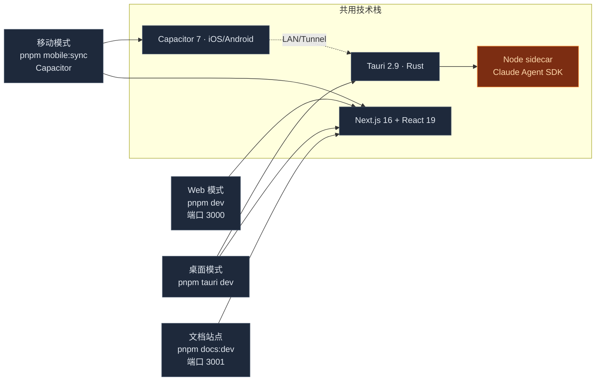
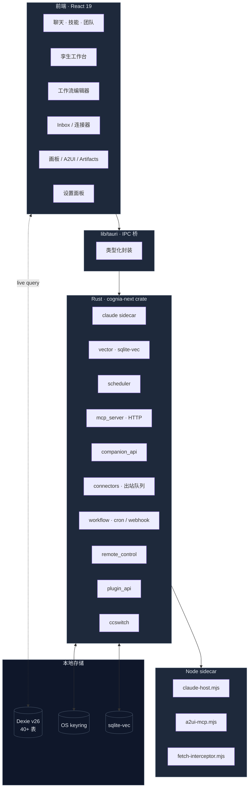

# Cognia · 概览

**Cognia**（代码库 `cognia-next`）是一个面向 [Claude Code](https://claude.com/claude-code) 的桌面客户端。它以 Tauri 2.9 应用形式运行在 Windows、macOS 与 Linux 上；前端是 Next.js 16 + React 19，后端是 Rust 实现的若干原生子系统（调度器、向量库、文件 IO、TTS、深链、MCP HTTP 服务器、工作流 cron 守护进程、Companion 配对服务器……）。一个 Node sidecar 打包了官方 `@anthropic-ai/claude-agent-sdk`，并通过 stdio 与父进程通信。此外还支持通过 Capacitor 在移动端运行（详见 [移动架构](./mobile-architecture)）。

本文档严格反映**仓库中的真实实现**——这里描述的每一个子系统都对应 `lib/`、`components/` 或 `src-tauri/src/` 下你可以阅读和修改的目录。

<TLDR>
  - **运行时矩阵**：Web（浏览器）、Desktop（Tauri 2.9）、Mobile（Capacitor）三种模式共用同一份 React
  代码。 - **存储**：Dexie schema 已经到 **v26**，40+
  张表覆盖聊天、技能、孪生、插件、工作流、连接器、Wiki、Companion 等子系统。 - **Rust
  后端**：`cognia-next` crate 注册了 **27 个** 顶层模块，包括
  `mcp_server`、`companion_api`、`connectors`、`workflow`、`remote_control`、`ccswitch`、`plugin_api`、`wallpaper`
  等。 - **Provider 链**：`app/layout.tsx` 嵌套 **14+ 个** 顶层
  Provider，先后驱动主题、本地化、Tauri、设置同步、连接器总线、Companion 引导、桌面同步源等子系统。
  -
  **多入口产品**：单一仓库同时是聊天客户端、孪生工作台、可视化工作流编辑器、平台连接器（Telegram/Discord/Slack/Lark/QQ）和外部桥（MCP
  服务器 + Wiki）。
</TLDR>

## 为什么"不是脚手架"

很多 `Next.js + Tauri` 仓库是供 fork 的模板。cognia-next 恰恰相反——它是一个完整产品，恰好基于 Next.js + Tauri。具体来说：

- **Dexie schema 已经到 v26**，超过 40 张表 —— 聊天、角色、技能、团队、孪生、插件、A2UI、画板、Wiki、连接器（适配器、入站账本、出站队列）、工作流（定义、运行、事件、触发器）、Companion 配对设备、订阅用量、聊天草稿……
- **Rust crate（`cognia-next`）注册了 27 个模块**：`claude` sidecar、`scheduler`（Windows Task Scheduler / launchd / systemd）、`vector`（sqlite-vec）、`tts`、`hooks`、`agents`、`external_agent`、`a2ui_bridge`、`canvas`、`skills`、`files`、`shell`、`settings`、`api_key`、`logging`、`mcp_server`、`companion_api`、`connectors`、`workflow`、`remote_control`、`ccswitch`、`anthropic_subscription`、`plugin_api`、`proxy_config`、`wallpaper`、`window_behavior`、`tray`/`menu`。还有 single-instance、deep-link、autostart、global-shortcut、store、updater 等插件。
- **Node sidecar**（`sidecar/claude-host.mjs`、`sidecar/a2ui-mcp.mjs`、`sidecar/fetch-interceptor.mjs`）有自己独立的 `pnpm install`，因为它有 Node-only 依赖，并作为 Tauri 资源单独打包。
- **前端在 `app/layout.tsx` 中嵌套了 14+ 个顶层 Provider**：Theme → SettingsHydrator → LocaleGate → SettingsSync → Tauri → Tooltip → Logger → ExternalAgent → AgentTeamRuntime → Scheduler → BackupScheduler → CompanionEventBridge → CanvasBridge → A2UIDispatch → DataAdapter → ConnectorBus → ConnectorDeepLinkRouter → SubscriptionUsage → CompanionBoot → DesktopSyncSource → DesktopMessageSource。
- **次级二进制 `cognia-server`**：`src-tauri/Cargo.toml` 注册了一个独立 `[[bin]]` 入口（详见 [Companion API](./companion-api)），允许把 Cognia 当作 headless 配对服务器跑在远端机器。

如果你打算来"学习这个脚手架"——选错仓库了，请挑更小的示例。如果你正在为 Cognia 做开发或贡献，那么这里就是入口。

## 三种运行时



- **Web 模式**（`pnpm dev`）— Next.js 开发服务器，零原生依赖。任何 `isTauri()` 守护的代码路径都会变 no-op；连接器、Companion、MCP 服务器、原生向量库均不可用。
- **桌面模式**（`pnpm tauri dev`）— 完整功能集。Tauri webview 内运行 Next.js，Rust 后端提供原生 IPC，Node sidecar 通过 stdio 承载 Claude Agent SDK。
- **移动模式**（`pnpm mobile:sync`）— `mobile/` 包通过 Capacitor 把同一份静态导出包到 iOS/Android。`isCapacitor()` 守卫触发后，UI 用 LAN 或 Tunnel 连回桌面侧的 Companion 服务器。详见 [移动架构](./mobile-architecture)。

## 仓库里有什么

| 子系统                                                   | 位置                                                                                                                                                            | 文档                                                                                                                                           |
| -------------------------------------------------------- | --------------------------------------------------------------------------------------------------------------------------------------------------------------- | ---------------------------------------------------------------------------------------------------------------------------------------------- |
| 多角色 / 技能 / 团队 聊天                                | `app/`、`components/chat/`、`lib/chat/`、`lib/character/`（经由 `lib/claude/types.ts`）、`lib/skills/`、`lib/db/{characters,skills,teams,sessions,messages}.ts` | [聊天 & 技能](./chat-and-skills) · [Agent 团队](./agent-teams)                                                                                 |
| Claude Agent SDK + Node sidecar                          | `sidecar/claude-host.mjs`、`lib/claude/`、`src-tauri/src/claude/`                                                                                               | [Sidecar & Claude SDK](./sidecar-and-claude-sdk)                                                                                               |
| Claude 订阅 OAuth                                        | `lib/anthropic-subscription/`、`src-tauri/src/anthropic_subscription/`、`components/settings/subscription/`                                                     | [Claude 订阅 OAuth](./claude-subscription-oauth)                                                                                               |
| CCSwitch 提供商切换                                      | `src-tauri/src/ccswitch/`、`lib/ccswitch/`                                                                                                                      | [CCSwitch](./ccswitch) · [提供商系统](./provider-system)                                                                                       |
| 员工数字孪生（RAG + 风格少样本）                         | `lib/twin/{ingest,distill,runtime}/`、`components/twin/`、`app/twin/`、`types/twin/`                                                                            | [员工数字孪生](./employee-twin)                                                                                                                |
| 原生向量库（sqlite-vec）                                 | `src-tauri/src/vector/`、`lib/vector/`                                                                                                                          | [向量库](./vector-store)                                                                                                                       |
| 加密备份 / 导入（schema v3）                             | `lib/data/`、`components/settings/data/`                                                                                                                        | [备份 & 数据传输](./backup-and-data) · [导出系统](./export-system)                                                                             |
| 跨平台调度器                                             | `src-tauri/src/scheduler/`、`lib/scheduler/`、`components/scheduler/`                                                                                           | [调度器](./scheduler)                                                                                                                          |
| 插件系统                                                 | `lib/plugin/`、`lib/db/plugins.ts`、`src-tauri/src/plugin_api/`、`components/plugins/`                                                                          | [插件系统](./plugin-system)                                                                                                                    |
| A2UI / 画板 / Artifacts 输出层                           | `lib/a2ui/`、`lib/canvas/`、`lib/artifacts/`、`components/{a2ui,canvas,artifacts}/`                                                                             | [A2UI](./a2ui-system) · [画板](./canvas) · [Artifacts](./artifacts-sandbox)                                                                    |
| TTS（Edge / OpenAI / Azure / ElevenLabs / 原生）         | `src-tauri/src/tts/`、`lib/tts/`                                                                                                                                | [杂项子系统](./misc-subsystems)                                                                                                                |
| MCP 服务器 + 预设                                        | `lib/claude/mcp-presets.ts`、`lib/db/mcp-servers.ts`                                                                                                            | [Sidecar & Claude SDK](./sidecar-and-claude-sdk)                                                                                               |
| **External Bridge（Wiki + MCP）**                        | `lib/wiki/`、`lib/external-bridge/`、`src-tauri/src/mcp_server/`                                                                                                | [External Bridge](./external-bridge) · [Wiki 生成器](./wiki-generator) · [Tauri MCP](./mcp-server-tauri) · [Sidecar MCP](./mcp-server-sidecar) |
| **可视化工作流**                                         | `lib/workflow/`、`components/workflow/`、`src-tauri/src/workflow/`                                                                                              | [可视化工作流](./visual-workflows)                                                                                                             |
| **平台连接器（Telegram / Discord / Slack / Lark / QQ）** | `lib/connectors/`、`components/connectors/`、`src-tauri/src/connectors/`、`app/inbox/`                                                                          | [平台连接器](./platform-connectors)                                                                                                            |
| **Companion API（移动配对）**                            | `src-tauri/src/companion_api/`、`mobile/`                                                                                                                       | [Companion API](./companion-api) · [移动架构](./mobile-architecture)                                                                           |
| **远程控制**                                             | `src-tauri/src/remote_control/`                                                                                                                                 | [远程控制](./remote-control)                                                                                                                   |
| **桌面同步 / 多会话源**                                  | `components/providers/desktop-sync-source-provider.tsx`、`components/providers/desktop-message-source-provider.tsx`                                             | [同步系统](./sync-system)                                                                                                                      |
| Skills / Slash commands                                  | `lib/skills/`、`src-tauri/src/skills/`、`lib/commands/`                                                                                                         | [技能系统](./skills-system) · [Slash commands](./slash-commands)                                                                               |
| 主题（oklch + 自定义主题）                               | `lib/themes/`、`lib/theme/`、`app/globals.css`                                                                                                                  | [主题 & 国际化](./theming-and-i18n) · [shadcn/ui 配置](./shadcn-ui-setup)                                                                      |
| 国际化（next-intl）                                      | `lib/i18n/`、`i18n/messages/{en,zh-CN}.json`                                                                                                                    | [主题 & 国际化](./theming-and-i18n)                                                                                                            |
| 设置 UI（多 section 嵌套面板）                           | `app/settings/`、`components/settings/`                                                                                                                         | [设置 UI](./settings-ui)                                                                                                                       |

各层如何衔接，参见 [架构](./architecture)。

## 子系统全景图



## 快速导航

<Cards>
  <Card title="快速开始" href="./getting-started" description="安装依赖、运行 Web、运行桌面。" />
  <Card title="架构" href="./architecture" description="分层视角：前端 → IPC → Rust → sidecar。" />
  <Card
    title="运行时 & Tauri"
    href="./runtime-and-tauri"
    description="Web/桌面双运行时、IPC 模式、CSP、bundle identifier。"
  />
  <Card
    title="Sidecar & Claude SDK"
    href="./sidecar-and-claude-sdk"
    description="Node 主机协议、生命周期、hooks。"
  />
  <Card
    title="聊天 & 技能"
    href="./chat-and-skills"
    description="会话、角色、技能、团队、MCP 预设。"
  />
  <Card
    title="员工数字孪生"
    href="./employee-twin"
    description="ingest / distill / runtime 流水线。"
  />
  <Card title="向量库" href="./vector-store" description="原生 sqlite-vec + 5 个云端后端。" />
  <Card
    title="备份 & 数据传输"
    href="./backup-and-data"
    description="schema v3、定时写入、第三方导入。"
  />
  <Card title="调度器" href="./scheduler" description="cron 解析、原生提升、任务模板。" />
  <Card title="插件系统" href="./plugin-system" description="清单、权限、市场、定时任务。" />
  <Card title="存储" href="./storage" description="Dexie schema v26、settings 表、迁移规范。" />
  <Card
    title="主题 & 国际化"
    href="./theming-and-i18n"
    description="Tailwind v4、oklch 主题 token、语言切换。"
  />
  <Card title="开发" href="./development" description="工作流、脚本、约定、测试规范。" />
  <Card title="部署" href="./deployment" description="Web、桌面、文档站点的构建。" />
</Cards>

### 新增子系统页

<Cards>
  <Card
    title="External Bridge"
    href="./external-bridge"
    description="MCP 服务器 + Wiki + RAG 暴露给外部代理。"
  />
  <Card title="Wiki 生成器" href="./wiki-generator" description="模块文章 + 交叉引用 + 索引页。" />
  <Card title="Tauri MCP 服务器" href="./mcp-server-tauri" description="Rust 侧 HTTP MCP 传输。" />
  <Card
    title="Sidecar MCP 服务器"
    href="./mcp-server-sidecar"
    description="Node 侧 stdio MCP 传输。"
  />
  <Card
    title="Claude 订阅 OAuth"
    href="./claude-subscription-oauth"
    description="Pro/Max 登录 + 速率限制可视化。"
  />
  <Card title="提供商系统" href="./provider-system" description="14+ 提供商解析链。" />
  <Card title="CCSwitch" href="./ccswitch" description="一键切换提供商 + MCP + 提示词。" />
  <Card
    title="Companion API"
    href="./companion-api"
    description="移动配对 / LAN / Tunnel / 推送。"
  />
  <Card title="移动架构" href="./mobile-architecture" description="Capacitor 客户端 + 同步层。" />
  <Card
    title="可视化工作流"
    href="./visual-workflows"
    description="38 节点 + cron / webhook 触发器。"
  />
  <Card
    title="平台连接器"
    href="./platform-connectors"
    description="Telegram / Discord / Slack / Lark / QQ。"
  />
  <Card title="远程控制" href="./remote-control" description="入站令牌 + HMAC 签名。" />
  <Card title="同步系统" href="./sync-system" description="桌面 / 移动多源消息合流。" />
  <Card title="技能系统" href="./skills-system" description="本地扫描 + 远程注册表 + 安全检查。" />
  <Card title="Agent 团队" href="./agent-teams" description="团队生命周期 + 共享上下文。" />
  <Card title="Slash commands" href="./slash-commands" description="`/` 触发的本地命令。" />
  <Card title="A2UI 系统" href="./a2ui-system" description="工具触发的 UI 工作面。" />
  <Card title="画板" href="./canvas" description="原生 Python 执行 + 多文档编辑。" />
  <Card title="Artifacts 沙箱" href="./artifacts-sandbox" description="HTML / JSX 安全预览。" />
  <Card title="导出系统" href="./export-system" description="Markdown / HTML / 动画导出。" />
  <Card title="搜索系统" href="./search-system" description="跨表全文检索。" />
  <Card title="文档处理" href="./document-processing" description="PDF / DOCX / 代码统一解析。" />
  <Card title="可观测性" href="./observability" description="OpenTelemetry + 日志桥。" />
  <Card title="Data hooks" href="./data-hooks" description="Dexie 数据适配层。" />
  <Card title="聊天 UI 架构" href="./chat-ui-architecture" description="消息渲染 + composer。" />
  <Card title="设置 UI" href="./settings-ui" description="多 section 嵌套面板。" />
  <Card title="shadcn/ui 配置" href="./shadcn-ui-setup" description="组件预装清单 + 配色 token。" />
  <Card title="杂项子系统" href="./misc-subsystems" description="TTS / 壁纸 / 钩子 / 代理。" />
</Cards>

<Callout type="info" title="ADR（架构决策记录）">
  17 份 [ADR](./adr/0001-backup-schema-v3) 在相关页面被引用，解释每个子系统**为什么**长成现在这样。
  v3 备份、孪生、连接器、订阅 OAuth、工作流、External Bridge、移动 v2、插件系统、命令清单都有独立
  ADR。
</Callout>

## 选择运行模式

<Tabs items={["Web", "桌面", "移动", "文档站点"]}>
  <Tab value="Web">
    ```bash pnpm install pnpm dev # → http://localhost:3000 ``` Web 模式只跑 Next.js
    开发服务器；所有 Tauri 专属能力（调度器、原生向量库、连接器、MCP 服务器）会被 `isTauri()`
    守卫降级为 no-op。
  </Tab>
  <Tab value="桌面">
    ```bash pnpm install pnpm tauri dev ``` 完整功能集。Tauri shell 启动 Next.js 开发服务器，派生
    Node sidecar，并注册所有 27 个 Rust 模块。
  </Tab>
  <Tab value="移动">
    ```bash pnpm mobile:sync pnpm mobile:run:ios # 或 mobile:run:android ``` Capacitor
    把同一份静态导出包到 iOS/Android。`isCapacitor()` 守卫激活后，UI 通过 LAN/Tunnel 连回桌面侧的
    Companion 服务器。
  </Tab>
  <Tab value="文档站点">
    ```bash pnpm docs:dev # → http://localhost:3001 ``` 你现在阅读的站点，由 Fumadocs
    提供。开发服务器实时热重载 MDX 编辑。
  </Tab>
</Tabs>

## 仓库结构速览

<Files>
  <Folder name="app/" defaultOpen>
    <File name="layout.tsx" />
    <File name="page.tsx" />
    <Folder name="settings/" />
    <Folder name="twin/" />
    <Folder name="workflows/" />
    <Folder name="inbox/" />
  </Folder>
  <Folder name="lib/" defaultOpen>
    <Folder name="claude/" />
    <Folder name="twin/" />
    <Folder name="workflow/" />
    <Folder name="connectors/" />
    <Folder name="external-bridge/" />
    <Folder name="wiki/" />
    <Folder name="data/" />
    <Folder name="db/" />
  </Folder>
  <Folder name="components/" />
  <Folder name="src-tauri/" defaultOpen>
    <Folder name="src/">
      <Folder name="claude/" />
      <Folder name="mcp_server/" />
      <Folder name="companion_api/" />
      <Folder name="connectors/" />
      <Folder name="workflow/" />
    </Folder>
    <File name="Cargo.toml" />
    <File name="tauri.conf.json" />
  </Folder>
  <Folder name="sidecar/">
    <File name="claude-host.mjs" />
    <File name="a2ui-mcp.mjs" />
    <File name="fetch-interceptor.mjs" />
  </Folder>
  <Folder name="mobile/" />
  <Folder name="docs/" />
</Files>

## 第一次贡献，四步走

<Steps>
  <Step>
    ### 阅读架构总览
    [架构](./architecture) 介绍四层模型（浏览器 → IPC → Rust → sidecar）以及每个子系统的位置。
  </Step>
  <Step>
    ### 找到对应子系统
    上面 Cards 中找到想修改的子系统页。每页都指向 `lib/`、`components/`、`src-tauri/src/` 下的源码目录。
  </Step>
  <Step>
    ### 用热重载开发
    `pnpm tauri dev` 让 React 侧改动秒级生效；Rust 改动会在保存时重新编译。
  </Step>
  <Step>
    ### 补上测试
    项目强制覆盖率 ≥90%。测试文件与源码同目录命名 `<file>.test.ts(x)`，运行 `pnpm test:coverage`。
  </Step>
</Steps>

## 常见问题

<Accordions>
  <Accordion title="Web 模式下哪些功能不可用？">
    任何被 `isTauri()` 守卫的代码：调度器原生执行、`sqlite-vec` 向量库、连接器（Telegram/Discord/...）、Companion API、MCP 服务器（HTTP）、Claude OAuth keyring、文件 IO。前端代码本身在 Web 也能工作；只是这些后端通道走不通。
  </Accordion>
  <Accordion title="如何在 zh 与 en 之间切换？">
    顶部右侧的语言切换按钮（地球图标）。zh 是默认语言，URL 是 `/docs/...`；en 是 `/en/docs/...`。
  </Accordion>
  <Accordion title="ADR / 连接器配置 / 插件开发文档在哪？">
    它们位于本（中文）侧边栏底部"技术参考"分组下。这些是项目共享的开发记录，未做英文翻译；EN 用户可通过绝对链接 `/docs/adr/...` 访问。
  </Accordion>
  <Accordion title="想添加 / 翻译一篇文档？">
    在 `docs/content/docs/<lang>/` 下新建 `.mdx` 文件，并在该语言的 `meta.json` 中加上文件名（不带扩展名）。`pnpm docs:dev` 会自动 reload。
  </Accordion>
</Accordions>
