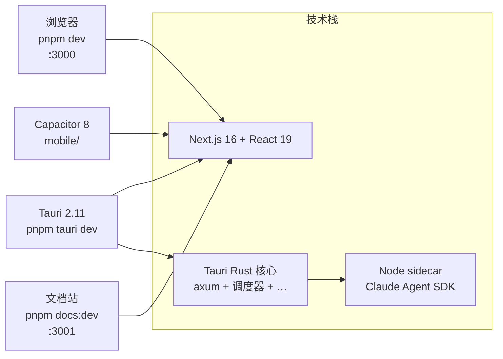

# 总览

**Cognia**（代码库 `cognia-next`）是 [Claude Code](https://claude.com/claude-code) 的 AI 客户端。同一份 Next.js 16 静态导出驱动三种外壳 —— 浏览器、Tauri 2.11 桌面、Capacitor 8 移动端，共享同一套 UI、同一份 i18n 词条、同一套业务逻辑。Rust 核心承载常驻服务（HTTP 服务器、调度器、向量存储、自动化、OCR、MCP），随包的 Node sidecar 托管官方 Claude Agent SDK。

本文档严格反映**仓库中的真实实现** —— 每一页都对应 `lib/`、`components/`、`src-tauri/src/` 或 `sidecar/` 下可阅读、可修改的目录。

## 一图速览



monorepo 旁有两个独立服务：

- `signaling-server/` —— WebRTC 信令汇合（axum + workers-rs）。
- `share-server/` —— Cloudflare Worker + Vite 查看器，承载零知识公共分享链。

## 快速导航

<Cards>
  <Card title="快速开始" href="./getting-started" description="安装依赖、跑 Web、跑桌面。" />
  <Card title="架构" href="./core/architecture" description="四层视图：前端、IPC、Rust、sidecar。" />
  <Card title="运行时 & Tauri" href="./core/runtime-and-tauri" description="Web/桌面双运行时、IPC、CSP。" />
  <Card title="Sidecar & Claude Agent SDK" href="./core/sidecar-and-claude-sdk" description="Node 主机协议、生命周期、hooks。" />
  <Card title="聊天 & 技能" href="./chat/chat-and-skills" description="会话、角色、技能、团队、MCP。" />
  <Card title="存储" href="./data/storage" description="Dexie schema（v54）、设置、迁移。" />
  <Card title="向量存储" href="./data/vector-store" description="原生 sqlite-vec + 云端后端。" />
  <Card title="备份与数据传输" href="./data/backup-and-data" description="Schema v3、定时写入、第三方导入。" />
  <Card title="插件系统" href="./subsystems/plugin-system" description="清单、权限、市场、定时任务。" />
  <Card title="主题与 i18n" href="./ui/theming-and-i18n" description="Tailwind v4、oklch token、语言切换。" />
  <Card title="开发" href="./dev/development" description="工作流、脚本、约定、测试。" />
  <Card title="部署" href="./dev/deployment" description="Web、桌面、移动、文档站构建。" />
</Cards>

<Callout type="info" title="ADR（架构决策记录）">
  ADR 位于 [`docs/content/docs/zh/adr/`](./adr/0001-backup-schema-v3) —— 每项重大决策一份。它们是不可变历史记录；若文档页与 ADR 冲突，以 ADR 为准。
</Callout>

## 选择运行模式

<Tabs items={["Web", "桌面", "移动", "文档站"]}>
  <Tab value="Web">
    ```bash
    pnpm install
    pnpm dev    # → http://localhost:3000
    ```
    仅浏览器。Tauri 专属能力（调度器、原生向量库、连接器、MCP 服务器、Computer Use）在 `isTauri()` 守卫后变 no-op。
  </Tab>
  <Tab value="桌面">
    ```bash
    pnpm install
    pnpm tauri dev
    ```
    完整功能。Tauri 外壳启动 Next.js 开发服务器、派生 Node sidecar、注册 Rust 核心。
  </Tab>
  <Tab value="移动">
    ```bash
    pnpm build
    pnpm mobile:sync
    pnpm mobile:open:ios       # 或 :android
    ```
    Capacitor 8 包裹 `out/`，通过 LAN/HTTPS 或 WebRTC 与 headless `cognia-server` 通信。
  </Tab>
  <Tab value="文档站">
    ```bash
    pnpm docs:dev   # → http://localhost:3001
    ```
    你正在阅读的站点。Fumadocs —— MDX 编辑秒级热重载。
  </Tab>
</Tabs>

## 第一次贡献，四步走

<Steps>
  <Step>
    ### 阅读架构总览
    [架构](./core/architecture) 介绍四层模型（浏览器 → IPC → Rust → sidecar）以及每个子系统的位置。
  </Step>
  <Step>
    ### 选定子系统
    每一页都指向 `lib/`、`components/` 或 `src-tauri/src/` 下的源码目录，并交叉引用对应 ADR。
  </Step>
  <Step>
    ### 热重载开发
    `pnpm tauri dev` 让 React 秒级生效；Rust 改动保存即重新编译。
  </Step>
  <Step>
    ### 补上测试
    覆盖率门槛 ≥ 90 %。同位命名 `<file>.test.ts(x)`，跑 `pnpm test:coverage`。
  </Step>
</Steps>
