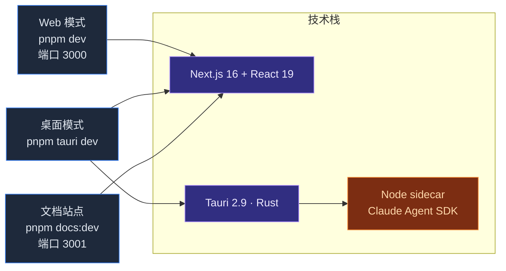

# Cognia · 概览

**Cognia**（代码库 `cognia-next`）是一个面向 [Claude Code](https://claude.com/claude-code) 的桌面客户端。它以 Tauri 2.9 应用形式运行在 Windows、macOS 与 Linux 上，前端是 Next.js 16 + React 19，后端是 Rust 实现的若干原生子系统（调度器、向量库、文件 IO、TTS、深链 等）。一个 Node sidecar 打包了官方 `@anthropic-ai/claude-agent-sdk`，并通过 stdio 与父进程通信。

本文档严格反映**仓库中的真实实现**——这里描述的每一个子系统都对应 `lib/`、`components/` 或 `src-tauri/src/` 下你可以阅读和修改的目录。

## 为什么"不是脚手架"

很多 `Next.js + Tauri` 仓库是供 fork 的模板。cognia-next 恰恰相反——它是一个完整产品，恰好基于 Next.js + Tauri。具体来说：

- Dexie schema 已经到 **v15**，超过 25 张表（聊天、角色、技能、团队、孪生、插件、A2UI、画板……）。
- Rust crate（`cognia-next`）注册了大约 16 个模块：`claude` sidecar、`scheduler`（Windows Task Scheduler / launchd / systemd）、`vector`（sqlite-vec）、`tts`、`hooks`、`agents`、`external_agent`、`a2ui_bridge`、`canvas`、`skills`、`files`、`shell`、`settings`、`api_key`、`logging`、`tray`/`menu`，以及 single-instance、deep-link、autostart、global-shortcut、store、updater 等插件。
- Node sidecar（`sidecar/claude-host.mjs`、`sidecar/a2ui-mcp.mjs`）有自己独立的 `pnpm install`，因为它有 Node-only 依赖，并作为 Tauri 资源单独打包。
- 前端在 `app/layout.tsx` 中嵌套了九层顶层 Provider（locale gate、Tauri runtime、scheduler initializer、backup scheduler、canvas bridge、A2UI dispatch、data adapter、settings sync、theme……）。

如果你打算来"学习这个脚手架"——选错仓库了，请挑更小的示例。如果你正在为 Cognia 做开发或贡献，那么这里就是入口。

## 速览

## 仓库里有什么

| 子系统 | 位置 |
| --- | --- |
| 多角色 / 技能 / 团队 聊天 | `app/`、`components/chat/`、`lib/chat/`、`lib/character/`（经由 `lib/claude/types.ts`）、`lib/skills/`、`lib/db/{characters,skills,teams,sessions,messages}.ts` |
| Claude Agent SDK + Node sidecar | `sidecar/claude-host.mjs`、`lib/claude/`、`src-tauri/src/claude/` |
| 员工数字孪生（RAG + 风格少样本） | `lib/twin/{ingest,distill,runtime}/`、`components/twin/`、`app/twin/`、`types/twin/` |
| 原生向量库（sqlite-vec） | `src-tauri/src/vector/`、`lib/vector/` |
| 加密备份 / 导入（schema v3） | `lib/data/`、`components/settings/data/` |
| 跨平台调度器 | `src-tauri/src/scheduler/`、`lib/scheduler/`、`components/scheduler/` |
| 插件系统 | `lib/plugin/`、`lib/db/plugins.ts`、`components/plugin/` |
| A2UI / 画板 / Artifacts 输出层 | `lib/a2ui/`、`lib/canvas/`、`lib/artifacts/`、`components/{a2ui,canvas,artifacts}/` |
| TTS（Edge / OpenAI / Azure / ElevenLabs / 原生） | `src-tauri/src/tts/`、`lib/tts/` |
| MCP 服务器 + 预设 | `lib/claude/mcp-presets.ts`、`lib/db/mcp-servers.ts` |
| 主题（oklch + 自定义主题） | `lib/themes/`、`lib/theme/`、`app/globals.css` |
| 国际化（next-intl） | `lib/i18n/`、`i18n/messages/{en,zh-CN}.json` |

各层如何衔接，参见 [架构](./architecture)。

## 快速导航

<Cards>
  <Card title="快速开始" href="./getting-started" description="安装依赖、运行 Web、运行桌面。" />
  <Card title="架构" href="./architecture" description="分层视角：前端 → IPC → Rust → sidecar。" />
  <Card title="运行时 & Tauri" href="./runtime-and-tauri" description="Web/桌面双运行时、IPC 模式、CSP、bundle identifier。" />
  <Card title="Sidecar & Claude SDK" href="./sidecar-and-claude-sdk" description="Node 主机协议、生命周期、hooks。" />
  <Card title="聊天 & 技能" href="./chat-and-skills" description="会话、角色、技能、团队、MCP 预设。" />
  <Card title="员工数字孪生" href="./employee-twin" description="ingest / distill / runtime 流水线。" />
  <Card title="向量库" href="./vector-store" description="原生 sqlite-vec + 5 个云端后端。" />
  <Card title="备份 & 数据传输" href="./backup-and-data" description="schema v3、定时写入、第三方导入。" />
  <Card title="调度器" href="./scheduler" description="cron 解析、原生提升、任务模板。" />
  <Card title="插件系统" href="./plugin-system" description="清单、权限、市场、定时任务。" />
  <Card title="存储" href="./storage" description="Dexie schema v15、settings 表、迁移规范。" />
  <Card title="主题 & 国际化" href="./theming-and-i18n" description="Tailwind v4、oklch 主题 token、语言切换。" />
  <Card title="开发" href="./development" description="工作流、脚本、约定、测试规范。" />
  <Card title="部署" href="./deployment" description="Web、桌面、文档站点的构建。" />
</Cards>

<Callout type="info" title="ADR（架构决策记录）">
  四份 [ADR](../adr/0001-backup-schema-v3) 在相关页面被引用，解释每个子系统**为什么**长成现在这样。
</Callout>
