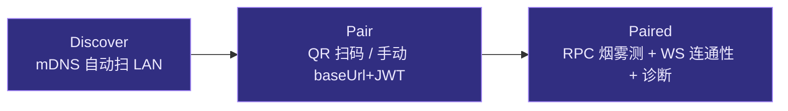
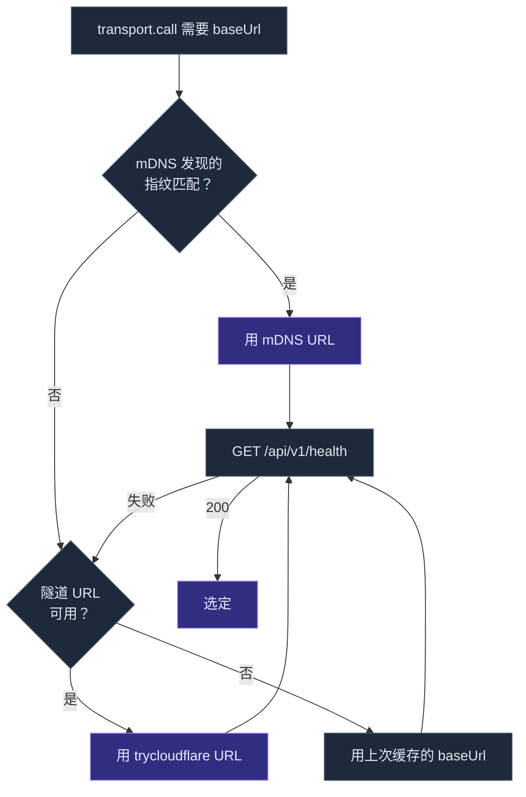

# 移动端架构

cognia-next 的移动客户端**不是**一个独立的 React Native 应用，也**不是**桌面版的简化版。它是同一份 Next.js 静态导出（`out/`），被 **Capacitor 7** 装进 iOS / Android 的原生 WebView，再通过 HTTP/WS 连回桌面端的 `/api/v1/*`。一份 JS bundle，三种壳（Tauri、Capacitor、Web），同一套 React 代码。

<Callout type="info">
  本页对应 ADR：[0014 — Capacitor 移动壳](../adr/0014-capacitor-mobile-shell)、 [0015 — 移动 V2
  完成](../adr/0015-mobile-v2-completion)、 [0012 — Transport
  抽象](../adr/0012-transport-abstraction)、 [0013 — 命令清单](../adr/0013-command-manifest)。
</Callout>

## TL;DR

<TLDR>

- 移动客户端 = **Capacitor 7 + 同一份 `out/` 静态导出**；不重写 UI、不并行维护组件库。
- 三态 `Transport` 在模块加载时决定：`TauriTransport`（桌面）/ `CompanionTransport`（手机）/ `WebStubTransport`（纯浏览器）。
- 桌面端是真正的"服务器"——sidecar、向量库、MCP、订阅、连接器全在桌面侧；手机是受信任的客户端。
- 设备 JWT 落 OS keystore（iOS Keychain / Android Keystore），通过 `capacitor-secure-storage-plugin` 写入。
- `lib/capacitor/*` 16 个原生插件包装（haptics、camera、share、deeplink、barcode、biometric……）走同一套 `withPlugin` 模板。
- TLS 自签证书（10 年有效）+ SubjectPublicKeyInfo 指纹钉绑，通过 QR 配对载荷 v2 分发到手机。
- mDNS 广播 `_cognia._tcp.local.` + Cloudflared 隧道 + 已缓存 URL = 三层连接候选。

</TLDR>

## 设计动机

| 选项               | 评估                                                                                              | 结论 |
| ------------------ | ------------------------------------------------------------------------------------------------- | ---- |
| **Tauri 2 Mobile** | 移动端缺 sidecar 支持（Tauri issues #11454 / #9774），Claude Agent SDK sidecar 是桌面运行时核心。 | 拒绝 |
| **React Native**   | 重写 57 个 shadcn/ui 组件到 RN 原语，数周工作量、无功能增益。                                     | 拒绝 |
| **Capacitor 7**    | 把现有 Next.js 静态导出装进原生 WebView，零 UI 重写。                                             | 选用 |

更深的判断：手机**永远**不是 sidecar 的运行环境。Claude Agent SDK 需要 Node ≥ 20、原生扩展、keyring crate 也不覆盖移动端 keystore，连接器 webhook 服务在 NAT 后的手机上也无法暴露公网 URL。承认这五个子系统是"桌面专属"是平台事实，不是框架选型遗留。

## 工程结构

```
pnpm-workspace.yaml
├── docs        # Fumadocs 文档站（独立 Next 服务，端口 3001）
└── mobile      # Capacitor 壳（无 Next 服务 —— 直接消费 ../out）
```

`mobile/capacitor.config.ts` 的 `webDir: "../out"` 与 `src-tauri/tauri.conf.json` 的 `frontendDist: "../out"` 指向**同一目录**。一次 `pnpm build` 产出一份静态导出，两种原生壳消费它。

## 第 1 层 —— 浏览器内核（WebView）

```mermaid
flowchart TB
  subgraph Phone["📱 手机端 · iOS Safari WebKit / Android System WebView"]
    NextOut[["/out 静态导出（同桌面）"]]
    React[["app/、components/、hooks/、lib/...<br/>同一套 React + Zustand + Dexie"]]
    Cap["@capacitor/core 桥"]
  end

  subgraph Native["📦 原生 Capacitor 插件"]
    Keystore[["SecureStorage<br/>JWT、配置"]]
    Camera[["Camera / Barcode<br/>QR 配对"]]
    Push[["Push Notifications"]]
    Deep[["@capacitor/app<br/>appUrlOpen"]]
  end

  subgraph Desktop["🖥️ 桌面端（真正的"服务器"）"]
    Companion["src-tauri/companion_api/<br/>axum HTTP + WS"]
    RustCmd[["companion_api/commands.rs<br/>~40 个允许命令"]]
    Tauri[["普通 Tauri 命令（200+）<br/>未被 RPC 暴露"]]
  end

  React --> Cap
  Cap --> Keystore
  Cap --> Camera
  Cap --> Push
  Cap --> Deep

  React -- "POST /api/v1/_rpc/<cmd>" --> Companion
  React -- "GET /ws/v1/events (WS)" --> Companion
  Companion --> RustCmd
  RustCmd -.- Tauri

  classDef phone fill:#1e293b,stroke:#475569,color:#e2e8f0
  classDef native fill:#312e81,stroke:#a78bfa,color:#ede9fe
  classDef server fill:#0f172a,stroke:#3b82f6,color:#cbd5e1
  class Phone,NextOut,React,Cap phone
  class Native,Keystore,Camera,Push,Deep native
  class Desktop,Companion,RustCmd,Tauri server
```

WebView 内运行的就是平时跑在 Tauri 里的那份代码 —— Zustand store、Dexie schema、`useTranslations(...)` 调用全部一致。差别只在 `lib/tauri/transport-instance.ts` 选了哪个 `Transport`，以及 `usePlatform()` 返回哪个枚举。

## 第 2 层 —— Transport 三态抽象

`lib/tauri.ts` 是**唯一**的命名导出聚合层；它底下站着一个 `Transport` 接口：

```ts title="lib/tauri/transport-types.ts"
export interface Transport {
  call<T = unknown>(name: string, args?: Record<string, unknown>): Promise<T>
  subscribe<T = unknown>(event: string, handler: (payload: T) => void): () => void
}
```

模块加载时选择实现：

```
window.__TAURI_INTERNALS__ 存在                  → TauriTransport
window.Capacitor?.isNativePlatform() === true   → CompanionTransport
其他                                              → WebStubTransport
```

| 实现                 | 在哪用               | `call`                                          | `subscribe`                       |
| -------------------- | -------------------- | ----------------------------------------------- | --------------------------------- |
| `TauriTransport`     | 桌面（Tauri 内）     | `@tauri-apps/api/core` 的 `invoke`              | `listen` 包成同步 `unsubscribe`   |
| `CompanionTransport` | Capacitor 移动       | `POST {baseUrl}/api/v1/_rpc/<name>`，Bearer JWT | `GET {baseUrl}/ws/v1/events` 长连 |
| `WebStubTransport`   | 纯浏览器（无 Tauri） | 拒绝 `tauri-only command from web mode: <name>` | no-op                             |

具体配置在 `lib/tauri/transport-companion.ts` —— 从 `companion-storage` 读出 `CompanionConfig`（baseUrl + JWT + 指纹），加 `Authorization: Bearer <JWT>`，POST 到 `/api/v1/_rpc/<command>`，请求体即原 Tauri 参数对象，返回 JSON。

WS 走 `?token=<JWT>` 鉴权；服务端保留一个 seq 游标，断线重连时从 `?since=<seq>` 续播，避免漏事件。详见 [Companion API](./companion-api)。

### 为什么不是 1:1 暴露所有 Tauri 命令

桌面上 `src-tauri/src/lib.rs` 注册了 200+ 命令。如果全部经 RPC 暴露：

1. 托盘操作、桌面壁纸写入、系统调度器提权——任何配对手机都能调用，**安全回归**。
2. API 表面太大，安全评审不现实。
3. 把"内部 Tauri 工具命令"和"稳定的对外 API"混在一起。

移动端真正需要的只是 ~30-40 个：发消息、技能 CRUD、MCP 测试、订阅凭证、设置读写。`src-tauri/src/companion_api/commands.rs` 是**手写的 match 表**，每个 arm 调用对应 Tauri 函数体。这就是 [ADR-0013 命令清单](../adr/0013-command-manifest) 的全部逻辑。

## 第 3 层 —— 配对流程

`app/(mobile-onboard)/pair/page.tsx` + `components/mobile/pair-onboarding-client.tsx` 实现一个三步向导，由 `components/mobile/pair/` 子目录支撑：



### Discover 步

调用 `lib/connectivity/lan-scanner.ts`：

1. 用 Capacitor mDNS 插件订阅 `_cognia._tcp.local.`。
2. 失败时回退到 IP 段扫（基于 WebRTC ICE 候选拿本地 IP，扫同段 1-254）。
3. 每个候选发 `GET {baseUrl}/api/v1/discover/info`，确认是 cognia 服务器。
4. 点击某条服务，预填它的 baseUrl 进 Pair 步。

### Pair 步

提供 QR 扫码 + 手动表单两条路：

- **QR**：`lib/capacitor/barcode.ts` 包 `@capacitor-mlkit/barcode-scanning`；解析 `lib/qr/pair-payload.ts` 的 v2 载荷（`cgnp2|<base64url JSON>`），同时兼容 M3.4 的裸 JSON。
- **手动**：两个 textarea —— baseUrl 与 pair JWT，校验交给 `pair-helpers.ts:validateBaseUrl/validatePairJwt`。

提交后：

```ts
const r = await transport.call("companion_api_pair", {
  baseUrl,
  pairJwt,
  deviceLabel,
  platform,
  publicKey: optionalEd25519,
})
// 返回 { deviceJwt, deviceId, serverVersion, fingerprint }
```

随即 `saveCompanionConfig(...)` 把 `CompanionConfig` 写进 OS keystore。

### Paired 步

- 调一次 `claude_sidecar_status` —— 已经在 RPC 允许列表，作为只读烟雾测。
- `transport.subscribe("claude://session-event", …)` 验 WS 通路，看到首帧或 5s 超时。
- 提供"诊断"折叠：服务端版本、绑定地址、指纹前 8 字节、最后心跳时间。
- "解除配对"按钮被 [biometric guard](#原生插件矩阵) 保护。

## 第 4 层 —— Secure Storage

`lib/tauri/companion-storage.ts` 抽象 `CompanionConfigStorage`：

```ts title="lib/tauri/companion-storage.ts"
export interface CompanionConfigStorage {
  read(): Promise<CompanionConfig | null>
  write(config: CompanionConfig): Promise<void>
  clear(): Promise<void>
}
```

两种实现：

- **`LocalStorageCompanionStorage`** —— 包 `window.localStorage`。Web 构建 + jsdom 测试用。
- **`SecureStorageCompanionStorage`** —— 动态导入 `capacitor-secure-storage-plugin`，写到 iOS Keychain / Android Keystore，key 是 `cognia.companion.config.v1`。

选择器 `pickCompanionStorage()` 镜像 transport 的三态选择。读路径走内存缓存（`hydrateCompanionConfig()` 启动时预热），确保 `transport.call()` 读 JWT 不再 await。

**永远不会**写到 `~/.claude/.credentials.json` —— 那是 `claude login` 的文件，是订阅 OAuth 的事，跟移动端无关。

## 安全：TLS 自签证书 + 指纹钉绑

桌面端 `src-tauri/src/companion_api/tls.rs`：

1. 启动时用 `rcgen` 生成 10 年有效自签证书。
2. 落盘 `<app_data>/cognia/companion/tls.{pem,key}`。
3. 计算 SHA-256 SubjectPublicKeyInfo 指纹（约 32 字节）。
4. 通过 QR 配对载荷把指纹推给手机。

后续每次 HTTPS 请求，移动端比对实际证书的 SPKI 哈希与缓存的指纹；不匹配则拒绝连接。重签证书时**保持同一私钥** → 指纹不变 → 不需要重新配对。

QR 载荷 v2 格式：

```
cgnp2|<base64url(JSON)>
JSON: { baseUrl, pairJwt, version, fingerprint }
```

旧 M3.4 的裸 JSON 也认，自动检测前缀决定走哪条解析路径。

## 连接策略：mDNS → 隧道 → 缓存

`lib/connectivity/connection-strategy.ts` 维护一个有优先级的候选列表：



- **mDNS** 服务端在 `src-tauri/src/companion_api/mdns.rs`，广播 `_cognia._tcp.local.`，TXT 记录含 `ver`、`fp`、`path`。
- **Cloudflared 隧道** 在 `src-tauri/src/companion_api/tunnel.rs`，spawn `cloudflared tunnel --url <local>`，从 stderr 解析 trycloudflare URL。默认关闭，设置里手动开启。
- **缓存** = `CompanionConfig.baseUrl`，上次成功连接的 URL。

`pickReachable(candidates, probe)` 顺序尝试，返回首个响应者。

## 原生插件矩阵

所有移动专属能力走 `lib/capacitor/<plugin>.ts`，统一从 `_shared.ts` 取模板：

```ts title="lib/capacitor/_shared.ts (节选)"
export async function withPlugin<P, R>(
  loader: () => Promise<P>,
  action: (plugin: P) => Promise<R>
): Promise<R | { kind: "unsupported" } | { kind: "error"; message: string }> {
  let plugin: P
  try {
    plugin = await loader()
  } catch {
    return { kind: "unsupported" }
  }
  try {
    return await action(plugin)
  } catch (err) {
    return { kind: "error", message: err instanceof Error ? err.message : String(err) }
  }
}
```

这套模板的好处：每个 wrapper 文件都返回**判别联合**outcome，调用方处理 `unsupported` / `error` 分支即可，绝不抛异常。Web/Tauri 自动降级为 `unsupported`，UI 据此隐藏入口。

| 文件                     | 包                                    | 用途                       |
| ------------------------ | ------------------------------------- | -------------------------- |
| `haptics.ts`             | `@capacitor/haptics`                  | 按钮反馈、错误震动         |
| `toast.ts`               | `@capacitor/toast`                    | 短提示（非 Sonner）        |
| `dialog.ts`              | `@capacitor/dialog`                   | 原生 alert / confirm       |
| `status-bar.ts`          | `@capacitor/status-bar`               | iOS 状态栏样式             |
| `splash-screen.ts`       | `@capacitor/splash-screen`            | 启动屏控制                 |
| `network.ts`             | `@capacitor/network`                  | 连接状态 + 切换事件        |
| `screen-orientation.ts`  | `@capacitor/screen-orientation`       | 锁竖屏 / 横屏              |
| `filesystem.ts`          | `@capacitor/filesystem`               | 缓存目录、下载附件         |
| `camera.ts`              | `@capacitor/camera`                   | 拍照、相册选图             |
| `share.ts`               | `@capacitor/share`                    | 调系统分享面板             |
| `browser.ts`             | `@capacitor/browser`                  | OAuth 内置浏览器           |
| `deeplink.ts`            | `@capacitor/app`（`appUrlOpen` 事件） | `cognia://` URL 解析       |
| `local-notifications.ts` | `@capacitor/local-notifications`      | 离线提醒                   |
| `geolocation.ts`         | `@capacitor/geolocation`              | 位置（仅 opt-in 子系统用） |
| `biometric.ts`           | `capacitor-native-biometric`          | Face ID / 指纹守卫敏感操作 |
| `barcode.ts`             | `@capacitor-mlkit/barcode-scanning`   | 配对 QR 解码               |

biometric 守卫由 `hooks/use-biometric-guard.ts:verify()` 暴露，包装"删除配对"、"导出备份"、"解密敏感数据"等动作；未启用生物识别的设备直接放行（默认 fallthrough）。

## 第 5 层 —— 移动 UI 壳

`components/app-shell-mobile.tsx` 在 `usePlatform() === "mobile"` 时取代桌面壳渲染：

```
┌────────────── 顶栏（56px） ──────────────┐
│ ☰   会话标题                       ⋯    │
├──────────────────────────────────────────┤
│                                          │
│            ChatPane（单栏）              │
│                                          │
└──────────────────────────────────────────┘
```

- **左侧抽屉**（Sheet slide-from-left）：`GuildRail` + `MobileChannelList` —— 桌面侧栏的内容下沉到抽屉里。
- **底部抽屉**（Sheet slide-from-bottom）：会话动作（设置、角色选择、成员列表、登出）。
- **Tab Bar**：`components/mobile/shell/mobile-tab-bar.tsx` —— Chat / Inbox / Workflows / Me 四 tab。
- **手势交互**：`components/mobile/interactions/` —— `LongPress`、`PullToRefresh`、`SwipeRow`，全部用同一套 pointer polyfill。
- **OfflineBanner**：`components/mobile/offline-banner.tsx` 在 `@capacitor/network` 报 `connected: false` 时弹横条。

桌面与移动壳**不**共享 `chat-view.tsx` 之外的组件 —— `ChatPane` 本身平台无关，但容器、抽屉、tab 全独立。Mobile 用 `Sheet`/`Drawer`，桌面用 `SidebarProvider` + 拖拽分割。

## 同步与离线

- **incremental sync**：手机本地仍维持 Dexie，启动时调 `companion_sync_pull` 拉增量。
- **outbound queue**：失败的 RPC 自动重试，桌面在线 → 直接发，离线 → 暂存。
- **Push Notifications**：`@capacitor/push-notifications` 接 FCM/APNs；推送内容透传桌面下发的 payload，触发 `cognia://session/<id>` 深链回到具体会话。

> 推送投递与凭证存储的服务端实现见 [Companion API](./companion-api) 的"Push 投递"小节。

## 配对凭证与撤销

设备 JWT 在桌面 `src-tauri/src/companion_api/auth.rs` 颁发，载荷含 `deviceId` + 过期时间 + 公钥指纹（可选）。撤销路径有两条：

1. **桌面 → 设置 → Companion → 配对设备列表**：每条一个 X，写黑名单后下次 token 校验失败。
2. **手机 → 我 → 应用安全 → 解除配对**：本地清 `companion-storage` + 通知桌面把自己加进黑名单。

## Web 模式降级

`mobile/` workspace 默认产物是 Capacitor 壳，但同一份 `out/` 也能作为 PWA 部署。这时：

- `Transport` 选 `WebStubTransport`。
- 所有 `transport.call(...)` 拒绝；UI 用 `usePlatform()` 检测后隐藏 Tauri-only 入口。
- `lib/capacitor/*` 的 wrapper 全返回 `unsupported`，对应按钮不渲染。
- 仅 Dexie + 翻译 + 主题这些纯前端功能可用 —— 这是为了演示截图、给浏览器内试用而保留的最小子集。

## 调试与构建

```bash title="桌面端 + 手机一起跑"
# 1. 桌面侧：开服务 + 启 sidecar
pnpm tauri dev
# 2. Settings → Companion → 开启 LAN bind + 生成 5 分钟 pair JWT

# 3. 静态导出
pnpm build

# 4. 同步到原生工程
pnpm mobile:sync          # 等价于 pnpm build && pnpm -F mobile sync

# 5. 打开原生 IDE
pnpm mobile:open:android  # 或 :ios（Mac 必需）
```

Android 构建（已在 Windows + JDK 21 + Android SDK 35 上验证）：

```bash
cd mobile/android
./gradlew assembleDebug
# 产物：app/build/outputs/apk/debug/app-debug.apk（≈22 MB）
```

`compileSdk` / `targetSdk` = 35（Capacitor 7 默认），`minSdk` = 24，debug-only `usesCleartextTraffic="true"` 仅在 `app/src/debug/AndroidManifest.xml`，release 构建走默认安全策略。

iOS（需 macOS + Xcode）：

- `iOS Deployment Target = 16.0`。
- `Info.plist`：`NSCameraUsageDescription`、`NSLocalNetworkUsageDescription`、`NSAppTransportSecurity / NSAllowsLocalNetworking = true`（M2.9 接入 TLS 信任锚后可收紧）。

## 测试

| 套件                                                        | 覆盖                                                     |
| ----------------------------------------------------------- | -------------------------------------------------------- |
| `companion-storage.test.ts`                                 | `LocalStorageCompanionStorage` 与 SecureStorage 后端切换 |
| `transport-companion.test.ts`                               | `CompanionTransport.call`、WS 订阅、token 注入           |
| `pair-onboarding-client.test.tsx` 及其下属步骤              | Discover / Pair / Paired 三步状态机                      |
| `lib/capacitor/*.test.ts`                                   | 每个原生插件 wrapper 的 unsupported / ok / error 分支    |
| `lib/connectivity/connection-strategy.test.ts`              | 三层候选选择 + probe                                     |
| `lib/qr/pair-payload.test.ts`                               | v2 载荷编码 + 兼容旧裸 JSON                              |
| Rust：`companion_api/{tls,mdns,tunnel,auth}.rs#[cfg(test)]` | 自签证书、mDNS 广播、隧道 spawn、JWT 颁发                |

整体覆盖率门槛同主仓 —— 每个源文件 ≥90%（lines / branches / functions），`pnpm test:coverage` 校验。

## 在哪里落地代码

| 目标                   | 文件                                                             |
| ---------------------- | ---------------------------------------------------------------- |
| 新原生插件 wrapper     | `lib/capacitor/<plugin>.ts` + 对应 `.test.ts`，复用 `_shared.ts` |
| 新 deep-link 路由 kind | `lib/capacitor/deeplink.ts` 的 `DeeplinkRoute` 联合              |
| 新移动专属 UI          | `components/mobile/<area>/<component>.tsx`                       |
| 新 RPC 命令暴露给手机  | `src-tauri/src/companion_api/commands.rs` 加 arm + 写文档        |
| 新连接候选源           | `lib/connectivity/connection-strategy.ts` 的候选构造器           |
| 新移动 tab             | `components/mobile/shell/mobile-tab-bar.tsx` + 对应路由          |

## 相关页

<Cards>
  <Card
    title="Companion API"
    href="./companion-api"
    description="服务器端：RPC 路由、WS 协议、推送、JWT 颁发"
  />
  <Card
    title="平台连接器"
    href="./platform-connectors"
    description="桌面侧的 Telegram / Discord / Lark 适配器，与移动 push 协同"
  />
  <Card
    title="远程控制"
    href="./remote-control"
    description="另一种『客户端』语义：桌面把会话借给另一端"
  />
  <Card
    title="设置 UI"
    href="./settings-ui"
    description="移动端的设置面板挂在 settings-shell 同一框架下"
  />
</Cards>
