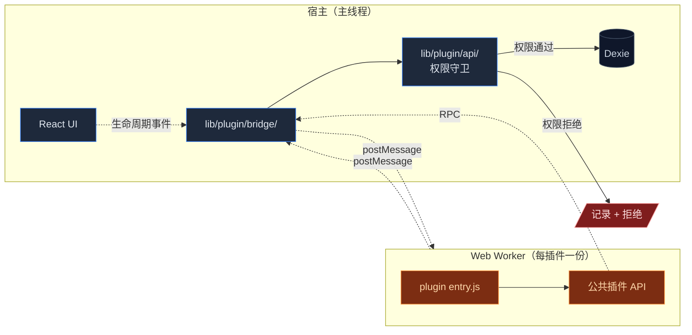
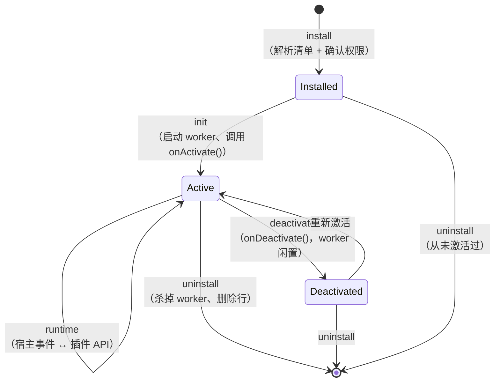

# 插件系统

<Status variant="experimental" />

<TLDR>
  每插件一个沙箱化 Web Worker、声明式 + 用户同意的权限、版本化 API 的 RPC 桥、
  以及供分发的市场。插件以签名的 `.cognia-plugin` 归档发布，与宿主 DOM 隔离运行。
</TLDR>

<StatGrid>
  <Stat label="Dexie 表" value="5" hint="plugins · permissions · reviews · analytics · jobs" />
  <Stat label="API 命名空间" value="11" hint="chat · twin · vector · scheduler · ……" />
  <Stat label="清单版本" value="v1" hint="Zod 校验" />
  <Stat label="沙箱" value="Worker" hint="postMessage RPC 桥" />
</StatGrid>

Cognia 提供沙箱化的插件运行时，让第三方代码扩展应用而不必 fork。插件可以：

- 添加菜单项、面板、聊天输出层。
- 注册 MCP 服务器和技能资源。
- 声明定时任务（由[调度器](./scheduler)执行）。
- 订阅生命周期事件（chat send / response、孪生 ingest 等）。

全部需要用户对每项权限明确同意。

## 代码位置

```
lib/plugin/
  index.ts               # 公共 API + 注册表
  api/                   # 插件可调的 API 表层
  bridge/                # 插件 worker 与宿主的 postMessage 桥
  contracts/             # 清单、权限、任务的 JSON Schema
  core/                  # 生命周期（load、init、dispose）
  devtools/              # 开发模式调试面
  lifecycle/             # 事件钩子（onSend、onResponse 等）
  messaging/             # 插件 ↔ 宿主 RPC
  package/               # 清单解析、打包
  scheduler/             # 插件侧定时任务注册
  security/              # 权限守卫、代码签名
  utils/
  icon.ts

lib/db/
  plugins.ts             # plugins 表（已安装插件）
  plugin-permissions.ts  # plugin_permissions 表（已授权权限）
  plugin-reviews.ts      # plugin_reviews（市场评价缓存）
  plugin-analytics.ts    # plugin_analytics（每安装遥测）
  plugin-scheduled-jobs.ts  # plugin_scheduled_jobs（插件注册的任务）
  plugin-bridge.ts       # plugin_bridge（宿主 ↔ 插件消息日志）
  plugin-types.ts        # 行类型

components/plugin/       # 设置 UI + 市场
```

## 清单格式

插件附带 `cognia-plugin.json`：

```jsonc
{
  "schemaVersion": 1,
  "id": "com.example.my-plugin",
  "name": "My Plugin",
  "version": "0.1.0",
  "description": "...",
  "author": "...",
  "icon": "icon.svg",
  "entry": "main.js", // ES module 入口
  "permissions": [
    "chat.read",
    "chat.send",
    "twin.read",
    "scheduler.register",
    "fs.read:$DOWNLOADS", // 限定作用域的 FS 权限
  ],
  "surfaces": [
    { "kind": "panel", "id": "main", "title": "My Plugin" },
    { "kind": "chat-action", "id": "summarize", "label": "Summarize" },
  ],
  "scheduledJobs": [
    { "id": "daily-sync", "trigger": { "type": "cron", "expression": "0 9 * * *" } },
  ],
}
```

Schema 校验：`lib/plugin/contracts/manifest-schema.ts`（一个 Zod schema）。任何字段缺失或不合规，安装即失败。

### 清单字段

<TypeTable
  type={{
    schemaVersion: {
      description: "清单格式版本。当前为 `1`。",
      type: "1",
      required: true,
    },
    id: {
      description: "反向 DNS 标识；用户已安装插件中必须唯一。",
      type: "string",
      required: true,
    },
    name: { description: "市场和设置中显示的名称。", type: "string", required: true },
    version: { description: "插件版本（semver）。", type: "string", required: true },
    description: { description: "安装对话框显示的简短描述。", type: "string" },
    author: { description: "自由格式作者标签。", type: "string" },
    icon: { description: "SVG 图标路径，相对清单。", type: "string" },
    entry: { description: "ES module 入口；加载到 worker。", type: "string", required: true },
    permissions: {
      description: "安装时申请的能力列表。",
      type: "string[]",
      required: true,
    },
    surfaces: {
      description: "插件贡献的 UI 输出层（面板、聊天动作）。",
      type: "Surface[]",
    },
    scheduledJobs: {
      description: "激活时希望向调度器注册的任务。",
      type: "ScheduledJob[]",
    },
  }}
/>

## 权限模型

`lib/plugin/security/` 强制：

- **预先声明** —— 插件调用的每个 API 必须在 `permissions[]` 列出。
- **用户同意** —— 安装对话框用人话展示权限摘要；用户逐项确认。
- **限定作用域** —— 文件系统、网络、资源权限要限定作用域（`fs.read:$DOWNLOADS` 而非 `fs.read:*`）。
- **可撤销** —— 用户可在 **设置 → 插件 → `<插件>` → 权限** 中关闭任意权限。
- **可审计** —— 每次 API 调用都写入 `plugin_bridge`（限量）。维护 tab 可看日志。

## 沙箱



插件运行在每安装一份的**专用 Web Worker** 中：

- 没有 DOM 访问（只能通过 `postMessage` 与宿主通信）。
- 没有直接网络访问 —— `fetch` 经由桥并受 `network.fetch:<origin>` 权限守护。
- 不能 import 宿主代码；只看公共插件 API。
- 卸载或禁用插件时被杀掉。

`lib/plugin/bridge/` 是宿主侧的 postMessage 通道，把强类型消息序列化回 worker。

## 生命周期



`core/lifecycle.ts` 是编排器。`index.ts:registerHostHooks(...)` 把生命周期事件接入应用其他部分。

## API 表层

插件经由 `lib/plugin/api/` 调用版本化的 API：

| 命名空间         | 能力                                                 |
| ---------------- | ---------------------------------------------------- |
| `chat.*`         | 读会话/消息、发模板化消息、注册聊天动作              |
| `character.*`    | 读角色、提交新角色草稿                               |
| `skill.*`        | 读技能、提交新技能                                   |
| `twin.*`         | 列举孪生、读孪生画像（不含 chunk 内容）、触发 ingest |
| `vector.*`       | 查询活动向量库（不可 upsert，特权操作）              |
| `scheduler.*`    | 注册定时任务，仅限插件自己                           |
| `notification.*` | 显示 toast / 原生通知                                |
| `surface.*`      | 渲染面板、渲染聊天输出层                             |
| `storage.*`      | 每插件一份 KV 存储（小、有上限）                     |
| `network.fetch`  | HTTPS fetch，受按 origin 限定的权限守护              |
| `fs.*`           | 受限 FS 访问（在用户许可的根下读/写）                |

宿主侧实现与命名空间文件并列。每一处都先做权限守卫。

## 定时任务

插件通过 `scheduler.register({ id, trigger })` 注册任务。插件调度器（`lib/plugin/scheduler/`）：

1. 校验 trigger。
2. 写一行 `plugin_scheduled_jobs`。
3. 转给[调度器](./scheduler)，`Executor.type === "plugin"`。
4. 触发时调用插件的 `onJob({ id, … })` 处理函数。

插件被禁用 / 卸载时，其任务被墓碑标记，重启用前不再触发。

## 市场

`lib/plugin/index.ts` 内含一个市场客户端。插件以签名的 `.cognia-plugin` 归档（zip：清单 + 源码 + 签名）发布。

- 目录是一个静态 JSON feed（URL 可配置）。
- 评价从目录拉取，缓存到 `plugin_reviews`。
- 安装流：下载 → 验证签名 → 解析清单 → 显示权限对话框 → 解压 → 注册。

市场 UI 在 `components/plugin/`。

## Devtools

`lib/plugin/devtools/` 仅在开发模式可见的检查器：

- 宿主与 worker 间的实时消息日志。
- 权限决策（"已授权"、"被拒"、"被拒——权限缺失"）。
- 触发的定时任务及结果。
- 性能：每个 API 调用耗时。

通过环境变量在 dev 中启用（`NEXT_PUBLIC_PLUGIN_DEVTOOLS=1`），生产隐藏。

## 内置插件运行时钩子

宿主把插件接入：

- **聊天发送** —— `lifecycle/onSend.ts` —— 插件可改写 / 取消。
- **聊天响应** —— `lifecycle/onResponse.ts` —— 插件可后置处理。
- **孪生 ingest** —— 孪生 source 完成 ingest 时触发。
- **调度器事件** —— 每次定时任务运行时触发。

插件在 `onActivate()` 中订阅。

## 在哪里入手

| 目标              | 文件                                                             |
| ----------------- | ---------------------------------------------------------------- |
| 加新权限          | `lib/plugin/contracts/permissions.ts`，相应 API 命名空间内做守卫 |
| 加新 API 命名空间 | `lib/plugin/api/<name>.ts`，在 `api/index.ts` 注册               |
| 改进沙箱          | `lib/plugin/security/`、`lib/plugin/bridge/`                     |
| 调整市场 UX       | `components/plugin/`、`lib/plugin/index.ts`（目录客户端）        |

## 测试

- `lib/plugin/index.test.ts` —— 注册表与生命周期集成。
- `lib/plugin/icon.test.ts` —— 图标解析（SVG sanitiser）。
- Schema 测试在 `lib/plugin/contracts/`。

## 下一篇

<Cards>
  <Card title="调度器" href="./scheduler" description="插件定时任务的执行引擎" />
  <Card title="存储" href="./storage" description="v15 插件表细节" />
  <Card
    title="Sidecar & Claude SDK"
    href="./sidecar-and-claude-sdk"
    description="插件借 MCP 扩展 sidecar"
  />
</Cards>
