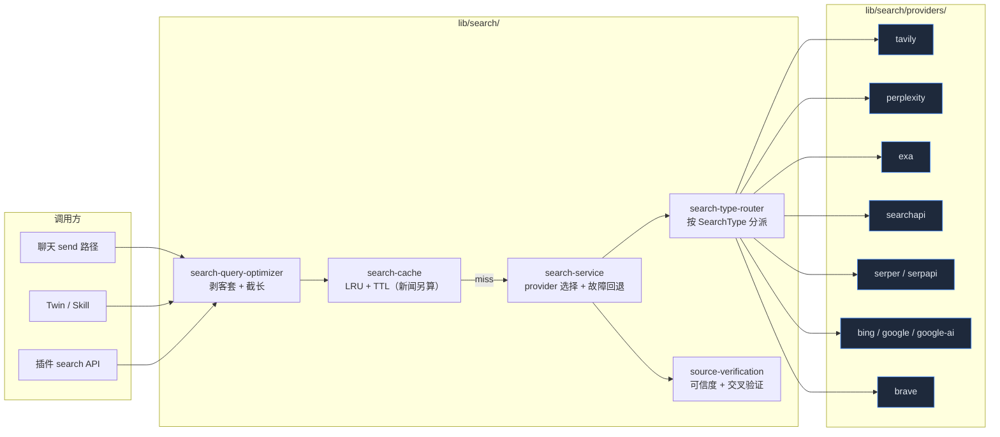

# 搜索系统

Cognia 把"让 AI 上网搜东西"这件事抽象成一个 provider 总线：上层只看到 `search(query, options)`，底下挂着十个 provider（Tavily / Perplexity / Exa / SearchAPI / Serper / SerpAPI / Bing / Google / Google AI / Brave），各自带 general/news/images/videos/academic 几种能力。所有 provider 走同一份 `SearchResponse` 形状，调用方拿到的结果格式始终一致。

<TLDR>
  统一搜索入口 `lib/search/search-service.ts:search()`，自动按设置选 provider + 故障回退。查询前用
  `optimizeSearchQuery` 剥离客套话与冗余前缀；命中 LRU 缓存（`search-cache.ts`）直接返回；未命中按
  `SearchType` 路由（`search-type-router.ts`）到具体 provider；结果可选过 `source-verification.ts`
  打可信度分。Provider 接口在 `lib/search/providers/`，每个 provider
  一个文件，连接测试函数随主搜索函数一起导出。
</TLDR>

## 总览



## 数据类型

所有 provider 都把自己的原生响应折叠成同一份 `SearchResponse`，定义在 `lib/search/types.ts`：

```ts title="lib/search/types.ts"
export type SearchProviderType =
  | "tavily"
  | "perplexity"
  | "exa"
  | "searchapi"
  | "serper"
  | "serpapi"
  | "bing"
  | "google"
  | "google-ai"
  | "brave"

export type SearchDepth = "basic" | "advanced" | "deep"
export type SearchType = "general" | "news" | "academic" | "images" | "videos"
export type SearchRecency = "day" | "week" | "month" | "year" | "any"

export interface SearchResult {
  title: string
  url: string
  content: string
  score: number
  publishedDate?: string
  source?: string
  favicon?: string
  thumbnail?: string
}

export interface SearchResponse {
  provider: SearchProviderType
  query: string
  answer?: string
  results: SearchResult[]
  responseTime: number
  totalResults?: number
  images?: SearchImage[]
}
```

`SearchOptions` 是 provider 通用入参：`maxResults` / `searchDepth` / `searchType` / `includeAnswer` / `includeRawContent` / `includeDomains` / `excludeDomains` / `recency` / `country` / `language`。Provider 自家专属字段不进通用层 —— 例如 Tavily 的 deep search、SerpAPI 的 SerpAPI-only 参数都靠各自的 provider 函数承接，统一层只暴露 ten 个共有 knob。

## 统一搜索入口

```ts title="lib/search/search-service.ts"
export async function search(
  query: string,
  options: UnifiedSearchOptions = {}
): Promise<SearchResponse> {
  const { provider, fallbackEnabled = true, providerSettings, ...searchOptions } = options
  // 1. 取出启用的 provider 列表
  // 2. 如果指定 provider，把它放队首，其余作为 fallback
  // 3. 依次尝试，第一个成功的返回，失败累积到 lastError
  // 4. 每次尝试都通过 recordUsage() 写回设置 store 做用量统计
}
```

三个对外门面：

- `search(query, opts)` — 主入口；指定 provider 时也允许故障回退。
- `autoSearch(query, providerSettings, opts)` — 不传 provider，按优先级自动挑。
- `searchWithProvider(provider, query, apiKey, opts)` — 一次性调用，不读全局设置。
- `aggregateSearch(query, providerSettings, opts)` — 并行打所有启用的 provider，结果按 URL 归并去重，按 `score` 重新排序后保留 top 20。

故障回退的语义很简单：捕到错误就尝试下一个 provider，全失败抛 `lastError`。`recordUsage()` 通过动态 `import("@/stores/settings")` 避免循环依赖 —— 测试 / SSR 环境下 store 没就绪也不影响主路径。

## 查询优化

用户消息里常常带着"请帮我看看"、"我想了解一下"这类客套；直接喂给搜索引擎会拉低召回。`search-query-optimizer.ts` 做四件事：

1. **填充词剥离** —— 中英文头尾的 please/帮我/谢谢之类按正则去掉。
2. **意图保留** —— 检测 `what/how/why/?/什么/如何/?` 之类，保留疑问形态。
3. **截断** —— `MAX_QUERY_LENGTH = 300`；先尝试抽核心句、再退到首句、再退到按词边界截断。
4. **空白清理** —— 多空格折叠。

```ts title="lib/search/search-query-optimizer.ts"
export function optimizeSearchQuery(message: string): string {
  if (!message || message.trim().length === 0) return ""
  const query = message.trim()
  if (query.length <= MAX_QUERY_LENGTH) return cleanQuery(query)
  // 长 query 三级降级：核心句 → 首句 → 按词截
}
```

调用方一般在送给 `search()` 之前调一次 `optimizeSearchQuery(userMessage)`；不需要的场景（程序生成的 query）直接绕过。

## 缓存

`search-cache.ts` 实现了 LRU + TTL 的搜索结果缓存：

- 默认 `defaultTTL = 5 min`；`searchType === "news"` 时缩到 `newsTTL = 1 min`。
- Key 由 query / provider / maxResults / type / depth / recency / answer / rawContent / language / country / domain filter 组合哈希得到 —— 任何一项变了都算 cache miss。
- `CacheStats` 暴露 `hits / misses / hitRate`，调试时可见。

缓存层是可选的；当前 `search()` 主路径没有强制走缓存，由上层（聊天 send 路径、twin runtime）按需挂载。

## 类型路由

不是所有 provider 都支持所有 `SearchType`：

```ts title="lib/search/search-type-router.ts"
const PROVIDER_CAPABILITIES: Record<SearchProviderType, ProviderCapabilities> = {
  brave: { general, news, images, videos },
  bing: { general, news, images },
  google: { general, images },
  searchapi: { general, news, images, academic },
  serper: { general, news, images, videos, academic },
  serpapi: { general, news, images },
  exa: { general },
  tavily: { general },
  perplexity: { general },
  "google-ai": { general },
}
```

`routeSearch()` 按 `options.searchType` 在能力表里查；如果当前 provider 不支持，回退到 `general`。这让上层 UI 不用关心 provider 差异 —— 用户切到"图片搜索"时不可用的 provider 自动从可选列表里隐藏。

## Provider 接入

每个 provider 都遵循同样的文件结构：

```
lib/search/providers/<name>.ts
├── searchWith<Name>(query, apiKey, options)        // general
├── searchNewsWith<Name>(...)                       // 可选
├── searchImagesWith<Name>(...)                     // 可选
├── searchVideosWith<Name>(...)                     // 可选
├── searchScholarWith<Name>(...)                    // 可选
└── test<Name>Connection(apiKey)                    // 设置页的连通性按钮
```

对应测试文件 `<name>.test.ts` 用 `vi.mock(global.fetch)` 验证 HTTP 调用形态 + 响应解析。所有 provider 共同跳过 `playwright-scraper`（依赖 Node-only Puppeteer，不适合 `output: "export"` + Tauri webview）。

### Provider 一览

| Provider     | 适用场景                                 | API key 形式   | 备注                                            |
| ------------ | ---------------------------------------- | -------------- | ----------------------------------------------- |
| `tavily`     | 默认主搜；支持 deep search + AI answer   | `tvly-...`     | `searchWithTavily / extractContent / getAnswer` |
| `perplexity` | 自带 LLM 摘要                            | `pplx-...`     | 单一 general，不分类型                          |
| `exa`        | 语义搜索 + similar links + content fetch | `exa_...`      | 适合做关联发现                                  |
| `searchapi`  | SerpAPI 平替                             | hex            | 含 scholar                                      |
| `serper`     | Google 搜索结果代理                      | hex            | 含 scholar / videos                             |
| `serpapi`    | 老牌 SerpAPI                             | hex            | 不含 academic                                   |
| `bing`       | 微软 Bing                                | Ocp-Apim 形式  | 不含 videos                                     |
| `google`     | Google Custom Search                     | api key + `cx` | 需要 cx；测试要求两者齐全                       |
| `google-ai`  | Google AI Search（Gemini grounding）     | api key        | 唯一一个走 LLM grounding                        |
| `brave`      | Brave 搜索                               | API token      | 类型最全                                        |

### Provider fetch 包装

`proxy-search-fetch.ts` 当前是 `fetch` 的薄壳，预留接入项目级 proxy 层的位置。开发模式下 `createSearchProviderFetch(providerName)` 会打印请求/响应耗时，帮助定位慢调用。

## 来源可信度与交叉验证

搜出来的结果不见得都靠谱 —— `source-verification.ts` 给每条 `SearchResult` 单独打分：

```ts title="lib/search/source-verification.ts"
export type CredibilityLevel = "high" | "medium" | "low" | "unknown"

export type SourceType =
  | "government"
  | "academic"
  | "news"
  | "encyclopedia"
  | "official"
  | "social"
  | "blog"
  | "forum"
  | "ecommerce"
  | "unknown"

export interface SourceVerificationResult {
  url: string
  domain: string
  credibilityLevel: CredibilityLevel
  credibilityScore: number // 0..1
  sourceType: SourceType
  isHttps: boolean
  domainAge?: string
  trustIndicators: string[]
  warningIndicators: string[]
}
```

分类的依据：

- **域名后缀** —— `.gov` / `.edu` / `.gov.cn` / `.ac.uk` 直接 `high`；`.com` 看具体 domain；社交平台（twitter / reddit）归 `social` + `low`。
- **协议** —— HTTPS 加分。
- **trust indicators** —— 已知白名单（Wikipedia、Nature、MIT）入 `high`。
- **warning indicators** —— 已知低质域名（content farm、过期 SSL）打入 `low`。

`CrossValidationResult` 把多条结果交叉比对，找支持 / 反对 / 中立证据，给出 `consensusLevel`（`strong / moderate / weak / conflicting`）。这一层主要面向有事实核查需求的 skill，不是所有调用方都必须接。

## 用量统计

`search-service.ts` 里每次调用 provider 都触发：

```ts
void recordUsage(providerConfig.providerId, Date.now() - startTime, true /* or false */)
```

`recordUsage` 通过动态 import 把统计写回 `useSettingsStore` 的 `incrementSearchUsage` action（如果存在）。store 没就绪不阻塞主路径。这条数据后续在 Settings → 搜索 provider 列表里以 "请求数 / 失败率 / 平均响应时间" 形式呈现。

## 与上层集成

搜索系统不是独立的 UI 表面，而是被这些位置消费：

- **聊天 send 路径** —— `lib/claude/build-options.ts` 在 send 之前可触发 web search，把摘要作为 system prompt 附加段。
- **Twin runtime** —— `lib/twin/runtime/apply-twin-context.ts` 走自己的向量搜索，但 skill 触发"web search"时也走本系统。详见 [向量库](./vector-store) 与 [员工数字孪生](./employee-twin)。
- **插件 search API** —— 插件可以请求 `search` 权限，调用 `searchWithProvider` 时由插件运行时注入受限 API key 表。

设置 UI 在 Settings → 搜索 provider 下，每个 provider 一张卡片 + 启用/优先级/默认参数 + 测试连接按钮。

## 关联文档

<Cards>
  <Card title="存储" href="./storage" description="Dexie schema 里的搜索设置位置" />
  <Card title="向量库" href="./vector-store" description="向量检索 vs. web 搜索的分工" />
  <Card title="聊天与技能" href="./chat-and-skills" description="send 路径如何拼搜索结果" />
  <Card title="文档处理" href="./document-processing" description="本地文档解析；与 web 搜索互补" />
</Cards>

## 在哪里入手

| 目标                 | 文件                                                                                                                                                     |
| -------------------- | -------------------------------------------------------------------------------------------------------------------------------------------------------- |
| 新增一个 provider    | `lib/search/providers/<name>.ts` + `providers/index.ts` 导出 + `search-service.ts` 的 `testProviderConnection` switch + `search-type-router.ts` 的能力表 |
| 改默认 fallback 顺序 | 调整 `getEnabledProviders` 的优先级比较（在 `lib/search/types.ts`）                                                                                      |
| 加新的 SearchType    | 在 `types.ts` 扩 union + `search-type-router.ts` 加分派 + 各 provider 是否支持                                                                           |
| 调缓存 TTL           | `search-cache.ts:SearchCacheOptions` 默认值                                                                                                              |
| 改可信度评分         | `source-verification.ts` 的域名表 + 评分函数                                                                                                             |
