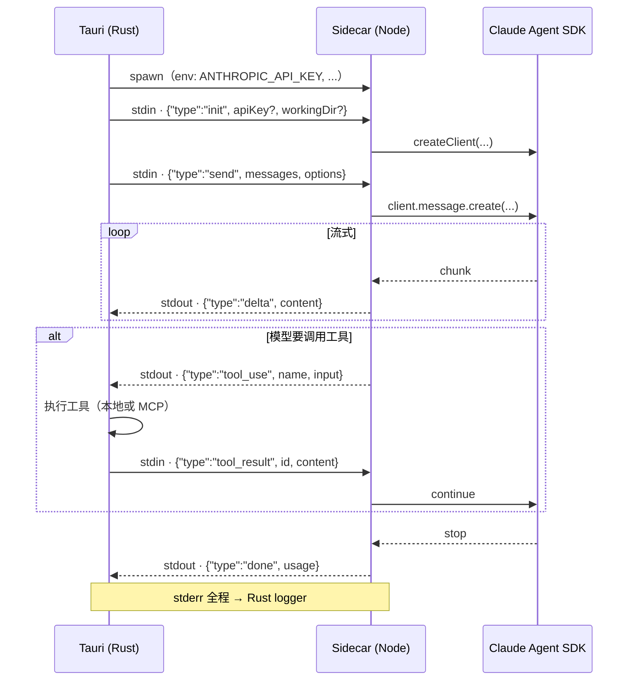

# Sidecar & Claude Agent SDK

Cognia 内嵌一个小型 Node 主机（即 **sidecar**），它包装官方 [`@anthropic-ai/claude-agent-sdk`](https://www.npmjs.com/package/@anthropic-ai/claude-agent-sdk) 并通过 stdio 上的 **JSON-lines 协议**与 Tauri 父进程通信。本页介绍 sidecar 的职责、动机与扩展方式。

## 为何独立进程

Agent SDK 有一些 Node-only 依赖（filesystem、child_process、原生模块），无法在 webview 中运行。曾考虑三个方案：

1. **纯 Web** —— 在 React 中直接调用 Anthropic REST API。
   被否决：会失去 SDK 的 tool-use 循环、hooks、MCP 集成、凭证发现等能力。
2. **嵌入 Rust** —— 在 Rust 中和 Anthropic 通信。
   被否决：SDK 是 JS-first 的，Rust 重写要复制大量逻辑。
3. **Sidecar** —— Tauri 拉起一个 Node 进程，通过 stdio 通信。
   选用。SDK 不变；Rust 侧负责生命周期与凭证。

## `sidecar/` 内容

```
sidecar/
├── claude-host.mjs        # 主入口 —— 包装 Agent SDK
├── a2ui-mcp.mjs           # A2UI 工具面的本地 MCP 服务器
├── builtin-tools/         # 一方工具实现
├── a2ui-tools/            # A2UI 专用工具定义
├── package.json           # Node 依赖（不在 pnpm workspace 内）
├── pnpm-lock.yaml         # Sidecar 自有 lockfile
└── README.md              # 维护者快速参考
```

Sidecar **不在**根 pnpm workspace 内，原因：

- Node-only 依赖会与浏览器 bundle 冲突。
- 它作为 Tauri **资源**打包（见 `tauri.conf.json` → `bundle.resources`）—— 整个 `node_modules/` 会随安装包一起发给用户。
- 版本独立于主应用。

## 协议：基于 stdio 的 JSON-lines

Tauri 侧用 `tauri::api::process::Command` 拉起 sidecar。通信约定：

- **每条消息是一个 JSON 对象，独占一行**，以 `\n` 结束。
- **父进程 → sidecar** 的数据写入 sidecar 的 `stdin`。
- **Sidecar → 父进程** 的数据写入 `stdout`。
- `stderr` 专门用于 sidecar 自身日志，会镜像到 Rust logger。



完整协议在 `claude-host.mjs` 顶部的注释块里。高层形态：

| 方向 | type          | payload                                                      |
| ---- | ------------- | ------------------------------------------------------------ |
| →    | `init`        | `{ type: "init", apiKey?, workingDir? }` —— 设置凭证与 CWD。 |
| →    | `send`        | `{ type: "send", messages, options }` —— 发起一轮对话。      |
| ←    | `delta`       | `{ type: "delta", content }` —— 流式 token 片段。            |
| ←    | `tool_use`    | `{ type: "tool_use", name, input }` —— 模型要调用工具。      |
| →    | `tool_result` | `{ type: "tool_result", id, content }` —— 工具结果。         |
| ←    | `done`        | `{ type: "done", usage }` —— 本轮结束。                      |
| ←    | `error`       | `{ type: "error", message }` —— 致命错误；sidecar 退出。     |
| →    | `kill`        | `{ type: "kill" }` —— 优雅关闭。                             |

`send` 中的 `options` 携带活动 `Character` 的系统提示、解析后的技能列表、MCP 服务器配置、模型选择、最大 token 数等 —— 全部由 `lib/claude/build-options.ts` 装配。

## 生命周期（Rust 侧）

`src-tauri/src/claude/sidecar.rs` 持有子进程句柄：

```rust
pub struct SidecarState {
    inner: Arc<Mutex<Option<CommandChild>>>,
    // ...
}
```

会影响 sidecar 的事件：

- **首次 `claude_send`** —— 懒加载启动，后续调用复用同一进程。
- **`claude_set_api_key`** —— 把新 key 写入 `ApiKeyState`（仅内存，永不落盘）。
- **`claude_restart_sidecar`** —— 杀掉当前 sidecar，下次 send 时 fork 新进程（SDK 在 init 时读取环境变量）。
- **应用退出** —— `RunEvent::ExitRequested` 处理器调用 `kill_sidecar`，避免遗留 Node 进程。

Sidecar 在 Unix 上用 SIGTERM、Windows 上用 `TerminateProcess` 杀掉；如 5 秒后仍未退出，升级为 SIGKILL。

## 构建发送选项

`lib/claude/build-options.ts` 是 UI 状态 → sidecar `send` payload 的唯一转换点。它组合：

1. **角色系统提示** —— 当前角色的 `Character.systemPrompt`。
2. **技能解析** —— `lib/skills/executor.ts` 把每个技能的提示、MCP 服务器、工具白名单实例化。
3. **孪生上下文（可选）** —— 当活动角色设置了 `twinId` 时，`lib/twin/runtime/apply-twin-context.ts` 包装消息，附加召回片段 + 风格少样本。
4. **MCP 配置** —— 内置 MCP 服务器（`lib/claude/builtin-mcp/`）与用户服务器（`lib/db/mcp-servers.ts`）合并。
5. **模型 + token 上限** —— `lib/ai/model-limits.ts` 按模型解析 token 上限。

公开函数是 `resolveSendOptions(...)`，被 `lib/chat/` 中的发送动作调用。

## Hooks

`lib/claude/hooks.ts` 定义用户可挂的生命周期钩子：

- `onSend(payload)` —— 在父 → sidecar `send` 之前。
- `onResponse(content, usage)` —— 在一轮结束之后。
- `onError(err)` —— sidecar 上报错误时。

Hooks 跑用户定义的代码（存在 Dexie 中的代码片段，或 shell 命令）。它们**不是** Cognia 内部用的 —— 内部逻辑放在 `lib/chat/`。Rust 侧（`src-tauri/src/hooks/`）允许 hooks 跑 shell 命令而不必经过主 webview。

## A2UI MCP sidecar

`sidecar/a2ui-mcp.mjs` 是第二个 sidecar —— 一个本地 MCP 服务器，把 A2UI 工具面（交互式卡片、表单、列表）暴露给 Claude Agent SDK。它的拉起方式与主 sidecar 相同，但走 MCP stdio 协议（与上面的 JSON-lines 协议不同）。

A2UI 通路：

- `src-tauri/src/a2ui_bridge/` —— Rust 桥，仲裁 webview 与 MCP sidecar 之间的通信。
- `lib/a2ui/` —— 前端分发与渲染。
- `components/a2ui/` —— 渲染 A2UI 节点的 React 组件。

## 认证

Sidecar 从 Claude Code 的同一来源读取凭证：

<TypeTable
  type={{
    ANTHROPIC_API_KEY: {
      description: "直接 API key。最高优先级 —— 设置后覆盖 OAuth token。",
      type: "env 变量",
    },
    "~/.claude/ token": {
      description: "由 `claude login` 写入的 OAuth token。最终用户的标准路径。",
      type: "OAuth token",
    },
    "AWS_BEDROCK_*、GCP_VERTEX_*": {
      description: "云端供应商凭证（Bedrock、Vertex 上的 Anthropic）。",
      type: "env 变量",
    },
  }}
/>

<Callout type="warn" title="永不明文">
  Rust 侧**绝不**直接读 `~/.claude/` —— 只是用合适的环境变量启 sidecar。UI 输入的 API key 存在
  `ApiKeyState`（内存）和 OS keyring（`keyring` crate）， 通过环境变量在 spawn 时传给
  sidecar，**永不**写入配置文件。
</Callout>

## 添加新工具

<Tabs groupId="tool-path" persist items={["内置（sidecar）", "MCP 服务器"]}>
  <Tab value="内置（sidecar）">
    适用于希望随 Cognia 一起发布、始终可用的工具：

    <Steps>
      <Step>
        ### 加实现

        在 `sidecar/builtin-tools/<name>.mjs` 新建：

        ```js
        export const definition = {
          name: "my_tool",
          description: "...",
          input_schema: { /* JSON Schema */ },
        }

        export async function execute(input, ctx) {
          // ctx 暴露 log、fs 等
          return { content: [{ type: "text", text: "..." }] }
        }
        ```
      </Step>
      <Step>
        ### 在 `claude-host.mjs` 注册

        在 `sidecar/claude-host.mjs` 顶部的加载器里加 import + 注册。
      </Step>
      <Step>
        ### 写测试

        测试与源同目录：`sidecar/builtin-tools/__tests__/<name>.test.mjs`，
        用 `pnpm sidecar:test` 运行。
      </Step>
    </Steps>

    <Callout type="warn" title="包体积">
      内置工具会随 Cognia 每次发版分发。避免重依赖 ——
      特殊场景优先用 MCP。
    </Callout>

  </Tab>
  <Tab value="MCP 服务器">
    绝大多数第三方集成走 MCP 路径，因为不必修改 sidecar。

    <Steps>
      <Step>
        ### 决定内置还是用户配置

        - **内置** —— 写入 `lib/claude/builtin-mcp/`；始终加载。
        - **用户配置** —— 让用户通过 UI 添加（`lib/db/mcp-servers.ts`）。
      </Step>
      <Step>
        ### 加预设（可选）

        在 `lib/claude/mcp-presets.ts` 加一项，让用户看到一键安装。
      </Step>
      <Step>
        ### 测试往返

        在包含此服务器的角色下发起聊天。Sidecar 中的 MCP 客户端会自动发现；
        工具调用通过 `tool_use` / `tool_result` 往返。
      </Step>
    </Steps>

  </Tab>
</Tabs>

## 调试 sidecar

独立运行：

```bash
cd sidecar
node claude-host.mjs           # 从 stdin 读 JSON 行
node claude-host.mjs --smoke   # 一次性冒烟
```

把样例 `init` + `send` 喂进去看响应：

```bash
echo '{"type":"init"}\n{"type":"send","messages":[{"role":"user","content":"hi"}],"options":{}}' | node claude-host.mjs
```

应用运行时，sidecar 的 `stderr` 会镜像到 Rust logger，并出现在 `app/logs/`。

## 测试

- TS 单元测试与源码同目录 —— 例如 `lib/claude/build-options.test.ts`、`lib/claude/sync.test.ts`。
- Sidecar 的单元测试用 Node test runner：`pnpm sidecar:test`。
- 真实拉起 sidecar 的集成测试位于 `src-tauri/tests/`。

## 下一篇

<Cards>
  <Card title="聊天 & 技能" href="./chat-and-skills" description="调用 claude_send 的用户面" />
  <Card title="插件系统" href="./plugin-system" description="插件如何借 MCP 扩展 sidecar" />
  <Card
    title="运行时 & Tauri"
    href="./runtime-and-tauri"
    description="拥有 sidecar 生命周期的 Rust 侧"
  />
</Cards>
