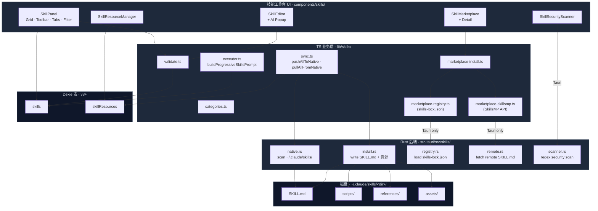
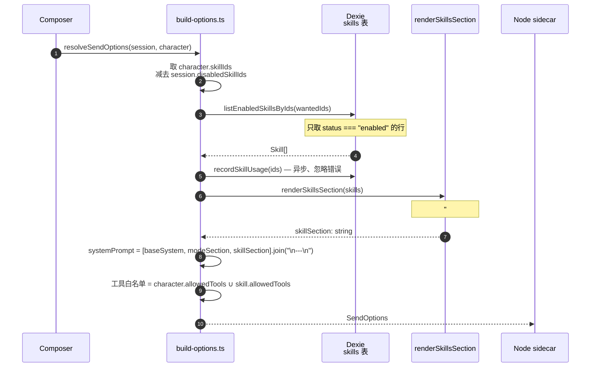
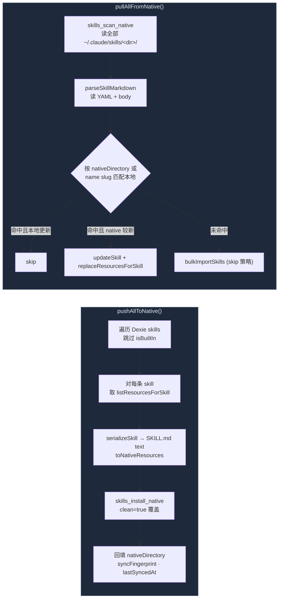
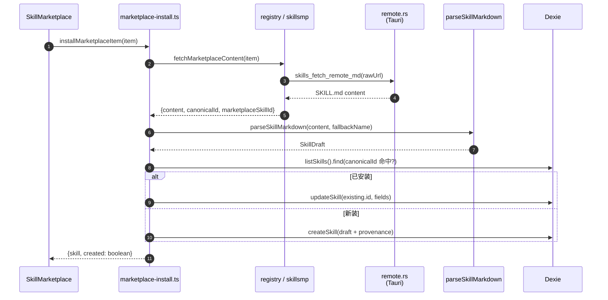

# 技能系统

技能（Skill）是 Cognia 中最小的"可携带能力"单位 —— 一个 Markdown 片段、一组允许的工具、可选的脚本/引用/资源捆绑。本页是技能子系统的深度剖析；如果你想先看技能在聊天里如何被启用，请回到[聊天、角色、技能 & 团队](./chat-and-skills)。

<TLDR>
技能 = SKILL.md（YAML frontmatter + body）+ scripts/ + references/ + assets/。
浏览器端的真理源是 Dexie；可选双向同步到 `~/.claude/skills/<dir>/`。
市场来自 `skills-lock.json` 注册表与 SkillsMP API，安装时走 `parseSkillMarkdown → createSkill`。
所有保存路径都强制走 `validateSkill` + Rust 端的 `skills_scan_security`。
</TLDR>

## 适用场景

- 给某个角色叠加一段"风格指南"或"工作清单"。
- 把一段提示词工程模板沉淀为可复用资产，跨会话/角色生效。
- 把外部 Claude Code 已有的 `~/.claude/skills/<dir>/` 拉进 Cognia，或反向推送。
- 从社区市场（registry + SkillsMP）按一键安装策划好的技能，包括其 scripts/references/assets。
- 在保存前对 SKILL.md 与脚本资源做静态安全扫描。

## 架构图

## 关键模块与文件路径

### TypeScript 业务层（`lib/skills/`）

| 文件                      | 角色                                                                                                                                                         |
| ------------------------- | ------------------------------------------------------------------------------------------------------------------------------------------------------------ |
| `executor.ts`             | `buildProgressiveSkillsPrompt(activeSkills)` —— 包装 `renderSkillsSection`，作为外部 agent 指令栈与 Claude SDK 构建流水线的统一入口。                        |
| `validate.ts`             | 纯函数校验器：名称格式 / 最大长度 / 必填正文 / 资源路径穿越检测 / 资源路径去重。返回 `SkillValidationError[]`，供编辑器逐字段高亮。                          |
| `categories.ts`           | 8 个内置分类（`creative-design` / `development` / `enterprise` / `productivity` / `data-analysis` / `communication` / `meta` / `custom`）+ 图标 + i18n key。 |
| `sync.ts`                 | 双向同步引擎 —— `pushAllToNative` / `pullAllFromNative`，按 `nativeDirectory` 优先、按名称次之进行身份匹配，写入 `syncFingerprint` + `lastSyncedAt` 防抖动。 |
| `marketplace-types.ts`    | 共享数据结构 `MarketplaceItem` / `FetchSkillContent`，两类来源（`registry` / `skillsmp`）归一到此。                                                          |
| `marketplace-registry.ts` | 适配 `skills-lock.json` 注册表（GitHub 仓库镜像）；Tauri 走 Rust，Web 走打包 JSON 兜底。                                                                     |
| `marketplace-skillsmp.ts` | 适配 SkillsMP API（Cognia 共用的服务端）；从 `useSettingsStore` 读 base URL，未配置即静默禁用。                                                              |
| `marketplace-install.ts`  | `installMarketplaceItem` —— 幂等：按 `canonicalId` 命中则原地 update，否则 createSkill。可选 `pushAllToNative()` 投射到磁盘。                                |
| `ai-prompts.ts`           | AI 修正辅助（"修复错误"提示，把 `validateSkill` 的结构化错误塞进系统提示）。                                                                                 |
| `export-toast.ts`         | 导出 / 同步操作的 toast 文案聚合（i18n key）。                                                                                                               |

### React 工作台（`components/skills/` + `app/skills/page.tsx`）

`app/skills/page.tsx` 只是一个挂载 `SkillPanel` 的薄路由。真正的 UI 由以下组件组成：

- **`SkillPanel`** —— Grid / Toolbar / Tabs / Filter / Category sidebar / Batch actions bar 复合容器，通过 `SkillPanelContext` 共享筛选状态。
- **`SkillEditor`** —— 表单 + Markdown 编辑 + `SkillEditorAiPopup`（调用 `ai-prompts.ts` 让 Claude 修复错误）。
- **`SkillResourceManager`** —— 管理 `script` / `reference` / `asset` 三类资源，上传时同步落 Dexie `skillResources` 表。
- **`SkillMarketplace`** + `SkillMarketplaceCard` + `SkillMarketplaceDetail` —— 浏览市场、查看详情、一键安装。
- **`SkillSecurityScanner`** —— 触发 Rust 端 `skills_scan_security`，把 `ScanIssue` 列表渲染为按严重程度分组的列表。
- **`SkillDiscovery`** / `SkillAnalytics` —— 探索 + 使用频次统计。

### Rust 后端（`src-tauri/src/skills/`）

| 文件          | 命令 / 用途                                                                                                                                                                                      |
| ------------- | ------------------------------------------------------------------------------------------------------------------------------------------------------------------------------------------------ | --------------------------------------------------------------- |
| `mod.rs`      | 模块入口；前端通过 `@/lib/claude/ipc` 调用每个命令。                                                                                                                                             |
| `native.rs`   | `skills_scan_native()` —— 遍历 `~/.claude/skills/<dir>/`，读 SKILL.md + scripts/ + references/ + assets/。每个资源 ≤ 2 MiB，单技能 ≤ 50 个资源。                                                 |
| `install.rs`  | `skills_install_native(InstallSkillRequest)` —— 校验 `dirName`（ASCII + `-_`，≤ 64 字符），可选 clean，按资源 `kind` 自动放进 scripts/ / references/ / assets/ 子目录；base64 资源解码成二进制。 |
| `registry.rs` | `skills_load_registry()` —— 解析项目根 `skills-lock.json`（生产读 bundled resource、dev 兜底相对路径）。                                                                                         |
| `remote.rs`   | `skills_fetch_remote_md(url)` —— HTTP(S) 代理（CSP 限制下浏览器侧 fetch 不通），15 s 超时、1 MiB 上限。                                                                                          |
| `scanner.rs`  | `skills_scan_security(content)` / `skills_scan_resources(resources)` —— 基于正则的轻量扫描：`rm -rf /` / fork-bomb / `curl                                                                       | sh`/`eval()`/ 反向 shell / 硬编码密钥…… 全部返回`ScanIssue[]`。 |
| `types.rs`    | 线缆类型（`NativeSkill` / `NativeSkillResource` / `InstallSkillRequest` / `RegistryEntry` / `ScanIssue`），serde camelCase。                                                                     |

## 数据流 / 控制流

### 发送时如何注入技能

当用户在聊天里发送一条消息时，`lib/claude/build-options.ts:resolveSendOptions` 按以下顺序处理技能：

**工具白名单语义**：character 与 skills 声明的 `allowedTools` 取**并集**。如果都没声明，SDK 工具集不受限。

**孪生绑定下的顺序**：若 `Character.twinId` 命中，孪生 runtime 会在系统提示前部插入身份块 + 召回片段 + 风格少样本；技能段始终追加在末尾，永不被孪生改写。

### 双向同步（push / pull native）

**身份匹配规则**：

1. 优先按 `nativeDirectory`（绝对路径）匹配。
2. 退化按 `name.toLowerCase()` 匹配。
3. `pullAllFromNative` 永远不会删本地行 —— 它只新增或更新。

**冲突解决**：`TIMESTAMP_FUDGE_MS = 1000`。本地行的 `updatedAt` 若早于 `Date.now() - 1s`，视为陈旧，采用 native 版本；否则跳过。

### 市场安装

幂等性靠 `canonicalId`（形如 `registry:ai-elements` 或 `skillsmp:1234`）保证。卸载就是按 `canonicalId` 删 Dexie 行 —— 内置技能不带 `canonicalId`，所以 uninstall 不会误删。

### 安全扫描

`skills_scan_security` 是**保存前**而非**运行前**的检查 —— 实际"运行"是把技能内容拼进系统提示，并不会执行其中的脚本。扫描器只是"如果你或他人在外部脚手架里执行这些脚本会发生什么"的提示性警告。规则按严重度分级：

- **high**：`rm -rf /` / fork-bomb / `curl | sh` / `wget | sh`
- **medium**：`sudo rm` / `eval(` / `DROP TABLE` / 硬编码密钥模式
- **low**：可疑环境变量泄露、未引号 shell 变量等

## 数据库表

详见 [存储](./storage)。技能子系统使用：

| 表               | 索引                                                                                | 角色                                    |
| ---------------- | ----------------------------------------------------------------------------------- | --------------------------------------- |
| `skills`         | `id, name, updatedAt, isBuiltIn, category, source, status, lastUsedAt, canonicalId` | 主表，自 v8 起加入丰富索引。            |
| `skillResources` | `id, skillId, [skillId+kind], [skillId+path], updatedAt`                            | 资源捆绑（scripts/references/assets）。 |

`Skill` 行的关键字段（完整类型见 `lib/claude/types.ts`）：

- `content`：SKILL.md body。
- `allowedTools?`：工具白名单。
- `category`：8 种预设分类之一。
- `source`：`builtin` / `custom` / `imported` / `marketplace`。
- `status`：`enabled` / `disabled`，发送时只取 enabled。
- `canonicalId`：市场幂等键（`<source>:<id>`）。
- `nativeDirectory`：同步到磁盘后的绝对路径。
- `syncOrigin`：`frontend` / `native` / `builtin` —— 用于决定同步冲突时谁赢。
- `syncFingerprint`：SKILL.md + resources 的 SHA-256（Web crypto.subtle 或非加密回退）。

## 配置项与扩展点

### App settings

- `settings.skillsMarketplace.baseUrl` —— SkillsMP API base；空字符串即禁用该来源。

### 内置技能

5 个内置技能在首次启动时种子化（`lib/db/skills.ts:seedBuiltInSkills`）：

- `skill_builtin_concise` — Concise answers
- `skill_builtin_step_by_step` — Step-by-step reasoning
- `skill_builtin_cite` — Cite sources
- `skill_builtin_code_review` — Code review checklist
- `skill_builtin_plain_english` — Plain-English explainer

内置技能 `isBuiltIn = true`，备份清空操作不会删它们；用户的 `status` 翻转与 `usageCount` 在升级时被保留。

### 扩展点：插件贡献技能

插件可在 manifest 里声明 `skills` 数组，安装后被插件管理器（`lib/plugin/core/manager.ts`）合并入主表。详见[插件系统](./plugin-system)。

### 扩展点：插件贡献市场来源

`marketplace-types.ts:MarketplaceSourceId` 目前是 `"registry" | "skillsmp"` 闭集合。要新增来源，加 union 成员并在 `marketplace-install.ts:fetchMarketplaceContent` 增加 case，再实现一个 `fetch<Source>Items` + `fetch<Source>SkillContent`。

## 关联子系统

- [聊天、角色、技能 & 团队](./chat-and-skills) —— 技能在发送时被 `resolveSendOptions` 引用的端到端流程。
- [插件系统](./plugin-system) —— 与插件的沙箱 + 权限模型对照；插件可贡献技能。
- [Agent 团队](./agent-teams) —— 团队成员各自的角色继承自同一 `skills` 表。
- [存储](./storage) —— `skills` / `skillResources` 表索引与版本演进。
- [Sidecar & Claude SDK](./sidecar-and-claude-sdk) —— 技能片段最终落到 SDK `system` 字段的位置。

## 关联 ADR

- [ADR-0002 Scheduler full agent resolution](../adr/0002-scheduler-full-agent-resolution) —— 调度器入口同样要走 `resolveSendOptions`，所以技能在定时任务里与交互式聊天完全等价。

## 已知限制

- `executor.executeSkill` 目前返回空结果 —— 当前模型并不把技能当作可独立调用的"工具"，而是把其 Markdown 追加进系统提示。后续如果把技能升格为头等工具，再补真实执行器。
- `buildProgressiveSkillsPrompt` 的 `maxTokens` 参数目前**仅作提示**，没有按 tokenizer 真正截断。需要 token-aware 修剪时再加。
- `skills_scan_security` 是基于正则的浅扫描；它对受动机驱动的攻击者**没有意义**，仅作为"开门前请看一眼"的卫生提醒。
- `skills_install_native` 的 base64 解码是手写实现（避免引入额外 crate），二进制资产规模较大时性能不及标准库。
- `marketplace-skillsmp` 的 base URL 若未配置则该来源**静默禁用**，Browse tab 不会提示用户。
- 同步冲突的"谁较新"判断基于本地 `updatedAt` 与 1 秒 fudge —— 跨时区 / 时钟跳变下会偶发误判。需要严格冲突仲裁时请显式地 pull 或 push 整体。
- Web 模式下 `pushAllToNative` / `pullAllFromNative` / `skills_scan_security` 均不可用，相关按钮在 UI 中被禁用并带提示。
