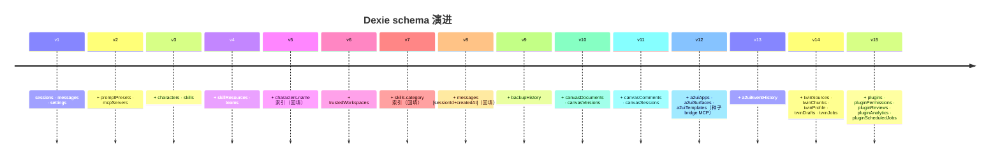

# 存储（Dexie schema v15）

<Status variant="stable">v15</Status>

<TLDR>
  所有浏览器侧状态通过 Dexie 存在 IndexedDB，库名 `cognia-claude`。
  Schema 版本只增不改 —— 每次发版加新 `.version(n)` 块，旧的永不修改。
  迁移幂等，每次打开库都会自动跑。
</TLDR>

<StatGrid>
  <Stat label="Schema 版本" value="15" hint="2024–2026" />
  <Stat label="表数" value="29" hint="所有版本累计" />
  <Stat label="数据库名" value="cognia-claude" hint="历史值，保持不变" />
  <Stat label="单例表" value="1" hint="settings 表" />
</StatGrid>

Cognia 几乎所有浏览器侧状态都通过 **Dexie 存在 IndexedDB**。Schema 定义在 `lib/db/schema.ts`，当前版本 **v15**。Schema 版本只增不改 —— 永远不要修改既有的 `.version(n).stores({...})` 块。

## 数据库标识

```ts
super("cognia-claude")
```

Dexie 数据库名是 `cognia-claude`（保留原始代号，避免对已有用户做迁移）。不要改。如非要改，需写一个迁移：首次启动从 `cognia-claude` 复制到新名，再删旧库。

## 表（v15）

| 表 | 类型 | 索引列 | 用途 |
| --- | --- | --- | --- |
| `sessions` | `ChatSession` | `id`, `updatedAt`, `createdAt` | 聊天会话 |
| `messages` | `StoredMessage` | `id`, `sessionId`, `[sessionId+createdAt]` | 聊天消息 |
| `settings` | `AppSettings`（单例） | `id`（始终 `"singleton"`） | 全局设置 |
| `promptPresets` | `SystemPromptPreset` | `id`, `category`, `updatedAt` | 可复用提示片段 |
| `mcpServers` | `McpServer` | `id`, `enabled`, `updatedAt` | MCP 服务器定义 |
| `characters` | `Character` | `id`, `name`, `isBuiltIn`, `updatedAt` | 角色人格 |
| `skills` | `Skill` | `id`, `name`, `category`, `isBuiltIn`, `updatedAt` | 技能定义 |
| `skillResources` | `SkillResource` | `id`, `skillId`, `[skillId+name]` | 技能附件（文件、URL） |
| `teams` | `Team` | `id`, `name`, `updatedAt` | 多角色团队 |
| `trustedWorkspaces` | `TrustedWorkspace` | `id`, `path`, `lastUsedAt` | 允许 shell-tool 执行的工作区 |
| `backupHistory` | `BackupHistoryRow` | `id`, `completedAt`, `status` | 限 50 行 |
| `canvasDocuments` | `CanvasDocumentRow` | `id`, `sessionId`, `updatedAt` | 长形式 artifact |
| `canvasVersions` | `CanvasVersionRow` | `id`, `documentId`, `[documentId+createdAt]` | 版本历史 |
| `canvasComments` | `CanvasCommentRow` | `id`, `documentId`, `createdAt` | 行内评论 |
| `canvasSessions` | `CanvasSessionRow` | `id`, `documentId`, `updatedAt` | 每会话画板状态 |
| `a2uiApps` | `A2UIAppRow` | `id`, `name`, `updatedAt` | A2UI 应用实例 |
| `a2uiSurfaces` | `A2UISurfaceRow` | `id`, `appId`, `[appId+createdAt]` | A2UI 已渲染输出层 |
| `a2uiTemplates` | `A2UITemplateRow` | `id`, `category`, `updatedAt` | A2UI 输出层模板 |
| `a2uiEventHistory` | `A2UIEventHistoryRow` | `id`, `surfaceId`, `[surfaceId+createdAt]` | A2UI 事件审计 |
| `twinSources` | `TwinSource` | `id`, `twinId`, `[twinId+status]`, `updatedAt` | 用户原始素材 |
| `twinChunks` | `TwinChunk` | `id`, `sourceId`, `[sourceId+chunkIdx]`, `twinId` | 嵌入后的 chunk |
| `twinProfile` | `TwinProfile` | `id`, `twinId` | 蒸馏画像（每个孪生一行） |
| `twinDrafts` | `TwinDraft` | `id`, `twinId`, `status`, `[twinId+createdAt]` | 待审角色/技能草稿 |
| `twinJobs` | `TwinJob` | `id`, `twinId`, `kind`, `status`, `createdAt` | ingest + distill 队列 |
| `plugins` | `PluginRow` | `id`, `enabled`, `updatedAt` | 已安装插件 |
| `pluginPermissions` | `PluginPermissionRow` | `[pluginId+permission]`（复合主键） | 已授权权限 |
| `pluginReviews` | `PluginReviewRow` | `[pluginId+rating]`（复合主键） | 市场评价缓存 |
| `pluginAnalytics` | `PluginAnalyticsRow` | `[pluginId+day]`（复合主键） | 每日插件统计 |
| `pluginScheduledJobs` | `PluginScheduledJobRow` | `id`, `pluginId`, `enabled` | 插件定时任务 |

## 版本历史



`lib/db/schema.ts` 中每个 `.version(n)` 块：

| 版本 | 新增 |
| --- | --- |
| **v1** | `sessions`、`messages`、`settings`。原始基线。 |
| **v2** | `promptPresets`、`mcpServers`。 |
| **v3** | `characters`、`skills`。 |
| **v4** | `skillResources`、`teams`。 |
| **v5** | 给 `characters` 加 `name` 索引（带回填 upgrade hook）。 |
| **v6** | `trustedWorkspaces`。 |
| **v7** | 给 `skills` 加 `category` 索引；带回填。 |
| **v8** | `messages` 索引重排；回填 `[sessionId+createdAt]`。 |
| **v9** | `backupHistory`。 |
| **v10** | `canvasDocuments`、`canvasVersions`。 |
| **v11** | `canvasComments`、`canvasSessions`。 |
| **v12** | A2UI 表（`a2uiApps`、`a2uiSurfaces`、`a2uiTemplates`）；upgrade hook 种子化内置 MCP A2UI 桥。 |
| **v13** | `a2uiEventHistory`；索引重排。 |
| **v14** | 孪生表 —— `twinSources`、`twinChunks`、`twinProfile`、`twinDrafts`、`twinJobs`。 |
| **v15** | 插件表 —— `plugins`、`pluginPermissions`、`pluginReviews`、`pluginAnalytics`、`pluginScheduledJobs`。 |

<Callout type="info" title="幂等升级">
  每个版本都幂等 —— 打开旧库会自动按顺序升级到最新版本。Dexie 按顺序应用。
  **永远不要修改之前的 `.version(n)` 块。**
</Callout>

## Upgrade hooks

某些版本有 `.upgrade(tx => { ... })` 钩子，仅在迁移到该版本时跑一次。常见模式：

- **回填索引** —— 读所有现存行、写派生字段、再 put。
- **种子化内置行** —— 缺失则插入内置角色/技能/MCP 服务器。
- **改造行结构** —— 把旧字段翻译为新字段。

钩子必须：

- **幂等** —— 跑两次也安全（用户清空 + 重新导入时会发生）。
- **近同步** —— Dexie 用事务包裹；长 async 工作可以但会阻塞写。
- **测试覆盖** —— 每个 upgrade hook 都有同名测试（参考 `seed.test.ts`、`schema.test.ts`）。

## Settings 表

`settings` 是单例 —— 只有一行，键 `"singleton"`。结构是 `AppSettings`（`lib/claude/types.ts`），包含：

- API key 引用（实际密钥放 OS keyring，这里只放元数据）。
- 默认角色 / 模型 / 技能 ID。
- UI 偏好（主题、locale、字号、密度）。
- 调度器开关。
- 备份调度 + 文件夹。
- 向量后端选择 + 连接。
- 孪生 runtime 默认值。
- 遥测同意。
- ……

`SettingsSyncProvider` 是挂载它的 React provider，把行缓存到内存，并暴露批量写回 Dexie 的更新器。

## 新增表

<Steps>
  <Step>
    ### 定义行类型

    在 `lib/db/<name>.ts` 新建文件并导出：

    ```ts
    export interface MyNewRow {
      id: string
      indexedField: string
      otherField: number
      // ...
    }
    ```
  </Step>
  <Step>
    ### 在 schema.ts 顶部 import

    在 `lib/db/schema.ts` 顶部加 `import type { MyNewRow } from "./<name>"`。
  </Step>
  <Step>
    ### 添加 Table 字段

    在 `CogniaDB` 类中加 `myNewTable!: Table<MyNewRow, string>`。
  </Step>
  <Step>
    ### 升级 schema 版本

    ```ts
    this.version(16).stores({
      myNewTable: "id, indexedField, [indexedField+otherField]",
      // 只列出新表；既有表自动继承
    })
    ```
  </Step>
  <Step>
    ### （可选）加 upgrade hook

    若需要种子化内置行或从既有表回填：

    ```ts
    this.version(16).stores({...}).upgrade(async tx => {
      // 幂等迁移
    })
    ```
  </Step>
  <Step>
    ### 写测试

    `lib/db/<name>.test.ts` 覆盖增删改查；如加了 hook，再覆盖幂等性。
  </Step>
  <Step>
    ### 更新本文档页

    把新表加入上面的列表。
  </Step>
</Steps>

<Callout type="error" title="永远不要修改之前的 version 块">
  如果发现某个索引错了，**新建**一个版本重新声明该表的正确索引列表。
  修改旧版本会让已经迁移过那一步的用户进入孤儿状态。
</Callout>

## 复合主键

Dexie 通过数组语法支持复合主键。Cognia 在插件权限/评价/统计表中用：

```ts
pluginPermissions: "[pluginId+permission], pluginId"
//                   ^ 主键              ^ 二级索引
```

这样"用户撤销了插件 Y 的权限 X"就是一次 `delete([pluginId, permission])`，不必扫描。

## 限量表

部分表限量以避免无界增长：

| 表 | 上限 | 修剪 |
| --- | --- | --- |
| `backupHistory` | 50 行 | 每次 insert 后调用 `pruneBackupHistory()` |
| `a2uiEventHistory` | 每 surface ~200 | 超量时 insert 时修剪 |
| `canvasVersions` | 无界，但可压缩 | 画板 UI 提供"压缩历史"动作 |

新增高写入表时请先决定是否需要上限。

## 查询提示

- 优先索引查询 —— `db.messages.where("[sessionId+createdAt]").between([sid, 0], [sid, Date.now()])`。
- 大表别 `Collection.toArray()`；用 `.each(callback)` 流式处理。
- 多表写入用事务包裹：`db.transaction("rw", tableA, tableB, async () => {...})`，部分失败可回滚。
- Live query（`dexie-react-hooks` 的 `useLiveQuery`）在底层数据变化时自动重渲染。

## 清空数据

`lib/data/clear.ts` 暴露：

- `clearAll()` —— 清空所有 Dexie 表。维护 tab 的"重置"动作使用。
- `clearTables(names)` —— 清空指定表。

两者都在单 Dexie 事务中运行，保证一致性。

## 测试

- `lib/db/schema.test.ts` —— 打开 DB、跑所有 upgrade、验证行数。
- `lib/db/seed.test.ts` —— 内置种子化幂等性。
- 各表测试（`messages.test.ts`、`characters.test.ts` 等）—— CRUD 覆盖。

## 下一篇

<Cards>
  <Card title="备份 & 数据传输" href="./backup-and-data" description="基于这些表构建备份载荷" />
  <Card title="插件系统" href="./plugin-system" description="使用 v15 插件表" />
  <Card title="员工数字孪生" href="./employee-twin" description="使用 v14 孪生表" />
</Cards>
